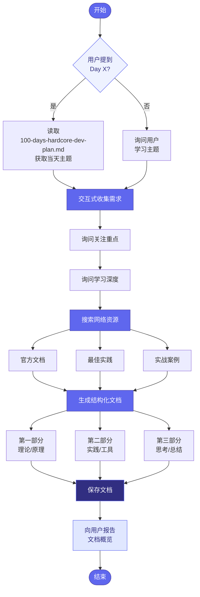
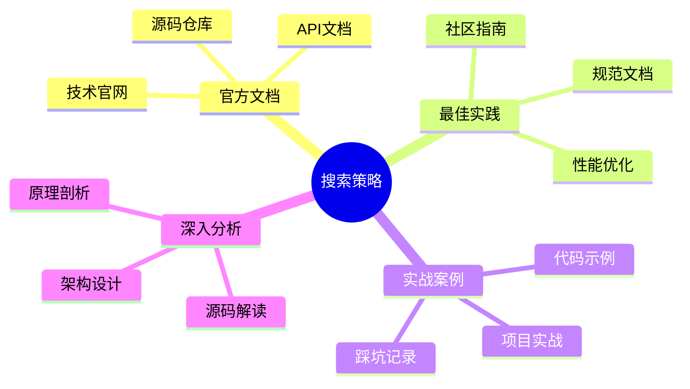
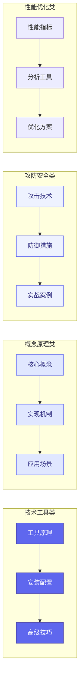
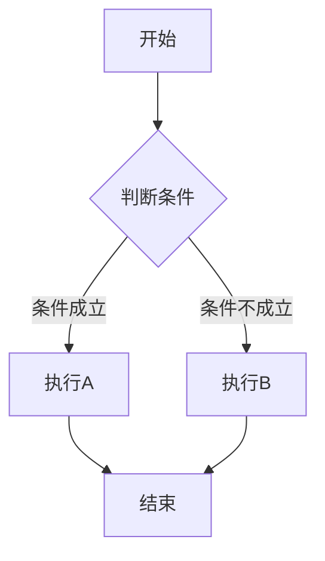
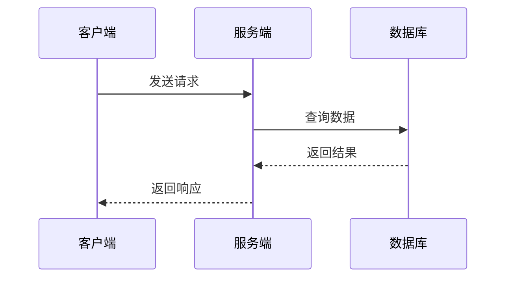
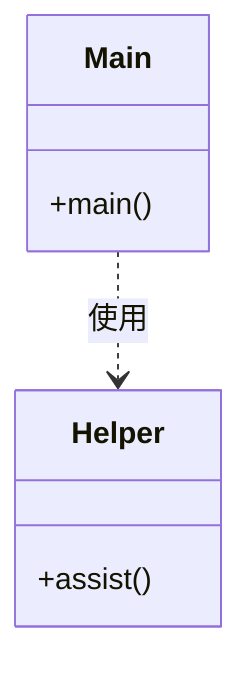
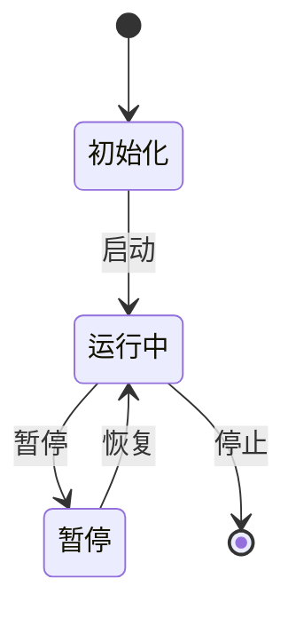
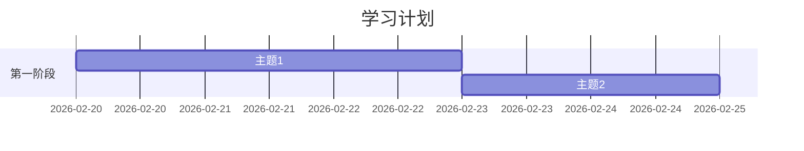
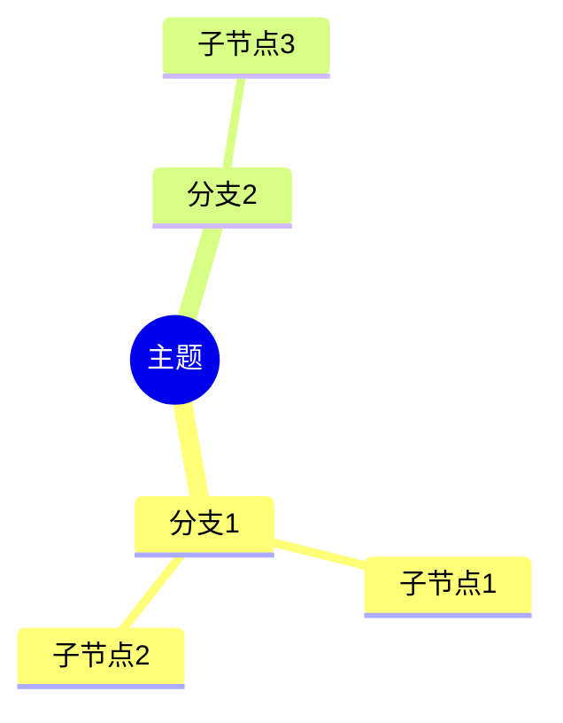

# Daily Learning

## 概述

此技能帮助用户通过交互式问答收集学习主题信息，自动搜索网络资源，并按照100天认知提升计划的格式生成结构化的学习文档。

## 工作流程



## 步骤 1：交互式收集需求

使用 `AskUserQuestion` 工具向用户提问以下信息：

### 必需问题

**问题 1：学习主题**

- 如果用户提到"第 X 天"或"Day X"，读取 `plan-1/100-days-hardcore-dev-plan.md` 获取当天主题
- 否则询问用户想学习什么主题

**问题 2：关注重点**（多选）

```yaml
question: 你希望重点关注哪些方面？
header: 关注重点
options:
  - label: 理论原理
    description: 深入理解概念和原理
  - label: 实战操作
    description: 动手实践和工具使用
  - label: 攻防安全
    description: 攻击技术和防御措施
  - label: 综合全面
    description: 理论+实践+思考的完整覆盖
multiSelect: true
```

**问题 3：学习深度**（单选）

```yaml
question: 你期望的学习深度是？
header: 学习深度
options:
  - label: 入门概述
    description: 了解基本概念和用途
  - label: 进阶实践
    description: 掌握核心工具和用法
  - label: 深入原理
    description: 理解底层机制和源码
multiSelect: false
```

## 步骤 2：搜索网络资源

### 推荐搜索工具

- `WebSearch` - 基础网络搜索
- `mcp__web-search-prime__webSearchPrime` - 增强搜索（中文优化）
- `mcp__web_reader__webReader` - 网页内容提取

### 搜索策略

针对技术主题，搜索以下类型内容：



### 搜索关键词模板

```
"{主题}" + "原理" + "2025"
"{主题}" + "实战" + "教程"
"{主题}" + "最佳实践"
"{主题}" + "源码分析"
```

## 步骤 3：生成结构化文档

### 文档结构选择

根据主题类型选择合适的结构：



### 文档格式模板

```markdown
# [主题名称]

> 100 天认知提升计划 | Day X

---

## 目录
- [第一部分：[主题]](#第一部分主题)
  - [子主题](#子主题)
- [第二部分：[相关主题]](#第二部分相关主题)
- [第三部分：实践与思考](#第三部分实践与思考)

---

## 第一部分：[主主题]

### 子主题

**概念说明**

[内容]

**工作原理**

```mermaid
[如果适用，使用流程图、序列图等展示工作原理]
```

---

## 第二部分：[相关主题]

### 工具/技术对比

| 对比项 | A | B | C |
|--------|---|---|---|
| 特性1 | ✓ | ✓ | ✗ |
| 特性2 | 快 | 中 | 慢 |

### 代码示例

```bash
# 示例代码
```

---

## 第三部分：实践与思考

### 实践记录

- [ ] 任务1：...
- [ ] 任务2：...
- [ ] 任务3：...

### 疑问与思考

**已解答**
1. ✅ 已解决的问题

**待探索**
1. ❓ 待深入的问题

---

*更新日期：YYYY-MM-DD*

## 参考资料

- [链接1]
- [链接2]
```

### 文档命名规范

```
plan-1/YYYY-MM-DD-{主题}.md
```

### 内容组织原则

1. **结构化展示** - 分为第一部分/第二部分/第三部分
2. **使用表格** - 对比、配置、示例等信息使用表格
3. **代码示例** - 提供可运行的代码示例
4. **疑问追踪** - 用 ✅ 标记已解答，用 ❓ 标记待探索
5. **可视化** - 使用 Mermaid 流程图、架构图等增强理解

## 步骤 4：使用 TodoWrite 跟踪进度

```python
TodoWrite([
    {"content": "收集用户学习需求", "status": "in_progress", "activeForm": "收集用户学习需求"},
    {"content": "搜索网络技术资源", "status": "pending", "activeForm": "搜索网络技术资源"},
    {"content": "整理知识点结构", "status": "pending", "activeForm": "整理知识点结构"},
    {"content": "生成学习文档", "status": "pending", "activeForm": "生成学习文档"}
])
```

## 步骤 5：生成文档后的确认

文档生成后，向用户报告：


1. **文档路径和名称** - 完整文件路径
2. **主要内容概览** - 三个部分的标题
3. **实践清单条目数** - 具体任务数量
4. **待探索的问题数量** - 待深入研究的问题
5. **建议后续行动** - 下一步学习建议

## 常用 Mermaid 图表类型

在生成学习文档时，根据内容类型选择合适的图表：

### 1. 流程图 (flowchart)

用于展示流程、步骤、决策：

```markdown

```

### 2. 序列图 (sequenceDiagram)

用于展示交互过程、时序：

```markdown

```

### 3. 类图 (classDiagram)

用于展示类结构、继承关系：

```markdown

```

### 4. 状态图 (stateDiagram)

用于展示状态转换：

```markdown

```

### 5. 甘特图 (gantt)

用于展示时间安排：

```markdown

```

### 6. 思维导图 (mindmap)

用于展示知识结构：

```markdown

```

## 示例对话

```
用户: 我想学习第四天的内容

Claude: [触发 daily-learning 技能]

让我帮你整理第四天的学习内容。

[读取 plan-1/100-days-hardcore-dev-plan.md]
第四天的主题是"HTTP 调试进阶"，主要学习 HTTP/HTTPS 流量的拦截、修改和重放。

**请回答以下问题：**

1. 你希望重点关注哪些方面？（可多选）
   - 理论原理（HTTPS 拦截原理）
   - 实战操作（mitmproxy 使用）
   - 攻防安全（中间人攻击与防御）
   - 综合全面

2. 你期望的学习深度是？
   - 入门概述
   - 进阶实践
   - 深入原理

[收集用户回答后，开始搜索和生成文档...]

✅ 文档已生成：plan-1/2026-02-19-HTTP调试进阶.md

内容概览：
├── 第一部分：HTTP/HTTPS 拦截原理
│   └── 包含工作原理流程图
├── 第二部分：核心工具实践（mitmproxy、grpcurl、websocat）
│   └── 工具对比表格和代码示例
└── 第三部分：攻防技术与实践思考
    └── 8 个实践任务和 4 个待探索问题

建议下一步：
1. 安装 mitmproxy 并按照文档中的示例操作
2. 尝试拦截一个 HTTPS 请求
3. 编写一个自动修改响应的脚本
```

## 资源文件

此技能不包含捆绑资源文件。所有工作流程和文档格式要求都在此 SKILL.md 中定义。

## 更新日志

- 2026-02-20: 添加 Mermaid 图表支持，优化工作流程可视化
