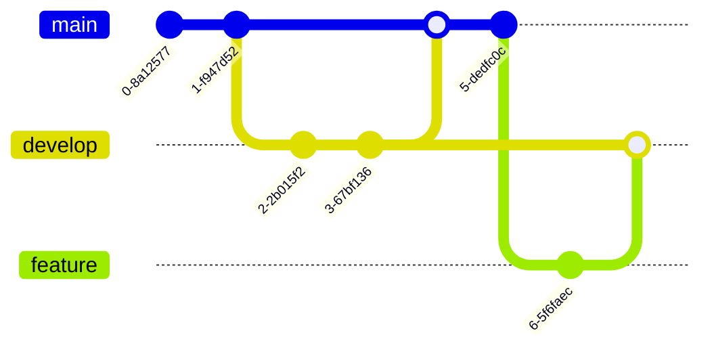

# Mermaid Chart

## 概述

此技能帮助用户将文字描述或概念转换为 Mermaid 图表代码，增强文档的可读性和可视化效果。

## 工作流程


## 图表类型速查

根据内容类型选择合适的图表：


## 图表类型详解

### 1. 流程图 (flowchart)

**适用场景**：业务流程、算法步骤、系统架构

**语法模板**：

```markdown

```

**方向说明**：
- `TD` 或 `TB`：从上到下
- `BT`：从下到上
- `LR`：从左到右
- `RL`：从右到左

**节点形状**：
- `[文本]`：矩形
- `(文本)`：圆角矩形
- `{文本}`：菱形（判断）
- `((文本))`：圆形
- `>文本]`：不对称矩形

### 2. 序列图 (sequenceDiagram)

**适用场景**：接口调用、交互流程、消息传递

**语法模板**：

```markdown

```

**常用语法**：
- `->>`：实线箭头
- `-->>`：虚线箭头
- `->>+`：带激活的箭头
- `-->>-`：带取消激活的箭头
- `Note over A,B`：在 A 和 B 上方添加注释
- `activate/deactivate`：激活/取消激活生命线

### 3. 类图 (classDiagram)

**适用场景**：代码结构、继承关系、模块依赖

**语法模板**：

```markdown

```

**关系类型**：
- `-->` 或 `..>`：依赖/关联
- `--|>` 或 `..|>`：继承/实现
- `--o` 或 `..o`：聚合
- `--*` 或 `..*`：组合

### 4. 状态图 (stateDiagram)

**适用场景**：状态转换、生命周期、工作流

**语法模板**：

```markdown

```

### 5. 甘特图 (gantt)

**适用场景**：项目计划、时间安排、里程碑

**语法模板**：

```markdown

```

### 6. 思维导图 (mindmap)

**适用场景**：知识结构、概念梳理、分类整理

**语法模板**：

```markdown

```

### 7. 饼图 (pie)

**适用场景**：占比分析、数据统计、分布展示

**语法模板**：

```markdown

```

### 8. ER 图 (erDiagram)

**适用场景**：数据库设计、实体关系、模型设计

**语法模板**：

```markdown

```

**关系类型**：
- `||--o{`：一对一 对 一对多
- `||--||`：一对一 对 一对一
- `}o--o{`：多对多

### 9. 用户旅程图 (journey)

**适用场景**：用户体验、流程分析、痛点识别

**语法模板**：

```markdown

```

### 10. Git 图 (gitGraph)

**适用场景**：分支策略、版本管理、协作流程

**语法模板**：

```markdown

```

## 样式优化指南

### 配色方案（适配网站主题）


### 常用样式属性

```markdown

```

**样式属性**：
- `fill`：填充颜色
- `stroke`：边框颜色
- `color`：文字颜色
- `stroke-width`：边框宽度
- `stroke-dasharray`：虚线样式

### 类定义样式

```markdown

```

## 使用场景示例

### 场景 1：系统架构图

```
用户: 帮我画一个微服务架构图

Claude: [生成架构图]


```

### 场景 2：算法流程图

```
用户: 用流程图展示二分查找算法

Claude: [生成算法流程图]

```mermaid
flowchart TD
    Start([开始]) --> Init[初始化<br/>left=0, right=n-1]
    Init --> Loop{left <= right?}
    Loop -->|是| Calc[mid = left + right / 2]
    Calc --> Compare{arr[mid] == target?}
    Compare -->|是| Found[返回 mid]
    Compare -->|否| Compare2{arr[mid] < target?}
    Compare2 -->|是| UpdateLeft[left = mid + 1]
    Compare2 -->|否| UpdateRight[right = mid - 1]
    UpdateLeft --> Loop
    UpdateRight --> Loop
    Loop -->|否| NotFound[返回 -1]
    Found --> End([结束])
    NotFound --> End
```
```

### 场景 3：项目时间线

```
用户: 生成一个3个月的学习计划甘特图

Claude: [生成甘特图]


```

## 最佳实践

1. **保持简洁** - 一个图表不要包含过多节点（建议 < 15 个）
2. **逻辑清晰** - 使用子图（subgraph）组织相关节点
3. **配色统一** - 使用网站主题色保持一致性
4. **添加注释** - 使用 Note 或注释说明关键逻辑
5. **响应式考虑** - 复杂图表使用 LR 方向避免过高

## 资源文件

此技能不包含捆绑资源文件。
