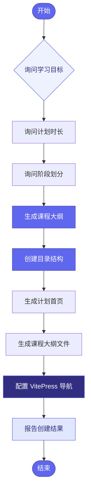
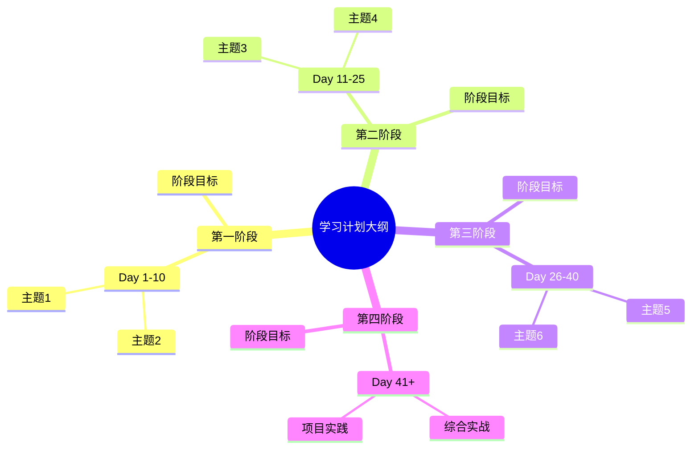
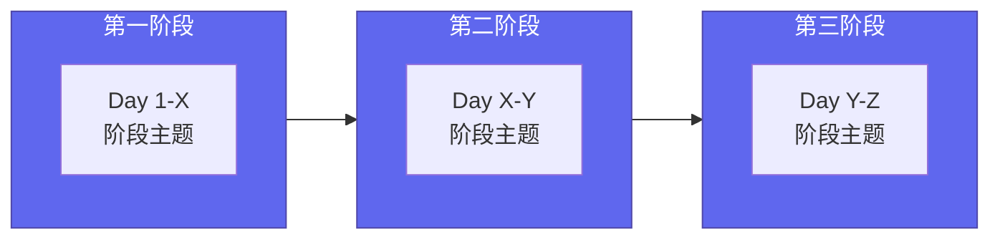
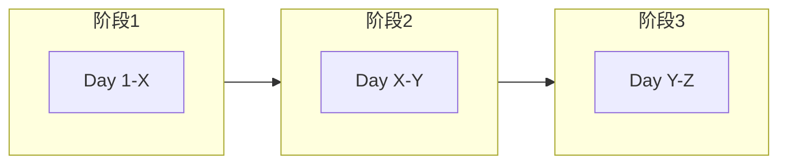

# Plan Creator

## 概述

此技能帮助用户创建结构化的学习计划，包括生成目录结构、课程大纲、每日主题规划等。

## 工作流程



## 步骤 1：收集计划信息

### 问题 1：学习目标

```yaml
question: 你想通过这个计划达成什么目标？
header: 学习目标
placeholder: 例如：掌握云原生技术栈、深入学习 AI 大模型应用、系统学习分布式系统等
```

### 问题 2：计划时长

```yaml
question: 计划的时长是？
header: 计划时长
options:
  - label: 30 天（冲刺计划）
    description: 快速入门一个新领域
  - label: 60 天（进阶计划）
    description: 系统掌握核心技术
  - label: 90 天（深度计划）
    description: 深入理解并实践
  - label: 100 天（完整计划）
    description: 从入门到精通的完整路径
  - label: 自定义
    description: 指定天数
multiSelect: false
```

### 问题 3：阶段划分

```yaml
question: 你想如何划分学习阶段？
header: 阶段划分
options:
  - label: 基础 → 进阶 → 实战
    description: 3 阶段经典路线
  - label: 入门 → 核心 → 扩展 → 综合
    description: 4 阶段系统路线
  - label: 自定义划分
    description: 根据主题特点自定义
multiSelect: false
```

### 问题 4：主题领域

```yaml
question: 计划的主题领域是？
header: 主题领域
options:
  - label: 前端开发
  - label: 后端开发
  - label: 云原生/DevOps
  - label: 人工智能/机器学习
  - label: 数据工程
  - label: 安全攻防
  - label: 系统架构
  - label: 其他（请描述）
multiSelect: false
```

## 步骤 2：生成课程大纲

根据收集的信息，生成课程大纲：



### 课程大纲模板

```markdown
# [计划名称] 课程大纲

> [X] 天学习计划 | [主题领域]

---

## 学习路线图



## 第一阶段：[阶段名称]（Day 1-X）

**阶段目标**：[一句话描述目标]

| Day | 主题 | 核心内容 |
|-----|------|----------|
| Day 1 | [主题1] | [核心概念] |
| Day 2 | [主题2] | [核心概念] |
| ... | ... | ... |

## 第二阶段：[阶段名称]（Day X-Y）

**阶段目标**：[一句话描述目标]

| Day | 主题 | 核心内容 |
|-----|------|----------|
| Day X | [主题] | [核心概念] |

## 第三阶段：[阶段名称]（Day Y-Z）

...

## 学习心法

- **输出倒逼输入**：只有能讲清楚，才算真正学会
- **建立知识图谱**：新知识要和旧知识连成网
- **动手优先**：至少 70% 的时间花在实践上
- **持续迭代**：每天进步一点点，[X] 天后大不同
```

## 步骤 3：创建目录结构

创建以下文件结构：

```
docs/plan-{N}/
├── index.md              # 计划首页
├── {N}-days-{plan-name}-plan.md  # 完整课程大纲
└── YYYY-MM-DD-主题.md    # 每日学习笔记（后续生成）
```

### 计划首页模板

```markdown
# Plan {N}: [计划名称]

> 目标：[一句话描述目标]
> 
> 适用人群：[目标人群]

---

## 学习路线图



## 阶段概览

### 🚀 第一阶段：[名称]（Day 1-X）

**阶段目标**：[目标描述]

| Day | 主题 | 状态 |
|-----|------|------|
| Day 1 | [主题] | ⚪ 待开始 |
| Day 2 | [主题] | ⚪ 待开始 |

...

## 学习方法论

### 每日笔记模板

```markdown
# [主题名称]

> Plan {N} | Day X

---

## 目录
- [第一部分：...](#第一部分xxx)
- [第二部分：...](#第二部分xxx)
- [第三部分：实践与思考](#第三部分实践与思考)

---

## 第一部分：[主主题]

### 子主题

**概念说明**

[内容]

---

## 第二部分：[相关主题]

...

---

## 第三部分：实践与思考

### 实践记录

- [ ] 待办事项

### 疑问与思考

**已解答**
1. ✅ 已解决的问题

**待探索**
2. ❓ 待深入的问题

---

*更新日期：YYYY-MM-DD*
```

### 学习原则

1. **结构化展示** - 分为第一部分/第二部分/第三部分
2. **使用表格** - 对比、配置、示例等信息使用表格
3. **代码示例** - 提供可运行的代码示例
4. **疑问追踪** - 用 ✅ 标记已解答，用 ❓ 标记待探索
5. **可视化** - 使用 Mermaid 图表增强理解

## 每日学习记录

点击左侧侧边栏查看详细的每日学习笔记。

---

*学习是一场马拉松，不是短跑。保持节奏，享受过程！*
```

## 步骤 4：配置 VitePress

更新 `docs/.vitepress/config.ts` 添加新计划的导航：

```typescript
nav: [
  { text: '首页', link: '/' },
  { 
    text: '学习计划',
    items: [
      { text: 'Plan 1: 硬核开发者进阶', link: '/plan-1/' },
      { text: 'Plan {N}: [新计划名称]', link: '/plan-{N}/' },  // 新增
    ]
  },
]

sidebar: {
  '/plan-1/': getSidebar('plan-1'),
  '/plan-{N}/': getSidebar('plan-{N}'),  // 新增
}
```

## 步骤 5：报告创建结果

向用户报告创建结果：


报告内容：

1. **创建的文件列表** - 所有生成的文件路径
2. **课程大纲概览** - 各阶段主题统计
3. **使用方法** - 如何开始第一天的学习
4. **下一步建议** - 建议立即开始的行动

## 示例对话

```
用户: 我想创建一个 60 天的云原生学习计划

Claude: [触发 plan-creator 技能]

好的，我来帮你创建一个 60 天的云原生学习计划。

让我先了解一些信息：

1. 你想如何划分学习阶段？
   - 基础 → 进阶 → 实战（3 阶段）
   - 入门 → 核心 → 扩展 → 综合（4 阶段）
   - 自定义划分

2. 你期望的学习深度是？
   - 快速入门，了解全貌
   - 系统学习，掌握核心
   - 深入原理，生产 ready

[根据用户选择生成课程大纲...]

✅ Plan 2: 云原生 60 天进阶计划 已创建！

📁 生成的文件：
├── docs/plan-2/index.md                    # 计划首页
├── docs/plan-2/60-days-cloud-native-plan.md # 完整课程大纲
└── docs/.vitepress/config.ts               # 已更新导航

📊 课程大纲概览：
├── 第一阶段：容器基础（Day 1-15）
│   └── Docker 基础、镜像构建、容器编排
├── 第二阶段：Kubernetes 核心（Day 16-35）
│   └── K8s 架构、工作负载、网络存储
├── 第三阶段：云原生生态（Day 36-50）
│   └── Helm、Prometheus、GitOps、Service Mesh
└── 第四阶段：实战与优化（Day 51-60）
    └── 生产部署、性能优化、故障排查

🎯 下一步建议：
1. 访问网站查看新计划的导航是否生效
2. 使用 daily-learning 技能开始 Day 1 的学习
3. 根据实际进度调整课程大纲中的具体内容

是否需要我帮你开始第一天的学习？
```

## 使用场景示例

### 场景 1：创建 AI 学习路线

```
用户: 我想系统学习 AI 大模型应用开发

→ 创建 90 天计划
→ 4 阶段：基础 → 模型 → 应用 → 实战
→ 生成课程大纲包含：Transformer、Prompt Engineering、RAG、Agent 等
```

### 场景 2：创建面试准备计划

```
用户: 我想准备后端开发面试

→ 创建 30 天冲刺计划
→ 3 阶段：基础 → 进阶 → 模拟
→ 包含：数据结构、系统设计、算法、项目复盘
```

### 场景 3：创建技术转型计划

```
用户: 我是前端开发，想转型全栈

→ 创建 60 天转型计划
→ 包含：Node.js、数据库、API 设计、部署运维
```

## 资源文件

此技能不包含捆绑资源文件。
