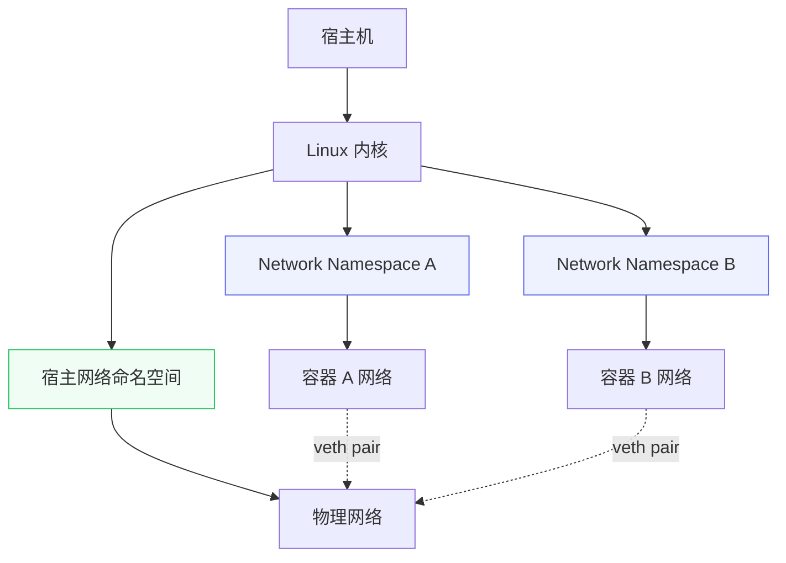
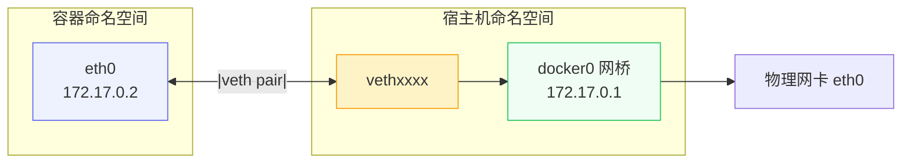
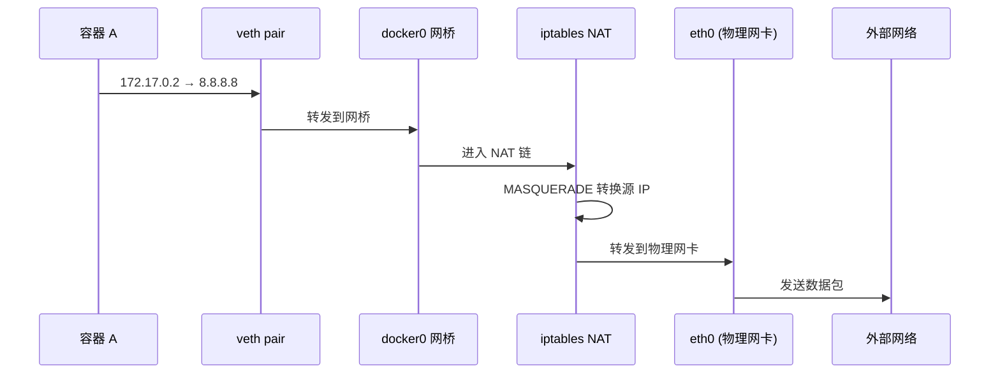
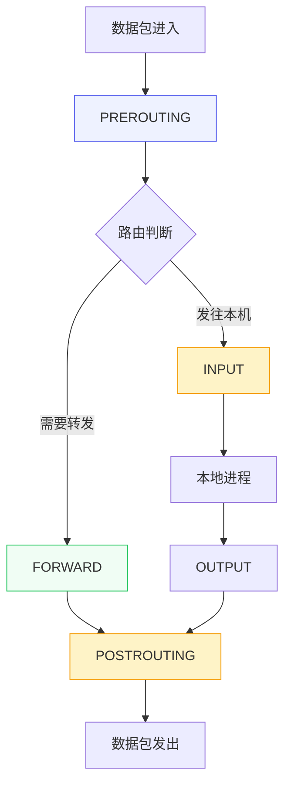
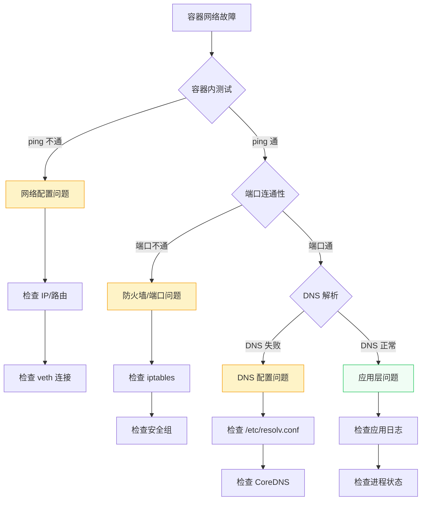

# 容器网络排查

> 100 天认知提升计划 | Day 7

---

## 目录
- [第一部分：容器网络原理](#第一部分容器网络原理)
  - [Network Namespace 隔离](#network-namespace-隔离)
  - [veth pair 与桥接](#veth-pair-与桥接)
  - [Docker 四大网络模式](#docker-四大网络模式)
- [第二部分：网络排查工具](#第二部分网络排查工具)
  - [nsenter 命名空间操作](#nsenter-命名空间操作)
  - [tcpdump 抓包分析](#tcpdump-抓包分析)
  - [conntrack 连接追踪](#conntrack-连接追踪)
  - [iptables 网络策略](#iptables-网络策略)
- [第三部分：安全攻防与故障排查](#第三部分安全攻防与故障排查)
  - [常见安全问题](#常见安全问题)
  - [防护策略](#防护策略)
  - [排查流程](#排查流程)
  - [实践任务](#实践任务)

---

## 第一部分：容器网络原理

### Network Namespace 隔离

**概念说明**

Linux Network Namespace 是容器网络隔离的核心技术，每个容器拥有独立的网络协议栈，包括网卡、IP 地址、路由表、防火墙规则等。

**工作原理**



Docker 使用的 6 种 Namespace：

| Namespace 类型 | 隔离内容 | Docker 应用 |
|---------------|----------|-------------|
| PID | 进程 ID 空间 | 容器内 PID 从 1 开始 |
| **Network** | **网卡、IP、路由** | **独立网络栈** |
| Mount | 文件系统挂载点 | 独立的 rootfs |
| UTS | 主机名和域名 | 可设置独立 hostname |
| IPC | 进程间通信 | 共享内存、消息队列隔离 |
| User | 用户和组 ID | 容器内 root ≠ 宿主机 root |

**验证网络隔离**

::: v-pre

```bash
# 查看容器的 Network Namespace
docker inspect <container_id> --format '{{.State.Pid}}'
ls -l /proc/<pid>/ns/net

# 在宿主机查看容器的网络配置
nsenter -t <pid> -n ip addr
```

:::

---

### veth pair 与桥接

**概念说明**

veth pair（虚拟以太网对）是 Linux 内核中成对出现的虚拟网络设备，数据从一端发出会立即出现在另一端接收队列中，类似一根虚拟网线。

**工作模式**



**veth pair 特性**

| 特性 | 说明 |
|------|------|
| 成对出现 | 创建时必须指定 peer 名称 |
| 跨命名空间 | 两端可分别位于不同的 netns |
| 点对点通信 | 数据一端进、另一端出 |
| 零丢失 | 无传统网络中的丢包概念 |

---

### Docker 四大网络模式

**模式对比**

| 网络模式 | 隔离级别 | 端口映射 | 适用场景 | 安全风险 |
|----------|----------|----------|----------|----------|
| **Bridge** | 高 | 需要 | 默认模式，Web 服务 | 低 |
| **Host** | 无 | 无需 | 高性能需求、监控 | **高** |
| **None** | 极高 | 无 | 安全沙箱、离线计算 | 极低 |
| **Container** | 中 | 视目标容器 | Sidecar 模式、调试 | 中 |

**Bridge 模式（默认）**

```bash
# 查看默认桥接网络
docker network inspect bridge

# 创建自定义桥接网络
docker network create --driver bridge --subnet 192.168.100.0/24 my-net

# 容器加入自定义网络
docker run -d --name web --network my-net nginx
```

**Host 模式（高性能但高风险）**

```bash
# 容器共享宿主机网络栈
docker run --network=host nginx

# 风险：容器可直接访问宿主机所有端口
# 防护：结合 SELinux/AppArmor 强化访问控制
```

**数据流向（Bridge 模式）**



---

## 第二部分：网络排查工具

### nsenter 命名空间操作

**核心功能**

nsenter（namespace enter）用于进入指定进程的命名空间执行命令，是容器网络排查的利器。

**基本语法**

```bash
nsenter [options] [program [arguments]]

# 常用选项
-t, --target <pid>    # 指定目标进程 PID
-m, --mount           # 进入挂载命名空间
-u, --uts             # 进入 UTS 命名空间（主机名）
-i, --ipc             # 进入 IPC 命名空间
-n, --net             # 进入网络命名空间（最常用）
-p, --pid             # 进入 PID 命名空间
-U, --user            # 进入用户命名空间
```

**实战操作**

::: v-pre

```bash
# 1. 获取容器进程 PID
PID=$(docker inspect -f '{{.State.Pid}}' <container_name>)

# 2. 进入容器的网络命名空间
nsenter -t $PID -n ip addr
nsenter -t $PID -n ip route
nsenter -t $PID -n iptables -t nat -L -n -v

# 3. 在容器 netns 中执行 tcpdump 抓包
nsenter -t $PID -n tcpdump -i any -w /tmp/capture.pcap

# 4. 一键进入容器所有命名空间（模拟 docker exec）
nsenter -t $PID -m -u -i -n -p bash
```

:::

**Docker vs containerd 运行时**

| 运行时 | 获取 PID 命令 |
|--------|--------------|
| Docker | `docker inspect -f '&#123;&#123;.State.Pid&#125;&#125;'` |
| containerd/CRI-O | `crictl inspect <container-id> \| jq -r .info.pid` |
| Kubernetes | `crictl inspectp <sandbox-id> \| jq -r .info.pid` |

---

### tcpdump 抓包分析

**核心功能**

tcpdump 是 Linux 下最强大的网络抓包工具，可实时捕获和分析网络数据包。

**常用参数**

| 参数 | 说明 |
|------|------|
| `-i <iface>` | 指定网卡，`any` 表示所有网卡 |
| `-nn` | 不做 DNS 解析，不转换端口名 |
| `-s 0` | 抓完整包（不截断） |
| `-vv` | 更详细的协议解码 |
| `-c <n>` | 抓 n 个包后停止 |
| `-w <file>` | 写入文件（供 Wireshark 分析） |
| `-A/-X` | 以 ASCII/HEX 打印 payload |

**实战命令**

::: v-pre

```bash
# 1. 抓取容器网络流量（在宿主机）
# 找到容器对应的 veth 接口
VETH=$(ip link | grep -A1 "veth" | grep "@" | head -1 | cut -d: -f2 | cut -d@ -f1 | tr -d ' ')
tcpdump -i $VETH -nn -s 0 -w container.pcap

# 2. 抓取特定端口的流量
tcpdump -i any port 80 -nn

# 3. 只抓 SYN 包（连接建立）
tcpdump -i any 'tcp[tcpflags] & tcp-syn != 0'

# 4. 抓取 HTTP 请求
tcpdump -i any -A -s 0 'tcp port 80 and (((ip[2:2] - ((ip[0]&0xf)<<2)) - ((tcp[12]&0xf0)>>2)) != 0)'

# 5. 进入容器 netns 抓包
PID=$(docker inspect -f '{{.State.Pid}}' mycontainer)
nsenter -t $PID -n tcpdump -i any -nn -s 0 host 8.8.8.8
```

:::

**过滤表达式速查**

```bash
# 主机过滤
host 192.168.1.1           # 源或目标 IP
src host 10.0.0.1          # 源 IP
dst host 10.0.0.2          # 目标 IP

# 端口过滤
port 80                    # 源或目标端口
src port 53                # 源端口
dst port 443               # 目标端口

# 协议过滤
tcp                        # TCP 协议
udp                        # UDP 协议
icmp                       # ICMP 协议

# 组合过滤
host 192.168.1.1 and port 80
tcp port 443 and host not 192.168.1.100

# TCP 标志位过滤
'tcp[tcpflags] & tcp-syn != 0'     # SYN 包
'tcp[tcpflags] & tcp-rst != 0'     # RST 包
'tcp[13] & 4!=0'                   # PSH 包（RST）
```

---

### conntrack 连接追踪

**概念说明**

conntrack（connection tracking）是 Linux 内核的网络连接跟踪机制，用于维护网络连接的状态信息，是 NAT 和状态防火墙的基础。

**连接状态**

| 状态 | 说明 |
|------|------|
| NEW | 新连接，如 TCP SYN 包 |
| ESTABLISHED | 已建立连接 |
| RELATED | 相关连接（如 FTP 数据连接） |
| INVALID | 无效连接 |

**常用命令**

```bash
# 1. 查看连接跟踪表
conntrack -L

# 2. 查看连接数量
conntrack -C

# 3. 查看特定连接
conntrack -L | grep 172.17.0.2

# 4. 按状态统计
conntrack -L | awk '{print $3}' | sort | uniq -c

# 5. 删除连接（慎用）
conntrack -D                      # 删除所有连接
conntrack -D -s 192.168.1.100     # 删除指定源 IP 的连接
conntrack -D --state ESTABLISHED  # 删除已建立的连接

# 6. 导出/导入连接表
conntrack -E > conntrack.dump
conntrack -I < conntrack.dump
```

**常见问题：连接跟踪表满**

```bash
# 现象：nf_conntrack: table full, dropping packet
# 排查
conntrack -C                      # 查看当前连接数
sysctl net.netfilter.nf_conntrack_max  # 查看最大连接数

# 临时解决（按状态清理）
conntrack -D --state CLOSE_WAIT   # 删除等待关闭的连接

# 永久解决（调整参数）
vi /etc/sysctl.conf
net.netfilter.nf_conntrack_max = 262144
net.nf_conntrack_buckets = 65536
sysctl -p
```

---

### iptables 网络策略

**核心概念**

iptables 是 Linux 内核 netfilter 框架的用户空间配置工具，通过表（tables）-链（chains）-规则（rules）三层结构实现网络流量控制。

**五表五链**

| 表 | 功能 | 默认可用 |
|----|------|----------|
| **filter** | 数据包过滤（ACCEPT/DROP） | ✅ |
| **nat** | 地址转换（SNAT/DNAT） | ✅ |
| mangle | 数据包修改 | ✅ |
| raw | 连接跟踪例外 | ✅ |
| security | SELinux 标记 | ✅ |

| 链 | Hook 点 | 流量方向 |
|----|---------|----------|
| PREROUTING | 数据包进入后，路由前 | 入站 |
| INPUT | 发往本机的数据包 | 入站 |
| FORWARD | 转发的数据包 | 转发 |
| OUTPUT | 本机发出的数据包 | 出站 |
| POSTROUTING | 路由后，发出前 | 出站 |

**数据包流向**



**Docker 自动创建的链**

```bash
# 查看 Docker 生成的 iptables 规则
iptables -t nat -L -n -v | grep -A 20 "Chain DOCKER"
iptables -L FORWARD -n -v | grep -A 10 "Chain DOCKER"

# 重要链：
# - DOCKER: DNAT 规则，端口映射
# - DOCKER-USER: 用户自定义规则（不会被 Docker 覆盖）
# - DOCKER-ISOLATION: 容器间隔离
```

**实战规则**

```bash
# 1. 查看所有规则
iptables -L -n -v --line-numbers
iptables -t nat -L -n -v

# 2. 阻止特定容器访问外网
iptables -I FORWARD -s 172.17.0.2 -d 0.0.0.0/0 -j DROP

# 3. 在 DOCKER-USER 链添加规则（持久化）
iptables -I DOCKER-USER -s 172.17.0.0/16 -d 8.8.8.8 -j DROP

# 4. 保存规则
iptables-save > /etc/iptables/rules.v4

# 5. 恢复规则
iptables-restore < /etc/iptables/rules.v4
```

---

## 第三部分：安全攻防与故障排查

### 常见安全问题

**容器网络逃逸风险**

| 攻击向量 | 风险等级 | 防护措施 |
|----------|----------|----------|
| 特权容器（--privileged） | **极高** | 禁止在生产环境使用 |
| Host 网络模式 | 高 | 仅在必要时使用，配合访问控制 |
| 挂载 /var/run/docker.sock | **极高** | 绝对禁止 |
| 默认 bridge 无隔离 | 中 | 使用自定义网络 + NetworkPolicy |
| 容器内运行 root 进程 | 中 | 启用 User Namespace |

**常见网络攻击**

1. **SYN Flood 攻击**
   - 现象：大量 SYN 包耗尽连接跟踪表
   - 防护：启用 `tcp_syncookies`，限制 SYN 速率

2. **DNS 污染**
   - 现象：容器 DNS 被篡改
   - 防护：使用 CoreDNS，配置上游 DNS

3. **横向渗透**
   - 现象：容器 A 攻击同网络其他容器
   - 防护：NetworkPolicy，网络分段

---

### 防护策略

**网络隔离最佳实践**

```bash
# 1. 使用自定义网络（支持 DNS 解析）
docker network create --driver bridge app-network

# 2. 创建隔离的测试网络
docker network create --driver bridge --internal isolated-net
# --internal: 禁止容器访问外网

# 3. 启用 User Namespace（容器内 root ≠ 宿主机 root）
# /etc/docker/daemon.json
{
  "userns-remap": "default"
}

# 4. 限制容器网络权限
docker run --security-opt=no-new-privileges \
           --cap-drop=ALL \
           --cap-add=NET_BIND_SERVICE \
           nginx
```

**iptables 防护规则**

```bash
# 1. 防止 SYN Flood
iptables -A INPUT -p tcp --syn -m limit --limit 10/s --limit-burst 20 -j ACCEPT
iptables -A INPUT -p tcp --syn -j DROP

# 2. 限制每个 IP 的并发连接数
iptables -A INPUT -p tcp --syn -m connlimit --connlimit-above 50 -j REJECT

# 3. 防止端口扫描
iptables -A INPUT -p tcp --tcp-flags ALL NONE -j DROP
iptables -A INPUT -p tcp --tcp-flags ALL ALL -j DROP

# 4. 记录可疑流量
iptables -A INPUT -m limit --limit 5/min -j LOG --log-prefix "IPTABLES DROP: "
```

**conntrack 防护**

```bash
# 1. 调整 conntrack 表大小
sysctl -w net.netfilter.nf_conntrack_max=262144
sysctl -w net.netfilter.nf_conntrack_buckets=65536

# 2. 减少连接超时时间
sysctl -w net.netfilter.nf_conntrack_tcp_timeout_established=600
sysctl -w net.netfilter.nf_conntrack_tcp_timeout_time_wait=30

# 3. 启用 SYN Cookies（防止 SYN Flood）
sysctl -w net.ipv4.tcp_syncookies=1
```

---

### 排查流程

**分层排查法**



**快速排查命令清单**

::: v-pre

```bash
# 1. 检查容器网络配置
docker inspect <container> | grep -A 20 "NetworkSettings"

# 2. 进入容器网络命名空间
PID=$(docker inspect -f '{{.State.Pid}}' <container>)
nsenter -t $PID -n ip addr
nsenter -t $PID -n ip route

# 3. 测试基础连通性
nsenter -t $PID -n ping -c 3 8.8.8.8        # 测试公网
nsenter -t $PID -n ping -c 3 <gateway>      # 测试网关

# 4. 测试 DNS 解析
nsenter -t $PID -n nslookup google.com

# 5. 测试端口连通性
nsenter -t $PID -n nc -zv <target_ip> <port>

# 6. 检查 iptables 规则
iptables -L FORWARD -n -v
iptables -t nat -L -n -v

# 7. 检查 conntrack 状态
conntrack -L | grep <container_ip>
conntrack -C

# 8. 抓包分析
tcpdump -i <veth> -nn -s 0 host <target_ip>
```

:::

---

### 实践任务

**基础任务**

- [ ] 1. 创建自定义 bridge 网络，启动两个容器并验证连通性
- [ ] 2. 使用 nsenter 进入容器网络命名空间，查看网络配置
- [ ] 3. 在容器内执行 tcpdump 抓包，分析 HTTP 请求

**进阶任务**

- [ ] 4. 模拟 conntrack 表满问题，并使用 conntrack -D 清理
- [ ] 5. 配置 iptables 规则阻止特定容器访问外网
- [ ] 6. 使用 tcpdump 分析容器间通信的完整 TCP 握手过程

**安全任务**

- [ ] 7. 配置 iptables 防止 SYN Flood 攻击
- [ ] 8. 创建隔离的网络环境，测试容器间隔离效果
- [ ] 9. 使用 User Namespace 实现容器内 root ≠ 宿主机 root

**实战场景**

- [ ] 10. 排查"容器无法访问外网"问题
- [ ] 11. 排查"容器间 DNS 解析失败"问题
- [ ] 12. 排查"容器访问 Service VIP 超时"问题

---

### 疑问与思考

**已解答**
1. ✅ Network Namespace 如何实现容器网络隔离？
2. ✅ veth pair 如何连接容器和宿主机？
3. ✅ 如何进入容器网络命名空间执行命令？
4. ✅ conntrack 表满如何解决？

**待探索**
1. ❓ Kubernetes 网络与 Docker 网络的区别？
2. ❓ CNI 插件（Flannel/Calico/Cilium）的工作原理？
3. ❓ eBPF 在容器网络中的应用？
4. ❓ 如何实现跨主机容器通信（Overlay 网络）？
5. ❓ Service Mesh（Istio/Linkerd）与容器网络的关系？

---

*更新日期：2026-02-24*

## 参考资料

- [Linux Network Namespace 详解](https://github.com/feiskyer/kubernetes-handbook/blob/master/concepts/linux-network-namespace.md)
- [Container Networking From Scratch - DockerCon](https://www.youtube.com/watch?v=Ok0JcEG8vE8)
- [Kubernetes Networking 101](https://www.youtube.com/watch?v=0Omvgd7Hg1I)
- [Docker 网络详解：四大网络模式](https://juejin.cn/post/7559932640288669722)
- [容器网络故障排查：从 ping 到 tcpdump](https://www.cnblogs.com/panwenbin-logs/p/19049365)
