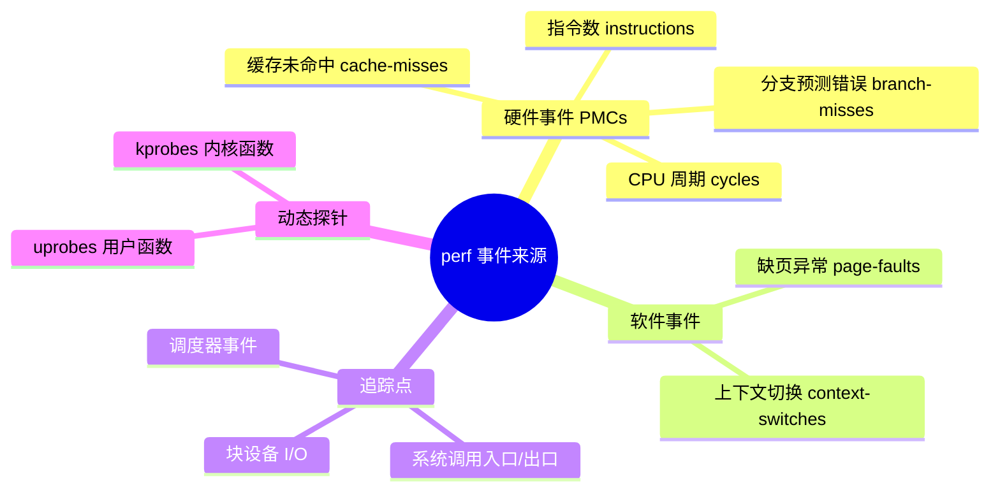
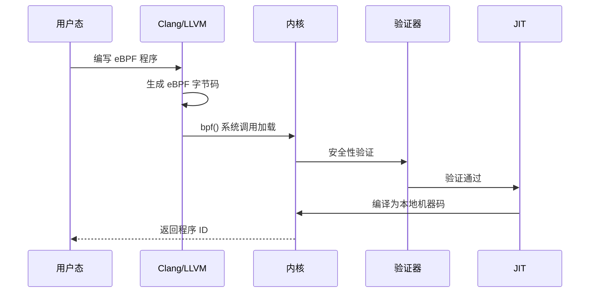

# 性能剖析实战

> 100 天认知提升计划 | Day 8

---

## 目录
- [第一部分：性能剖析基础](#第一部分性能剖析基础)
  - [perf 工具原理](#perf-工具原理)
  - [CPU 火焰图](#cpu-火焰图)
- [第二部分：eBPF 与 bpftrace](#第二部分ebpf-与-bpftrace)
  - [eBPF 架构](#ebpf-架构)
  - [bpftrace 探针机制](#bpftrace-探针机制)
- [第三部分：内存分析实战](#第三部分内存分析实战)
  - [用户态内存调试](#用户态内存调试)
  - [内核态内存分析](#内核态内存分析)

---

## 第一部分：性能剖析基础

### perf 工具原理

**概念说明**

`perf` 是 Linux 内核官方性能剖析器，位于内核源码的 `tools/perf` 目录。它是一个统一的前端接口，整合了内核中多种性能测量机制。

**核心操作模式**

| 模式 | 命令 | 开销 | 说明 |
|------|------|------|------|
| 计数 | `perf stat` | 最低 | 事件聚合统计，执行结束打印摘要 |
| 采样 | `perf record` | 中等 | 按频率捕获事件详情和调用栈 |
| 追踪 | `perf record -e <event>` | 最高 | 捕获每一次事件发生 |

**事件来源**



### CPU 火焰图

**发明者背景**

火焰图由 Brendan Gregg 发明，他是系统性能优化领域的顶级专家，曾任职于 Sun Microsystems、Netflix、Intel，2026 年 2 月加入 OpenAI 专攻 ChatGPT 性能优化。

**工作原理**


**火焰图阅读指南**

| 维度 | 含义 | 分析技巧 |
|------|------|----------|
| **横轴宽度** | 采样次数占比（非时间轴） | 越宽 = CPU 占用越高，优先优化 |
| **纵轴深度** | 调用栈深度 | 层数多 = 嵌套调用复杂 |
| **颜色** | 默认无特殊含义 | 仅区分不同函数 |
| **顶部宽块** | 函数自身耗时多 | 密集计算、未优化算法 |
| **峡谷突变** | I/O 或锁等待 | write() 卡住导致堆积 |

**生成火焰图完整流程**

::: v-pre
```bash
# 1. 采样（99Hz，捕获调用栈）
sudo perf record -F 99 -ag -- sleep 30

# 2. 转换为折叠格式
sudo perf script | ./FlameGraph/stackcollapse-perf.pl > out.folded

# 3. 生成 SVG 火焰图
./FlameGraph/flamegraph.pl out.folded > flamegraph.svg

# 4. 差分火焰图（对比优化前后）
./FlameGraph/difffolded.pl old.folded new.folded | ./flamegraph.pl > diff.svg
```
:::

---

## 第二部分：eBPF 与 bpftrace

### eBPF 架构

**核心概念**

eBPF (Extended Berkeley Packet Filter) 是 Linux 内核中的一个虚拟机，允许用户在内核空间安全、高效地运行自定义程序。

**执行全流程**



**执行阶段详解**

| 阶段 | 说明 | 关键组件 |
|------|------|----------|
| **编译** | C/脚本 → eBPF 字节码 | Clang/LLVM |
| **加载** | 提交字节码到内核 | libbpf, bpf() 系统调用 |
| **验证** | 安全性检查 | BPF 验证器 |
| **JIT** | 字节码 → 机器码 | JIT 编译器 |

### bpftrace 探针机制

**探针类型选择**

| 探针类型 | 描述 | 稳定性 | 适用场景 |
|----------|------|--------|----------|
| **tracepoint** | 内核静态跟踪点 | ★★★★★ | 通用系统事件，优先选择 |
| **fentry/fexit** | 快速内核函数探针 | ★★★★☆ | 高频内核函数跟踪 |
| **kprobe/kretprobe** | 内核动态探针 | ★★☆☆☆ | 任意内核函数，可能失效 |
| **uprobe/uretprobe** | 用户态探针 | ★★☆☆☆ | 应用程序性能分析 |

**bpftrace 程序结构**

```c
preamble     // 序言：类型、宏定义

probe[,probe]      // 探针：事件类型
/ predicate / {    // 谓词：过滤条件
  action          // 动作：数据处理
}
```

**实战示例**

::: v-pre
```bash
# 1. CPU 火焰图（99Hz 采样）
bpftrace -e 'profile:hz:99 /pid == 1234/ { @[ustack] = count(); }'

# 2. off-CPU 分析（阻塞原因）
bpftrace -e 'kprobe:schedule { @[kstack, ustack, comm] = count(); }'

# 3. 内存分配追踪
bpftrace -e 'u:libc:malloc { @[comm, ustack] = count(); }'

# 4. 系统调用统计
bpftrace -e 'tracepoint:syscalls:sys_enter* { @[probe] = count(); }'
```
:::

**Map 数据结构**

| Map 类型 | 用途 | 性能特点 |
|----------|------|----------|
| **Hash Map** | 键值存储 | 动态扩容，通用性强 |
| **Array** | 固定大小索引 | 访问最快，已知数量 |
| **Per-CPU Array** | 无锁并发 | 高性能计数器 |
| **Stack Trace** | 调用栈存储 | 函数调用链分析 |

---

## 第三部分：内存分析实战

### 用户态内存调试

**Valgrind 工具集**

| 工具 | 功能 | 使用场景 |
|------|------|----------|
| **Memcheck** | 内存错误检测 | 泄漏、越界、未初始化 |
| **Callgrind** | 函数调用分析 | CPU 时间、调用次数 |
| **Massif** | 堆内存分析 | 内存使用峰值 |
| **Helgrind** | 线程竞争检测 | 死锁、数据竞争 |

::: v-pre
```bash
# 1. 检测内存泄漏
valgrind --leak-check=full --show-leak-kinds=all ./program

# 2. 函数调用分析
valgrind --tool=callgrind ./program
kcachegrind callgrind.out.<pid>

# 3. 堆内存分析
valgrind --tool=massif ./program
ms_print massif.out.<pid>
```
:::

### 内核态内存分析

**问题定位流程**

```mermaid
flowchart TD
    A[free/vmstat 观察] --> B{判断泄漏类型}
    B -->|MemFree↓ + Slab↑| C[内核态泄漏]
    B -->|进程 %MEM↑| D[用户态泄漏]
    C --> E[slabtop 定位 cache]
    E --> F[/proc/slabinfo 验证]
    F --> G[kmemleak 扫描]
    D --> H[valgrind 检测]

    style A fill:#54a0ff
    style B fill:#feca57
    style C fill:#ff6b6b
    style D fill:#48dbfb
```

**内核内存泄漏诊断**

::: v-pre
```bash
# 1. 观察 Slab 变化
watch -n 5 'cat /proc/meminfo | grep -E "MemFree|Slab|SUnreclaim"'

# 2. slabtop 定位暴涨缓存
slabtop -o  # 按 Shift+P 排序

# 3. 检查具体 cache
grep dentry /proc/slabinfo

# 4. kmemleak 扫描
echo scan > /sys/kernel/debug/kmemleak
cat /sys/kernel/debug/kmemleak

# 5. perf 内存分配追踪
perf record -e kmem:kmalloc,kmem:kfree -a sleep 30
perf script | grep -E "kmalloc|kfree"
```
:::

**关键指标解读**

| 指标 | 正常状态 | 异常信号 |
|------|----------|----------|
| **SUnreclaim/Slab** | < 50% | > 90% → 大量对象无法回收 |
| **ACTIVE/OBJS** | 稳定 | 稳定增长 → 只分配不释放 |
| **PageTables** | 平稳 | 持续上涨 → 进程数暴增 |

---

## 实践与思考

### 实践记录

- [ ] **任务 1**：生成一个简单程序的 CPU 火焰图
  - 编写一个计算密集型程序（如递归斐波那契）
  - 使用 `perf record` 采样 30 秒
  - 生成火焰图并分析热点函数

- [ ] **任务 2**：使用 bpftrace 追踪系统调用
  - 编写 bpftrace 脚本统计 syscalls 频率
  - 添加过滤条件只追踪特定进程
  - 生成直方图查看调用分布

- [ ] **任务 3**：检测一个程序的内存泄漏
  - 编写一个故意泄漏内存的 C 程序
  - 使用 valgrind 定位泄漏点
  - 修复后验证结果

- [ ] **任务 4**：off-CPU 分析
  - 使用 bpftrace 追踪 `schedule` 函数
  - 分析进程阻塞的调用栈
  - 找出阻塞的根本原因

- [ ] **任务 5**：生成差分火焰图
  - 对优化前后代码分别采样
  - 生成差分火焰图对比
  - 量化性能改进效果

### 疑问与思考

**已解答**

1. ✅ **perf 和 valgrind 的区别？**
   - perf：基于硬件计数器采样，关注 CPU 性能和热点，开销低
   - valgrind：用户态模拟执行，检测内存错误，开销高（10-30x）

2. ✅ **为什么火焰图横轴不是时间轴？**
   - 火焰图是对所有采样点的无序聚合
   - 横轴宽度代表采样次数占比
   - 同一行的函数按宽度排序，而非时间顺序

3. ✅ **bpftrace vs BCC 选择？**
   - bpftrace：单行脚本，快速诊断，学习曲线低
   - BCC：Python 编写，复杂逻辑，生产环境工具开发

**待探索**

1. ❓ eBPF 验证器的具体安全检查规则是什么？
   - 如何确保程序不会导致内核崩溃？
   - 哪些操作被验证器禁止？

2. ❓ 在容器环境中使用 perf 有哪些限制？
   - 容器内能否获取完整的性能数据？
   - 需要哪些特殊权限？

3. ❓ Brendan Gregg 加入 OpenAI 后的 AI 性能优化方向？
   - GPU 集群性能分析与传统 CPU 有何不同？
   - 神经网络的性能瓶颈在哪里？

4. ❓ JIT 编译后的 eBPF 程序性能损失有多大？
   - 与原生内核代码相比的效率差距？

---

## 参考资料

**官方文档**
- [perf wiki](https://perf.wiki.kernel.org/)
- [bpftrace GitHub](https://github.com/iovisor/bpftrace)
- [FlameGraph GitHub](https://github.com/brendangregg/FlameGraph)

**推荐书籍**
- [Systems Performance by Brendan Gregg](http://www.brendangregg.com/systems-performance-2nd-edition-book.html)
- [BPF Performance Tools](http://www.brendangregg.com/bpf-performance-tools-book.html)

**在线资源**
- [Brendan Gregg's Blog](https://www.brendangregg.com/blog/)
- [eBPF 官方网站](https://ebpf.io/)

---

*更新日期：2026-02-25*
