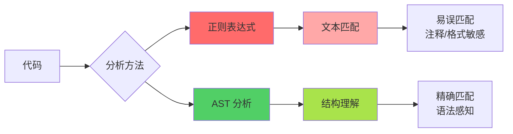
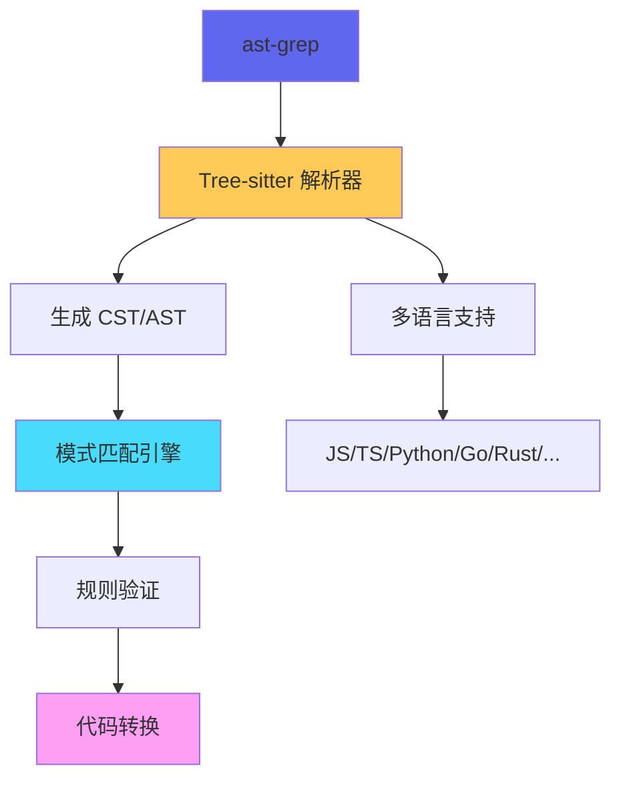
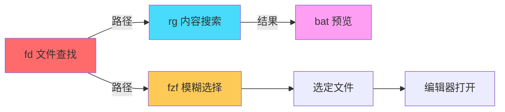

# 代码搜索神器

> 100 天认知提升计划 | Day 9

---

## 目录
- [第一部分：AST 结构化搜索](#第一部分ast-结构化搜索)
  - [ast-grep 核心原理](#ast-grep-核心原理)
  - [模式语法与规则配置](#模式语法与规则配置)
- [第二部分：文本搜索工具链](#第二部分文本搜索工具链)
  - [ripgrep 高级用法](#ripgrep-高级用法)
  - [fd 文件查找](#fd-文件查找)
- [第三部分：代码安全扫描](#第三部分代码安全扫描)
  - [静态分析工具](#静态分析工具)
  - [安全规则实践](#安全规则实践)

---

## 第一部分：AST 结构化搜索

### ast-grep 核心原理

**概念说明**

`ast-grep`（简称 `sg`）是基于抽象语法树（AST）的代码搜索、检查和重构工具。与传统的正则表达式不同，它理解代码的语法结构，能够进行精确的模式匹配和安全的代码转换。

**AST vs 正则表达式**



**核心优势**

| 维度 | 正则表达式 | ast-grep |
|------|-----------|----------|
| 匹配精度 | 文本层面，易误匹配 | 语法层面，理解结构 |
| 格式容忍 | 需处理空格/换行/缩进 | 自动忽略格式差异 |
| 注释处理 | 会匹配注释内容 | 跳过注释和字符串 |
| 重构安全 | 破坏语法结构 | 保证语法正确 |

**技术架构**



### 模式语法与规则配置

**基础模式语法**

ast-grep 使用类似代码的语法编写搜索模式：

::: v-pre
```bash
# 基础搜索：查找所有 console.log 调用
sg -p 'console.log($ARGS)' --lang js src/

# 重构：替换为 logger.debug
sg -p 'console.log($ARGS)' -r 'logger.debug($ARGS)' --lang js -i src/
```
:::

**元变量语法**

| 元变量 | 用途 | 示例 |
|--------|------|------|
| `$A` | 匹配任意表达式 | `console.log($A)` |
| `$$$` | 匹配任意序列 | `function($$$) { $$$ }` |
| `$_` | 单个通配符 | `if $_ == null` |

**YAML 规则配置**

完整的规则文件结构：

```yaml
id: no-console-log
language: javascript
message: "使用 logger 代替 console.log"
severity: warning

rule:
  pattern: console.log($$$)
  # 可添加更多约束条件

fix: logger.debug($$$)
```

**高级规则示例**

**场景 1：查找未处理的错误（Go）**

```yaml
id: unhandled-error
language: go
rule:
  pattern: if err != nil { $$$->Error() }
  # 匹配只调用 Error() 而不返回的情况
message: 错误未被处理或返回
```

**场景 2：检测 SQL 注入风险**

```yaml
id: sql-injection-risk
language: go
rule:
  pattern: db.Query($X + $Y)
message: 潜在的 SQL 注入，使用参数化查询
severity: error
```

**场景 3：迁移 API 调用**

```yaml
id: migrate-api
language: typescript
rule:
  pattern: oldAPI($$$ARGS)
fix: newAPI($$$ARGS)
```

---

## 第二部分：文本搜索工具链

### ripgrep 高级用法

**概念说明**

`ripgrep`（简称 `rg`）是 Rust 编写的现代正则表达式搜索工具，比传统 grep 快 5-10 倍，具有智能的默认配置。

**核心特性**

| 特性 | 说明 | 优势 |
|------|------|------|
| **智能大小写** | 默认忽略大小写，含大写时自动敏感 | 减少误匹配 |
| **自动忽略** | 遵循 .gitignore | 跳过无关文件 |
| **并行搜索** | 多线程遍历目录 | 极速响应 |
| **Unicode 支持** | 完整 Unicode 兼容 | 多语言友好 |

**高级搜索技巧**

::: v-pre
```bash
# 1. 多模式搜索（同时搜索多个关键词）
rg -e "error" -e "warning" -e "fatal" /var/log/

# 2. 上下文显示（匹配行周围内容）
rg "pattern" -C 3    # 前后各 3 行
rg "pattern" -A 5    # 之后 5 行
rg "pattern" -B 2    # 之前 2 行

# 3. 仅显示匹配部分
rg -o "[0-9]+"       # 只输出数字

# 4. 文件类型过滤
rg -t py "import"    # 仅 Python 文件
rg -T js "function"  # 排除 JavaScript 文件

# 5. PCRE2 高级正则
rg -P '(?=lookahead)pattern'

# 6. 统计匹配数
rg -c "TODO" --stats
```
:::

**正则元字符速查**

| 元字符 | 含义 | 示例 |
|--------|------|------|
| `^` | 行首 | `^func` |
| `$` | 行尾 | `\.js$` |
| `\b` | 单词边界 | `\bmain\b` |
| `*` | 0 次或多次 | `.*` |
| `+` | 1 次或多次 | `\d+` |
| `?` | 0 次或 1 次 | `file?` |
| `{n,m}` | n 到 m 次 | `a{2,4}` |

### fd 文件查找

**概念说明**

`fd` 是 `find` 命令的现代替代品，语法简洁、速度极快（比 find 快 23 倍），默认递归当前目录。

**基础用法对比**

| 操作 | find 命令 | fd 命令 |
|------|-----------|---------|
| 搜索文件名 | `find . -name '*config*'` | `fd config` |
| 按扩展名 | `find . -name '*.js'` | `fd -e js` |
| 仅文件 | `find . -type f -name '*'` | `fd -tf` |
| 搜索隐藏 | `find . -name '.*'` | `fd -H .` |

**高级功能**

::: v-pre
```bash
# 1. 模式匹配（正则表达式）
fd '^test_.*\.py$'          # 以 test_ 开头的 .py 文件
fd 'config\.(toml|yaml|json)'  # 多扩展名

# 2. 搜索深度限制
fd "src" --max-depth 2       # 最多搜索 2 层

# 3. 排除模式
fd -E node_modules "app" .   # 跳过 node_modules

# 4. 执行命令（批量操作）
fd -e zip -x unzip {}        # {} 占位符
fd -e jpg -x convert {} {.}.png  # {.} 无扩展名

# 5. 批次执行（一次传递所有结果）
fd -e md -X pandoc {} -o {}.pdf
```
:::

**与 fzf 集成（模糊选择）**

```bash
# 目录快速跳转
cdf() {
  cd "$(fd --type directory | fzf)"
}

# 文件预览
fd --type file | fzf --preview 'bat --color=always {}'
```

**工具链协作**



---

## 第三部分：代码安全扫描

### 静态分析工具

**概念说明**

静态代码分析（SAST）在不执行程序的情况下分析源代码，检测安全漏洞、代码异味和编码规范问题。

**工具分类对比**

| 类别 | 工具 | 语言支持 | 主要功能 |
|------|------|----------|----------|
| **综合平台** | SonarQube | 25+ | 质量门禁、技术债务 |
| **语义分析** | CodeQL | 10+ | 复杂漏洞、数据流分析 |
| **语言专用** | Pylint | Python | 代码质量、风格检查 |
| **语言专用** | ESLint | JS/TS | 语法错误、最佳实践 |
| **安全专项** | Bandit | Python | 安全坏味道检测 |
| **轻量级** | Flawfinder | Python/C++ | 快速风险扫描 |

**ast-grep 安全规则实践**

**规则 1：禁止使用 eval**

```yaml
id: no-eval
language: javascript
message: "禁止使用 eval，存在代码注入风险"
severity: error
rule:
  pattern: eval($$$)
```

**规则 2：检测硬编码密钥**

```yaml
id: no-hardcoded-key
language: python
rule:
  any:
    - pattern: api_key = "___"
    - pattern: password = "___"
    - pattern: secret = "___"
  constraints:
    "___":
      regex: ".{16,}"  # 至少 16 个字符
message: 检测到可能的硬编码密钥
```

**规则 3：SQL 注入检测**

```yaml
id: sql-injection
language: go
rule:
  pattern: db.Query($X + $Y)
message: 使用字符串拼接构建 SQL，存在注入风险
fix: |
  使用 db.QueryContext(ctx, $QUERY, $ARGS...)
```

**规则 4：不安全的随机数**

```yaml
id: insecure-random
language: python
rule:
  pattern: random.random()
message: 使用 secrets.SystemRandom() 或 secrets.token_hex()
```

### 安全规则实践

**常用安全检测模式**

| 漏洞类型 | 检测模式 | 严重级别 |
|----------|----------|----------|
| SQL 注入 | 字符串拼接查询 | 高 |
| XSS | 用户输入直接插入 DOM | 高 |
| 命令注入 | shell_exec / exec + 用户输入 | 高 |
| 硬编码密码 | 密钥常量定义 | 中 |
| 弱加密 | 使用 md5/sha1 做哈希 | 中 |
| 不安全随机 | math.random / rand | 中 |

**CI/CD 集成示例**

```yaml
# .github/workflows/security-scan.yml
name: Security Scan
on: [push, pull_request]

jobs:
  ast-grep-scan:
    runs-on: ubuntu-latest
    steps:
      - uses: actions/checkout@v4
      - name: Install ast-grep
        run: npm install -g @ast-grep/cli
      - name: Run security rules
        run: |
          sg scan --config .ast-grep/security.yml
      - name: Upload results
        uses: actions/upload-artifact@v4
        with:
          name: scan-results
          path: results/
```

---

## 实践与思考

### 实践记录

- [ ] **任务 1**：使用 ast-grep 进行 API 迁移
  - 选择项目中的一个旧 API（如 `console.log`）
  - 编写转换规则
  - 执行批量替换
  - 验证代码正确性

- [ ] **任务 2**：构建 ripgrep + fd 工作流
  - 使用 fd 快速定位目标文件
  - 配合 ripgrep 搜索代码内容
  - 集成 fzf 实现交互式选择
  - 添加到 shell 配置文件

- [ ] **任务 3**：编写自定义安全规则
  - 选择一个安全场景（如硬编码密钥）
  - 编写 ast-grep 规则文件
  - 在测试代码上验证
  - 集成到 CI/CD 流水线

- [ ] **任务 4**：性能对比测试
  - 对比 find vs fd 在大项目中的速度
  - 对比 grep vs ripgrep 的搜索效率
  - 记录性能数据并分析

- [ ] **任务 5**：构建代码搜索工具链
  - 编写组合脚本：fd → fzf → rg → bat
  - 实现一键搜索+预览功能
  - 添加到日常开发工作流

### 疑问与思考

**已解答**

1. ✅ **为什么 ast-grep 比 AST 工具更易用？**
   - 使用类似代码的语法，而非复杂的 AST 选择器
   - 模式更直观，学习成本低
   - 内置多语言支持，无需切换工具

2. ✅ **ripgrep 和 grep 什么时候应该用哪个？**
   - ripgrep：日常代码搜索，速度更快，默认配置更智能
   - grep：需要严格 POSIX 兼容或特殊功能时

3. ✅ **fd 能完全替代 find 吗？**
   - 不能。find 功能更强大（如按时间、权限查找）
   - fd 覆盖 80% 常用场景，且更简单快速

**待探索**

1. ❓ ast-grep 的性能在大规模代码库中表现如何？
   - 与传统 AST 工具（如 ESLint）的性能对比
   - 如何优化规则扫描速度？

2. ❓ 如何编写复杂的嵌套匹配规则？
   - 如何匹配多层嵌套的函数调用？
   - 如何处理上下文相关的匹配？

3. ❓ 代码搜索工具链的进一步优化？
   - 如何与 IDE 集成实现无缝跳转？
   - 如何构建团队共享的规则库？

4. ❓ 静态分析的误报率如何控制？
   - 如何平衡检测深度和误报率？
   - 如何实现智能的误报过滤？

---

## 参考资料

**官方文档**
- [ast-grep 官网](https://ast-grep.github.io/)
- [ripgrep GitHub](https://github.com/BurntSushi/ripgrep)
- [fd GitHub](https://github.com/sharkdp/fd)

**推荐资源**
- [ast-grep Playground](https://ast-grep.github.io/playground.html)
- [SonarQube 规则文档](https://docs.sonarqube.com/)
- [OWASP 代码安全指南](https://owasp.org/www-project-code-security-guide/)

---

*更新日期：2026-02-26*
