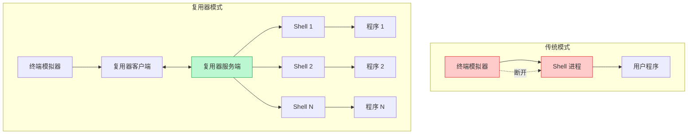
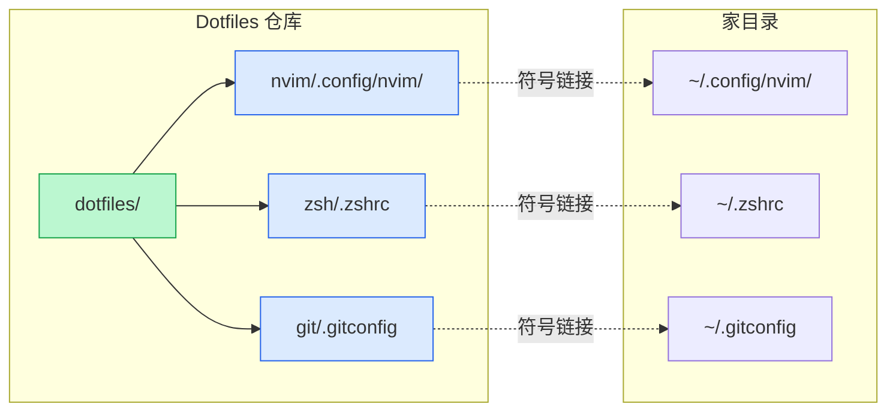

# 终端复用与自动化

> 100 天认知提升计划 | Day 10

---

## 目录

- [第一部分：终端复用原理](#第一部分终端复用原理)
  - [什么是终端复用器](#什么是终端复用器)
  - [核心工作原理](#核心工作原理)
  - [主流工具对比](#主流工具对比)
- [第二部分：核心工具实践](#第二部分核心工具实践)
  - [Zellij：现代终端复用器](#zellij现代终端复用器)
  - [direnv：目录级环境变量管理](#direnv目录级环境变量管理)
  - [GNU Stow：Dotfiles 管理](#gnu-stowdotfiles-管理)
  - [一键启动脚本](#一键启动脚本)
- [第三部分：实践与思考](#第三部分实践与思考)
  - [实践记录](#实践记录)
  - [疑问与思考](#疑问与思考)

---

## 第一部分：终端复用原理

### 什么是终端复用器

**终端复用器（Terminal Multiplexer）** 是一种允许在**一个终端窗口中运行多个独立终端会话**的工具。它解决了传统终端的多个痛点：

| 痛点 | 传统终端 | 终端复用器 |
|------|----------|------------|
| SSH 断开 | 进程终止 | 进程继续运行 |
| 多任务 | 打开多个窗口 | 单窗口多窗格 |
| 环境恢复 | 手动重建 | 自动恢复状态 |
| 配置迁移 | 手动复制 | 配置文件同步 |

### 核心工作原理



**关键概念**：

| 概念 | 说明 | 类比 |
|------|------|------|
| **会话（Session）** | 独立的工作环境容器 | 浏览器窗口 |
| **窗口（Window）** | 会话中的标签页 | 浏览器标签 |
| **窗格（Pane）** | 窗口中的分屏区域 | 分屏功能 |
| **分离（Detach）** | 断开客户端但保持会话运行 | 最小化窗口 |
| **附加（Attach）** | 重新连接到已存在的会话 | 恢复窗口 |

### 主流工具对比

| 特性 | tmux | Zellij | screen |
|------|------|--------|--------|
| **语言** | C | Rust | C |
| **默认配置** | 需要大量配置 | 开箱即用 | 基础 |
| **界面** | 传统 | 现代化 | 传统 |
| **布局系统** | 手动配置 | KDL 文件定义 | 基础 |
| **插件系统** | 有 | WebAssembly | 无 |
| **浮窗支持** | 无 | 有 | 无 |
| **学习曲线** | 陡峭 | 平缓 | 平缓 |
| **持久化** | 支持 | 支持 | 支持 |

---

## 第二部分：核心工具实践

### Zellij：现代终端复用器

[Zellij](https://zellij.dev/) 是用 Rust 编写的现代终端复用器，相比 tmux 具有更友好的默认配置和现代化界面。

#### 安装

```bash
# macOS
brew install zellij

# Linux (Ubuntu/Debian)
sudo apt install zellij

# 或使用 cargo
cargo install --locked zellij
```

#### 核心快捷键

Zellij 默认使用 `Ctrl-g` 作为前缀键（可配置）：

| 快捷键 | 功能 |
|--------|------|
| `Ctrl-g` `d` | 分离当前会话 |
| `Ctrl-g` `p` `n` | 新建窗格（横向） |
| `Ctrl-g` `p` `v` | 新建窗格（纵向） |
| `Ctrl-g` `t` `n` | 新建标签页 |
| `Ctrl-g` `h/j/k/l` | 窗格间导航 |
| `Ctrl-g` `z` | 窗格全屏切换 |
| `Ctrl-g` `x` | 关闭当前窗格 |
| `Ctrl-g` `q` | 退出 |

#### 布局配置文件

创建 `~/.config/zellij/layouts/dev.kdl`：

```kdl
layout {
    default_tab_template {
        children
        pane size=1 borderless=true {
            plugin location="zellij:tab-bar"
        }
    }
    tab name="Editor" {
        pane command="nvim" {
            cwd "."
        }
    }
    tab name="Terminals" {
        pane split_direction="vertical" {
            pane name="Server"
            pane name="Logs" command="tail" {
                args "-f" "app.log"
            }
        }
    }
    tab name="Git" {
        pane command="lazygit"
    }
}
```

#### 常用命令

```bash
# 启动新会话
zellij

# 使用指定布局启动
zellij --layout dev

# 附加到已存在的会话
zellij attach myapp

# 列出所有会话
zellij list-sessions

# 删除会话
zellij delete-session myapp

# 杀死所有会话
zellij kill-all-sessions
```

### direnv：目录级环境变量管理

[direnv](https://direnv.net/) 是一个 shell 扩展，能够根据当前目录**自动加载和卸载环境变量**。

#### 安装

```bash
# macOS
brew install direnv

# Linux (Ubuntu/Debian)
sudo apt install direnv

# 配置 shell（添加到 ~/.zshrc 或 ~/.bashrc）
eval "$(direnv hook zsh)"  # zsh
eval "$(direnv hook bash)" # bash
```

#### 基本使用

在项目根目录创建 `.envrc` 文件：

```bash
# .envrc - 项目环境变量配置

# 基本环境变量
export NODE_ENV=development
export DATABASE_URL="postgresql://localhost:5432/mydb"

# 添加项目 bin 目录到 PATH
export PATH="$PWD/node_modules/.bin:$PATH"

# 加载 .env 文件（如果存在）
dotenv
```

**安全机制**：首次创建或修改 `.envrc` 后需要手动授权：

```bash
direnv allow
```

#### 布局（Layout）功能

direnv 内置多种语言的项目布局支持：

```bash
# Python 项目 - 自动创建/激活虚拟环境
layout python

# 指定 Python 版本
layout python3.11

# Node.js 项目
layout node

# Go 项目
layout go
```

#### 实战示例

```bash
# ~/projects/myapi/.envrc

# 使用 Python 虚拟环境
layout python

# 设置环境变量
export API_HOST="0.0.0.0"
export API_PORT=8080
export DEBUG=true

# 添加自定义脚本目录
PATH_add scripts/

# 使用 .env 文件
dotenv_if_exists .env.local
```

### GNU Stow：Dotfiles 管理

[GNU Stow](https://www.gnu.org/software/stow/) 是一个**符号链接农场管理器**，用于管理 Unix/Linux 系统上的配置文件。

#### 安装

```bash
# macOS
brew install stow

# Linux (Ubuntu/Debian)
sudo apt install stow

# Arch Linux
sudo pacman -S stow
```

#### 工作原理



#### 目录结构设计

```
~/dotfiles/
├── nvim/
│   └── .config/
│       └── nvim/
│           ├── init.lua
│           └── lua/
├── zsh/
│   ├── .zshrc
│   └── .zsh/
│       └── aliases.zsh
├── git/
│   └── .gitconfig
├── zellij/
│   └── .config/
│       └── zellij/
│           └── config.kdl
└── stowrc           # Stow 配置文件
```

#### 基本命令

```bash
# 进入 dotfiles 目录
cd ~/dotfiles

# 部署单个配置
stow nvim

# 部署多个配置
stow nvim zsh git

# 模拟部署（预览将创建的链接）
stow -n nvim

# 删除配置链接
stow -D nvim

# 重新部署（先删后建）
stow -R nvim
```

#### .stowrc 配置

创建 `~/.stowrc` 或 `~/dotfiles/.stowrc`：

```bash
# 忽略特定文件
--ignore=\.git
--ignore=\.DS_Store
--ignore=README\.md
--ignore=\.stowrc

# 目标目录
--target=$HOME

# 详细输出
--verbose
```

### 一键启动脚本

将以上工具整合成一键启动的完整开发环境：

#### 开发环境启动脚本

创建 `~/bin/dev-env-start`：

```bash
#!/bin/bash
# dev-env-start - 一键启动开发环境

set -e

PROJECT_NAME="$1"
PROJECT_PATH="$2"

if [ -z "$PROJECT_NAME" ]; then
    echo "用法: dev-env-start <项目名> [项目路径]"
    echo "示例: dev-env-start myapp ~/projects/myapp"
    exit 1
fi

# 默认项目路径
if [ -z "$PROJECT_PATH" ]; then
    PROJECT_PATH="$HOME/projects/$PROJECT_NAME"
fi

# 检查项目目录
if [ ! -d "$PROJECT_PATH" ]; then
    echo "错误: 项目目录不存在: $PROJECT_PATH"
    exit 1
fi

# 创建或附加 Zellij 会话
cd "$PROJECT_PATH"

# 检查会话是否已存在
if zellij list-sessions 2>/dev/null | grep -q "^$PROJECT_NAME"; then
    echo "附加到已存在的会话: $PROJECT_NAME"
    zellij attach "$PROJECT_NAME"
else
    echo "创建新会话: $PROJECT_NAME"
    # 使用项目特定的布局（如果存在）
    if [ -f "$PROJECT_PATH/.zellij/layout.kdl" ]; then
        zellij --layout "$PROJECT_PATH/.zellij/layout.kdl" attach -c "$PROJECT_NAME"
    elif [ -f "$HOME/.config/zellij/layouts/dev.kdl" ]; then
        zellij --layout dev attach -c "$PROJECT_NAME"
    else
        zellij attach -c "$PROJECT_NAME"
    fi
fi
```

#### 项目级 Zellij 布局

在项目目录创建 `.zellij/layout.kdl`：

```kdl
// .zellij/layout.kdl - 项目专用布局

layout {
    default_tab_template {
        children
        pane size=1 borderless=true {
            plugin location="zellij:tab-bar"
        }
    }

    tab name="Code" {
        pane size="70%" command="nvim" {
            cwd "."
        }
        pane split_direction="vertical" {
            pane name="Term"
            pane name="Tests" command="npm" {
                args "test" "--watch"
            }
        }
    }

    tab name="Server" {
        pane command="npm" {
            args "run" "dev"
        }
    }

    tab name="Git" {
        pane command="lazygit"
    }
}
```

#### 项目级环境变量

创建项目 `.envrc`：

```bash
# .envrc - 项目环境配置

# Node.js 版本（如使用 nvm）
use node 20

# 项目环境变量
export PORT=3000
export API_URL="http://localhost:8080"

# 添加项目脚本到 PATH
PATH_add ./scripts
PATH_add ./node_modules/.bin

# 加载本地覆盖配置
dotenv_if_exists .env.local
```

---

## 第三部分：实践与思考

### 实践记录

- [ ] **安装 Zellij** 并熟悉基本快捷键
- [ ] **创建个人布局配置** `~/.config/zellij/layouts/dev.kdl`
- [ ] **安装 direnv** 并配置 shell hook
- [ ] **为现有项目创建** `.envrc` 文件
- [ ] **初始化 dotfiles 仓库** 并使用 Stow 管理
- [ ] **编写一键启动脚本** `dev-env-start`
- [ ] **迁移现有配置** 到 dotfiles 仓库
- [ ] **测试会话恢复** - 关闭终端后重新附加

### 疑问与思考

**已解答**

1. ✅ **Zellij 与 tmux 如何选择？**
   - 新手推荐 Zellij：开箱即用，界面友好
   - 高级用户可继续使用 tmux：生态更成熟，插件丰富

2. ✅ **direnv 安全吗？**
   - 设计安全：每次修改 `.envrc` 都需要 `direnv allow` 手动授权
   - 建议：不要在 `.envrc` 中存储敏感信息，使用 `.env` 文件并加入 `.gitignore`

3. ✅ **Stow 的符号链接有什么好处？**
   - 单一真实数据源：配置文件只存在一份
   - 版本控制友好：直接在 dotfiles 仓库中管理
   - 易于同步：通过 Git 实现多设备配置同步

**待探索**

1. ❓ **Zellij 插件开发** - 如何使用 WebAssembly 开发自定义插件？
2. ❓ **多机同步策略** - 如何优雅地处理不同机器的配置差异？
3. ❓ **团队配置共享** - 如何在团队中共享项目级 `.envrc` 模板？
4. ❓ **SSH 远程环境** - 如何在远程服务器上保持一致的终端体验？

---

## 参考资料

- [Zellij 官方文档](https://zellij.dev/)
- [direnv 官方文档](https://direnv.net/)
- [GNU Stow 手册](https://www.gnu.org/software/stow/manual/)
- [30分钟玩转 Zellij](https://m.blog.csdn.net/gitblog_00675/article/details/152648081)
- [direnv 环境变量管理教程](https://m.blog.csdn.net/gitblog_01053/article/details/141210374)
- [GNU Stow dotfiles 管理指南](https://m.blog.csdn.net/gitblog_00031/article/details/156357002)
- [tmuxinator 会话管理教程](https://m.blog.csdn.net/gitblog_00361/article/details/141624190)

---

*更新日期：2026-02-27*
