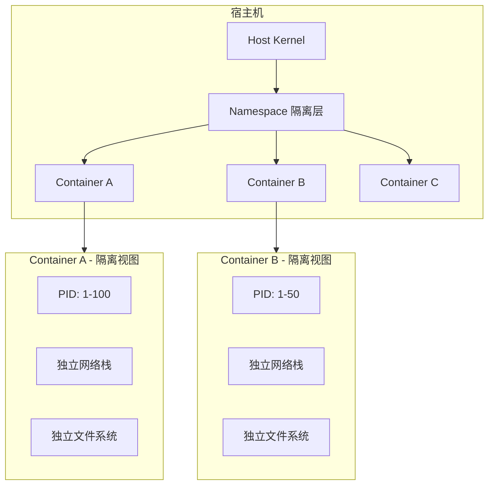
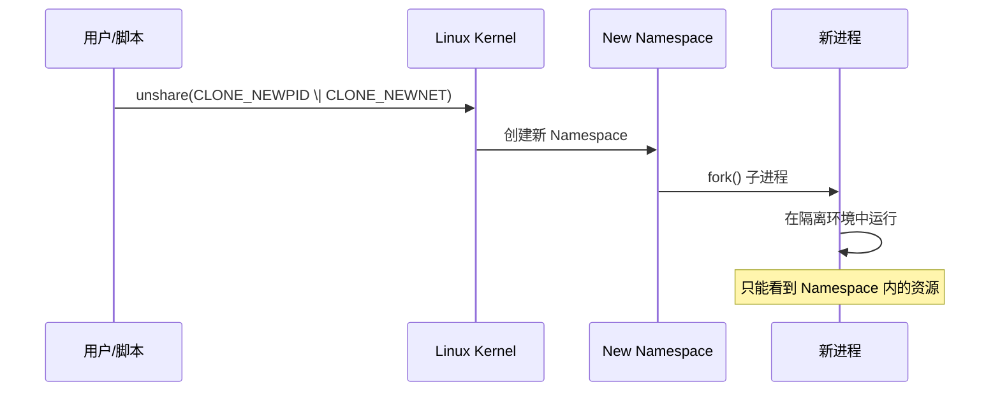
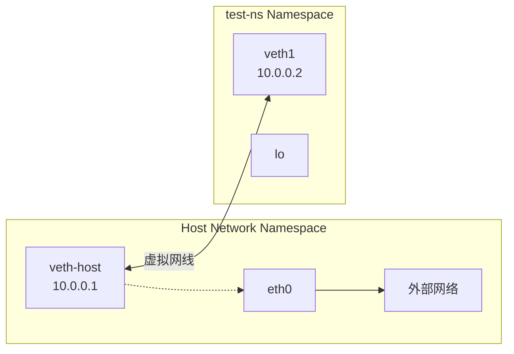
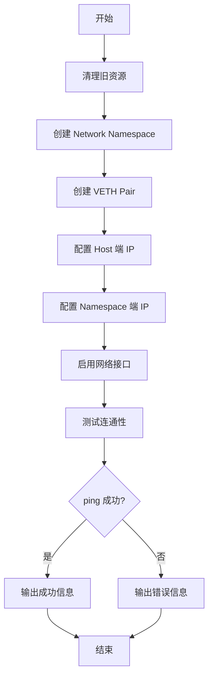

# Linux Namespace 实战

> 100 天认知提升计划 | Day 11

---

## 目录
- [第一部分：Linux Namespace 基础](#第一部分linux-namespace-基础)
- [第二部分：核心 Namespace 实践](#第二部分核心-namespace-实践)  
- [第三部分：手写隔离脚本](#第三部分手写隔离脚本)
- [第四部分：实践与思考](#第四部分实践与思考)

---

## 第一部分：Linux Namespace 基础

### 什么是 Namespace？

Linux Namespace 是 Linux 内核提供的一种资源隔离机制，是容器技术的基石。通过 Namespace，可以让进程在隔离的环境中运行，就像拥有独立的系统一样。

**核心 Namespace 类型：**

| Namespace | 隔离内容 | 典型应用场景 |
|-----------|----------|--------------|
| **PID** | 进程 ID | 容器内进程从 PID 1 开始 |
| **Mount** | 文件系统视图 | 容器独立根文件系统 |
| **Network** | 网络栈 | 容器独立 IP、端口 |
| **IPC** | 进程间通信 | 隔离信号量、消息队列 |
| **UTS** | 主机名/域名 | 容器独立 hostname |
| **User** | 用户/用户组 | 容器内 root 映射宿主机普通用户 |
| **Cgroup** | 资源控制视图 | 隔离 cgroup 层级 |

### Namespace 与容器的关系



### Namespace 创建流程



---

## 第二部分：核心 Namespace 实践

### PID Namespace 实战

**创建新的 PID Namespace：**
```bash
# 创建新的 PID 和 Mount Namespace
sudo unshare --pid --fork --mount-proc /bin/bash
echo $$  # 显示为 1，在新 namespace 中是 init 进程
ps aux   # 只能看到自己 namespace 的进程
```

**实践结果：**
- 在新 Namespace 中，当前进程的 PID 变为 1
- 只能看到当前 Namespace 内的进程
- 实现了进程隔离

### Network Namespace 实战

**VETH Pair 连接示意图：**



**创建 Network Namespace：**
```bash
# 创建 Network Namespace
sudo ip netns add test-ns
sudo ip netns exec test-ns ip link  # 在 namespace 中执行命令
sudo ip netns exec test-ns bash     # 进入 namespace 的 shell

# 手动配置网络（容器网络的缩影）
sudo ip link add veth0 type veth peer name veth1
sudo ip link set veth1 netns test-ns
sudo ip addr add 10.0.0.1/24 dev veth0
sudo ip netns exec test-ns ip addr add 10.0.0.2/24 dev veth1
sudo ip link set veth0 up
sudo ip netns exec test-ns ip link set veth1 up
```

---

## 第三部分：手写隔离脚本

### namespace-isolation.sh

**脚本执行流程：**



```bash
#!/bin/bash

# Linux Namespace 隔离脚本
# 大飞哥学习记录 - Day 11

set -e

echo "🚀 开始 Linux Namespace 隔离实验"

# 创建网络命名空间
create_network_namespace() {
    echo "📡 创建 Network Namespace"
    sudo ip netns add learning-ns
    sudo ip netns list | grep learning-ns
}

# 配置网络对
setup_veth_pair() {
    echo "🔗 配置 VETH 网络对"
    sudo ip link add veth-host type veth peer name veth-ns
    sudo ip link set veth-ns netns learning-ns
    
    # 配置主机端
    sudo ip addr add 10.0.0.1/24 dev veth-host
    sudo ip link set veth-host up
    
    # 配置 Namespace 端
    sudo ip netns exec learning-ns ip addr add 10.0.0.2/24 dev veth-ns
    sudo ip netns exec learning-ns ip link set veth-ns up
    sudo ip netns exec learning-ns ip link set lo up
}

# 测试网络连通性
test_connectivity() {
    echo "🔍 测试网络连通性"
    ping -c 2 10.0.0.2
    sudo ip netns exec learning-ns ping -c 2 10.0.0.1
}

# 创建 PID Namespace 进程
create_pid_namespace_process() {
    echo "🔄 创建 PID Namespace 进程"
    sudo unshare --pid --fork --mount-proc sleep 60 &
    local pid=$!
    echo "新 PID Namespace 进程ID: $pid"
    
    # 进入新 Namespace 查看
    sudo nsenter --target $pid --pid --mount --uts --ipc --net --user /bin/bash
}

# 清理函数
cleanup() {
    echo "🧹 清理资源"
    sudo ip netns del learning-ns 2>/dev/null || true
    sudo ip link del veth-host 2>/dev/null || true
    sudo ip link del veth-ns 2>/dev/null || true
}

# 主函数
main() {
    cleanup
    create_network_namespace
    setup_veth_pair
    test_connectivity
    
    echo "✅ Namespace 配置完成！"
    echo "💡 使用以下命令进入 Namespace："
    echo "   sudo ip netns exec learning-ns bash"
}

trap cleanup EXIT
main "$@"
```

---

## 第四部分：实践与思考

### 实践记录

- [x] **理论学习** - 理解 7 种核心 Namespace 概念
- [x] **PID 实践** - 创建和测试 PID Namespace
- [x] **网络实践** - 配置 Network Namespace 和 VETH 对
- [x] **脚本编写** - 实现完整的 Namespace 隔离脚本
- [ ] **生产应用** - 思考如何在实际项目中应用

### 疑问与思考

**已解答**
1. ✅ **Namespace 是如何实现的？** - 通过 Linux 内核的系统调用和进程隔离机制
2. ✅ **容器依赖 Namespace 吗？** - 是的，Namespace 是容器隔离的技术基础
3. ✅ **如何调试 Namespace 问题？** - 使用 nsenter、ip netns 等工具

**待探索**
4. ❓ **Namespace 的性能开销如何？**
5. ❓ **在 Kubernetes 中如何优化 Namespace 使用？**
6. ❓ **User Namespace 的安全性如何保障？**

---

## 学习心得

通过今天的 Linux Namespace 实战，我深刻理解了：

1. **容器技术的基础** - Namespace 是容器隔离的核心技术，理解了 Docker/K8s 背后的原理
2. **系统级编程** - 接触了 Linux 内核级的功能，对系统有了更深的认识
3. **网络底层** - Network Namespace 让我理解了容器网络的基本原理
4. **工程思维** - 通过手写脚本，将理论知识转化为实际工具

这为后续学习 Cgroup、容器编排等高级技术打下了坚实基础。

---

*学习时间：2026-02-28 | 学习者：大飞哥龙虾版*
