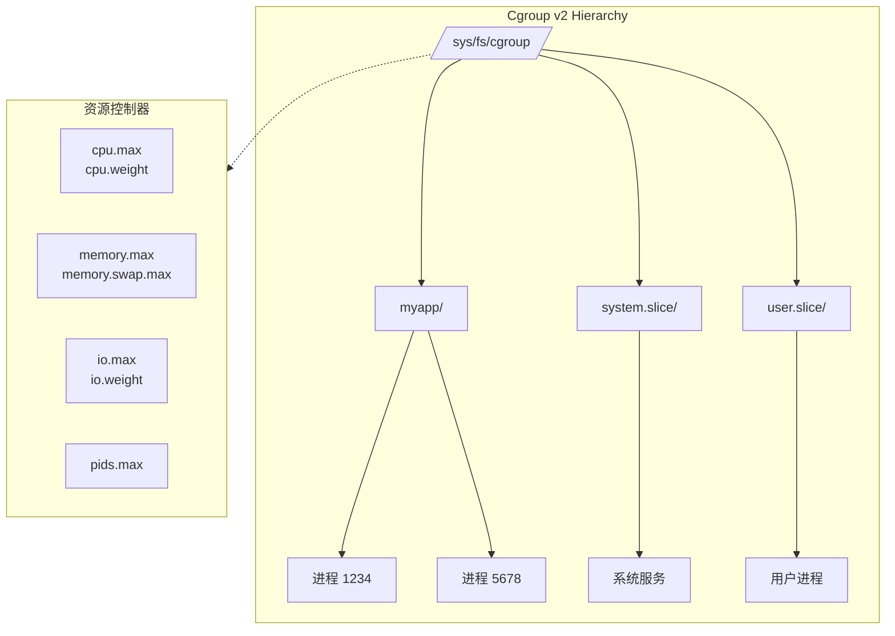
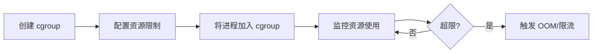
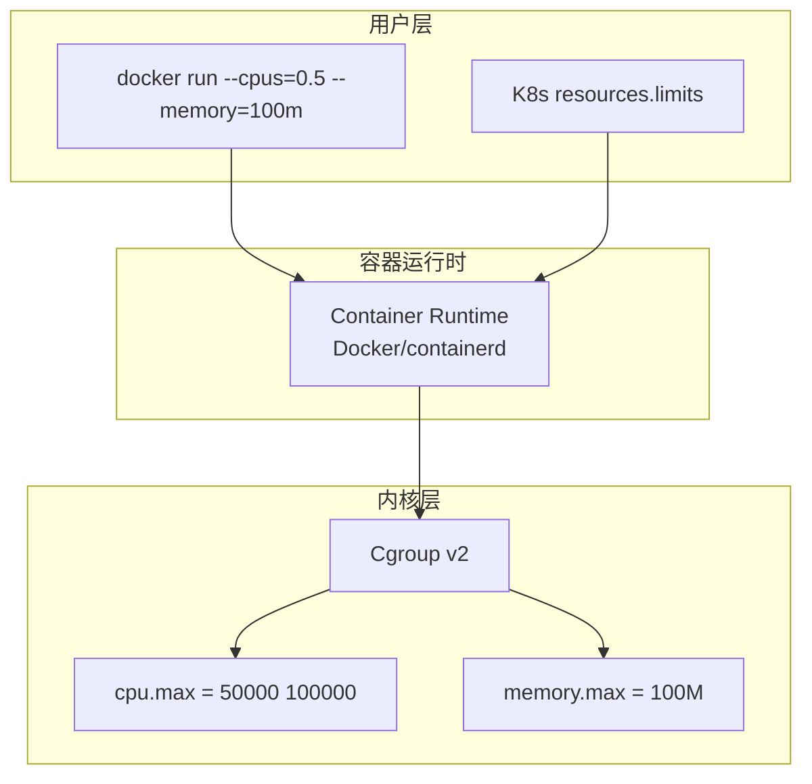
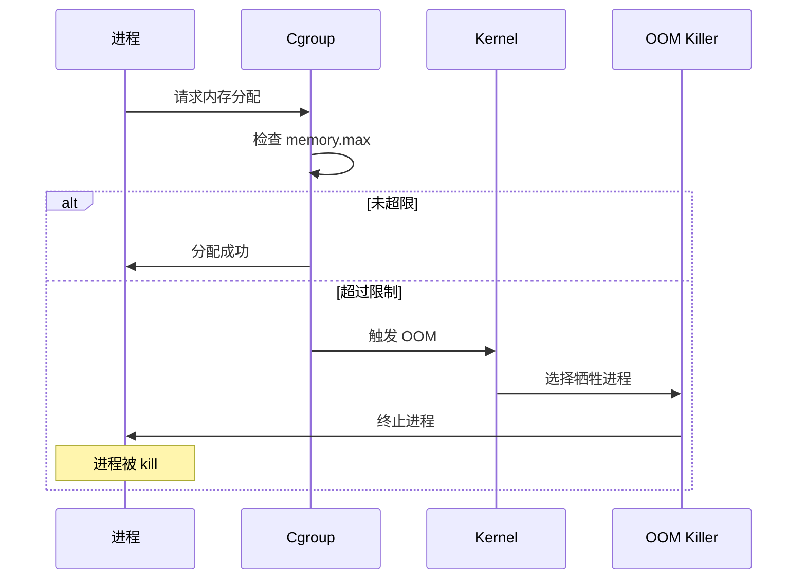

# Cgroup v2 资源限制

> 100 天认知提升计划 | Day 12

---

## 目录
- [第一部分：核心概念](#第一部分核心概念)
- [第二部分：实践操作](#第二部分实践操作)
- [第三部分：实践与思考](#第三部分实践与思考)

---

## 第一部分：核心概念

### 什么是 Cgroup？

**Cgroup (Control Group)** 是 Linux 内核提供的资源限制机制，用于控制、限制和隔离进程组的资源使用（CPU、内存、磁盘 IO 等）。

### Cgroup 架构图



### Cgroup v1 vs v2

| 特性 | Cgroup v1 | Cgroup v2 |
|------|-----------|-----------|
| 层次结构 | 多个独立的层次结构 | 统一的单一层次结构 |
| 挂载点 | /sys/fs/cgroup/`<controller>` | /sys/fs/cgroup/ |
| 配置方式 | 每个控制器独立配置 | 统一在 cgroup.procs 中管理 |
| 复杂度 | 较复杂 | 简化 |
| 内核版本 | Linux 2.6.24+ | Linux 4.5+ |

### 核心控制器

| 控制器 | 功能 | 常用参数 |
|--------|------|----------|
| **CPU** | CPU 时间分配 | cpu.weight, cpu.max |
| **Memory** | 内存限制 | memory.max, memory.swap.max |
| **IO** | 磁盘 IO 限制 | io.max, io.weight |
| **Pids** | 进程数限制 | pids.max |

---

## 第二部分：实践操作

### Cgroup 配置流程



### 2.1 CPU 控制

```bash
# 创建 cgroup
sudo mkdir /sys/fs/cgroup/myapp

# 查看当前 CPU 配置
cat /sys/fs/cgroup/myapp/cpu.weight  # 默认 100
cat /sys/fs/cgroup/myapp/cpu.max     # 默认 max 100000

# 设置 CPU 权重（范围 1-10000，默认 100）
echo "200" | sudo tee /sys/fs/cgroup/myapp/cpu.weight

# 设置 CPU 限额：最多使用 50% 的 CPU
# 格式：$QUOTA $PERIOD（微秒）
echo "50000 100000" | sudo tee /sys/fs/cgroup/myapp/cpu.max
```

### 2.2 内存控制

```bash
# 设置内存限制为 100MB
echo "100M" | sudo tee /sys/fs/cgroup/myapp/memory.max

# 设置 Swap 限制（通常设为 0 禁用 swap）
echo "0" | sudo tee /sys/fs/cgroup/myapp/memory.swap.max

# 查看内存使用情况
cat /sys/fs/cgroup/myapp/memory.current
```

### 2.3 将进程加入 Cgroup

```bash
# 将当前 shell 加入 cgroup
echo $$ | sudo tee /sys/fs/cgroup/myapp/cgroup.procs

# 将指定 PID 加入 cgroup
echo 12345 | sudo tee /sys/fs/cgroup/myapp/cgroup.procs

# 查看当前 cgroup 中的进程
cat /sys/fs/cgroup/myapp/cgroup.procs
```

### 2.4 测试资源限制

```bash
# 安装 stress-ng（如果未安装）
brew install stress-ng  # macOS
# 或
sudo apt install stress-ng  # Ubuntu

# 测试内存限制（尝试使用 200MB，但限制为 100MB，会触发 OOM）
stress-ng --vm 1 --vm-bytes 200M

# 测试 CPU 限制
stress-ng --cpu 4  # 启动 4 个 CPU 压测线程
```

---

## 第三部分：实践与思考

### 与容器的关系

Cgroup 是容器资源限制的底层实现：



### OOM Killer 工作流程



| 容器运行时 | Cgroup 使用方式 |
|-----------|----------------|
| Docker | 通过 --cpus, --memory 参数配置 |
| Kubernetes | 通过 resources.limits/requests 配置 |
| systemd | 通过 systemd-run --property 配置 |

### Docker 资源限制示例

```bash
# 限制容器使用 0.5 CPU 和 100MB 内存
docker run -d \
  --cpus=0.5 \
  --memory=100m \
  --name limited-app \
  nginx

# 查看容器的 cgroup 配置
docker inspect limited-app | jq '.[0].HostConfig'
```

### 实践记录

- [ ] 在 Linux 环境下创建并配置 cgroup
- [ ] 测试 CPU 限制效果
- [ ] 测试内存限制效果
- [ ] 观察 Docker 容器的 cgroup 配置

### 疑问与思考

**已解答**
1. ✅ Cgroup v2 相比 v1 简化了配置，使用统一层次结构

**待探索**
2. ❓ macOS 上如何模拟 cgroup 行为？（macOS 没有 cgroup，可通过 Docker Desktop 间接体验）
3. ❓ 如何监控 cgroup 的实时资源使用？

---

## 关键要点

1. **Cgroup v2** 是现代 Linux 的资源控制标准
2. **CPU 限制**：cpu.weight（权重）vs cpu.max（硬限额）
3. **内存限制**：memory.max 触发 OOM Killer
4. **容器本质**：Docker/K8s 的资源限制底层就是 cgroup

---

*更新日期：2026-03-01*
