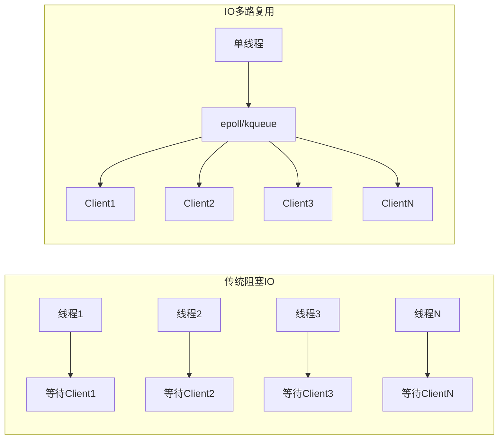
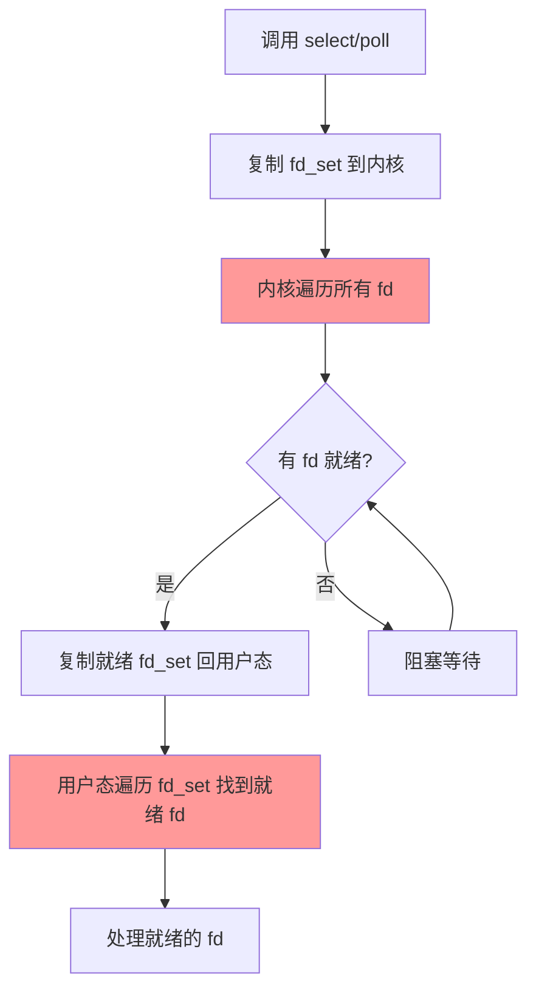
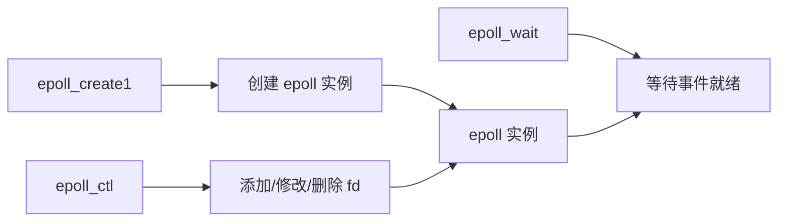
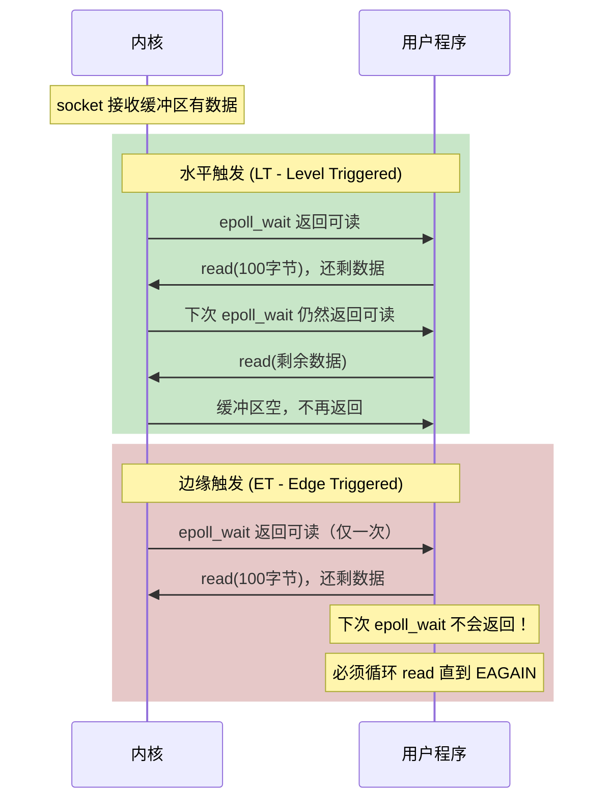
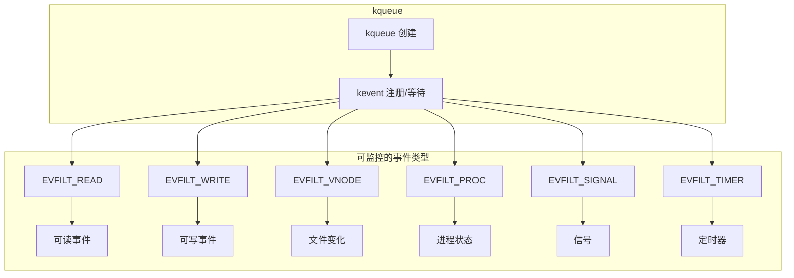
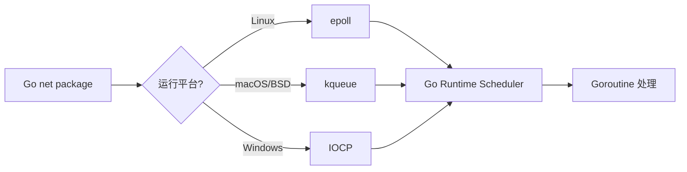

# epoll/kqueue 原理

> 100 天认知提升计划 | Day 13

---

## 目录
- [第一部分：IO 多路复用演进](#第一部分io-多路复用演进)
- [第二部分：epoll 深入剖析](#第二部分epoll-深入剖析)
- [第三部分：kqueue 与跨平台](#第三部分kqueue-与跨平台)
- [第四部分：实践与思考](#第四部分实践与思考)

---

## 第一部分：IO 多路复用演进

### 什么是 IO 多路复用？

**IO 多路复用**是一种机制，允许单线程同时监控多个文件描述符（socket、文件、管道等），当其中任何一个就绪时就能得到通知，从而避免阻塞等待。

### 为什么需要多路复用？



**传统模型的问题**：
- 每个连接需要一个线程 → 内存消耗大
- 线程切换开销 → CPU 浪费
- C10K 问题：1万连接需要1万线程

**多路复用的优势**：
- 单线程管理万级连接
- 事件驱动，只在有数据时处理
- O(1) 时间复杂度检测就绪事件

### IO 模型演进

| 机制 | 时间复杂度 | fd 数量限制 | 触发方式 | 适用场景 |
|------|-----------|-------------|----------|----------|
| **select** | O(n) | 1024 (FD_SETSIZE) | 水平触发 | 简单场景 |
| **poll** | O(n) | 无限制 | 水平触发 | fd 中等 |
| **epoll** | O(1) | 无限制 | 水平/边缘 | Linux 高并发 |
| **kqueue** | O(1) | 无限制 | 水平/边缘 | macOS/BSD |
| **io_uring** | O(1) | 无限制 | 异步回调 | Linux 5.1+ |

### select/poll 的工作原理



**select/poll 的性能瓶颈**：
1. 每次调用需要复制 fd 集合到内核
2. 内核需要遍历所有 fd（O(n)）
3. 返回后用户态也要遍历所有 fd

---

## 第二部分：epoll 深入剖析

### epoll 三大核心 API



| API | 功能 | 关键参数 |
|-----|------|----------|
| `epoll_create1(0)` | 创建 epoll 实例 | 返回 epfd |
| `epoll_ctl(epfd, op, fd, event)` | 操作 fd 集合 | EPOLL_CTL_ADD/MOD/DEL |
| `epoll_wait(epfd, events, max, timeout)` | 等待事件 | 返回就绪事件数 |

### epoll 核心数据结构

```mermaid
graph TB
    subgraph epoll实例
        A[红黑树<br/>存储所有注册的 fd] --> B[O(log n) 查找/插入/删除]
        C[就绪链表<br/>rdllist] --> D[存储已就绪的 fd]
    end

    subgraph 内核回调
        E[网卡收到数据] --> F[触发 fd 的回调函数]
        F --> G[将 fd 加入就绪链表]
    end

    G --> C

    subgraph epoll_wait
        H[检查就绪链表] --> I{链表为空?}
        I -->|是| J[阻塞等待]
        I -->|否| K[返回就绪事件]
        J --> H
    end

    D --> H
```

**为什么 epoll 是 O(1)？**
1. **注册时**：fd 存入红黑树，O(log n)
2. **事件发生时**：回调函数直接将 fd 加入就绪链表，O(1)
3. **等待时**：直接检查就绪链表，O(1)

### 水平触发 vs 边缘触发



| 触发方式 | 特点 | 适用场景 |
|----------|------|----------|
| **水平触发 (LT)** | 缓冲区有数据就通知 | 简单、安全、通用 |
| **边缘触发 (ET)** | 状态变化时通知一次 | 高性能、需配合非阻塞 IO |

### epoll 代码示例

```go
package main

import (
	"fmt"
	"net"
	"os"
	"syscall"

	"golang.org/x/sys/unix"
)

func main() {
	// 1. 创建 epoll 实例
	epfd, err := unix.EpollCreate1(0)
	if err != nil {
		panic(err)
	}
	defer unix.Close(epfd)

	// 2. 创建监听 socket
	listener, _ := net.Listen("tcp", ":8080")
	file, _ := listener.(*net.TCPListener).File()
	listenFd := int(file.Fd())

	// 设置非阻塞
	syscall.SetNonblock(listenFd, true)

	// 3. 将监听 fd 加入 epoll
	event := &unix.EpollEvent{
		Events: unix.EPOLLIN,
		Fd:     int32(listenFd),
	}
	unix.EpollCtl(epfd, unix.EPOLL_CTL_ADD, listenFd, event)

	fmt.Println("Server started on :8080")

	// 4. 事件循环
	events := make([]unix.EpollEvent, 128)
	for {
		n, err := unix.EpollWait(epfd, events, -1)
		if err != nil {
			continue
		}

		for i := 0; i < n; i++ {
			if int(events[i].Fd) == listenFd {
				// 新连接
				conn, _, _ := listener.(*net.TCPListener).AcceptFrom(nil)
				connFd, _ := conn.(*net.TCPConn).File()
				fd := int(connFd.Fd())
				syscall.SetNonblock(fd, true)

				// 添加到 epoll，使用边缘触发
				ev := &unix.EpollEvent{
					Events: unix.EPOLLIN | unix.EPOLLET,
					Fd:     int32(fd),
				}
				unix.EpollCtl(epfd, unix.EPOLL_CTL_ADD, fd, ev)
				fmt.Printf("New connection: fd=%d\n", fd)
			} else {
				// 处理数据
				fd := int(events[i].Fd)
				buf := make([]byte, 1024)
				n, _ := syscall.Read(fd, buf)
				if n == 0 {
					// 连接关闭
					unix.EpollCtl(epfd, unix.EPOLL_CTL_DEL, fd, nil)
					syscall.Close(fd)
					fmt.Printf("Connection closed: fd=%d\n", fd)
				} else {
					fmt.Printf("Received: %s\n", string(buf[:n]))
				}
			}
		}
	}
}
```

### 使用 strace 观察 epoll

```bash
# 启动一个使用 epoll 的程序
strace -e epoll_create1,epoll_ctl,epoll_wait ./my-epoll-server

# 输出示例
epoll_create1(EPOLL_CLOEXEC)        = 3  # 创建实例，返回 fd=3
epoll_ctl(3, EPOLL_CTL_ADD, 4, ...) = 0  # 将 fd=4 添加到 epoll
epoll_wait(3, ..., 128, -1)         = 1  # 等待事件，返回 1 个就绪事件
```

---

## 第三部分：kqueue 与跨平台

### kqueue 概述

**kqueue** 是 BSD/macOS 上的 IO 多路复用机制，设计更加统一和优雅。



### epoll vs kqueue 对比

| 特性 | epoll | kqueue |
|------|-------|--------|
| **平台** | Linux | macOS/BSD |
| **API 风格** | 三个独立函数 | 统一的 kevent |
| **事件类型** | 主要是 IO | IO + 信号 + 进程 + 文件 + 定时器 |
| **批量操作** | 不支持 | 支持批量注册 |
| **代码复杂度** | 较高 | 较低 |

### kqueue 代码示例

```go
package main

import (
	"fmt"
	"net"
	"syscall"

	"golang.org/x/sys/unix"
)

func main() {
	// 1. 创建 kqueue
	kq, err := unix.Kqueue()
	if err != nil {
		panic(err)
	}
	defer unix.Close(kq)

	// 2. 创建监听 socket
	listener, _ := net.Listen("tcp", ":8080")
	file, _ := listener.(*net.TCPListener).File()
	listenFd := int(file.Fd())
	syscall.SetNonblock(listenFd, true)

	// 3. 注册监听 fd 的读事件
	changes := []unix.Kevent_t{
		{
			Ident:  uint64(listenFd),
			Filter: unix.EVFILT_READ,
			Flags:  unix.EV_ADD | unix.EV_ENABLE,
		},
	}
	unix.Kevent(kq, changes, nil, nil)

	fmt.Println("Server started on :8080 (kqueue)")

	// 4. 事件循环
	events := make([]unix.Kevent_t, 128)
	for {
		n, err := unix.Kevent(kq, nil, events, nil)
		if err != nil {
			continue
		}

		for i := 0; i < n; i++ {
			fd := int(events[i].Ident)

			if fd == listenFd {
				// 新连接
				conn, _, _ := listener.(*net.TCPListener).AcceptFrom(nil)
				connFd, _ := conn.(*net.TCPConn).File()
				newFd := int(connFd.Fd())
				syscall.SetNonblock(newFd, true)

				// 注册新连接的读事件
				changes = []unix.Kevent_t{{
					Ident:  uint64(newFd),
					Filter: unix.EVFILT_READ,
					Flags:  unix.EV_ADD | unix.EV_ENABLE,
				}}
				unix.Kevent(kq, changes, nil, nil)
				fmt.Printf("New connection: fd=%d\n", newFd)
			} else {
				// 处理数据
				buf := make([]byte, 1024)
				n, _ := syscall.Read(fd, buf)
				if n == 0 {
					// 移除事件并关闭
					changes = []unix.Kevent_t{{
						Ident:  uint64(fd),
						Filter: unix.EVFILT_READ,
						Flags:  unix.EV_DELETE,
					}}
					unix.Kevent(kq, changes, nil, nil)
					syscall.Close(fd)
					fmt.Printf("Connection closed: fd=%d\n", fd)
				} else {
					fmt.Printf("Received: %s\n", string(buf[:n]))
				}
			}
		}
	}
}
```

### Go 语言的抽象：netpoll

Go 运行时自动选择底层实现：



**Go 的优势**：
- 开发者无需关心底层实现
- goroutine 天然非阻塞
- 运行时自动处理 epoll/kqueue 细节

---

## 第四部分：实践与思考

### 实践任务

```bash
# 1. 使用 strace 观察 epoll 系统调用
strace -c -e epoll_create1,epoll_ctl,epoll_wait nginx

# 2. 查看进程的 epoll 使用情况
cat /proc/$(pidof nginx)/fdinfo/xxx  # xxx 是 epoll fd

# 3. 性能对比测试
# 安装压测工具
go install github.com/rakyll/hey@latest

# 压测 echo server
hey -n 100000 -c 1000 http://localhost:8080/echo
```

### 实践记录

- [ ] 用 Go 实现简单的 epoll echo server
- [ ] 用 strace 观察 epoll 系统调用序列
- [ ] 对比水平触发和边缘触发的行为差异
- [ ] 在 macOS 上用 kqueue 实现相同功能
- [ ] 性能压测对比不同实现

### 疑问与思考

**已解答**
1. ✅ 为什么 epoll 比 select/poll 快？—— 事件驱动 + O(1) 获取就绪事件
2. ✅ 边缘触发为什么更高效？—— 减少系统调用次数，但编程更复杂
3. ✅ Go 如何处理跨平台？—— netpoll 自动选择 epoll/kqueue/IOCP

**待探索**
4. ❓ io_uring 与 epoll 的性能差距有多大？
5. ❓ 如何诊断 epoll 事件循环的性能问题？
6. ❓ 在 K8s 环境中如何优化高并发服务？

---

## 关键要点

1. **IO 多路复用**是高并发服务的基础，单线程管理万级连接
2. **epoll** 通过红黑树 + 就绪链表实现 O(1) 事件检测
3. **边缘触发 (ET)** 性能更高，但需要非阻塞 IO + 循环读取
4. **kqueue** 设计更优雅，支持更多事件类型
5. **Go 运行时**自动处理跨平台差异，开发者无需关心底层

---

## 延伸阅读

- [The C10K Problem](http://www.kegel.com/c10k.html) - 经典的高并发问题
- [epoll 源码分析](https://zhuanlan.zhihu.com/p/63179839)
- [io_uring 新时代异步 IO](https://kernel.dk/io_uring.pdf)

---

*更新日期：2026-03-02*
