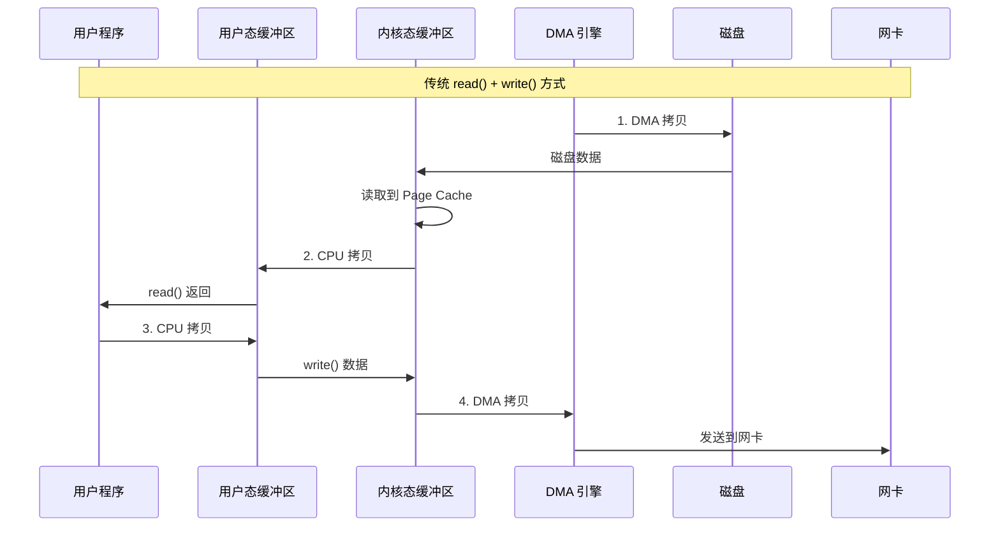
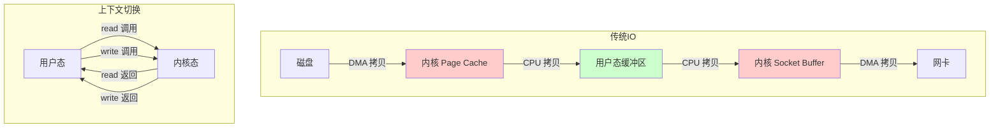
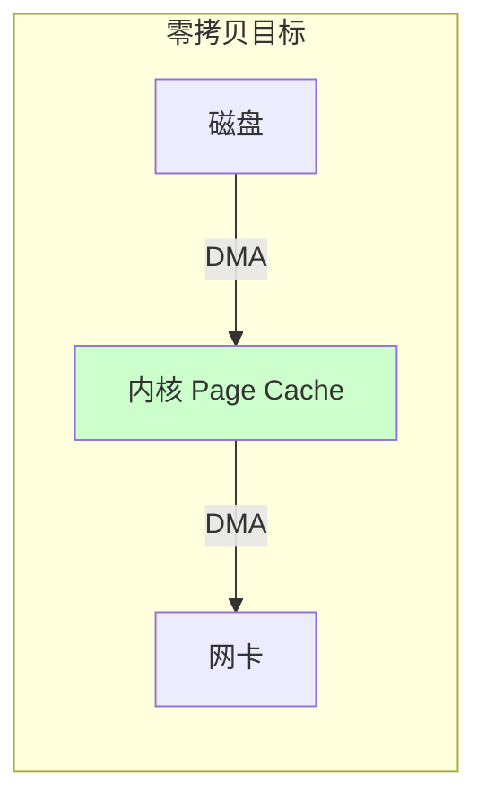
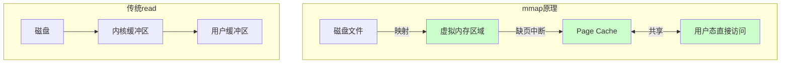
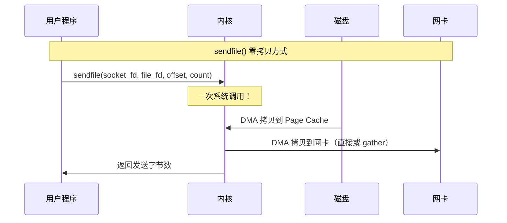
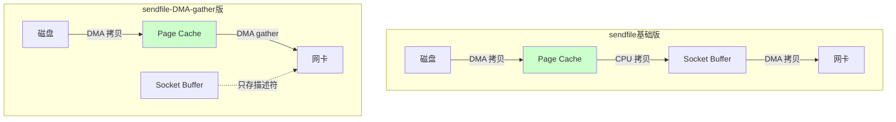
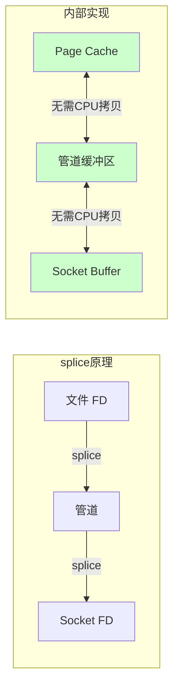
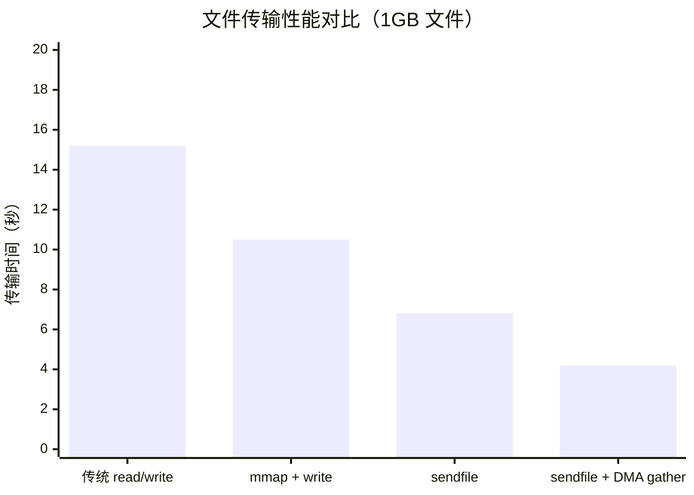
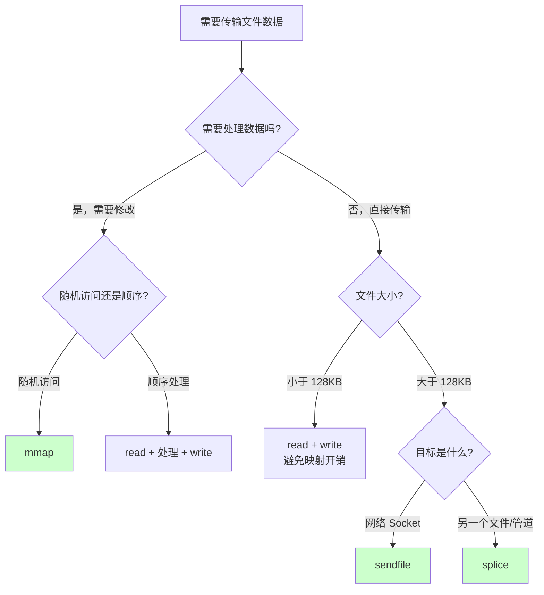
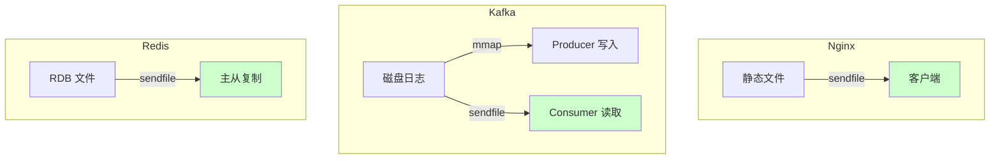

# 零拷贝技术

> 100 天认知提升计划 | Day 14

---

## 目录
- [第一部分：传统 IO 的拷贝问题](#第一部分传统-io-的拷贝问题)
- [第二部分：零拷贝技术详解](#第二部分零拷贝技术详解)
- [第三部分：mmap 与 sendfile 对比](#第三部分mmap-与-sendfile-对比)
- [第四部分：实践与思考](#第四部分实践与思考)

---

## 第一部分：传统 IO 的拷贝问题

### 什么是零拷贝？

**零拷贝（Zero Copy）** 是一种避免数据在用户态和内核态之间多次复制的技术，目标是减少 CPU 拷贝次数和上下文切换，提升 IO 性能。

### 传统 IO 的数据流向

以"从磁盘读取文件并发送到网络"为例：



### 4 次拷贝 + 4 次上下文切换



| 步骤 | 操作 | 执行者 | 说明 |
|------|------|--------|------|
| 1 | DMA 拷贝 | DMA | 磁盘 → 内核 Page Cache |
| 2 | CPU 拷贝 | CPU | Page Cache → 用户缓冲区 |
| 3 | CPU 拷贝 | CPU | 用户缓冲区 → Socket Buffer |
| 4 | DMA 拷贝 | DMA | Socket Buffer → 网卡 |

**问题**：
- 2 次 CPU 拷贝（可优化）
- 4 次上下文切换（可优化）
- 数据在用户态和内核态之间来回搬运

---

## 第二部分：零拷贝技术详解

### 零拷贝的核心思想

**让数据不经过用户态，直接在内核态完成传输。**



### 零拷贝技术对比

| 技术 | CPU 拷贝 | DMA 拷贝 | 上下文切换 | 适用场景 |
|------|----------|----------|------------|----------|
| **传统 read/write** | 2 | 2 | 4 | 通用 |
| **mmap + write** | 1 | 2 | 4 | 需要访问数据 |
| **sendfile** | 0 | 2 | 2 | 静态文件传输 |
| **sendfile + DMA gather** | 0 | 2 | 2 | 高性能传输 |
| **splice** | 0 | 0 | 2 | 管道传输 |

### mmap（内存映射）



**mmap 优势**：
- 用户态直接访问文件数据，无需 read()
- 适合随机访问大文件
- 多进程共享同一文件映射

**mmap 劣势**：
- 映射有开销，小文件不划算
- 文件大小变化时需要重新映射
- 可能导致内存碎片

```c
// mmap 示例
#include <sys/mman.h>
#include <fcntl.h>
#include <unistd.h>

int main() {
    int fd = open("large_file.bin", O_RDONLY);
    off_t size = lseek(fd, 0, SEEK_END);
    
    // 将文件映射到内存
    void *mapped = mmap(NULL, size, PROT_READ, MAP_PRIVATE, fd, 0);
    
    // 直接访问，无需 read()
    char *data = (char *)mapped;
    printf("First byte: %c\n", data[0]);
    
    // 解除映射
    munmap(mapped, size);
    close(fd);
    return 0;
}
```

### sendfile（真正的零拷贝）



**sendfile 流程**：
1. 用户态调用 `sendfile()`
2. DMA 将磁盘数据拷贝到 Page Cache
3. 内核将 Page Cache 数据拷贝到 Socket Buffer（或使用 DMA gather）
4. DMA 将数据发送到网卡



**DMA Scatter/Gather**：
- Socket Buffer 只存储数据的位置和长度（描述符）
- 网卡 DMA 直接从 Page Cache 读取数据
- 完全避免 CPU 拷贝

```c
// sendfile 示例
#include <sys/sendfile.h>
#include <fcntl.h>
#include <unistd.h>

int main() {
    int file_fd = open("video.mp4", O_RDONLY);
    int socket_fd = /* 已连接的 socket */;
    
    off_t offset = 0;
    off_t size = lseek(file_fd, 0, SEEK_END);
    
    // 一次系统调用完成文件传输
    ssize_t sent = sendfile(socket_fd, file_fd, &offset, size);
    
    printf("Sent %zd bytes\n", sent);
    
    close(file_fd);
    return 0;
}
```

### splice（管道零拷贝）



**splice 特点**：
- 两个文件描述符之间传输数据
- 必须有一个是管道
- 完全在内核态完成，零 CPU 拷贝

```c
// splice 示例
#include <fcntl.h>
#include <unistd.h>
#include <linux/fs.h>

int main() {
    int file_fd = open("data.bin", O_RDONLY);
    int pipe_fds[2];
    pipe(pipe_fds);
    
    int socket_fd = /* 已连接的 socket */;
    
    // 文件 -> 管道
    splice(file_fd, NULL, pipe_fds[1], NULL, size, SPLICE_F_MOVE);
    
    // 管道 -> Socket
    splice(pipe_fds[0], NULL, socket_fd, NULL, size, SPLICE_F_MOVE);
    
    close(file_fd);
    close(pipe_fds[0]);
    close(pipe_fds[1]);
    return 0;
}
```

---

## 第三部分：mmap 与 sendfile 对比

### 性能对比图



### 使用场景选择



### 各技术优劣势

| 技术 | 优势 | 劣势 | 最佳场景 |
|------|------|------|----------|
| **mmap** | 随机访问高效、多进程共享 | 映射开销、内存碎片 | 数据库、随机访问大文件 |
| **sendfile** | 真正零拷贝、简单 | 只能文件到 socket | 静态文件服务、视频流 |
| **splice** | 任意 FD 之间、零拷贝 | 需要管道中转 | 代理服务器、数据转发 |

### 实际应用案例



**Nginx 配置**：
```nginx
# 开启 sendfile
sendfile on;
# 开启 TCP nopush（优化 sendfile）
tcp_nopush on;
# 开启 TCP nopull（优化接收）
tcp_nodelay on;
```

**Kafka 零拷贝**：
```java
// Kafka 使用 FileChannel.transferTo() 底层就是 sendfile
FileChannel fileChannel = new FileInputStream("log.segment").getChannel();
fileChannel.transferTo(position, count, socketChannel);
```

---

## 第四部分：实践与思考

### 实践任务

```bash
# 1. 使用 strace 对比系统调用
# 传统方式
strace -c cp large_file.bin /dev/null

# sendfile 方式（使用 dd）
strace -c dd if=large_file.bin of=/dev/null bs=1M

# 2. 创建测试文件
dd if=/dev/urandom of=test_1gb.bin bs=1M count=1024

# 3. 使用 perf 观察拷贝相关事件
perf stat -e cpu-cycles,context-switches,page-faults ./transfer_program

# 4. 查看 sendfile 系统调用
strace -e sendfile nginx -g "daemon off;"
```

### Go 语言零拷贝示例

```go
package main

import (
	"fmt"
	"io"
	"net"
	"os"
	"syscall"
)

// 传统方式
func traditionalCopy(dst *os.File, src *os.File) (int64, error) {
	return io.Copy(dst, src)
}

// 使用 sendfile（Go 的 io.Copy 在文件到 socket 时自动使用）
func sendfileCopy(dst net.Conn, src *os.File) (int64, error) {
	// Go 的 io.Copy 在检测到文件到 TCP 连接时会自动使用 sendfile
	return io.Copy(dst, src)
}

// 手动使用 syscall.Sendfile
func manualSendfile(dst int, src int, offset int64, count int) (int64, error) {
	written, err := syscall.Sendfile(dst, src, nil, count)
	return int64(written), err
}

func main() {
	// 创建测试
	file, _ := os.Open("large_file.bin")
	defer file.Close()

	// 获取文件大小
	stat, _ := file.Stat()
	size := stat.Size()

	fmt.Printf("File size: %d bytes\n", size)

	// 性能对比代码略...
	// 实际测试需要建立 TCP 连接并测量传输时间
}
```

### 性能测试脚本

```bash
#!/bin/bash
# zero_copy_benchmark.sh

FILE="test_1gb.bin"
PORT=8080

# 生成测试文件
dd if=/dev/urandom of=$FILE bs=1M count=1024

echo "=== 零拷贝性能测试 ==="

# 测试 sendfile
echo "Testing sendfile..."
time (cat $FILE > /dev/null)

# 测试 mmap（通过 dd）
echo "Testing mmap-style access..."
time (dd if=$FILE of=/dev/null bs=1M status=progress)

# 清理
rm $FILE
```

### 实践记录

- [ ] 使用 strace 对比 read/write 和 sendfile 的系统调用
- [ ] 用 Go 实现文件传输服务器，对比 io.Copy 性能
- [ ] 在 Nginx 中验证 sendfile 配置效果
- [ ] 阅读 Linux 内核 sendfile 源码

### 疑问与思考

**已解答**
1. ✅ 为什么零拷贝能提升性能？—— 减少 CPU 拷贝和上下文切换
2. ✅ sendfile 只能用于文件到 socket 吗？—— 是的，这是 Linux 的限制
3. ✅ Go 的 io.Copy 会自动使用零拷贝吗？—— 文件到 TCP 时会自动使用 sendfile

**待探索**
4. ❓ Windows 的 TransmitFile 与 Linux sendfile 有何区别？
5. ❓ io_uring 与 sendfile 性能差距有多大？
6. ❓ 在容器环境中零拷贝是否仍然有效？

---

## 关键要点

1. **传统 IO** 需要 4 次拷贝（2 DMA + 2 CPU）和 4 次上下文切换
2. **零拷贝** 目标是消除 CPU 拷贝，减少上下文切换
3. **mmap** 适合随机访问大文件，用户态直接访问内核数据
4. **sendfile** 适合静态文件传输，真正的零 CPU 拷贝
5. **splice** 适合任意 FD 之间的数据转发
6. **DMA Scatter/Gather** 让网卡直接从 Page Cache 读取，完全零 CPU 拷贝

---

## 延伸阅读

- [Zero Copy I: User-Mode Perspective](https://www.linuxjournal.com/article/6345) - IBM 经典文章
- [Efficient data transfer through zero copy](https://developer.ibm.com/tutorials/l-user-space-tcp/) - IBM 教程
- [Linux sendfile 系统调用手册](https://man7.org/linux/man-pages/man2/sendfile.2.html)
- [Kafka 零拷贝原理](https://kafka.apache.org/documentation/#design_fileformat)

---

*更新日期：2026-03-03*
