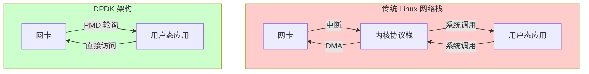
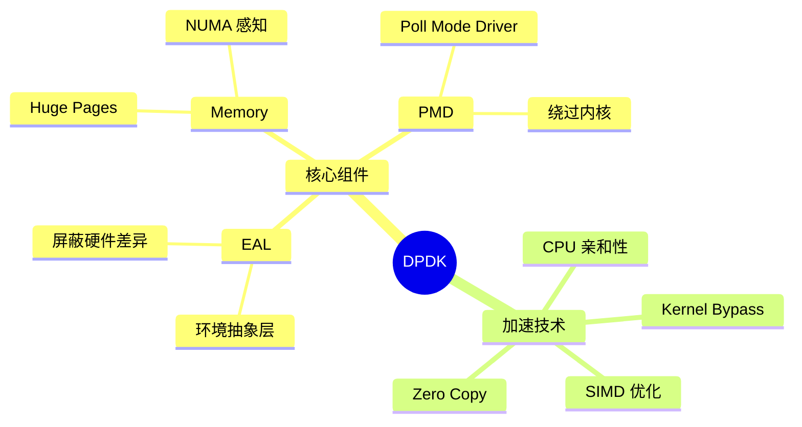
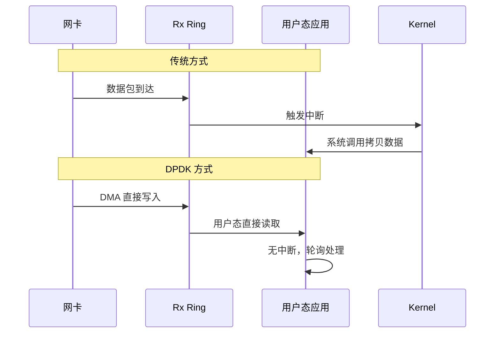
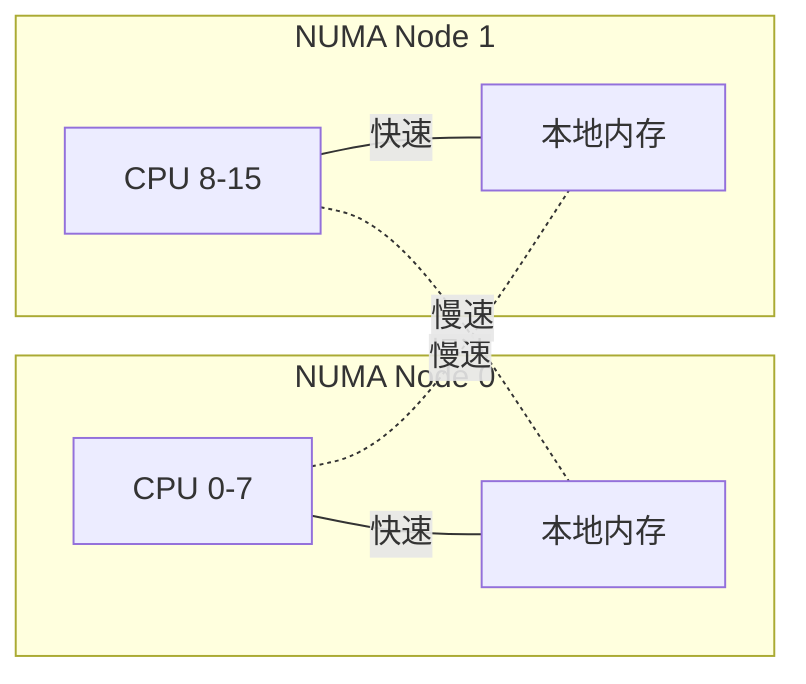
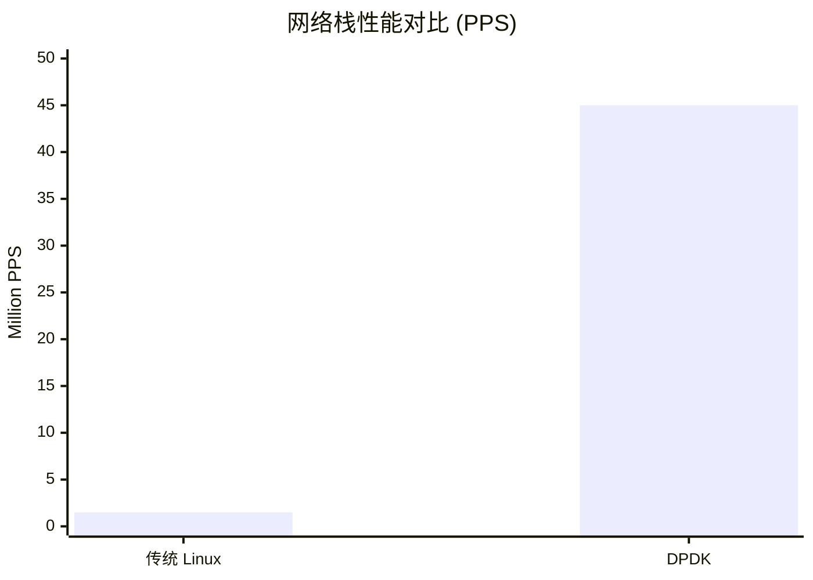

# DPDK 入门

> 100 天认知提升计划 | Day 16

---

## 核心概念

### 什么是 DPDK？

**DPDK (Data Plane Development Kit)** 是 Intel 开源的数据平面开发套件，提供用户态的高性能数据包处理能力。通过绕过 Linux 内核网络栈，实现百万级 PPS（Packets Per Second）的处理性能。

### 为什么需要 DPDK？

传统 Linux 网络栈存在以下性能瓶颈：

| 瓶颈 | 原因 | 影响 |
|------|------|------|
| 中断开销 | 每个包触发中断 | CPU 耗费大量时间处理中断 |
| 上下文切换 | 内核态↔用户态切换 | 数据拷贝和模式切换开销 |
| 协议栈处理 | 复杂的协议处理逻辑 | 即使不需要也要经过 |
| 内存拷贝 | 数据在内核/用户态之间复制 | CPU 和内存带宽浪费 |

---

## 技术架构

### 传统网络栈 vs DPDK



### DPDK 核心组件



---

## 核心技术详解

### 1. Kernel Bypass（内核旁路）

**原理**：网卡驱动直接将数据包放入用户态内存，绕过内核协议栈。



### 2. PMD (Poll Mode Driver)

**轮询模式驱动**：用轮询替代中断，消除中断处理开销。

```c
// 简化的 PMD 轮询逻辑
while (1) {
    // 轮询接收队列
    nb_rx = rte_eth_rx_burst(port_id, queue_id, mbufs, MAX_PKT_BURST);
    
    if (nb_rx > 0) {
        // 处理收到的数据包
        for (i = 0; i < nb_rx; i++) {
            process_packet(mbufs[i]);
        }
    }
    
    // 批量发送
    nb_tx = rte_eth_tx_burst(port_id, queue_id, tx_mbufs, nb_tx);
}
```

**优势**：
- 消除中断抖动
- 批量处理提高效率
- CPU 缓存友好

### 3. Huge Pages（大页内存）

**问题**：传统 4KB 页面导致大量 TLB miss。

**解决**：使用 2MB 或 1GB 大页，减少 TLB 条目数量。

```bash
# 配置 Huge Pages
echo 1024 > /sys/kernel/mm/hugepages/hugepages-2048kB/nr_hugepages

# 挂载 hugetlbfs
mkdir -p /dev/hugepages
mount -t hugetlbfs nodev /dev/hugepages
```

| 页面大小 | TLB 覆盖范围 | 适用场景 |
|---------|-------------|---------|
| 4KB | 4KB × TLB条目 | 普通应用 |
| 2MB | 2MB × TLB条目 | DPDK 常用 |
| 1GB | 1GB × TLB条目 | 大内存场景 |

### 4. NUMA 亲和性

**NUMA (Non-Uniform Memory Access)**：多 CPU 架构下，访问本地内存更快。



**最佳实践**：
- 网卡、内存、CPU 在同一 NUMA 节点
- 使用 `l3fwd -l 0-3 -n 4 --socket-mem=1024` 指定内存

---

## 实践任务

### 1. 环境搭建

```bash
# 安装 DPDK（Ubuntu）
apt-get install dpdk dpdk-dev

# 或从源码编译
git clone https://github.com/DPDK/dpdk.git
cd dpdk
meson build
ninja -C build install
```

### 2. 绑定网卡到 DPDK

```bash
# 加载 vfio-pci 驱动（推荐，比 igb_uio 更安全）
sudo modprobe vfio-pci

# 查看网卡状态
dpdk-devbind.py --status

# 绑定网卡（替换 PCI 地址）
sudo dpdk-devbind.py --bind=vfio-pci 0000:02:00.0
```

### 3. 运行 testpmd

```bash
# 启动 testpmd（DPDK 自带的测试工具）
sudo ./dpdk-testpmd -l 0-3 -n 4 -- -i

# 参数说明：
# -l 0-3    使用 CPU 核心 0-3
# -n 4      内存通道数
# -- -i     交互模式

# 在 testpmd 中执行
testpmd> show port info all      # 显示端口信息
testpmd> set fwd mac             # 设置 MAC 转发模式
testpmd> start                   # 开始转发
testpmd> show port stats all     # 显示统计
```

### 4. 理解 l2fwd 示例

```c
// l2fwd 核心逻辑（简化版）
static void
l2fwd_main_loop(void)
{
    struct rte_mbuf *pkts_burst[MAX_PKT_BURST];
    
    while (!force_quit) {
        // 从端口接收数据包
        nb_rx = rte_eth_rx_burst(port_id, 0, pkts_burst, MAX_PKT_BURST);
        
        // 逐个处理
        for (i = 0; i < nb_rx; i++) {
            m = pkts_burst[i];
            
            // 修改源/目的 MAC（L2 转发）
            rte_ether_addr_copy(&dst_eth_addr, &eth_hdr->d_addr);
            rte_ether_addr_copy(&src_eth_addr, &eth_hdr->s_addr);
            
            // 发送到另一个端口
            rte_eth_tx_burst(dest_port_id, 0, &m, 1);
        }
    }
}
```

---

## 性能对比



| 指标 | 传统 Linux | DPDK | 提升 |
|------|-----------|------|------|
| PPS | ~1.5M | 40-50M | 30x+ |
| 延迟 | 10-100μs | 1-5μs | 10x+ |
| CPU 利用率 | 高（中断） | 高（轮询但高效） | 更可预测 |

---

## 关键收获

1. **Kernel Bypass 是核心**：绕过内核是性能提升的关键，但也意味着放弃内核协议栈的功能
2. **轮询 vs 中断**：PMD 用 CPU 换取低延迟和确定性，适合高吞吐场景
3. **内存很关键**：Huge Pages 和 NUMA 亲和性对性能影响巨大
4. **权衡取舍**：DPDK 适合 NFV、SDN、负载均衡等场景，不是所有应用都需要

---

## 参考资料

- [DPDK 官方文档](https://doc.dpdk.org/guides/) - 完整的官方指南
- [DPDK 入门指南](https://dpdk.org/doc/guides/prog_guide/) - 编程指南
- [深入浅出 DPDK](https://book.douban.com/subject/26780289/) - 中文书籍
- [DPDK GitHub](https://github.com/DPDK/dpdk) - 源码仓库

---

*学习日期：2026-03-12*
