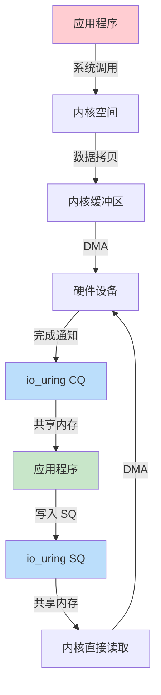

# io_uring 异步 IO

> 100 天认知提升计划 | Day 17

---

## 核心概念

### 什么是 io_uring？

**io_uring** 是 Linux 5.1+ 引入的新一代异步 I/O 接口，由 Jens Axboe（Facebook）设计。它通过共享内存中的环形缓冲区（ring buffer）实现用户态与内核态的高效通信，旨在解决传统 I/O 接口的性能瓶颈。

**设计目标**：
- 零拷贝（Zero-copy）通信
- 最小化系统调用开销
- 支持所有 I/O 操作的异步执行
- 可扩展到百万级 IOPS

### 核心架构：SQ 与 CQ

io_uring 的核心是两个共享的环形缓冲区：

| 组件 | 全称 | 方向 | 作用 |
|------|------|------|------|
| **SQ** | Submission Queue | 用户态 → 内核态 | 存放待执行的 I/O 请求（SQE） |
| **CQ** | Completion Queue | 内核态 → 用户态 | 存放已完成的 I/O 结果（CQE） |

**关键特性**：
- SQ 仅由用户态写入，内核态读取
- CQ 仅由内核态写入，用户态读取
- 通过 `mmap()` 映射到用户空间，实现零拷贝


### io_uring vs 传统方法

#### Linux I/O 演进史

| 机制 | 年代 | 时间复杂度 | FD 限制 | 特点 |
|------|------|-----------|---------|------|
| `select(2)` | 1980s | O(n) | 1024 | 位图表示，线性扫描 |
| `poll(2)` | 1990s | O(n) | 无 | 结构体数组，仍需遍历 |
| `epoll(7)` | 2000s | O(1) | 无 | 事件驱动，红黑树管理 |
| `io_uring` | 2019 | O(1) | 无 | 共享内存，零系统调用 |

#### 性能对比

| 指标 | epoll | aio | io_uring（普通） | io_uring（轮询） |
|------|-------|-----|-----------------|------------------|
| 4K IOPS | ~600K | ~600K | **1.2M** | **1.7M** |
| 系统调用 | 每次请求 | 每次请求 | 批量提交 | **零调用** |
| 内存拷贝 | 需要 | 需要 | 可选零拷贝 | 零拷贝 |



---

## 技术细节

### 工作流程

#### 1. 初始化（io_uring_setup）

```c
#include <liburing.h>

struct io_uring ring;
int ret = io_uring_queue_init(256, &ring, 0);
if (ret < 0) {
    fprintf(stderr, "io_uring_queue_init: %s\n", strerror(-ret));
    return 1;
}
```

**关键参数**：
- `entries`：队列深度（必须是 2 的幂）
- `flags`：配置选项（如 `IORING_SETUP_SQPOLL`）

#### 2. 提交请求（SQE）

```c
struct io_uring_sqe *sqe = io_uring_get_sqe(&ring);
if (!sqe) {
    fprintf(stderr, "无法获取 SQE\n");
    return 1;
}

// 准备读取操作
io_uring_prep_read(sqe, fd, buffer, buffer_size, 0);

// 设置用户数据（用于识别完成的请求）
io_uring_sqe_set_data(sqe, buffer);

// 提交到内核
int submitted = io_uring_submit(&ring);
```

**支持的 I/O 操作**：
- 文件操作：`read`、`write`、`fsync`、`fallocate`
- 网络操作：`accept`、`connect`、`send`、`recv`
- 其他：`openat`、`statx`、`splice`、`tee`

#### 3. 等待完成（CQE）

```c
struct io_uring_cqe *cqe;
int ret = io_uring_wait_cqe(&ring, &cqe);
if (ret < 0) {
    fprintf(stderr, "io_uring_wait_cqe: %s\n", strerror(-ret));
    return 1;
}

// 检查结果
if (cqe->res < 0) {
    fprintf(stderr, "I/O 错误: %s\n", strerror(-cqe->res));
} else {
    printf("读取了 %d 字节\n", cqe->res);
}

// 标记 CQE 已处理
io_uring_cqe_seen(&ring, cqe);
```

### 高级特性

#### SQPOLL（提交队列轮询）

**原理**：内核线程持续轮询 SQ，避免系统调用

```c
// 启用 SQPOLL
struct io_uring_params params = {0};
params.flags = IORING_SETUP_SQPOLL;
params.sq_thread_cpu = 0;  // 绑定到 CPU 0
params.sq_thread_idle = 2000;  // 空闲 2 秒后休眠

io_uring_queue_init_params(256, &ring, &params);
```

**适用场景**：
- 高频 I/O 操作
- 低延迟要求
- 可容忍额外 CPU 占用

#### Registered Buffers（注册缓冲区）

**原理**：预注册内存区域，避免每次 I/O 的权限检查

```c
struct iovec iov = {
    .iov_base = buffer,
    .iov_len = buffer_size
};

int ret = io_uring_register_buffers(&ring, &iov, 1);
if (ret < 0) {
    fprintf(stderr, "注册缓冲区失败: %s\n", strerror(-ret));
    return 1;
}

// 使用已注册的缓冲区（通过索引引用）
io_uring_prep_read_fixed(sqe, fd, buffer, buffer_size, 0, 0);
```

#### 链式请求（Linked SQEs）

**原理**：将多个请求串联，前一个完成才执行下一个

```c
struct io_uring_sqe *sqe1 = io_uring_get_sqe(&ring);
io_uring_prep_read(sqe1, fd, buf1, size, 0);
sqe1->flags |= IOSQE_IO_LINK;  // 标记为链式

struct io_uring_sqe *sqe2 = io_uring_get_sqe(&ring);
io_uring_prep_write(sqe2, fd, buf2, size, 0);
// sqe2 会等待 sqe1 完成后执行
```

### 性能优化技巧

#### 1. 批量提交

```c
// 一次性提交多个 SQE
for (int i = 0; i < 100; i++) {
    struct io_uring_sqe *sqe = io_uring_get_sqe(&ring);
    io_uring_prep_read(sqe, fds[i], buffers[i], size, 0);
}

io_uring_submit(&ring);  // 单次系统调用提交 100 个请求
```

#### 2. 避免内存拷贝

```c
// 使用 IOSQE_BUFFER_SELECT 从预注册的缓冲池选择
io_uring_prep_recv(sqe, sockfd, NULL, buffer_size, 0);
sqe->flags |= IOSQE_BUFFER_SELECT;
sqe->buf_group = 0;  // 缓冲区组 ID
```

#### 3. 合理设置队列深度

| 场景 | 推荐深度 |
|------|---------|
| 低延迟存储 | 128-256 |
| 高吞吐网络 | 512-1024 |
| 混合负载 | 256-512 |

**原则**：
- 深度过大：浪费内存，CQE 处理延迟增加
- 深度过小：无法充分利用批处理优势

---

## 实践与思考

### 实践任务

- [ ] 在 Linux 5.1+ 环境中安装 liburing
- [ ] 实现一个基于 io_uring 的文件复制工具
- [ ] 对比 io_uring 与 epoll 的 echo 服务器性能
- [ ] 尝试 SQPOLL 模式并观察 CPU 使用率
- [ ] 使用 `perf` 分析系统调用次数

### 安装与环境

```bash
# Ubuntu/Debian
sudo apt-get install liburing-dev

# CentOS/RHEL
sudo yum install liburing-devel

# 从源码编译
git clone https://github.com/axboe/liburing.git
cd liburing
make && sudo make install
```

### 示例：简单的 cat 实现

```c
#include <liburing.h>
#include <fcntl.h>
#include <stdio.h>
#include <string.h>
#include <unistd.h>

#define QUEUE_DEPTH 4
#define BUFFER_SIZE 4096

int main(int argc, char *argv[]) {
    if (argc < 2) {
        fprintf(stderr, "用法: %s <文件>\n", argv[0]);
        return 1;
    }

    int fd = open(argv[1], O_RDONLY);
    if (fd < 0) {
        perror("open");
        return 1;
    }

    struct io_uring ring;
    io_uring_queue_init(QUEUE_DEPTH, &ring, 0);

    char buffer[BUFFER_SIZE];
    off_t offset = 0;

    while (1) {
        struct io_uring_sqe *sqe = io_uring_get_sqe(&ring);
        io_uring_prep_read(sqe, fd, buffer, BUFFER_SIZE, offset);
        io_uring_sqe_set_data(sqe, buffer);

        io_uring_submit(&ring);

        struct io_uring_cqe *cqe;
        io_uring_wait_cqe(&ring, &cqe);

        if (cqe->res <= 0) {
            break;  // EOF 或错误
        }

        write(STDOUT_FILENO, buffer, cqe->res);
        offset += cqe->res;

        io_uring_cqe_seen(&ring, cqe);
    }

    close(fd);
    io_uring_queue_exit(&ring);
    return 0;
}
```

### 性能测试对比

```bash
# 编译
gcc -o io_uring_cat io_uring_cat.c -luring

# 使用 fio 进行基准测试
fio --name=io_uring-test --ioengine=io_uring --iodepth=128 \
    --rw=randread --bs=4k --size=1G --numjobs=1

# 对比 libaio
fio --name=aio-test --ioengine=libaio --iodepth=128 \
    --rw=randread --bs=4k --size=1G --numjobs=1
```

### 关键收获

1. **零拷贝设计**：共享内存避免了用户态-内核态的数据拷贝开销
2. **批量处理**：单次系统调用提交多个请求，极大降低上下文切换成本
3. **轮询模式**：SQPOLL 实现零系统调用，适合极端性能场景
4. **生态支持**：Rust（`io-uring` crate）、Go（`x/sys/unix`）均有绑定
5. **适用场景**：高并发网络服务、存储引擎、数据库系统

### 注意事项

- **内核版本**：需要 Linux 5.1+，部分特性需要 5.6+
- **权限要求**：SQPOLL 需要 `CAP_SYS_NICE` 能力
- **调试难度**：异步编程模型增加了代码复杂性
- **兼容性**：仅限 Linux，macOS 使用 kqueue

---

## 参考资料

- [Efficient IO with io_uring (PDF)](https://kernel.dk/io_uring.pdf) - Jens Axboe 官方论文
- [Lord of the io_uring](https://unixism.net/loti/) - 最全面的教程
- [liburing GitHub](https://github.com/axboe/liburing) - 官方库
- [What is io_uring?](https://unixism.net/loti/what_is_io_uring.html) - 核心概念讲解
- [Understanding Asynchronous I/O in Linux - io_uring](https://sumofbytes.com/blog/understanding-asynchronous-in-linux-io-uring/) - 深度解析
- [io_uring(7) - Linux man page](https://man7.org/linux/man-pages/man7/io_uring.7.html) - 系统调用文档

---

*学习日期：2026-03-28*
