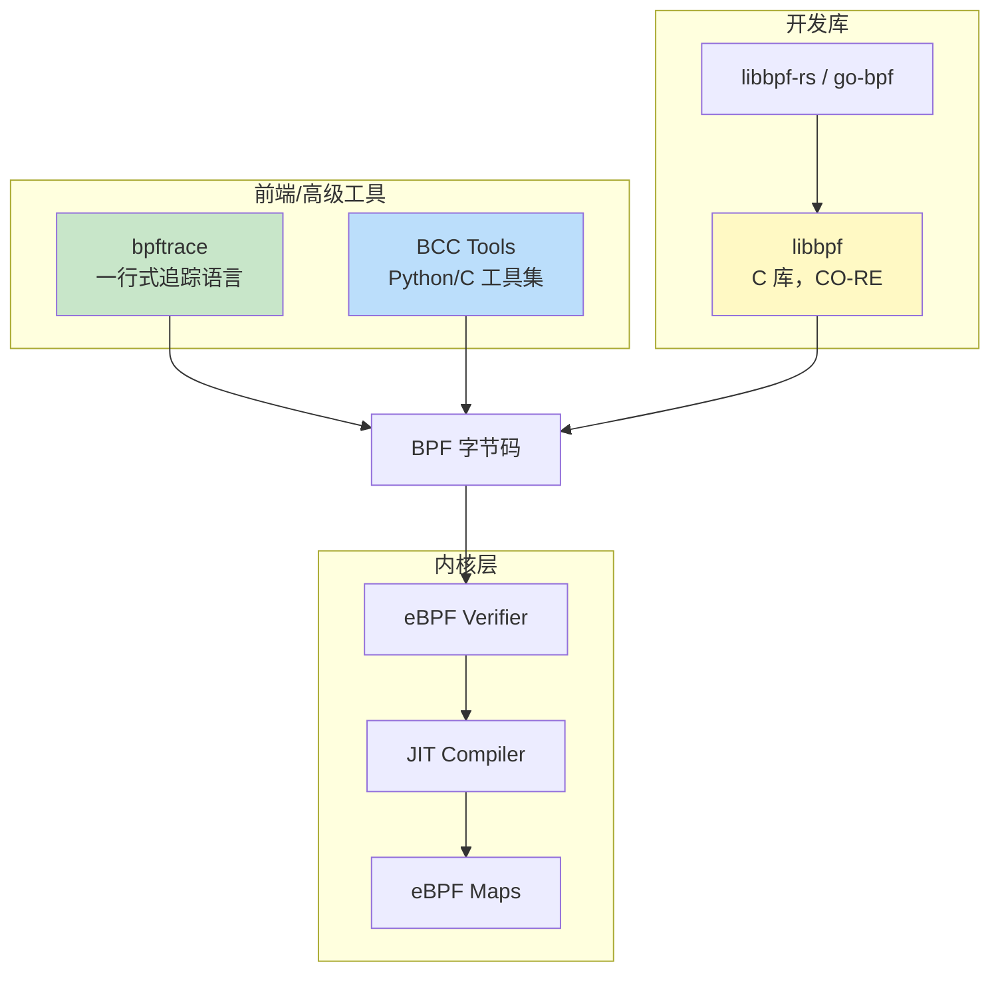
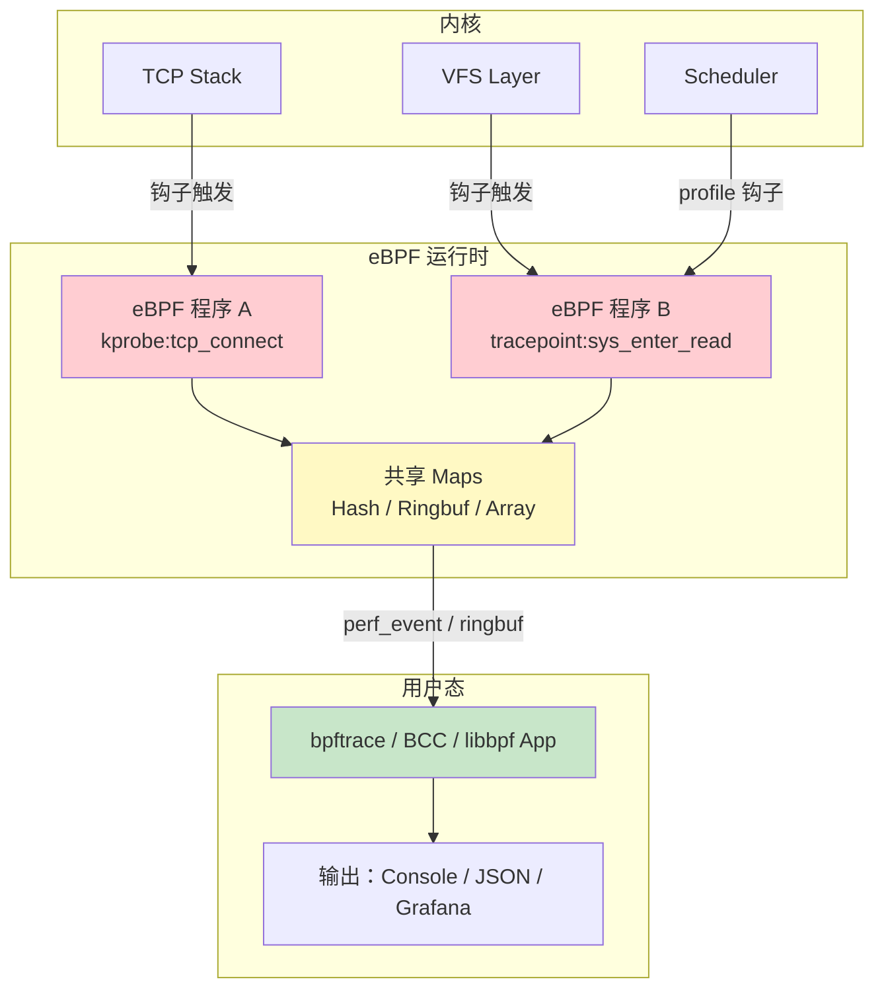

# eBPF 追踪

> 100 天认知提升计划 | Day 18

---

## 核心概念

### 什么是 eBPF？

**eBPF**（extended Berkeley Packet Filter）是 Linux 内核中的一项革命性技术，允许在不修改内核源码、不加载内核模块的前提下，安全地在内核态运行沙箱化程序。它被誉为"Linux 内核的 JavaScript"——正如浏览器通过 JS 扩展网页功能，eBPF 让开发者可以动态扩展内核能力。

**设计哲学**：
- **安全**：eBPF 程序经过验证器（Verifier）严格检查，确保不会 crash 内核
- **高性能**：JIT 编译为本地机器码，接近原生执行速度
- **动态**：运行时加载，无需重启系统或重新编译内核
- **可观测**：从内核最深处获取系统行为数据

### eBPF 程序生命周期

```mermaid
flowchart TD
    A[编写 eBPF C 代码] --> B[clang/llvm 编译为 BPF 字节码]
    B --> C[通过 bpf() 系统调用加载]
    C --> D{验证器 Verifier 检查}
    D -->|通过| E[JIT 编译为机器码]
    D -->|失败| F[拒绝加载]
    E --> G[附加到内核钩子]
    G --> H[事件触发执行]
    H --> I[通过 Map 与用户态通信]
```

### eBPF 程序类型

| 类型 | 钩子位置 | 典型用途 |
|------|---------|---------|
| **kprobe/kretprobe** | 内核函数入口/返回 | 内核函数追踪 |
| **uprobe/uretprobe** | 用户态函数入口/返回 | 应用层追踪 |
| **tracepoint** | 内核静态追踪点 | 稳定的内核追踪 |
| **perf_event** | 性能监控计数器 | CPU 性能分析 |
| **XDP** | 网卡驱动层 | 高性能包处理 |
| **tc** | 流量控制层 | 网络流量分类 |
| **cgroup** | cgroup 操作 | 容器网络/安全 |

### eBPF Map 类型

Map 是 eBPF 程序与用户态之间的数据桥梁：

| Map 类型 | 用途 | 特点 |
|---------|------|------|
| `BPF_MAP_TYPE_HASH` | 哈希表 | 通用 KV 存储 |
| `BPF_MAP_TYPE_ARRAY` | 数组 | 索引快速查找 |
| `BPF_MAP_TYPE_PERF_EVENT_ARRAY` | 事件数组 | per-CPU 事件发送到用户态 |
| `BPF_MAP_TYPE_RINGBUF` | 环形缓冲区 | 替代 perf buffer，更高效 |
| `BPF_MAP_TYPE_STACK_TRACE` | 调用栈 | 存储内核/用户态调用栈 |
| `BPF_MAP_TYPE_LRU_HASH` | LRU 哈希 | 自动淘汰旧条目 |

---

## 工具链：BCC、bpftrace、libbpf

### 工具栈全景



### BCC（BPF Compiler Collection）

BCC 是最成熟、最高层的 eBPF 开发框架，使用 Python（或 Lua）作为用户态前端，C 编写内核态 eBPF 程序。

**安装**：
```bash
# Ubuntu/Debian
sudo apt install bpfcc-tools linux-headers-$(uname -r)

# CentOS/RHEL
sudo yum install bcc-tools

# 工具通常安装在 /usr/share/bcc/tools/
```

**内置工具一览**：

| 工具 | 功能 | 用途 |
|------|------|------|
| `execsnoop` | 追踪新进程执行 | 安全审计、调试启动问题 |
| `opensnoop` | 追踪文件打开 | 查看应用读取哪些文件 |
| `tcpconnect` | 追踪 TCP 主动连接 | 网络调试 |
| `tcpaccept` | 追踪 TCP 被动连接 | 服务端连接分析 |
| `biosnoop` | 追踪块 I/O | 磁盘 I/O 分析 |
| `funccount` | 统计函数调用次数 | 性能热点定位 |
| `profile` | CPU profiling | 性能分析 |
| `offcputime` | 追踪离 CPU 时间 | 等待/阻塞分析 |

**BCC 编写示例：TCP 连接追踪**：

```python
#!/usr/bin/env python3
from bcc import BPF

# eBPF C 代码
prog = """
#include <net/sock.h>
#include <bcc/proto.h>

// 发送事件到用户态
struct event_t {
    u32 pid;
    u32 saddr;
    u32 daddr;
    u16 dport;
    char comm[16];
};

BPF_PERF_OUTPUT(events);

int kprobe__tcp_v4_connect(struct pt_regs *ctx, struct sock *sk) {
    struct event_t event = {};
    event.pid = bpf_get_current_pid_tgid() >> 32;
    event.saddr = sk->__sk_common.skc_rcv_saddr;
    event.daddr = sk->__sk_common.skc_daddr;
    event.dport = sk->__sk_common.skc_dport;
    bpf_get_current_comm(&event.comm, sizeof(event.comm));
    events.perf_submit(ctx, &event, sizeof(event));
    return 0;
}
"""

b = BPF(text=prog)

def print_event(cpu, data, size):
    event = b["events"].event(data)
    print(f"{event.pid:6d} {event.comm.decode():16s} "
          f"-> {event.daddr}  port {event.dport}")

b["events"].open_perf_buffer(print_event)
print("PID   COMM              DST           PORT")

while True:
    b.perf_buffer_poll()
```

### bpftrace：一行式追踪

bpftrace 是 eBPF 领域的"awk"——用简洁的一行命令完成强大的追踪任务。

**安装**：
```bash
# Ubuntu
sudo apt install bpftrace

# 从源码
git clone https://github.com/bpftrace/bpftrace
cd bpftrace && mkdir build && cd build
cmake .. && make && sudo make install
```

**常用 One-Liners**：

```bash
# 1. 追踪所有 execve 系统调用（新进程创建）
bpftrace -e 'tracepoint:syscalls:sys_enter_execve { printf("%s -> %s\n", comm, join(args->argv)); }'

# 2. 统计每个进程的 read 系统调用次数
bpftrace -e 'tracepoint:syscalls:sys_enter_read { @reads[comm] = count(); }'

# 3. 按 PID 统计系统调用延迟（纳秒）
bpftrace -e '
  tracepoint:syscalls:sys_enter_read { @start[tid] = nsecs; }
  tracepoint:syscalls:sys_exit_read  /@start[tid]/ {
    @latency[pid, comm] = hist(nsecs - @start[tid]);
    delete(@start[tid]);
  }'

# 4. 追踪 TCP 连接建立
bpftrace -e '
  kprobe:tcp_v4_connect { @tid[tid] = arg1; }
  kretprobe:tcp_v4_connect /ret == 0/ {
    printf("PID %d connected\n", pid);
  }'

# 5. 每 5 秒打印一次 open 系统调用计数
bpftrace -e '
  tracepoint:syscalls:sys_enter_openat {
    @opens[comm] = count();
  }
  interval:s:5 { print(@opens); clear(@opens); }'

# 6. 函数调用耗时分布
bpftrace -e '
  kprobe:vfs_read { @start[tid] = nsecs; }
  kretprobe:vfs_read /@start[tid]/ {
    @ns = hist(nsecs - @start[tid]);
    delete(@start[tid]);
  }'

# 7. 追踪进程上下文切换
bpftrace -e 'tracepoint:sched:sched_switch { printf("CPU %d: %s -> %s\n", cpu, args->prev_comm, args->next_comm); }'

# 8. 内核栈频率采样
bpftrace -e 'profile:hz:99 { @[kstack] = count(); }'
```

**bpftrace 语法速查**：

| 语法 | 说明 | 示例 |
|------|------|------|
| `kprobe:func` | 内核函数探针 | `kprobe:vfs_read` |
| `kretprobe:func` | 内核函数返回探针 | `kretprobe:vfs_read` |
| `tracepoint:category:name` | 静态追踪点 | `tracepoint:syscalls:sys_enter_read` |
| `uprobe:binary:func` | 用户态探针 | `uprobe:/bin/bash:readline` |
| `profile:hz:N` | 定时采样 | `profile:hz:99` |
| `interval:s:N` | 定时输出 | `interval:s:5` |
| `@name` | 全局 Map | `@count[comm] = count()` |
| `hist()` | 对数直方图 | `hist(nsecs - @start[tid])` |
| `comm` | 当前进程名 | `printf("%s", comm)` |
| `pid / tid` | 进程/线程 ID | `printf("%d", pid)` |

### libbpf：CO-RE 时代

libbpf 是 eBPF 的底层 C 库，支持 **CO-RE**（Compile Once – Run Everywhere），通过 BTF（BPF Type Format）实现内核版本兼容。

**libbpf 脚手架项目结构**：

```
my-bpf-tool/
├── src/
│   ├── my_tool.bpf.c    # eBPF 内核态代码
│   ├── my_tool.c         # 用户态加载/交互代码
│   └── vmlinux.h         # 内核类型定义（bpftool btf dump）
├── Makefile
└── README.md
```

**libbpf 内核态代码示例（系统调用延迟统计）**：

```c
// syscall_lat.bpf.c
#include "vmlinux.h"
#include <bpf/bpf_helpers.h>
#include <bpf/bpf_tracing.h>

struct event {
    u32 pid;
    u64 latency_ns;
    char comm[16];
    int syscall_id;
};

struct {
    __uint(type, BPF_MAP_TYPE_RINGBUF);
    __uint(max_entries, 256 * 1024);
} events SEC(".maps");

struct {
    __uint(type, BPF_MAP_TYPE_HASH);
    __uint(max_entries, 10240);
    __type(key, u64);
    __type(value, u64);
} start_ts SEC(".maps");

SEC("tracepoint/syscalls/sys_enter_*")
int handle_enter(struct trace_event_raw_sys_enter *ctx)
{
    u64 tid = bpf_get_current_pid_tgid();
    u64 ts = bpf_ktime_get_ns();
    bpf_map_update_elem(&start_ts, &tid, &ts, BPF_ANY);
    return 0;
}

SEC("tracepoint/syscalls/sys_exit_*")
int handle_exit(struct trace_event_raw_sys_exit *ctx)
{
    u64 tid = bpf_get_current_pid_tgid();
    u64 *start = bpf_map_lookup_elem(&start_ts, &tid);
    if (!start) return 0;

    struct event *e = bpf_ringbuf_reserve(&events, sizeof(*e), 0);
    if (!e) goto cleanup;

    e->pid = tid >> 32;
    e->latency_ns = bpf_ktime_get_ns() - *start;
    e->syscall_id = ctx->id;
    bpf_get_current_comm(e->comm, sizeof(e->comm));
    bpf_ringbuf_submit(e, 0);

cleanup:
    bpf_map_delete_elem(&start_ts, &tid);
    return 0;
}

char LICENSE[] SEC("license") = "GPL";
```

**用户态加载代码**：

```c
// syscall_lat.c
#include <stdio.h>
#include <bpf/libbpf.h>
#include <bpf/bpf.h>
#include "syscall_lat.skel.h"

static int handle_event(void *ctx, void *data, size_t len) {
    struct event *e = data;
    printf("PID %-6d COMM %-16s SYSCALL %-3d LATENCY %llu us\n",
           e->pid, e->comm, e->syscall_id, e->latency_ns / 1000);
    return 0;
}

int main(int argc, char **argv) {
    struct syscall_lat_bpf *skel;
    struct ring_buffer *rb;

    skel = syscall_lat_bpf__open_and_load();
    if (!skel) {
        fprintf(stderr, "Failed to open/load BPF skeleton\n");
        return 1;
    }

    if (syscall_lat_bpf__attach(skel)) {
        fprintf(stderr, "Failed to attach BPF programs\n");
        return 1;
    }

    rb = ring_buffer__new(bpf_map__fd(skel->maps.events), handle_event, NULL, NULL);

    printf("Tracing syscall latency... Ctrl-C to stop\n");
    while (1) ring_buffer__poll(rb, 100);

    ring_buffer__free(rb);
    syscall_lat_bpf__destroy(skel);
    return 0;
}
```

---

## 实战：TCP 连接追踪工具

### 完整的 TCP 连接监控 bpftrace 脚本

```bash
#!/usr/bin/env bpftrace
/*
 * tcpconnect.bt - 追踪所有 TCP 连接建立
 * 输出：时间、PID、进程名、源/目标 IP:Port
 */

#include <net/sock.h>

kprobe:tcp_v4_connect {
    @sk[tid] = arg1;
}

kretprobe:tcp_v4_connect /@sk[tid] && ret == 0/ {
    $sk = (struct sock *)@sk[tid];
    $daddr = $sk->__sk_common.skc_daddr;
    $dport = $sk->__sk_common.skc_dport;

    printf("%-10s %-6d %-16s %s:%d\n",
        strftime("%H:%M:%S", nsecs),
        pid, comm,
        ntop($daddr),
        $dport >> 8 | (($dport & 0xff) << 8));

    delete(@sk[tid]);
}

kretprobe:tcp_v4_connect /@sk[tid] && ret != 0/ {
    delete(@sk[tid]);
}
```

### 系统调用延迟直方图

```bash
#!/usr/bin/env bpftrace
/*
 * syscall_lat.bt - 系统调用延迟分布统计
 * 生成对数直方图，直观展示延迟分布
 */

tracepoint:syscalls:sys_enter_read   { @ts[tid, "read"]   = nsecs; }
tracepoint:syscalls:sys_enter_write  { @ts[tid, "write"]  = nsecs; }
tracepoint:syscalls:sys_enter_openat { @ts[tid, "openat"] = nsecs; }
tracepoint:syscalls:sys_enter_fsync  { @ts[tid, "fsync"]  = nsecs; }

tracepoint:syscalls:sys_exit_read   /@ts[tid, "read"]/   { @read_ns   = hist(nsecs - @ts[tid, "read"]);   delete(@ts[tid, "read"]); }
tracepoint:syscalls:sys_exit_write  /@ts[tid, "write"]/  { @write_ns  = hist(nsecs - @ts[tid, "write"]);  delete(@ts[tid, "write"]); }
tracepoint:syscalls:sys_exit_openat /@ts[tid, "openat"]/ { @openat_ns = hist(nsecs - @ts[tid, "openat"]); delete(@ts[tid, "openat"]); }
tracepoint:syscalls:sys_exit_fsync  /@ts[tid, "fsync"]/  { @fsync_ns  = hist(nsecs - @ts[tid, "fsync"]);  delete(@ts[tid, "fsync"]); }

END {
    clear(@ts);
}
```

输出示例（直方图）：
```
@read_ns:
[256, 512)         547 |@@@@@@@@@@@@@@@@@@@@@@@@@@@@@@@@@@@@@@@@@@@@@@@@@@@@|
[512, 1K)          203 |@@@@@@@@@@@@@@@@@                                   |
[1K, 2K)            28 |@@                                                  |
[2K, 4K)             5 |                                                    |
```

---

## 性能对比

### eBPF vs 传统追踪工具

| 指标 | strace | perf | SystemTap | eBPF (bpftrace) |
|------|--------|------|-----------|-----------------|
| 开销 | **极高**（ptrace） | 低 | 中等 | **极低** |
| 内核支持 | 全版本 | 2.6+ | 需内核模块 | 4.4+（推荐 5.2+） |
| 动态加载 | ❌ | 部分 | 部分 | ✅ |
| 安全性 | 安全 | 安全 | 风险（内核模块） | **验证器保证** |
| 灵活性 | 低 | 中等 | 高 | **极高** |
| 学习曲线 | 低 | 中 | 高 | 中 |

### 开销实测对比

追踪 10 万次 `openat` 系统调用的额外延迟：

| 工具 | 额外延迟 | 相对开销 |
|------|---------|---------|
| 无追踪 | 0 ms | 0% |
| bpftrace (tracepoint) | ~5 ms | ~2% |
| bpftrace (kprobe) | ~8 ms | ~3% |
| strace -e openat | **~500 ms** | **~200%** |
| strace (全追踪) | **~2000 ms** | **~800%** |

---

## 架构图：eBPF 数据流



---

## 实践任务

- [ ] 安装 bpftrace 并运行至少 5 个 one-liner 示例，观察输出
- [ ] 使用 `bpftrace -l 'tracepoint:syscalls:*'` 列出所有可用的系统调用追踪点
- [ ] 编写一个 bpftrace 脚本，追踪特定进程的所有文件操作（提示：按 comm 过滤）
- [ ] 使用 BCC 的 `tcpconnect` 和 `tcpaccept` 工具分析系统的网络连接模式
- [ ] （进阶）使用 libbpf + BPF CO-RE 编写一个自定义 eBPF 工具，追踪 `vfs_read` 延迟分布
- [ ] （进阶）对比同一追踪任务用 strace 和 bpftrace 的性能差异，记录数据

---

## 关键收获

1. **eBPF 是内核可观测性的未来**：在不修改内核的前提下实现了动态、安全、高性能的内核追踪
2. **工具链选择**：快速诊断用 bpftrace one-liners，复杂工具用 BCC，生产级工具用 libbpf + CO-RE
3. **性能关键**：eBPF 的开销比传统追踪低 1-2 个数量级，适合生产环境持续运行
4. **验证器是安全的基石**：每个 eBPF 程序都经过严格的静态验证，确保不会破坏内核稳定性
5. **Map 是通信核心**：理解不同 Map 类型（Hash、Ringbuf、PerfEventArray）的适用场景至关重要
6. **CO-RE 解决版本兼容**：一次编译、到处运行，libbpf + BTF 让 eBPF 工具跨内核版本分发

---

## 参考资料

- [bpftrace Reference Guide](https://github.com/bpftrace/bpftrace/blob/master/docs/reference_guide.md)
- [BCC Python Developer Tutorial](https://github.com/iovisor/bcc/blob/master/docs/tutorial_bcc_python_developer.md)
- [libbpf-bootstrap](https://github.com/libbpf/libbpf-bootstrap)
- [BPF and XDP Reference Guide — Cilium](https://docs.cilium.io/en/latest/bpf/)
- [Brendan Gregg - eBPF](https://www.brendangregg.com/ebpf.html)
- [Linux Kernel BPF Documentation](https://docs.kernel.org/bpf/index.html)

---

*学习日期：2026-03-29*
