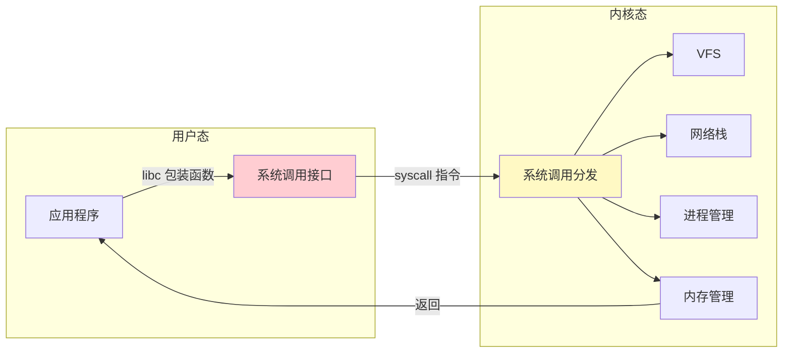
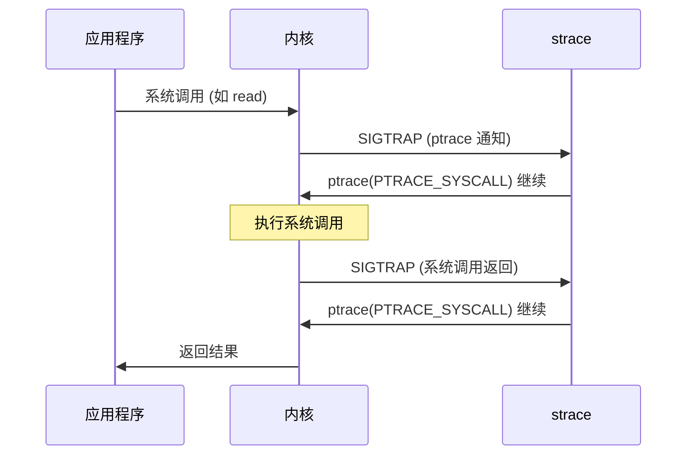
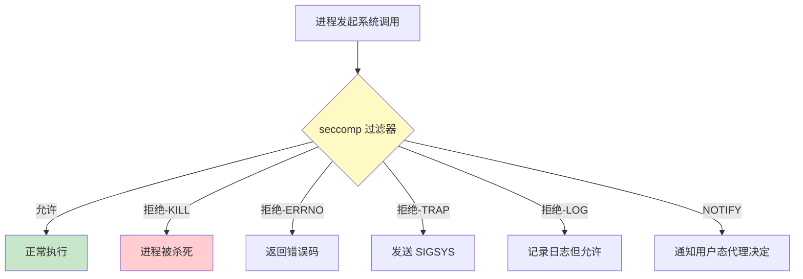
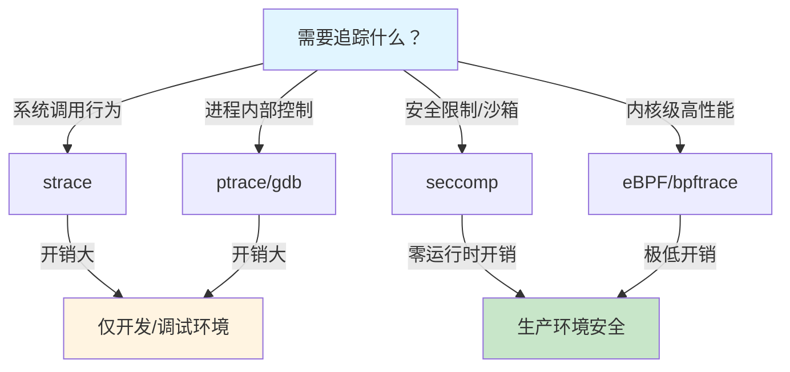

# 系统调用追踪

> 100 天认知提升计划 | Day 19

---

## 核心概念

### 什么是系统调用？

系统调用（syscall）是用户态程序请求内核服务的唯一接口。每当应用程序需要读写文件、创建进程、建立网络连接时，都必须通过系统调用陷入内核态。追踪系统调用是理解程序行为、调试问题、审计安全的基石。



### Linux 系统调用分类

| 类别 | 系统调用示例 | 说明 |
|------|------------|------|
| **文件 I/O** | `open`, `read`, `write`, `close`, `lseek` | 文件操作 |
| **文件系统** | `stat`, `mkdir`, `unlink`, `mount` | 目录/文件系统管理 |
| **进程管理** | `fork`, `execve`, `wait4`, `exit`, `clone` | 进程创建与控制 |
| **内存管理** | `mmap`, `munmap`, `brk`, `mprotect` | 虚拟内存操作 |
| **网络** | `socket`, `bind`, `listen`, `accept`, `connect` | 网络通信 |
| **信号** | `kill`, `sigaction`, `sigprocmask` | 信号处理 |
| **权限** | `setuid`, `setgid`, `capset` | 权限管理 |
| **时间** | `clock_gettime`, `nanosleep`, `timer_create` | 时间操作 |

---

## strace：系统调用追踪利器

### 基本用法

```bash
# 追踪程序的所有系统调用
strace ls -la

# 追踪正在运行的进程（-p PID）
strace -p 12345

# 只追踪特定系统调用（-e trace=）
strace -e trace=read,write,open,close ./myapp

# 常用过滤器
strace -e trace=file ./myapp        # 所有文件相关
strace -e trace=network ./myapp     # 所有网络相关
strace -e trace=process ./myapp     # 所有进程相关
strace -e trace=signal ./myapp      # 所有信号相关
strace -e trace=memory ./myapp      # 所有内存相关
strace -e trace=desc ./myapp        # 所有文件描述符相关
```

### 关键选项

| 选项 | 说明 | 示例 |
|------|------|------|
| `-c` | 统计系统调用次数和耗时 | `strace -c ./myapp` |
| `-T` | 显示每个系统调用耗时 | `strace -T ./myapp` |
| `-tt` | 微秒级时间戳 | `strace -tt ./myapp` |
| `-ff` | 追踪子进程（配合 `-o`） | `strace -ff -o trace ./myapp` |
| `-y` | 解码文件描述符为路径 | `strace -y ./myapp` |
| `-yy` | 解码 IP/端口、文件路径 | `strace -yy ./myapp` |
| `-s 1024` | 打印字符串最大长度 | `strace -s 1024 ./myapp` |
| `-o file` | 输出到文件 | `strace -o trace.log ./myapp` |
| `-e signal=` | 追踪特定信号 | `strace -e signal=SIGSEGV ./myapp` |

### 实战场景

#### 场景 1：程序启动失败—"No such file or directory"

```bash
# 现象：运行程序报错但不知道缺什么文件
strace -e trace=openat ./myapp 2>&1 | tail -20
```

输出分析：
```
openat(AT_FDCWD, "/lib/x86_64-linux-gnu/libssl.so.1.1", O_RDONLY|O_CLOEXEC) = -1 ENOENT (No such file or directory)
openat(AT_FDCWD, "/usr/lib/x86_64-linux-gnu/libssl.so.1.1", O_RDONLY|O_CLOEXEC) = 3
```
→ 定位到缺少 `libssl.so.1.1`

#### 场景 2：程序卡住—分析阻塞位置

```bash
# 某服务请求 hang 住，追踪它在等什么
strace -p $(pgrep myapp) -T -tt -e trace=read,write,poll,epoll_wait
```

输出：
```
15:23:01.123456 poll([{fd=5, events=POLLIN}], 1, -1) = 1 ([POLLIN]) <5.001234>
```
→ `poll` 等了 5 秒，说明上游服务响应慢

#### 场景 3：性能分析—系统调用统计

```bash
strace -c -p $(pgrep nginx) 2>&1 | head -30
```

输出：
```
% time     seconds  usecs/call     calls    errors syscall
------ ----------- ----------- --------- --------- ----------------
 42.30    0.150000           3     50000        10 epoll_wait
 28.50    0.101000           2     50000         0 accept4
 15.20    0.053800           1     50000         0 writev
  8.10    0.028700           1     25000         0 read
  3.20    0.011300           0     25000         0 close
------ ----------- ----------- --------- --------- ----------------
100.00    0.344800                200000        10 total
```
→ `epoll_wait` 占 42% 时间，结合业务判断是否正常

#### 场景 4：追踪网络连接

```bash
# 追踪某个进程的所有网络操作
strace -e trace=network -yy -p $(pgrep curl) 2>&1
```

```
socket(AF_INET, SOCK_STREAM, IPPROTO_TCP) = 3
connect(3, {sa_family=AF_INET, sin_port=htons(443), sin_addr=inet_addr("93.184.216.34")}, 16) = -1 EINPROGRESS (Operation now in progress)
```

### strace 原理与开销

strace 基于 `ptrace` 系统调用实现，每次系统调用都会触发两次上下文切换（进入/退出），开销极大：



**开销对比**：

| 场景 | 无追踪 | strace | 开销 |
|------|--------|--------|------|
| 10 万次 read | ~250ms | ~2500ms | **10x** |
| 10 万次 openat | ~250ms | ~5000ms | **20x** |
| nginx QPS | 50K | 5K | **90% 下降** |

> ⚠️ **生产环境慎用 strace**：对于性能敏感的服务，优先使用 eBPF/perf 方案

---

## ptrace：进程追踪机制

### ptrace 概述

`ptrace` 是 Linux 底层进程追踪机制，strace、gdb、lldb 都基于它实现。它允许一个进程（tracer）观察和控制另一个进程（tracee）的执行。

### ptrace 请求类型

| 请求 | 说明 | 用途 |
|------|------|------|
| `PTRACE_ATTACH` | 附加到进程 | strace/gdb attach |
| `PTRACE_TRACEME` | 子进程请求被追踪 | fork 后调用 |
| `PTRACE_PEEKDATA` | 读取 tracee 内存 | 读取变量值 |
| `PTRACE_POKEDATA` | 写入 tracee 内存 | 修改内存/断点 |
| `PTRACE_GETREGS` | 读取寄存器 | 获取当前执行上下文 |
| `PTRACE_SETREGS` | 设置寄存器 | 修改执行流 |
| `PTRACE_SINGLESTEP` | 单步执行 | 调试器逐行执行 |
| `PTRACE_SYSCALL` | 继续到下一个系统调用 | strace 实现 |
| `PTRACE_CONT` | 继续执行 | 恢复运行 |
| `PTRACE_SETOPTIONS` | 设置选项 | 如 PTRACE_O_TRACEFORK |

### 最小 strace 实现

```c
#define _GNU_SOURCE
#include <sys/ptrace.h>
#include <sys/wait.h>
#include <sys/user.h>
#include <unistd.h>
#include <stdio.h>
#include <string.h>
#include <sys/syscall.h>

// x86_64 系统调用号表（部分）
struct syscall_entry {
    long nr;
    const char *name;
};

static const struct syscall_entry syscalls[] = {
    { SYS_read,    "read" },
    { SYS_write,   "write" },
    { SYS_open,    "open" },
    { SYS_close,   "close" },
    { SYS_execve,  "execve" },
    { SYS_fork,    "fork" },
    { SYS_mmap,    "mmap" },
    { SYS_munmap,  "munmap" },
    { SYS_socket,  "socket" },
    { SYS_connect, "connect" },
    { -1, NULL }
};

const char *get_syscall_name(long nr) {
    for (int i = 0; syscalls[i].name; i++)
        if (syscalls[i].nr == nr) return syscalls[i].name;
    return "unknown";
}

int main(int argc, char **argv) {
    if (argc < 2) {
        fprintf(stderr, "Usage: %s <prog> [args...]\n", argv[0]);
        return 1;
    }

    pid_t child = fork();
    if (child == 0) {
        // 子进程：请求被追踪，然后执行目标程序
        ptrace(PTRACE_TRACEME, 0, NULL, NULL);
        raise(SIGSTOP);
        execvp(argv[1], argv + 1);
    } else {
        // 父进程：追踪子进程的系统调用
        int status;
        waitpid(child, &status, 0);

        // 设置追踪选项：自动追踪 fork 的子进程
        ptrace(PTRACE_SETOPTIONS, child, 0, PTRACE_O_TRACEFORK);

        int enter = 1; // 交替追踪进入和退出
        while (1) {
            // 继续执行到下一个系统调用
            ptrace(PTRACE_SYSCALL, child, 0, 0);
            waitpid(child, &status, 0);

            if (WIFEXITED(status)) {
                printf("Child exited with %d\n", WEXITSTATUS(status));
                break;
            }

            if (enter) {
                // 系统调用进入：读取系统调用号
                struct user_regs_struct regs;
                ptrace(PTRACE_GETREGS, child, 0, &regs);
                printf("%-15s(%ld, %ld, %ld)",
                       get_syscall_name(regs.orig_rax),
                       regs.rdi, regs.rsi, regs.rdx);
            } else {
                // 系统调用退出：读取返回值
                struct user_regs_struct regs;
                ptrace(PTRACE_GETREGS, child, 0, &regs);
                printf(" = %ld\n", regs.rax);
            }
            enter = !enter;
        }
    }
    return 0;
}
```

### ptrace 的局限性

| 限制 | 说明 |
|------|------|
| **性能开销巨大** | 每次系统调用 2 次上下文切换 |
| **只能追踪系统调用** | 无法追踪内核函数内部 |
| **单 tracer** | 一个进程只能被一个 tracer 追踪 |
| **不支持多线程粒度** | 对多线程程序追踪复杂 |
| **信号干扰** | 可能干扰被追踪进程的信号处理 |

---

## seccomp：系统调用过滤与安全沙箱

### seccomp 概述

**seccomp**（secure computing mode）是 Linux 内核的安全机制，允许限制进程可调用的系统调用集合。它是 Docker、Firecracker、Chrome 沙箱等容器/应用安全的核心组件。



### seccomp 模式

| 模式 | 常量 | 说明 |
|------|------|------|
| **严格模式** | `SECCOMP_MODE_STRICT` | 仅允许 `read`, `write`, `_exit`, `sigreturn` |
| **过滤模式** | `SECCOMP_MODE_FILTER` | 通过 BPF 规则自定义允许/拒绝的系统调用 |
| **用户态通知** | `SECCOMP_RET_USER_NOTIF` (5.0+) | 系统调用由用户态代理决定（seccomp-agent） |

### BPF 过滤规则

seccomp 使用经典的 BPF（cBPF，非 eBPF）规则过滤系统调用：

```c
// seccomp BPF 规则结构
struct sock_filter {
    __u16 code;    // 操作码
    __u8  jt;      // 为真跳转
    __u8  jf;      // 为假跳转
    __u32 k;       // 通用字段
};

struct sock_fprog {
    unsigned short len;
    struct sock_filter *filter;
};
```

### libseccomp：高级接口

直接写 BPF 规则繁琐易错，`libseccomp` 提供了友好的 API：

```c
// sandbox.c - 最小 seccomp 沙箱
#include <stdio.h>
#include <stdlib.h>
#include <seccomp.h>
#include <unistd.h>
#include <fcntl.h>
#include <errno.h>

int main(int argc, char **argv) {
    if (argc < 2) {
        fprintf(stderr, "Usage: %s <prog> [args...]\n", argv[0]);
        return 1;
    }

    // 初始化 seccomp 上下文，默认 KILL 所有系统调用
    scmp_filter_ctx ctx = seccomp_init(SCMP_ACT_KILL);
    if (!ctx) {
        perror("seccomp_init");
        return 1;
    }

    // 允许必需的系统调用
    seccomp_rule_add(ctx, SCMP_ACT_ALLOW, SCMP_SYS(read), 0);
    seccomp_rule_add(ctx, SCMP_ACT_ALLOW, SCMP_SYS(write), 0);
    seccomp_rule_add(ctx, SCMP_ACT_ALLOW, SCMP_SYS(exit), 0);
    seccomp_rule_add(ctx, SCMP_ACT_ALLOW, SCMP_SYS(exit_group), 0);
    seccomp_rule_add(ctx, SCMP_ACT_ALLOW, SCMP_SYS(brk), 0);
    seccomp_rule_add(ctx, SCMP_ACT_ALLOW, SCMP_SYS(mmap), 0);
    seccomp_rule_add(ctx, SCMP_ACT_ALLOW, SCMP_SYS(munmap), 0);
    seccomp_rule_add(ctx, SCMP_ACT_ALLOW, SCMP_SYS(fstat), 0);
    seccomp_rule_add(ctx, SCMP_ACT_ALLOW, SCMP_SYS(newfstatat), 0);
    seccomp_rule_add(ctx, SCMP_ACT_ALLOW, SCMP_SYS(ioctl), 0);
    seccomp_rule_add(ctx, SCMP_ACT_ALLOW, SCMP_SYS(lseek), 0);
    seccomp_rule_add(ctx, SCMP_ACT_ALLOW, SCMP_SYS(close), 0);
    seccomp_rule_add(ctx, SCMP_ACT_ALLOW, SCMP_SYS(access), 0);
    seccomp_rule_add(ctx, SCMP_ACT_ALLOW, SCMP_SYS(openat), 0);
    seccomp_rule_add(ctx, SCMP_ACT_ALLOW, SCMP_SYS(readlink), 0);
    seccomp_rule_add(ctx, SCMP_ACT_ALLOW, SCMP_SYS(getdents64), 0);
    seccomp_rule_add(ctx, SCMP_ACT_ALLOW, SCMP_SYS(sysinfo), 0);
    seccomp_rule_add(ctx, SCMP_ACT_ALLOW, SCMP_SYS(writev), 0);
    seccomp_rule_add(ctx, SCMP_ACT_ALLOW, SCMP_SYS(poll), 0);
    seccomp_rule_add(ctx, SCMP_ACT_ALLOW, SCMP_SYS(clock_gettime), 0);

    // execve 特殊处理：允许执行子程序
    seccomp_rule_add(ctx, SCMP_ACT_ALLOW, SCMP_SYS(execve), 0);

    // openat 限制：禁止写入（只允许 O_RDONLY）
    seccomp_rule_add(ctx, SCMP_ACT_ERRNO(EACCES), SCMP_SYS(openat), 1,
        SCMP_A2(SCMP_CMP_MASKED_EQ, O_WRONLY | O_RDWR, O_WRONLY | O_RDWR));

    // 加载规则（不可逆！）
    if (seccomp_load(ctx) < 0) {
        perror("seccomp_load");
        seccomp_release(ctx);
        return 1;
    }

    printf("[sandbox] seccomp filters loaded. Starting: %s\n", argv[1]);
    seccomp_release(ctx);

    // 执行目标程序
    execvp(argv[1], argv + 1);
    perror("execvp");
    return 1;
}
```

**编译和测试**：

```bash
# 编译
gcc -o sandbox sandbox.c -lseccomp

# 正常命令可以运行（只读操作）
./sandbox ls -la

# 写入操作被拒绝
./sandbox touch /tmp/test.txt
# → Bad system call (或 Operation not permitted)
```

### Docker/容器中的 seccomp

Docker 默认使用 seccomp profile 限制容器可用的系统调用：

```bash
# 查看 Docker 默认 seccomp profile
docker run --rm docker/whalesay cat /etc/docker/seccomp.json 2>/dev/null || \
  curl -s https://raw.githubusercontent.com/moby/moby/master/profiles/seccomp/default.json | head -50

# 使用自定义 profile
docker run --security-opt seccomp=custom.json ...

# 完全禁用 seccomp（危险！仅调试用）
docker run --security-opt seccomp=unconfined ...
```

**Docker 默认禁止的系统调用（部分）**：

| 系统调用 | 禁止原因 |
|---------|---------|
| `acct` | 启用进程记账 |
| `add_key` | 内核密钥环操作 |
| `bpf` | 加载 eBPF 程序 |
| `clock_adjtime` | 调整系统时钟 |
| `mount` | 挂载文件系统 |
| `nfsservctl` | NFS 服务 |
| `pivot_root` | 改变根文件系统 |
| `ptrace` | 进程追踪（可逃逸） |
| `reboot` | 重启系统 |
| `swapon/swapoff` | 交换空间管理 |
| `syslog` | 内核日志访问 |
| `umount2` | 卸载文件系统 |

### seccomp 动作类型

| 动作 | 说明 | 使用场景 |
|------|------|---------|
| `SCMP_ACT_KILL` | 终止进程 | 安全违规（默认） |
| `SCMP_ACT_KILL_PROCESS` | 终止整个进程组 | 严重违规 |
| `SCMP_ACT_TRAP` | 发送 SIGSYS | 调试 |
| `SCMP_ACT_ERRNO(n)` | 返回错误码 | 优雅拒绝 |
| `SCMP_ACT_TRACE(n)` | 通知 ptrace | 配合调试器 |
| `SCMP_ACT_LOG` | 记录但允许 | 审计模式 |
| `SCMP_ACT_ALLOW` | 允许 | 白名单 |
| `SCMP_ACT_NOTIFY` | 用户态决定 | seccomp-agent |

---

## 工具对比与选型



| 维度 | strace | ptrace (直接) | seccomp | eBPF |
|------|--------|--------------|---------|------|
| **用途** | 观察系统调用 | 控制/调试进程 | 限制系统调用 | 内核级追踪 |
| **开销** | 高 (2-20x) | 极高 | 几乎为零 | 极低 (<5%) |
| **安全级别** | 只读 | 可读写 | 强制访问控制 | 只读/受限写 |
| **生产可用** | ❌ 不推荐 | ❌ 不推荐 | ✅ | ✅ |
| **学习曲线** | 低 | 高 | 中 | 中高 |
| **内核版本** | 全版本 | 全版本 | 3.5+（推荐 4.14+） | 4.4+（推荐 5.2+） |

---

## 实践任务

- [ ] 使用 `strace -c` 分析一个常用命令（如 `ls`、`cat`、`curl`）的系统调用分布
- [ ] 使用 `strace -e trace=openat` 定位一个程序缺失的文件依赖
- [ ] 编译最小 strace 实现，追踪一个简单程序的 `read/write` 调用
- [ ] 使用 libseccomp 编写沙箱，限制一个程序只能进行只读文件操作
- [ ] （进阶）编写一个 seccomp profile，为 Node.js/Python 应用创建最小权限沙箱
- [ ] （进阶）使用 `strace -ff -o trace` 追踪多进程程序的父子进程交互

---

## 关键收获

1. **strace 是调试第一工具**：当程序行为不符合预期时，`strace` 是最快的诊断入口——看它在和内核说什么
2. **ptrace 是底层机制**：理解 ptrace 才能理解 strace/gdb 的原理和局限，知道为什么它慢
3. **seccomp 是安全基石**：现代容器安全的核心，默认拒绝 + 白名单是最安全的策略
4. **生产环境用 eBPF 替代 strace**：strace 的 ptrace 开销不适合生产环境，eBPF 可以零侵入地完成同样的追踪
5. **seccomp 不可逆**：一旦加载就无法卸载，这是设计而非缺陷——攻击者无法解除沙箱
6. **组合使用最强大**：strace 快速定位问题 → seccomp 限制攻击面 → eBPF 持续监控

---

## 参考资料

- [strace(1) — Linux manual page](https://man7.org/linux/man-pages/man1/strace.1.html)
- [ptrace(2) — Linux manual page](https://man7.org/linux/man-pages/man2/ptrace.2.html)
- [seccomp(2) — Linux manual page](https://man7.org/linux/man-pages/man2/seccomp.2.html)
- [libseccomp — GitHub](https://github.com/seccomp/libseccomp)
- [Docker seccomp profiles](https://docs.docker.com/engine/security/seccomp/)
- [The Falco Project — syscall auditing](https://falco.org/)

---

*学习日期：2026-03-30*
