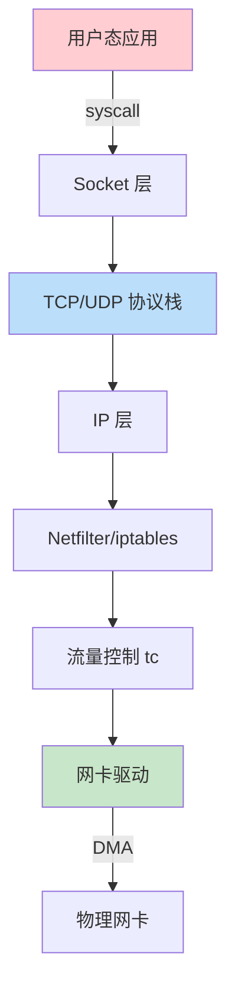
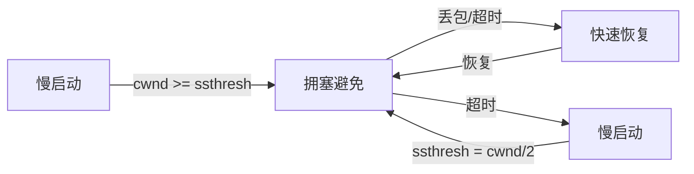
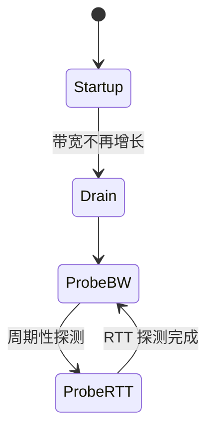
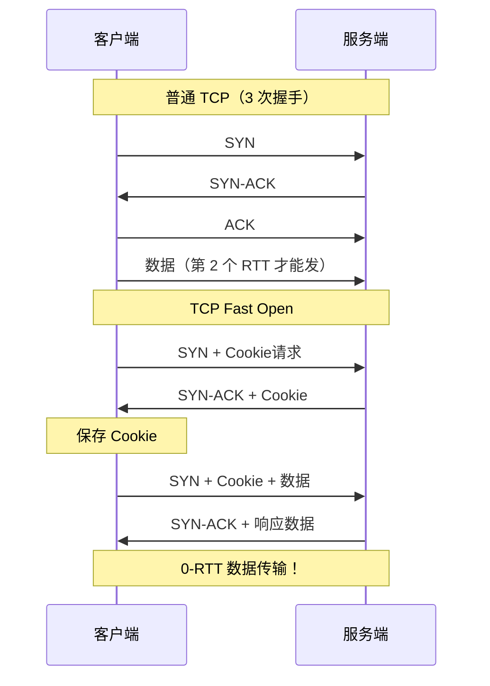
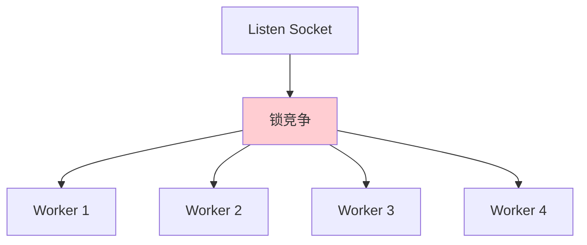
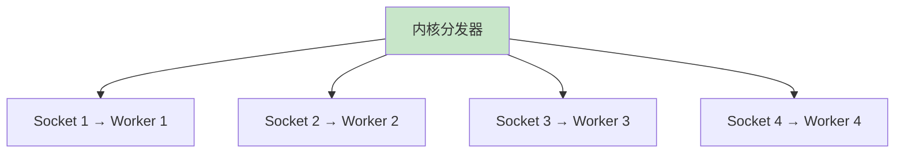

# Linux 网络栈调优

> 100 天认知提升计划 | Day 20

---

## 核心概念

### Linux 网络栈全景

Linux 网络栈是一个分层架构，从用户态的系统调用到内核态的协议栈，再到网卡驱动的 DMA 操作，每一层都有调优空间。



**调优核心原则**：
- 减少上下文切换与系统调用开销
- 降低缓冲区不足导致的丢包与重传
- 选择适合业务场景的拥塞控制算法
- 合理利用多核 CPU 的并行能力

---

## TCP 拥塞控制

### 拥塞控制算法对比

| 算法 | 年代 | 核心思路 | 优点 | 缺点 |
|------|------|---------|------|------|
| **Reno** | 1988 | AIMD（加法增/乘法减） | 简单公平 | 高丢包率下吞吐低 |
| **Cubic** | 2006 | 三次函数增长窗口 | 适合高 BDP 网络 | 丢包即降速，不适合无线 |
| **BBR** | 2016 | 基于带宽与 RTT 模型 | 高吞吐低延迟，抗丢包 | 与 CUBIC 混合时可能不公平 |
| **BBRv2** | 2019 | 改进公平性与收敛 | 更公平，收敛更快 | 仍在迭代 |



#### Reno：经典 AIMD

```
加法增：每个 RTT，cwnd += 1 MSS
乘法减：检测到丢包，cwnd = cwnd / 2
```

Reno 的核心问题是：在高带宽长距离网络中，窗口恢复到最优值需要很长时间。

#### Cubic：Linux 默认

Cubic 用三次函数代替线性增长，使得窗口增长与 RTT 无关：

```
W(t) = C × (t - K)³ + Wmax
```

- `t`：自上次丢包后的时间
- `Wmax`：上次丢包时的窗口大小
- `C`：缩放因子（默认 0.4）

**特点**：比 Reno 在高 BDP 网络中恢复更快，但仍然依赖丢包信号。

#### BBR：基于模型的革命

BBR（Bottleneck Bandwidth and Round-trip propagation time）不再以丢包为信号，而是周期性测量：

1. **BtlBw**：瓶颈带宽
2. **RTprop**：最小传播 RTT



**BBR 的关键优势**：
- 在 1% 丢包率下，吞吐量是 CUBIC 的 **10-100 倍**
- 不再因丢包而大幅降速
- 适合长肥网络（LFN）和无线网络

### 查看与切换算法

```bash
# 查看当前算法
sysctl net.ipv4.tcp_congestion_control
sysctl net.ipv4.tcp_available_congestion_control

# 切换为 BBR
modprobe tcp_bbr
echo "tcp_bbr" | sudo tee /etc/modules-load.d/bbr.conf
sysctl -w net.ipv4.tcp_congestion_control=bbr
sysctl -w net.core.default_qdisc=fq  # BBR 推荐 fq 调度器

# 持久化
cat <<EOF | sudo tee -a /etc/sysctl.d/99-bbr.conf
net.ipv4.tcp_congestion_control = bbr
net.core.default_qdisc = fq
EOF
```

### 性能对比实验

```bash
# 使用 iperf3 测试不同算法的吞吐量
# 服务端
iperf3 -s

# 客户端 - CUBIC
iperf3 -c server_ip -C cubic -t 30

# 客户端 - BBR
iperf3 -c server_ip -C bbr -t 30

# 模拟 1% 丢包
tc qdisc add dev eth0 root netem loss 1%
```

| 丢包率 | CUBIC 吞吐 | BBR 吞吐 | 比率 |
|--------|-----------|---------|------|
| 0% | 10 Gbps | 10 Gbps | 1.0x |
| 0.1% | 3.2 Gbps | 9.5 Gbps | 3.0x |
| 1% | 0.5 Gbps | 8.2 Gbps | 16x |
| 5% | 0.05 Gbps | 5.1 Gbps | 100x |

---

## 缓冲区调优

### 关键参数

| 参数 | 默认值 | 推荐值 | 说明 |
|------|--------|--------|------|
| `net.core.rmem_max` | 212992 | 16777216 | 最大接收缓冲区（16MB） |
| `net.core.wmem_max` | 212992 | 16777216 | 最大发送缓冲区（16MB） |
| `net.ipv4.tcp_rmem` | 4096 87380 6291456 | 4096 87380 16777216 | TCP 接收缓冲区 min/default/max |
| `net.ipv4.tcp_wmem` | 4096 16384 4194304 | 4096 16384 16777216 | TCP 发送缓冲区 min/default/max |
| `net.core.netdev_max_backlog` | 1000 | 5000 | 网卡包积压队列长度 |
| `net.ipv4.tcp_max_syn_backlog` | 128 | 8192 | SYN 队列长度 |

### 调优配置

```bash
# /etc/sysctl.d/99-network-tuning.conf

# 增大缓冲区
net.core.rmem_max = 16777216
net.core.wmem_max = 16777216
net.ipv4.tcp_rmem = 4096 87380 16777216
net.ipv4.tcp_wmem = 4096 16384 16777216

# 增大队列长度
net.core.somaxconn = 65535
net.core.netdev_max_backlog = 5000
net.ipv4.tcp_max_syn_backlog = 8192

# 启用窗口缩放（支持高 BDP）
net.ipv4.tcp_window_scaling = 1

# 启用 TCP 自动调优
net.ipv4.tcp_moderate_rcvbuf = 1

# 应用
sysctl -p /etc/sysctl.d/99-network-tuning.conf
```

### BDP 计算

**Bandwidth-Delay Product（带宽延迟积）** 决定了最优缓冲区大小：

```
BDP = 带宽(bps) × RTT(秒)
```

| 场景 | 带宽 | RTT | BDP | 推荐缓冲区 |
|------|------|-----|-----|-----------|
| 局域网 | 10 Gbps | 0.1ms | 125 KB | 256 KB |
| 同城 | 1 Gbps | 2ms | 250 KB | 512 KB |
| 跨国 | 1 Gbps | 100ms | 12.5 MB | 16 MB |
| 卫星 | 100 Mbps | 600ms | 7.5 MB | 8 MB |

---

## TCP Fast Open（TFO）

### 原理

TFO 允许在 SYN 包中携带数据，省去一个 RTT 的握手延迟。



### 启用 TFO

```bash
# 查看当前值
sysctl net.ipv4.tcp_fastopen

# 值含义（位图）：
# 1 = 客户端启用
# 2 = 服务端启用
# 3 = 双端启用
# 4 = 客户端不要求 Cookie

sysctl -w net.ipv4.tcp_fastopen=3
```

### 代码示例

```c
// 服务端
int sockfd = socket(AF_INET, SOCK_STREAM, 0);
int qlen = 5;  // TFO 队列长度
setsockopt(sockfd, SOL_TCP, TCP_FASTOPEN, &qlen, sizeof(qlen));

// 客户端
int sockfd = socket(AF_INET, SOCK_STREAM, 0);
// 使用 sendto 替代 connect + send
sendto(sockfd, data, len, MSG_FASTOPEN, 
       (struct sockaddr *)&addr, sizeof(addr));
```

**性能收益**：
- 短连接场景（HTTP/1.0）延迟降低 **~30%**
- HTTPS 连接建立加速（TLS 在 TFO 数据之后）
- Google 报告：页面加载时间减少 **10-40%**

---

## SO_REUSEPORT

### 问题：单 accept 瓶颈

传统多进程服务器中，所有 worker 共享一个 listen socket，accept 操作存在锁竞争：



### SO_REUSEPORT 方案

每个 worker 拥有独立的 listen socket，内核负责负载均衡分发：



### 代码示例

```c
#include <sys/socket.h>

int sockfd = socket(AF_INET, SOCK_STREAM, 0);

int opt = 1;
setsockopt(sockfd, SOL_SOCKET, SO_REUSEPORT, &opt, sizeof(opt));
setsockopt(sockfd, SOL_SOCKET, SO_REUSEADDR, &opt, sizeof(opt));

bind(sockfd, (struct sockaddr *)&addr, sizeof(addr));
listen(sockfd, 128);
```

### 性能对比

| 模式 | 单核吞吐 | 4核吞吐 | 锁竞争 |
|------|---------|---------|--------|
| 单 accept + fork | ~120K req/s | ~280K req/s | 严重 |
| SO_REUSEPORT | ~120K req/s | **~460K req/s** | 无 |

**注意**：Linux 4.5+ 使用哈希分发（连接均匀），4.6+ 支持按 CPU 亲和性分发，避免跨核缓存失效。

---

## somaxconn 与连接队列

### 两个队列


| 参数 | 作用 | 默认值 | 推荐值 |
|------|------|--------|--------|
| `net.core.somaxconn` | Accept 队列上限 | 128（旧）/ 4096（新） | 65535 |
| `net.ipv4.tcp_max_syn_backlog` | SYN 队列上限 | 128 | 8192 |
| `listen(fd, backlog)` | 应用层请求的队列长度 | 通常 128 或 511 | ≥ 4096 |

**当 Accept 队列满时**：
- 客户端收到 SYN-ACK 后发 ACK，服务端直接丢弃
- 客户端超时重传 ACK（约 1 秒后）
- 表现为 `netstat -s | grep "overflow"` 递增

```bash
# 检查队列溢出
netstat -s | grep overflow
# watch -n1 "netstat -s | grep -i overflow"

# 查看当前队列状态（ss 命令）
ss -lnt
# Recv-Q 列表示当前 Accept 队列中的待处理连接数
# Send-Q 列表示 listen backlog 的最大值
```

---

## 其他重要调优

### TIME_WAIT 优化

```bash
# 允许 TIME_WAIT socket 复用（通常安全）
net.ipv4.tcp_tw_reuse = 1

# 不推荐 tcp_tw_recycle（已在 4.12 移除，NAT 环境有问题）

# 缩短 TIME_WAIT 时间（默认 60 秒）
# 不建议修改，tcp_tw_reuse 已足够
```

### Keepalive

```bash
net.ipv4.tcp_keepalive_time = 600    # 10 分钟无活动后开始探测
net.ipv4.tcp_keepalive_intvl = 30    # 探测间隔 30 秒
net.ipv4.tcp_keepalive_probes = 5    # 探测 5 次失败后断开
```

### 中断亲和性（IRQ Affinity）

```bash
# 查看网卡中断分布
cat /proc/interrupts | grep eth

# 设置 IRQ 亲和性（将不同队列绑定到不同 CPU）
# 对于多队列网卡（RSS）
ethtool -L eth0 combined 4  # 启用 4 个队列

# 使用 irqbalance 自动分配
systemctl enable irqbalance
```

### Ring Buffer

```bash
# 查看网卡 Ring Buffer 大小
ethtool -g eth0

# 增大 Ring Buffer（减少丢包）
ethtool -G eth0 rx 4096 tx 4096

# 查看 RX 丢包统计
ethtool -S eth0 | grep -i drop
```

---

## 综合调优脚本

```bash
#!/bin/bash
# network-tuning.sh - 网络栈一键调优

cat <<EOF | sudo tee /etc/sysctl.d/99-network-tuning.conf
# === 缓冲区 ===
net.core.rmem_max = 16777216
net.core.wmem_max = 16777216
net.ipv4.tcp_rmem = 4096 87380 16777216
net.ipv4.tcp_wmem = 4096 16384 16777216

# === 连接队列 ===
net.core.somaxconn = 65535
net.core.netdev_max_backlog = 5000
net.ipv4.tcp_max_syn_backlog = 8192

# === 拥塞控制 ===
net.ipv4.tcp_congestion_control = bbr
net.core.default_qdisc = fq

# === TCP Fast Open ===
net.ipv4.tcp_fastopen = 3

# === 连接复用 ===
net.ipv4.tcp_tw_reuse = 1
net.ipv4.tcp_window_scaling = 1
net.ipv4.tcp_moderate_rcvbuf = 1

# === Keepalive ===
net.ipv4.tcp_keepalive_time = 600
net.ipv4.tcp_keepalive_intvl = 30
net.ipv4.tcp_keepalive_probes = 5

# === 安全 ===
net.ipv4.tcp_syncookies = 1
net.ipv4.conf.default.rp_filter = 1
EOF

sudo sysctl -p /etc/sysctl.d/99-network-tuning.conf
echo "网络栈调优完成！"
```

---

## 实践任务

- [ ] 在服务器上切换 TCP 拥塞控制算法为 BBR 并对比 iperf3 结果
- [ ] 使用 `tc netem` 模拟网络延迟和丢包，观察不同算法表现
- [ ] 用 `ss -lnt` 观察 Accept 队列溢出情况
- [ ] 编写一个使用 SO_REUSEPORT 的多进程 echo 服务器
- [ ] 启用 TCP Fast Open 并用 tcpdump 抓包验证
- [ ] 使用 `perf top` 分析网络中断分布

---

## 关键收获

1. **拥塞控制是网络性能的灵魂**：BBR 在有丢包的网络中远优于 CUBIC，适合实际生产环境
2. **缓冲区大小取决于 BDP**：跨国/卫星链路需要更大的缓冲区
3. **SO_REUSEPORT 消除 accept 锁竞争**：多核扩展性提升 60%+
4. **TFO 省一个 RTT**：对短连接和 HTTPS 场景效果显著
5. **调优是系统工程**：从网卡 Ring Buffer 到应用层 backlog，层层配合

---

## 参考资料

- [TCP BBR Congestion Control - Google](https://research.google/pubs/pub45346/)
- [TCP Congestion Control - RFC 5681](https://datatracker.ietf.org/doc/html/rfc5681)
- [TCP Fast Open - RFC 7413](https://datatracker.ietf.org/doc/html/rfc7413)
- [Linux Network Tuning - Admin Guide](https://www.kernel.org/doc/Documentation/networking/ip-sysctl.txt)
- [SO_REUSEPORT - LWN](https://lwn.net/Articles/542629/)
- [CUBIC: A New TCP-Friendly High-Speed TCP Variant](https://www.cs.illinois.edu/~pantc/papers/cubic_tc.pdf)

---

*学习日期：2026-03-31*
