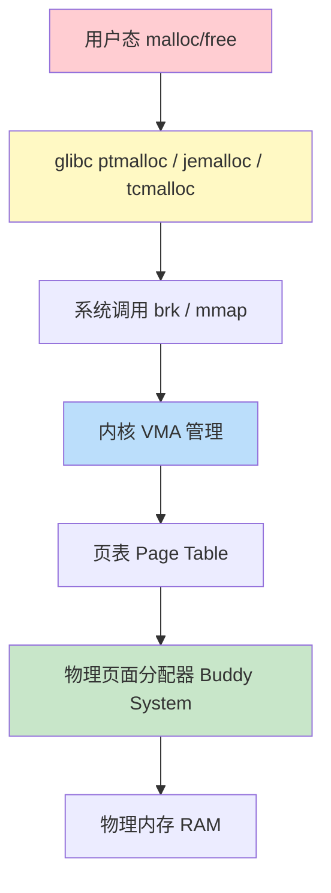
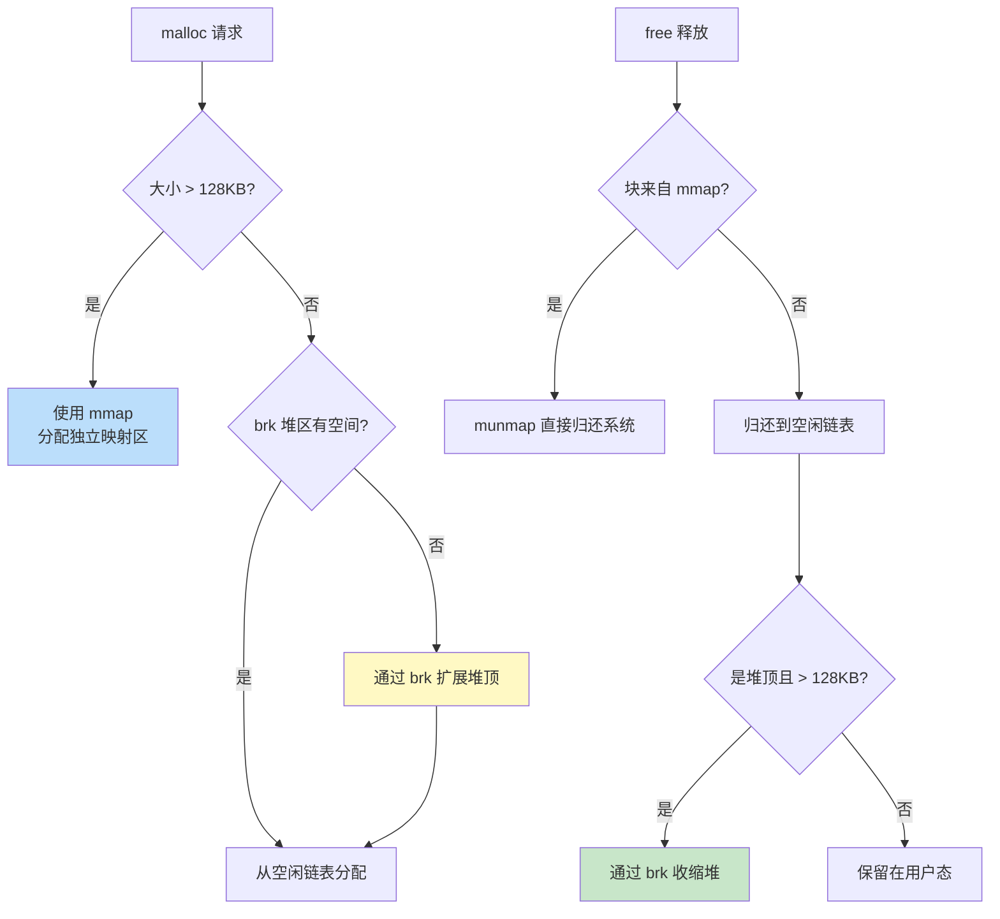
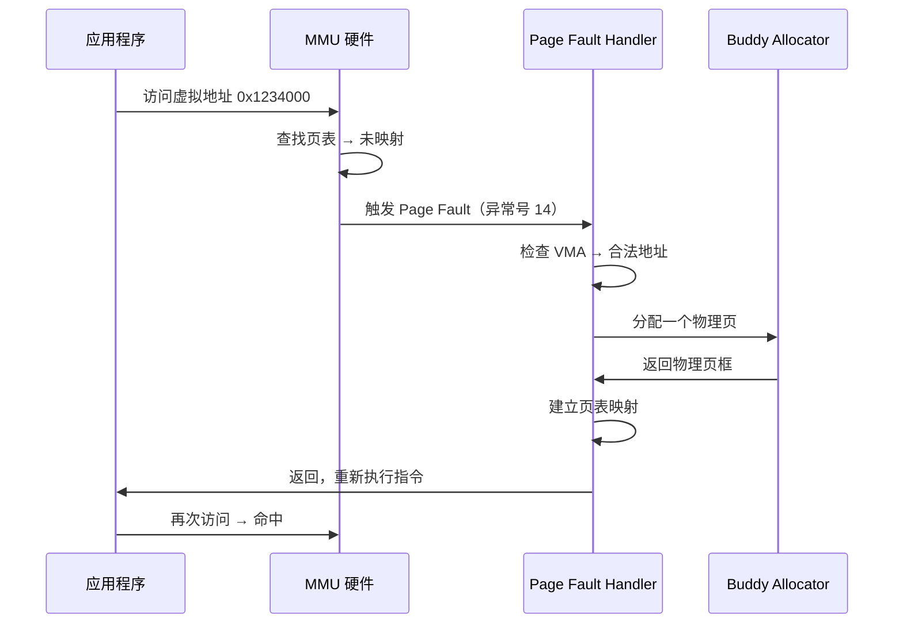
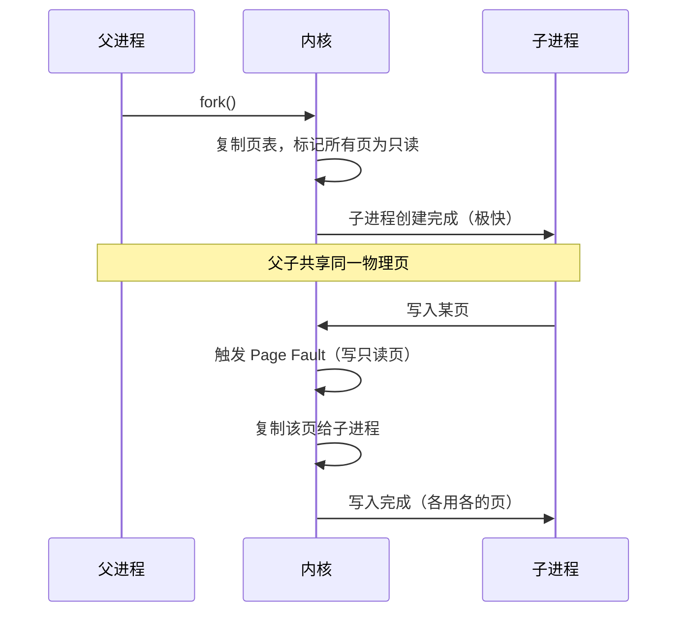
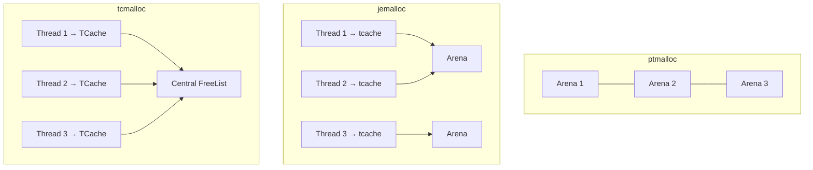
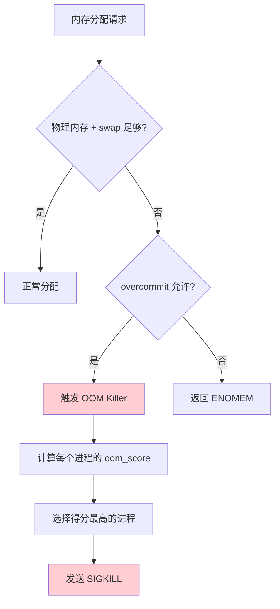

# 内存管理深潜

> 100 天认知提升计划 | Day 21

---

## 核心概念

### Linux 内存管理架构

Linux 内存管理是一个多层抽象系统，从硬件页表到用户态 malloc，每一层都有不同的设计权衡。



**关键设计哲学**：
- **按需分配（Lazy Allocation）**：分配虚拟地址时不立即分配物理页
- **缺页中断（Page Fault）**：访问未映射的虚拟地址时触发
- **内存超额（Overcommit）**：允许分配超过物理内存的虚拟地址

---

## 虚拟内存

### 为什么需要虚拟内存？

| 特性 | 无虚拟内存 | 有虚拟内存 |
|------|-----------|-----------|
| 进程隔离 | 无，可互踩内存 | 每个进程独立地址空间 |
| 内存保护 | 无法实现 | 页级权限（R/W/X） |
| 内存利用率 | 受物理内存限制 | 可使用 swap/文件映射 |
| 编程模型 | 需手动管理物理地址 | 每个进程独享完整地址空间 |

### 虚拟地址空间布局

64 位 Linux 进程的虚拟地址空间（简化）：

```
┌──────────────────────┐ 0xFFFFFFFFFFFFFFFF
│   内核空间            │ （高地址，约 128TB）
│   (所有进程共享)       │
├──────────────────────┤ 0xFFFF800000000000
│   非规范地址区         │ （空洞）
├──────────────────────┤ 0x7FFFFFFFFFFF
│   栈区 Stack         │ ↓ 向下增长
│                      │
├──────────────────────┤
│   内存映射区 mmap     │ ↑ 向下增长（与堆相向）
│   (共享库、文件映射)    │
├──────────────────────┤
│                      │
│   堆区 Heap          │ ↑ 向上增长
│                      │
├──────────────────────┤
│   BSS 段             │ （未初始化全局变量）
├──────────────────────┤
│   Data 段            │ （已初始化全局变量）
├──────────────────────┤
│   Text 段            │ （代码段，只读可执行）
├──────────────────────┤ 0x400000
│   不可访问区域         │
└──────────────────────┘ 0x0
```

### 页表与 TLB


- **四级页表**：PML4 → PDPT → PD → PT → Page（Linux 4.11+ 支持五级）
- **页大小**：常规 4KB，大页 2MB/1GB
- **TLB**：页表缓存，减少内存访问次数

```bash
# 查看页大小
getconf PAGESIZE    # 4096

# 查看页表信息
cat /proc/[pid]/maps
cat /proc/[pid]/smaps  # 详细内存映射

# 查看 TLB 信息
cat /sys/devices/system/cpu/cpu0/cache/index3/shared_cpu_map
```

---

## brk vs mmap

### 两种内存扩展方式

| 特性 | brk/sbrk | mmap |
|------|----------|------|
| 增长方向 | 向上（连续） | 可在任意位置 |
| 释放方式 | 只能释放尾部 | 可释放任意映射 |
| 适用场景 | 小块内存 | 大块内存（>128KB） |
| 碎片风险 | 高（无法中间释放） | 低 |
| 对齐 | 页对齐 | 页对齐 |

### glibc malloc 的分配策略



**关键阈值**：
- `MMAP_THRESHOLD`：默认 128KB，动态调整（glibc 2.10+）
- `TRIM_THRESHOLD`：堆顶空闲超过此值时归还系统，默认 128KB

```c
// 查看和调整 glibc malloc 参数
#include <malloc.h>

struct mallinfo mi = mallinfo();
printf("堆大小: %d bytes\n", mi.arena);
printf("空闲块总大小: %d bytes\n", mi.fordblks);

// 调整 mmap 阈值
mallopt(M_MMAP_THRESHOLD, 256 * 1024);  // 256KB
mallopt(M_TRIM_THRESHOLD, 256 * 1024);
```

---

## Page Fault 深入

### Page Fault 类型

| 类型 | 触发条件 | 处理方式 | 开销 |
|------|---------|---------|------|
| **Minor Fault** | 访问已分配但未映射的页 | 分配物理页，建立映射 | 低（~1μs） |
| **Major Fault** | 访问被换出到 swap/文件的页 | 从磁盘读回 | 高（~ms 级） |
| **Segmentation Fault** | 访问非法地址 | 发送 SIGSEGV | 进程终止 |

### Minor Fault 流程



```bash
# 查看进程的 page fault 统计
cat /proc/self/stat | awk '{print "minor faults: "$10, "major faults: "$12}'

# 使用 perf 监控 page fault
perf stat -e faults,major-faults,minor-faults ./your_program

# 使用 time 查看 faults
/usr/bin/time -v ./your_program
# 输出包含:
#   Major (requiring I/O) page faults: XX
#   Minor (reclaiming a frame) page faults: XXXX
```

---

## Lazy Allocation

### 原理

Linux 采用 **按需分页（Demand Paging）**：malloc 只分配虚拟地址，不分配物理内存。直到实际访问时才通过 Page Fault 分配物理页。

```mermaid
flowchart LR
    A[malloc(1GB)] --> B[分配虚拟地址空间<br/>物理内存: 0]
    B --> C{访问第一页?}
    C -->|是| D[Page Fault → 分配 4KB]
    C -->|否| E[不消耗物理内存]
    D --> F[后续访问各页<br/>逐页触发 Minor Fault]

    style A fill:#ffcdd2
    style D fill:#c8e6c9
```

**好处**：
1. **内存效率**：分配但不使用的内存不占物理空间
2. **fork 加速**：子进程共享父进程的物理页（Copy-on-Write）
3. **启动加速**：程序启动时 mmap 代码段但不立即加载

### Copy-on-Write（COW）



```bash
# 观察 COW
fork_cow_demo &  # 运行示例程序
cat /proc/$!/stat | awk '{print "RSS pages: "$24}'

# 监控 COW 事件
perf stat -e 'syscalls:sys_enter_mprotect' ./fork_demo
```

### Overcommit

Linux 默认允许 overcommit（分配超过物理内存的虚拟地址）：

```bash
# 查看策略
cat /proc/sys/vm/overcommit_memory
# 0 = 启发式（默认）
# 1 = 总是允许
# 2 = 严格（不允许超过 commit_ratio）

# 严格模式下的限制
cat /proc/sys/vm/overcommit_ratio  # 默认 50%，即 swap + 50% RAM
cat /proc/sys/vm/overcommit_kbytes # 精确控制（优先于 ratio）

# 查看当前 commit 情况
cat /proc/meminfo | grep -i commit
# CommitLimit:     总可分配量
# Committed_AS:    已分配量
```

---

## jemalloc vs tcmalloc

### 为什么不用 glibc malloc？

| 问题 | glibc ptmalloc | jemalloc | tcmalloc |
|------|---------------|----------|----------|
| 多线程锁 | 每个 arena 一把锁 | 细粒度锁 | 每 CPU cache 无锁 |
| 内存碎片 | 高（不可合并跨 arena） | 低（slab 分配） | 低（span 管理） |
| 大对象 | mmap 每次单独映射 | 大小类对齐 | Central Free List |
| 小对象 | 最小 32B | 最小 8B | 最小 8B |

### 架构对比



### jemalloc

**核心设计**：
- **Arena**：按 CPU 数量创建（通常 4 × CPU），减少竞争
- **tcache**：每线程本地缓存，无锁分配小对象
- **Slab**：将大块内存切成固定大小的 slot

```bash
# 安装
apt-get install libjemalloc-dev  # Debian/Ubuntu

# 使用（LD_PRELOAD 方式，无需改代码）
LD_PRELOAD=/usr/lib/x86_64-linux-gnu/libjemalloc.so ./your_program

# 或编译链接
gcc -o demo demo.c -ljemalloc
```

```c
// jemalloc 特有 API
#include <jemalloc/jemalloc.h>

// 获取分配统计
size_t sz = sizeof(size_t);
je_mallctl("stats.allocated", &allocated, &sz, NULL, 0);
je_mallctl("stats.active", &active, &sz, NULL, 0);
je_mallctl("stats.metadata", &metadata, &sz, NULL, 0);

// 打印详细报告
malloc_stats_print(NULL, NULL, NULL);
```

### tcmalloc

**核心设计**：
- **ThreadCache**：每线程无锁缓存（小对象 ≤ 256KB）
- **CentralFreeList**：全局中心缓存（中对象）
- **PageHeap**：大对象直接从页面堆分配

```bash
# 安装
apt-get install libtcmalloc-minimal4  # Debian/Ubuntu

# 使用
LD_PRELOAD=/usr/lib/libtcmalloc_minimal.so ./your_program

# 查看分析
HEAPCHECK=normal ./your_program  # 内置堆检查器
```

### 性能对比

| 场景 | ptmalloc2 | jemalloc | tcmalloc |
|------|-----------|----------|----------|
| 单线程分配释放 | 100ns/op | 80ns/op | 75ns/op |
| 8 线程并发 | 500ns/op | **120ns/op** | **110ns/op** |
| 内存碎片率 | 1.5x | **1.05x** | 1.1x |
| 大对象 (>1MB) | 较慢 | 中等 | 较快 |
| RSS 增长 | 高 | **低** | 中等 |

**选择建议**：
- **Web 服务器 / 数据库**：jemalloc（Redis、Firefox 默认）
- **高并发短连接**：tcmalloc（Google 内部广泛使用）
- **通用场景**：glibc malloc 够用
- **极致性能**：mimalloc（微软，最新且极快）

---

## OOM Killer

### 触发机制

当物理内存和 swap 都耗尽时，内核的 OOM Killer 会选择一个进程杀掉以释放内存。



### oom_score 计算

每个进程的 `/proc/[pid]/oom_score` 范围 0-1000，分数越高越容易被杀：

**影响因素**：
- 内存占用（RSS + swap）占比
- 子进程内存（子进程多 = 父进程得分高）
- `oom_score_adj` 调整值（-1000 到 +1000）

```bash
# 查看进程的 oom_score
cat /proc/$$/oom_score

# 调整分数（保护重要进程）
echo -1000 > /proc/[pid]/oom_score_adj  # 永不被杀
echo +1000 > /proc/[pid]/oom_score_adj  # 优先被杀

# 查看最近 OOM 事件
dmesg | grep -i "out of memory"
journalctl -k | grep -i "oom"

# 禁用 OOM Killer（不推荐）
echo 0 > /proc/[pid]/oom_score_adj  # 不会被杀，但可能系统卡死
sysctl -w vm.oom_kill_allocating_task=1  # 杀死触发 OOM 的进程
```

### 保护关键进程

```bash
# 保护 SSH（防止被 OOM 杀掉导致无法远程登录）
echo -1000 > /proc/$(pidof sshd)/oom_score_adj

# 保护数据库
echo -500 > /proc/$(pidof mysqld)/oom_score_adj

# 让某进程优先被杀
echo +500 > /proc/$(pidof some_worker)/oom_score_adj

# 持久化（systemd 服务）
# 在 service 文件中添加：
# OOMScoreAdjust=-1000
```

### OOM 前的预警

```bash
# 监控可用内存
watch -n1 "free -h"

# 设置内存水位线
sysctl -w vm.watermark_scale_factor=10  # 提前触发 kswapd 回收

# cgroup v2 限制内存（比 OOM 更优雅）
mkdir /sys/fs/cgroup/myapp
echo 1G > /sys/fs/cgroup/myapp/memory.max
echo $$ > /sys/fs/cgroup/myapp/cgroup.procs
```

---

## 实践：内存分析工具

### 常用命令

```bash
# 进程内存概览
pmap -x [pid]         # 详细内存映射
cat /proc/[pid]/status | grep Vm  # 各项内存指标

# 系统级内存
free -h               # 总体内存使用
vmstat 1              # 每秒统计（swap/内存）
cat /proc/meminfo     # 详细内存信息
cat /proc/zoneinfo    # 内存区域信息

# 内存分配跟踪
strace -e mmap,brk,munmap ./your_program
ltrace -e malloc,free ./your_program

# valgrind 内存泄漏检测
valgrind --leak-check=full ./your_program

# eBPF 实时监控
bpftrace -e 'uprobe:/lib/x86_64-linux-gnu/libc.so.6:malloc { printf("malloc %d\n", arg0); }'
```

### 示例：观察 Lazy Allocation

```c
// lazy_alloc_demo.c
#include <stdio.h>
#include <stdlib.h>
#include <string.h>
#include <unistd.h>

#define SIZE (100 * 1024 * 1024)  // 100MB

int main() {
    printf("PID: %d\n", getpid());
    printf("分配前，按 Enter 继续...");
    getchar();

    char *buf = malloc(SIZE);
    printf("malloc(100MB) 完成，按 Enter 继续...");
    getchar();  // 此时 RSS 几乎不变

    memset(buf, 0, SIZE);  // 触发所有页的 Page Fault
    printf("memset 完成，按 Enter 退出...");
    getchar();  // 此时 RSS ≈ 100MB

    free(buf);
    return 0;
}
```

```bash
# 另一个终端监控 RSS
watch -n1 "ps -o pid,rss,comm -p $(pidof lazy_alloc_demo)"
```

---

## 实践任务

- [ ] 编译运行 lazy_alloc_demo，观察 malloc 与 memset 对 RSS 的影响
- [ ] 使用 valgrind 检测一个 C 程序的内存泄漏
- [ ] 对比 jemalloc 和 glibc malloc 在多线程场景下的性能
- [ ] 手动触发 OOM（cgroup 限制内存）并观察 OOM Killer 行为
- [ ] 使用 `pmap -x` 分析一个运行中进程的内存布局
- [ ] 编写一个 fork 程序，通过 `/proc/[pid]/smaps` 观察 COW

---

## 关键收获

1. **虚拟内存是伟大的抽象**：每个进程独享地址空间，简化编程模型
2. **Lazy Allocation + COW = 高效**：fork 极快，内存按需使用
3. **brk 适合小块连续，mmap 适合大块独立**：glibc 自动选择
4. **选择合适的分配器很重要**：高并发场景 jemalloc/tcmalloc 远优于 ptmalloc
5. **OOM Killer 是最后防线**：用 cgroup 限制内存比依赖 OOM 更优雅
6. **Page Fault 不是坏事**：Minor Fault 是按需分配的正常机制

---

## 参考资料

- [Understanding the Linux Virtual Memory Manager - Mel Gorman](https://www.kernel.org/doc/gorman/)
- [glibc malloc internals](https://sourceware.org/glibc/wiki/MallocInternals)
- [jemalloc documentation](https://jemalloc.net/jemalloc.3.html)
- [TCMalloc Overview - Google](https://github.com/google/tcmalloc/blob/master/docs/design.md)
- [The C++ Operator That Was Too Tricky - mimalloc](https://www.youtube.com/watch?v=jozR3G9QHYo)
- [Linux OOM Killer documentation](https://www.kernel.org/doc/html/latest/admin-guide/mm/concepts.html)
- [Page Fault Handling - LWN](https://lwn.net/Articles/718355/)

---

*学习日期：2026-04-01*
