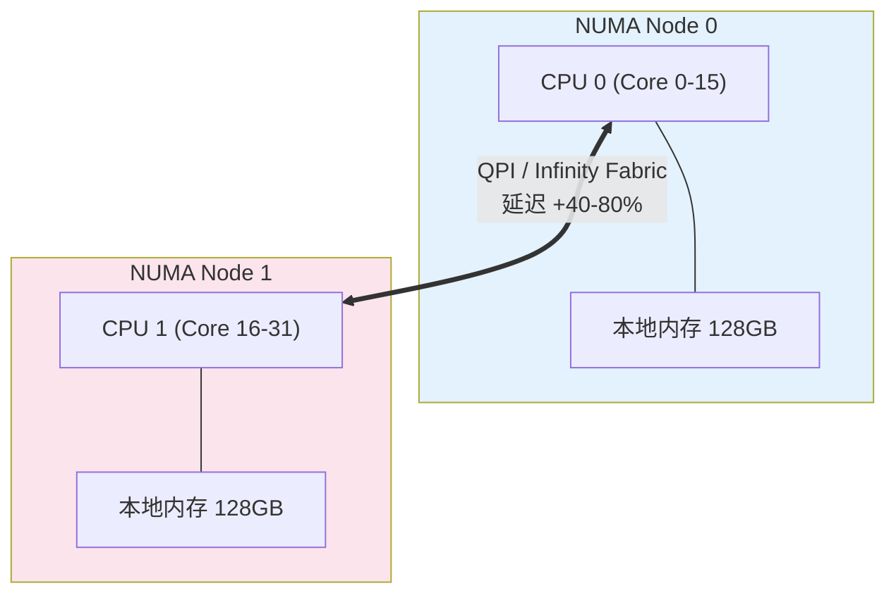
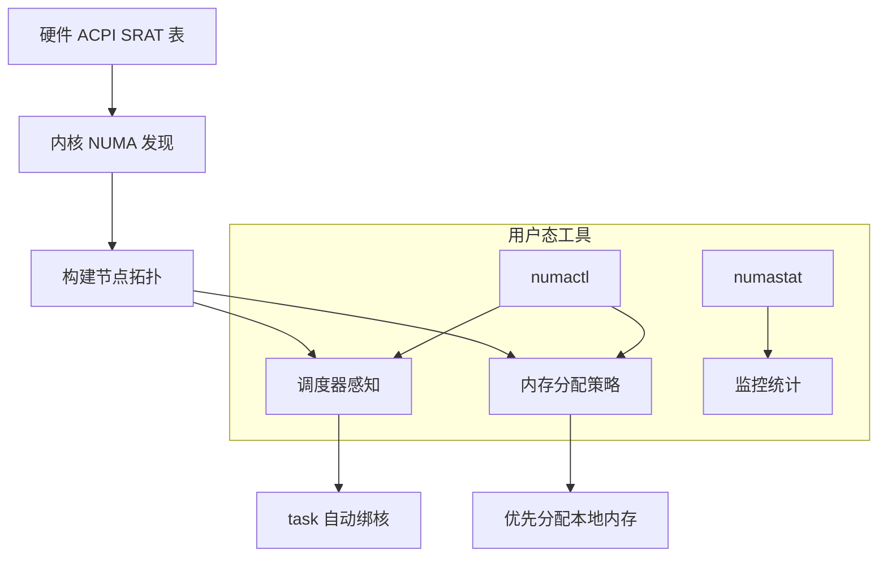
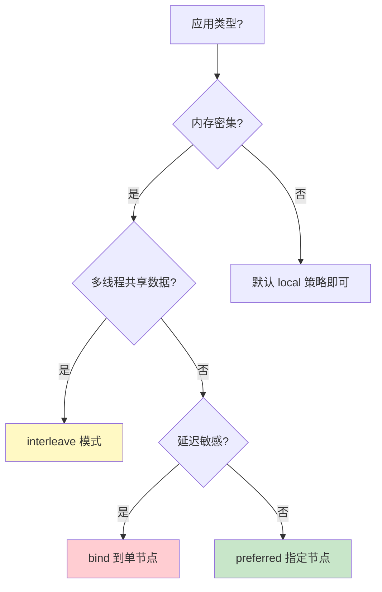

# NUMA 架构感知

> 100 天认知提升计划 | Day 22

---

## 核心概念

### 什么是 NUMA？

**NUMA（Non-Uniform Memory Access，非一致性内存访问）** 是现代多路服务器的内存架构模型。在 NUMA 系统中，每个 CPU（或 CPU 组）拥有自己的本地内存（Local Memory），访问本地内存的速度远快于访问其他 CPU 的远程内存（Remote Memory）。

**为什么需要 NUMA？**

传统的 UMA（Uniform Memory Access）架构中，所有 CPU 通过单一总线共享同一块内存。当 CPU 核数增加时，总线成为瓶颈。NUMA 通过将内存分散到各 CPU 节点，消除总线争用，实现水平扩展。

| 特性 | UMA (SMP) | NUMA |
|------|-----------|------|
| 内存访问延迟 | 一致（均匀） | 不一致（近快远慢） |
| 可扩展性 | 受总线带宽限制 | 理论上无限制 |
| 典型系统 | 消费级 PC、笔记本 | 多路服务器、大型主机 |
| 总线架构 | 单一前端总线 | QPI / Infinity Fabric |

### NUMA 拓扑结构



**关键术语**：

| 术语 | 说明 |
|------|------|
| **NUMA Node** | 包含 CPU + 本地内存的最小单元 |
| **Local Memory** | 当前 CPU 直接连接的内存，访问延迟最低 |
| **Remote Memory** | 需跨 QPI/IF 访问的其他节点内存 |
| **QPI** | Intel QuickPath Interconnect，节点间互联总线 |
| **Infinity Fabric** | AMD 的等效互联技术 |
| **NUMA Distance** | 节点间的相对距离，10 表示本地，20+ 表示远程 |

### Local vs Remote Memory 性能差异

| 操作 | Local Memory | Remote Memory | 差异 |
|------|-------------|---------------|------|
| 读取延迟 | ~80ns | ~130ns | **+60%** |
| 写入延迟 | ~80ns | ~140ns | **+75%** |
| 带宽 | ~50 GB/s | ~30 GB/s | **-40%** |
| cache line 获取 | 1 跳 | 2 跳（经互联） | 双倍跳数 |

> 💡 在 4 路服务器上，最远节点的延迟可达本地的 **2-3 倍**，对延迟敏感型应用影响显著。

---

## 技术架构

### Linux NUMA 支持

Linux 内核从 2.5 开始支持 NUMA，提供完整的拓扑发现和调度策略：



### 查看 NUMA 拓扑

```bash
# 查看系统 NUMA 拓扑
numactl --hardware

# 输出示例（双路服务器）：
# available: 2 nodes (0-1)
# node 0 cpus: 0 1 2 3 4 5 6 7 8 9 10 11 12 13 14 15
# node 0 size: 130946 MB
# node 1 cpus: 16 17 18 19 20 21 22 23 24 25 26 27 28 29 30 31
# node 1 size: 131072 MB

# 查看各节点的内存使用
numastat -s

# 使用 lscpu 查看
lscpu | grep -i numa
# NUMA node(s):        2
# NUMA node0 CPU(s):   0-15
# NUMA node1 CPU(s):   16-31
```

### CPU 亲和性（CPU Affinity）

CPU 亲和性决定进程/线程在哪些 CPU 核上运行，是 NUMA 优化的核心手段：

```c
#define _GNU_SOURCE
#include <sched.h>
#include <stdio.h>
#include <pthread.h>

void pin_to_node(int node_id) {
    cpu_set_t cpuset;
    CPU_ZERO(&cpuset);

    // 获取该节点的 CPU 列表
    int cpus_per_node = 16;  // 假设每节点 16 核
    int start = node_id * cpus_per_node;
    for (int i = start; i < start + cpus_per_node; i++) {
        CPU_SET(i, &cpuset);
    }

    // 绑定当前线程
    int ret = pthread_setaffinity_np(pthread_self(), sizeof(cpuset), &cpuset);
    if (ret != 0) {
        perror("pthread_setaffinity_np");
    }
}

int main() {
    // 将线程绑定到 NUMA Node 0
    pin_to_node(0);
    printf("Pinned to NUMA Node 0\n");
    return 0;
}
```

---

## numactl 详解

### 内存分配策略

| 策略 | 选项 | 说明 | 适用场景 |
|------|------|------|---------|
| **default** | `--preferred=node` | 优先分配指定节点，不够时溢出 | 通用场景 |
| **bind** | `--membind=nodes` | 严格绑定到指定节点，不够则失败 | 确定性要求高 |
| **interleave** | `--interleave=nodes` | 轮询分配到所有节点 | 均衡负载 |
| **local** | 默认行为 | 优先分配运行 CPU 的本地节点 | 大多数场景 |

```bash
# 在 Node 0 上运行，优先使用 Node 0 的内存
numactl --cpunodebind=0 --preferred=0 ./my_app

# 交织模式：均匀使用所有节点内存
numactl --interleave=all ./my_app

# 严格绑定到 Node 1
numactl --cpunodebind=1 --membind=1 ./my_app

# 查看进程的 NUMA 内存分布
numastat -p <pid>
```

### 策略选择指南



---

## 多路服务器优化实战

### 数据库服务器（MySQL/PostgreSQL）

```bash
# 双路服务器优化：每个 NUMA 节点跑一个实例
numactl --cpunodebind=0 --membind=0 \
    mysqld --port=3306 --datadir=/data/node0 &

numactl --cpunodebind=1 --membind=1 \
    mysqld --port=3307 --datadir=/data/node1 &
```

### 多线程编程最佳实践

```c
#define _GNU_SOURCE
#include <sched.h>
#include <numa.h>
#include <numaif.h>
#include <pthread.h>
#include <stdio.h>
#include <stdlib.h>

typedef struct {
    int node_id;
    size_t data_size;
    void *local_data;
} worker_arg_t;

void* numa_worker(void *arg) {
    worker_arg_t *warg = (worker_arg_t *)arg;

    // 1. 绑定到指定 NUMA 节点
    struct bitmask *mask = numa_allocate_nodemask();
    numa_bitmask_setbit(mask, warg->node_id);
    numa_bind(mask);
    numa_free_nodemask(mask);

    // 2. 在本地节点分配内存
    warg->local_data = numa_alloc_onnode(warg->data_size, warg->node_id);
    if (!warg->local_data) {
        perror("numa_alloc_onnode");
        return NULL;
    }

    printf("Worker on node %d, data at %p (local)\n",
           warg->node_id, warg->local_data);

    // ... 处理数据 ...

    numa_free(warg->local_data, warg->data_size);
    return NULL;
}

int main() {
    int num_nodes = numa_num_configured_nodes();
    printf("NUMA nodes: %d\n", num_nodes);

    pthread_t threads[num_nodes];
    worker_arg_t args[num_nodes];

    // 每个 NUMA 节点启动一个 worker 线程
    for (int i = 0; i < num_nodes; i++) {
        args[i].node_id = i;
        args[i].data_size = 1024 * 1024 * 256; // 256MB
        pthread_create(&threads[i], NULL, numa_worker, &args[i]);
    }

    for (int i = 0; i < num_nodes; i++) {
        pthread_join(threads[i], NULL);
    }
    return 0;
}
```

### 性能对比：感知 vs 不感知

使用 `numastat` 观察内存分布：

```bash
# 未优化的进程：大量远程内存访问
numastat -p my_app
#                  Node 0   Node 1   Total
# Hits            123456   876544  1000000
# Misses           0         0       0
# 经过优化后：本地访问为主
#                  Node 0   Node 1   Total
# Hits            498000   502000  1000000
```

| 场景 | 无 NUMA 感知 | NUMA 优化后 | 提升 |
|------|------------|------------|------|
| 内存带宽 | 30 GB/s | 48 GB/s | **+60%** |
| P99 延迟 | 120μs | 75μs | **-37%** |
| QPS | 250K | 380K | **+52%** |

---

## 实践任务

- [ ] 在 Linux 环境使用 `numactl --hardware` 查看系统 NUMA 拓扑
- [ ] 编写 C 程序，对比本地内存与远程内存的访问延迟（使用 `rdtsc` 计时）
- [ ] 使用 `numactl --interleave=all` 运行 Redis/MongoDB，对比默认模式的性能
- [ ] 编写多线程程序，每个线程绑定不同 NUMA 节点并使用本地内存
- [ ] 使用 `perf stat -e numa_*` 监控 NUMA 相关事件

---

## 关键收获

1. **架构认知**：NUMA 不是"问题"，而是多路服务器的必然选择；理解它才能用好它
2. **本地优先**：保持数据和工作线程在同一 NUMA 节点是最重要的优化原则
3. **工具先行**：`numactl`、`numastat`、`lscpu` 是诊断 NUMA 问题的三板斧
4. **策略选择**：延迟敏感用 bind，吞吐优先用 interleave，通用场景用 preferred
5. **框架支持**：现代框架（Netty、DPDK、SPDK）均内置 NUMA 感知，配置即可受益

---

## 参考资料

- [NUMA (Non-Uniform Memory Access): An Overview](https://queue.acm.org/detail.cfm?id=2512775) - ACM Queue
- [Linux NUMA Project](https://github.com/numactl/numactl) - numactl 源码与文档
- [NUMA Deep Dive Series](https://frankdenneman.nl/2016/07/13/numa-deep-dive-part-1-uds-numa/) - Frank Denneman 博客
- [NUMA Best Practices for Red Hat Enterprise Linux](https://access.redhat.com/documentation/en-us/red_hat_enterprise_linux/9/html/performing_a_rHEL_9_upgrade/numa) - Red Hat 官方
- [Intel® 64 and IA-32 Architectures Software Developer's Manual](https://www.intel.com/content/www/us/en/developer/articles/technical/intel-sdm.html) - 第三章内存层次
- [numa(3) man page](https://man7.org/linux/man-pages/man3/numa.3.html) - Linux NUMA API

---

*学习日期：2026-04-02*
