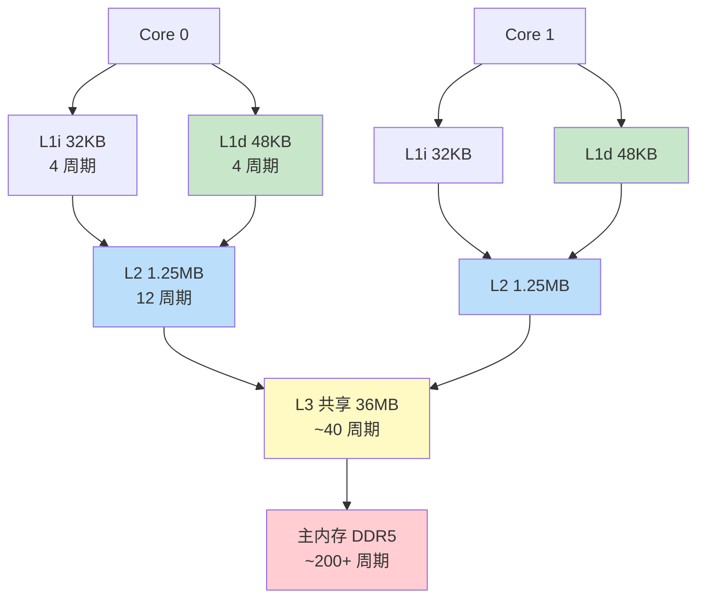
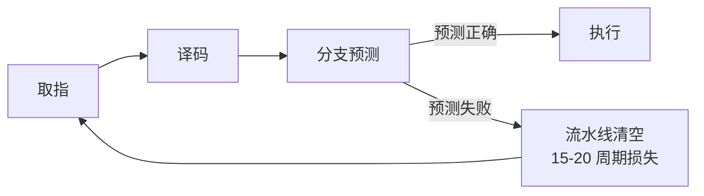

# CPU Cache 优化

> 100 天认知提升计划 | Day 23

---

## 核心概念

### CPU Cache 层次结构

现代 CPU 的 Cache 是多级层次结构，从快到慢、从小到大：



### 各级 Cache 参数（Apple M2 / Intel 13th Gen 对比）

| 参数 | L1 Data | L1 Instruction | L2 | L3 (LLC) | 主内存 |
|------|---------|---------------|-----|-----------|--------|
| **大小** | 48/32 KB | 32/32 KB | 1.25/2 MB | 36/36 MB | 16-64 GB |
| **延迟** | 4 周期 | 4 周期 | 12-14 周期 | 40-60 周期 | 200-300 周期 |
| **带宽** | ~2 TB/s | ~2 TB/s | ~1 TB/s | ~500 GB/s | ~50 GB/s |
| **归属** | 每核私有 | 每核私有 | 每核私有 | 所有核共享 | 全局 |

> 💡 **核心洞察**：L1 比 DRAM 快约 **50 倍**。一次 Cache Miss 的代价等价于执行 **200+ 条指令**。

---

## Cache Line：Cache 的基本单位

### 什么是 Cache Line？

Cache 不是按字节管理的，而是按 **Cache Line**（通常 64 字节）为单位读写。即使只读 1 字节，也会把整条 Cache Line（64B）加载进来。

```c
#include <stdio.h>
#include <stdint.h>

// 查看 Cache Line 大小
int main() {
    FILE *f = fopen("/sys/devices/system/cpu/cpu0/cache/index0/coherency_line_size", "r");
    int line_size;
    fscanf(f, "%d", &line_size);
    fclose(f);
    printf("Cache Line size: %d bytes\n", line_size); // 通常 64
    return 0;
}
```

### Cache Line 对性能的影响

```c
// 实验：步长遍历数组
#define SIZE (64 * 1024 * 1024) // 64MB
int arr[SIZE];

// 顺序访问 — Cache 友好
for (int i = 0; i < SIZE; i++) {
    arr[i] *= 3;  // 每次访问，整条 Cache Line 都在 L1
}

// 步长 16 访问 — 仍然 OK（同一 Cache Line 内）
for (int i = 0; i < SIZE; i += 16) {
    arr[i] *= 3;  // 16 个 int = 64B = 1 Cache Line，每个 line 只用一次
}

// 步长 64 访问 — Cache 不友好
for (int i = 0; i < SIZE; i += 64) {
    arr[i] *= 3;  // 每条 Cache Line 只用 1/4，浪费 75%
}
```

| 步长（int 元素） | 每 Cache Line 有效利用 | 相对性能 |
|------------------|----------------------|---------|
| 1（顺序） | 100%（16/16 元素） | **1.0x（基准）** |
| 4 | 100%（4/4 元素） | 1.0x |
| 16 | 100%（1/1 元素） | 1.0x |
| 32 | 50%（1/2 元素） | ~0.55x |
| 64 | 25%（1/4 元素） | ~0.30x |
| 128 | 12.5% | ~0.17x |

---

## 分支预测优化

### 现代 CPU 的分支预测

CPU 的流水线深度可达 15-20 级，分支预测失败会导致流水线清空，代价约 **15-20 周期**。



### 实验：有序 vs 无序数据的分支预测

```c
#include <stdio.h>
#include <stdlib.h>
#include <time.h>

#define SIZE (1024 * 1024 * 256)

int main() {
    int *data = malloc(SIZE * sizeof(int));
    long long sum = 0;
    clock_t start, end;

    // 填充随机数据
    srand(42);
    for (int i = 0; i < SIZE; i++) {
        data[i] = rand() % 256;
    }

    // 测试 1：无序数据（分支预测频繁失败）
    start = clock();
    for (int i = 0; i < SIZE; i++) {
        if (data[i] >= 128) sum += data[i];  // ~50% 概率，难以预测
    }
    end = clock();
    printf("Unsorted: %.3f sec, sum=%lld\n",
           (double)(end - start) / CLOCKS_PER_SEC, sum);

    // 排序后
    qsort(data, SIZE, sizeof(int), (int(*)(const void*, const void*))cmp);

    // 测试 2：有序数据（分支预测准确率接近 100%）
    start = clock();
    sum = 0;
    for (int i = 0; i < SIZE; i++) {
        if (data[i] >= 128) sum += data[i];  // 先全是 false，后全是 true
    }
    end = clock();
    printf("Sorted:   %.3f sec, sum=%lld\n",
           (double)(end - start) / CLOCKS_PER_SEC, sum);

    free(data);
    return 0;
}
```

**典型结果**：

| 数据状态 | 分支预测准确率 | 执行时间 | 差异 |
|---------|-------------|---------|------|
| 无序随机 | ~50-60% | ~4.2s | 基准 |
| 排序后 | ~99%+ | ~1.1s | **快 3-4 倍** |

### 无分支替代技巧

```c
// 方法 1：位运算消除分支
// if (x >= 128) sum += x;
// 等价于：
int mask = -(x >= 128);   // 条件为真时 mask = 0xFFFFFFFF，否则 0x00000000
sum += x & mask;

// 方法 2：条件移动（cmov）
// 编译器可能自动优化，也可手动：
sum += (x >= 128) ? x : 0;  // GCC/Clang 常编译为 cmov
```

---

## 顺序 vs 随机访问

### 内存访问模式对性能的影响

```c
#include <stdio.h>
#include <stdlib.h>
#include <time.h>
#include <stdint.h>

#define SIZE (64 * 1024 * 1024)  // 64M 元素 = 256MB

int main() {
    int *arr = malloc(SIZE * sizeof(int));

    // 顺序写入
    clock_t start = clock();
    for (int i = 0; i < SIZE; i++) {
        arr[i] = i;
    }
    double seq_time = (double)(clock() - start) / CLOCKS_PER_SEC;

    // 准备随机索引
    int *indices = malloc(SIZE * sizeof(int));
    for (int i = 0; i < SIZE; i++) indices[i] = i;
    // Fisher-Yates shuffle
    for (int i = SIZE - 1; i > 0; i--) {
        int j = rand() % (i + 1);
        int tmp = indices[i]; indices[i] = indices[j]; indices[j] = tmp;
    }

    // 随机访问写入
    start = clock();
    for (int i = 0; i < SIZE; i++) {
        arr[indices[i]] = i;
    }
    double rand_time = (double)(clock() - start) / CLOCKS_PER_SEC;

    printf("Sequential: %.3f s\n", seq_time);
    printf("Random:      %.3f s (%.1fx slower)\n",
           rand_time, rand_time / seq_time);

    free(arr);
    free(indices);
    return 0;
}
```

| 访问模式 | L1/L2 命中率 | 有效带宽 | 典型倍率 |
|---------|-------------|---------|---------|
| 顺序访问 | ~95%+ | 接近峰值 | **1.0x** |
| 步长 2 | ~90% | ~90% | ~1.2x |
| 步长 16 | ~60% | ~60% | ~2x |
| 随机访问 | <10% | 受限于 DRAM | **5-15x 慢** |

> 💡 **硬件预取器**（Hardware Prefetcher）能识别顺序/步长访问模式，提前将数据加载到 Cache。随机访问则完全无法预测。

---

## 数据结构布局优化

### AoS vs SoA

```c
// AoS (Array of Structures) — 面向对象的典型布局
struct Particle_AoS {
    float x, y, z;       // 位置 12B
    float vx, vy, vz;   // 速度 12B
    float r, g, b;       // 颜色 12B
    float mass;           // 质量 4B
};  // 共 40B

struct Particle_AoS particles[N];

// 只更新位置 — 但加载了整条 Cache Line 包含速度/颜色等无用数据
for (int i = 0; i < N; i++) {
    particles[i].x += particles[i].vx * dt;
    particles[i].y += particles[i].vy * dt;
    particles[i].z += particles[i].vz * dt;
}

// SoA (Structure of Arrays) — 数据导向布局
struct Particles_SoA {
    float x[N], y[N], z[N];     // 位置
    float vx[N], vy[N], vz[N]; // 速度
    float r[N], g[N], b[N];    // 颜色
    float mass[N];              // 质量
};

struct Particles_SoA ps;

// 只更新位置 — Cache Line 全是 x 坐标，利用率 100%
for (int i = 0; i < N; i++) {
    ps.x[i] += ps.vx[i] * dt;
    ps.y[i] += ps.vy[i] * dt;
    ps.z[i] += ps.vz[i] * dt;
}
```

| 布局 | Cache 利用率 | 向量化友好度 | 适用场景 |
|------|------------|------------|---------|
| **AoS** | 低（混合字段） | 差（需 gather/scatter） | 少量对象、频繁访问全部字段 |
| **SoA** | 高（连续同字段） | 优秀（SIMD 友好） | 批量处理、只操作部分字段 |
| **AoSoA** | 折中 | 好 | 最佳通用方案 |

### 结构体字段排序

```c
// ❌ 差：7 个字段填不满 2 条 Cache Line，且字段分散
struct Bad {
    char flag;       // 1B
    double value;    // 8B（需要 8B 对齐，前面填充 7B）
    char name[3];    // 3B
    int count;       // 4B
};
// sizeof = 24B（含 7B 填充），2 条 Cache Line 内放下 5 个 vs 8 个

// ✅ 好：按大小降序排列，最小化填充
struct Good {
    double value;    // 8B
    int count;       // 4B
    char name[3];    // 3B
    char flag;       // 1B
};
// sizeof = 16B（零填充），同样 2 条 Cache Line 能放 8 个
```

### 热冷数据分离

```c
// ❌ 热冷数据混在一起
struct User {
    int id;              // 热：频繁读取
    char name[64];       // 冷：偶尔显示
    char email[128];     // 冷：偶尔显示
    int login_count;     // 热：频繁更新
    char bio[512];       // 冷：几乎不访问
};

// ✅ 热数据单独结构，冷数据指针引用
struct UserHot {
    int id;
    int login_count;
    struct UserCold *cold;  // 指针，8B
};

struct UserCold {
    char name[64];
    char email[128];
    char bio[512];
};
```

> 热数据结构仅 16B，一条 Cache Line 可放 4 个 UserHot。原来混合结构 ~704B，一条 Line 只放不到 1/10。

---

## 性能分析工具

```bash
# 1. perf 查看 Cache Miss
perf stat -e cache-references,cache-misses,L1-dcache-load-misses \
    ./my_app

# 2. perf record 热点分析
perf record -g ./my_app
perf report

# 3. cachegrind（Valgrind 工具）
valgrind --tool=cachegrind ./my_app
# 输出：I1/D1/L2 的命中率和 miss 数

# 4. 查看 CPU Cache 信息
lscpu | grep -i cache
# L1d cache:       48K
# L1i cache:       32K
# L2 cache:        1280K
# L3 cache:        36608K
```

---

## 实践任务

- [ ] 编写 C 程序，用 `__builtin_expect` 和无分支位运算对比分支预测优化的效果
- [ ] 实现数组步长遍历测试，绘制"步长 vs 延迟"图表，观察 L1/L2/L3 的边界
- [ ] 将一个 AoS 结构重构为 SoA，用 `perf stat` 对比 Cache Miss 率
- [ ] 使用 `valgrind --tool=cachegrind` 分析一个真实项目的 Cache 行为
- [ ] 实现热冷数据分离，测量对排序/搜索密集操作的性能影响

---

## 关键收获

1. **Cache Line 是原子单位**：理解 64B 对齐是 Cache 优化的起点
2. **顺序 > 随机**：硬件预取器是最好的朋友，保持访问模式可预测
3. **分支预测代价高**：对热路径的不可预测分支，考虑无分支替代
4. **数据布局决定性能**：SoA 适合批量计算，热冷分离减少 Cache 污染
5. **量化先行**：先用 `perf` / `cachegrind` 测量，再优化；过早优化是万恶之源，但有数据支撑的优化是美德

---

## 参考资料

- [What Every Programmer Should Know About Memory](https://people.freebsd.org/~lstewart/articles/cpumemory.pdf) - Ulrich Drepper 经典论文
- [Gallery of Processor Cache Effects](https://igoro.com/archive/gallery-of-processor-cache-effects/) - Igor Ostrovsky 经典博客
- [CPU Caches and Why You Care](https://www.aristeia.com/TalkNotes/codedive-CPUCachesHandouts.pdf) - Scott Meyers 演讲
- [Data-Oriented Design](https://www.dataorienteddesign.com/dodbook/) - Richard Fabian 书籍
- [perf(1) Tutorial](https://perf.wiki.kernel.org/index.php/Tutorial) - Linux perf 官方教程
- [Intel® 64 and IA-32 Optimization Manual](https://www.intel.com/content/www/us/en/developer/articles/technical/intel-sdm.html) - 第 2 卷优化指南

---

*学习日期：2026-04-03*
