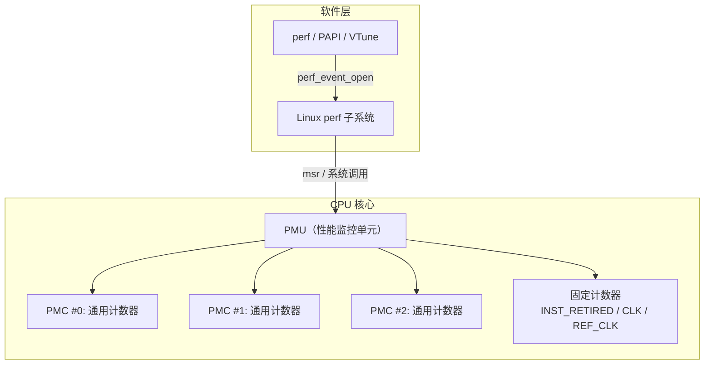
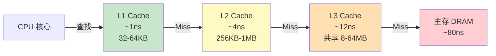
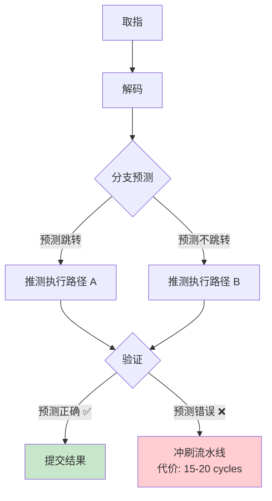
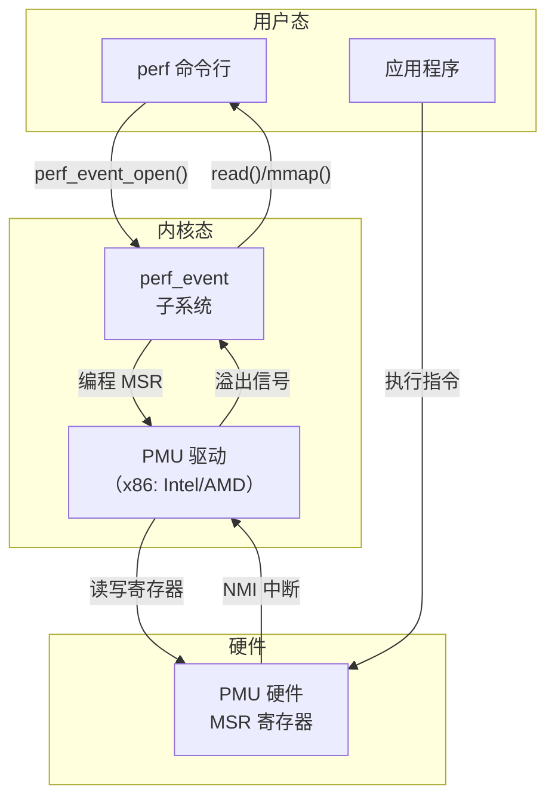

# 性能计数器 PMC

> 100 天认知提升计划 | Day 24

---

## 核心概念

### 什么是性能监控计数器（PMC）？

**PMC（Performance Monitoring Counter）** 是现代 CPU 内置的硬件寄存器，用于在运行时统计微架构级别的事件，如指令执行数、缓存命中/未命中、分支预测成败、TLB 未命中等。它们是性能分析和调优的"底层眼睛"。



### 为什么需要 PMC？

| 场景 | 传统方法的问题 | PMC 的优势 |
|------|---------------|-----------|
| 性能热点定位 | 只能看 CPU% 用量 | 能区分是计算密集还是访存密集 |
| 缓存优化 | 不知道 miss rate | 精确统计 L1/L2/L3 miss |
| 分支预测 | 无法量化 | 直接读取 misprediction 数 |
| 锁争用 | 只知有锁 | 知道自旋等待了多少周期 |
| NUMA 效应 | 难以测量 | 统计远程内存访问次数 |

### 关键微架构事件

| 事件 | 含义 | 公式/用途 |
|------|------|----------|
| `instructions` | 退役指令数 | IPC = instructions / cycles |
| `cycles` | CPU 周期数 | 衡量总耗时 |
| `cache-references` | 缓存引用次数 | — |
| `cache-misses` | 缓存未命中次数 | Miss Rate = misses / references |
| `branch-misses` | 分支预测失败次数 | Mispred Rate = misses / branches |
| `branch-instructions` | 分支指令数 | — |
| `dTLB-loads` | 数据 TLB 加载 | — |
| `dTLB-load-misses` | 数据 TLB 未命中 | TLB Miss Rate |
| `L1-dcache-loads` | L1 数据缓存加载 | — |
| `L1-dcache-load-misses` | L1 数据缓存未命中 | L1 Miss Rate |

---

## 核心指标详解

### 1. IPC（Instructions Per Cycle）

$$IPC = \frac{\text{instructions retired}}{\text{CPU cycles}}$$

| IPC 范围 | 含义 | 典型场景 |
|----------|------|----------|
| < 0.5 | 严重瓶颈 | 频繁 cache miss / 页错误 |
| 0.5 ~ 1.0 | 有瓶颈 | 内存密集型或分支密集 |
| 1.0 ~ 2.0 | 较好 | 一般计算任务 |
| > 2.0 | 优秀 | 向量化、流水线充分利用 |

```c
// 计算 IPC 的示例
#include <stdio.h>
#include <perfmon/pfmlib.h>

void compute_ipc() {
    // 通过 perf_event_open 读取 instructions 和 cycles
    // perf stat -e instructions,cycles ./your_program
    // IPC = instructions / cycles
}
```

### 2. Cache Miss Rate

$$\text{Cache Miss Rate} = \frac{\text{cache misses}}{\text{cache references}} \times 100\%$$



| 缓存层级 | 典型命中率 | Miss 惩罚 | 优化策略 |
|----------|-----------|----------|----------|
| L1 | > 95% | ~4 cycles | 数据对齐、缓存行填充 |
| L2 | > 90% | ~12 cycles | 分块（tiling）、预取 |
| L3 | > 85% | ~40 cycles | NUMA 感知、数据局部性 |
| 主存 | — | ~200+ cycles | 减少工作集、压缩 |

#### 实际测量

```bash
# 测量 L1 数据缓存 miss rate
perf stat -e L1-dcache-loads,L1-dcache-load-misses ./your_program

# 测量最后一级缓存（LLC）miss rate
perf stat -e LLC-loads,LLC-load-misses ./your_program

# 输出示例：
#   1,234,567  L1-dcache-loads
#      12,345  L1-dcache-load-misses  # ≈ 1.0% miss rate ✅
```

### 3. Branch Misprediction

现代 CPU 使用分支预测器（Branch Predictor）来填充流水线。预测失败需要冲刷流水线，代价约 15-20 个 cycle。



```c
// 分支预测友好 vs 不友好的代码

// ❌ 分支预测不友好：随机数据，预测率约 50%
void sum_positive_random(int *arr, int n, int *result) {
    *result = 0;
    for (int i = 0; i < n; i++) {
        if (arr[i] > 0)       // 随机正负，分支预测 ~50%
            *result += arr[i];
    }
}

// ✅ 分支预测友好：先排序，预测率接近 100%
void sum_positive_sorted(int *arr, int n, int *result) {
    qsort(arr, n, sizeof(int), cmp_int);  // 先排序
    *result = 0;
    for (int i = 0; i < n; i++) {
        if (arr[i] > 0)       // 排序后，连续正/负，预测率极高
            *result += arr[i];
    }
}

// ✅✅ 无分支：彻底消除分支
void sum_positive_branchless(int *arr, int n, int *result) {
    *result = 0;
    for (int i = 0; i < n; i++) {
        *result += arr[i] * (arr[i] > 0);  // 无分支
    }
}
```

#### 性能对比

```bash
# 测量分支预测
perf stat -e branches,branch-misses ./benchmark_branch

# 典型结果对比：
# 随机数据:  branch-misses: 24.8%  → 慢 3-5x
# 排序数据:  branch-misses:  0.3%  → 快
# 无分支版:  branch-misses:  0.0%  → 最快
```

### 4. TLB Miss

**TLB（Translation Lookaside Buffer）** 缓存虚拟地址到物理地址的映射。TLB miss 会触发页表遍历（Page Table Walk），代价高昂。

| TLB 类型 | 条目数（典型） | 覆盖范围 | Miss 代价 |
|----------|--------------|----------|----------|
| L1 ITLB | 64 | 指令翻译 | ~10 cycles |
| L1 DTLB | 64 | 数据翻译 | ~10 cycles |
| L2 STLB | 1536 | 共享 | ~30 cycles |
| Page Walk | — | 4 级页表 | ~100+ cycles |

```c
// 大页（Huge Pages）减少 TLB miss
#include <sys/mman.h>

// 使用 2MB 大页，一个 TLB 条目覆盖 2MB（而非 4KB）
void *buf = mmap(NULL, size, PROT_READ | PROT_WRITE,
                 MAP_PRIVATE | MAP_ANONYMOUS | MAP_HUGETLB, -1, 0);

// 也可以使用透明大页（THP）
// echo always > /sys/kernel/mm/transparent_hugepage/enabled
```

---

## perf stat 详解

### 基本用法

```bash
# 基础统计（最常用）
perf stat ./your_program

# 指定事件
perf stat -e cycles,instructions,cache-references,cache-misses,branch-misses ./your_program

# 附加到运行中的进程
perf stat -p <pid>

# 系统级统计（所有 CPU）
perf stat -a sleep 10
```

### 输出解读

```
 Performance counter stats for './matrix_multiply':

      3,456,789,012  cycles                    #    3.457 GHz
      5,678,901,234  instructions              #    1.64  insn per cycle
        123,456,789  cache-references          #   35.713 M/sec
         12,345,678  cache-misses              #   10.00% of all cache refs
          1,234,567  branch-misses             #    0.52% of all branches

       1.002345678 seconds time elapsed
```

| 字段 | 含义 | 分析方向 |
|------|------|----------|
| cycles | 总周期 | 基础耗时指标 |
| instructions | 总指令数 | 与 cycles 算 IPC |
| insn per cycle | IPC | <1.0 需关注访存瓶颈 |
| cache-misses % | 缓存未命中率 | >5% 需优化数据访问 |
| branch-misses % | 分支预测失败率 | >2% 需考虑排序或无分支 |

### 高级选项

```bash
# 重复运行 N 次取统计
perf stat -r 5 ./your_program

# 按进程/线程分组显示
perf stat -I 1000 -e cycles,instructions ./your_program  # 每秒输出

# 硬件断点
perf stat -e mem_loads,mem_stores ./your_program

# 列出所有可用事件
perf list

# 列出可用的硬件事件
perf list hw
```

### 自定义事件组合

```bash
# 完整的性能分析事件集
perf stat -e \
  cycles,\
  instructions,\
  cache-references,\
  cache-misses,\
  L1-dcache-loads,\
  L1-dcache-load-misses,\
  LLC-loads,\
  LLC-load-misses,\
  dTLB-loads,\
  dTLB-load-misses,\
  branches,\
  branch-misses,\
  bus-cycles \
  ./your_program
```

### perf 与 PMU 架构的关系



---

## 实战：性能分析工作流

### Step 1: 先看全局

```bash
perf stat ./your_program
```

关注 IPC、cache-miss%、branch-miss%。

### Step 2: 定位热点函数

```bash
perf record -g ./your_program
perf report
```

### Step 3: 针对性优化

| 症状 | 可能原因 | 优化方向 |
|------|----------|----------|
| IPC < 0.5 | 内存瓶颈 | 数据结构重排、缓存友好的访问模式 |
| L1 miss > 10% | 缓存行对齐问题 | `__attribute__((aligned(64)))` |
| LLC miss > 5% | 工作集太大 | 分块（blocking/tiling） |
| Branch miss > 2% | 不可预测分支 | 排序数据、位运算替代 |
| TLB miss 高 | 大量小页 | 大页（Huge Pages） |

### Step 4: 验证优化效果

```bash
# Before
perf stat -e cycles,instructions,cache-misses,branch-misses ./your_program_v1

# After
perf stat -e cycles,instructions,cache-misses,branch-misses ./your_program_v2
```

---

## 代码示例：使用 perf_event_open 编程

```c
#define _GNU_SOURCE
#include <stdio.h>
#include <stdlib.h>
#include <string.h>
#include <unistd.h>
#include <sys/syscall.h>
#include <linux/perf_event.h>
#include <asm/unistd.h>

static long perf_event_open(struct perf_event_attr *hw_event, pid_t pid,
                            int cpu, int group_fd, unsigned long flags) {
    return syscall(__NR_perf_event_open, hw_event, pid, cpu, group_fd, flags);
}

int main() {
    struct perf_event_attr pe;
    int fd_cycles, fd_instructions;
    long long cycles_start, cycles_end, inst_start, inst_end;

    // 配置 cycles 事件
    memset(&pe, 0, sizeof(pe));
    pe.type = PERF_TYPE_HARDWARE;
    pe.size = sizeof(pe);
    pe.config = PERF_COUNT_HW_CPU_CYCLES;
    pe.disabled = 1;
    pe.exclude_kernel = 1;
    pe.exclude_hv = 1;

    fd_cycles = perf_event_open(&pe, 0, -1, -1, 0);
    if (fd_cycles == -1) {
        perror("perf_event_open cycles");
        exit(1);
    }

    // 配置 instructions 事件
    pe.config = PERF_COUNT_HW_INSTRUCTIONS;
    fd_instructions = perf_event_open(&pe, 0, -1, -1, 0);
    if (fd_instructions == -1) {
        perror("perf_event_open instructions");
        exit(1);
    }

    // 开始计数
    ioctl(fd_cycles, PERF_EVENT_IOC_RESET, 0);
    ioctl(fd_instructions, PERF_EVENT_IOC_RESET, 0);
    ioctl(fd_cycles, PERF_EVENT_IOC_ENABLE, 0);
    ioctl(fd_instructions, PERF_EVENT_IOC_ENABLE, 0);

    // === 你的代码 ===
    volatile int sum = 0;
    for (int i = 0; i < 10000000; i++) {
        sum += i;
    }

    // 停止计数
    ioctl(fd_cycles, PERF_EVENT_IOC_DISABLE, 0);
    ioctl(fd_instructions, PERF_EVENT_IOC_DISABLE, 0);

    // 读取结果
    read(fd_cycles, &cycles_end, sizeof(cycles_end));
    read(fd_instructions, &inst_end, sizeof(inst_end));

    printf("Cycles:       %lld\n", cycles_end);
    printf("Instructions: %lld\n", inst_end);
    printf("IPC:          %.4f\n", (double)inst_end / cycles_end);

    close(fd_cycles);
    close(fd_instructions);
    return 0;
}
```

---

## 性能对比：排序 vs 无排序 vs 无分支

```c
// benchmark.c — 编译: gcc -O2 -o bench benchmark.c
#include <stdio.h>
#include <stdlib.h>
#include <time.h>

#define N 100000000

int cmp(const void *a, const void *b) { return *(int*)a - *(int*)b; }

// 测量各版本运行时间
int main() {
    int *data = malloc(N * sizeof(int));
    srand(42);
    for (int i = 0; i < N; i++) data[i] = rand() % 256 - 128;

    clock_t start, end;

    // 版本1: 随机数据 + if
    start = clock();
    long sum1 = 0;
    for (int i = 0; i < N; i++) if (data[i] > 0) sum1 += data[i];
    end = clock();
    printf("Random + if:       %f sec, sum=%ld\n", (double)(end-start)/CLOCKS_PER_SEC, sum1);

    // 版本2: 排序后 + if
    qsort(data, N, sizeof(int), cmp);
    start = clock();
    long sum2 = 0;
    for (int i = 0; i < N; i++) if (data[i] > 0) sum2 += data[i];
    end = clock();
    printf("Sorted + if:       %f sec, sum=%ld\n", (double)(end-start)/CLOCKS_PER_SEC, sum2);

    // 版本3: 无分支
    start = clock();
    long sum3 = 0;
    for (int i = 0; i < N; i++) sum3 += data[i] * (data[i] > 0);
    end = clock();
    printf("Branchless:        %f sec, sum=%ld\n", (double)(end-start)/CLOCKS_PER_SEC, sum3);

    free(data);
    return 0;
}
```

```bash
# 运行 perf stat 对比
perf stat -e cycles,instructions,branches,branch-misses ./bench

# 典型输出：
# Random + if:    ~0.30s  branch-misses: ~25%
# Sorted + if:    ~0.09s  branch-misses: ~0.3%
# Branchless:     ~0.08s  branch-misses: 0%
```

---

## 实践任务

- [ ] 使用 `perf stat` 分析一个你写的程序，记录 IPC、cache-miss%、branch-miss%
- [ ] 使用 `perf_event_open` 编程读取 cycles 和 instructions，计算 IPC
- [ ] 编写分支预测优化 benchmark：对比随机数据 vs 排序数据 vs 无分支版本
- [ ] 测量大页（Huge Pages）对 TLB miss 的影响
- [ ] 使用 `perf record -g` + `perf report` 定位一个程序的热点函数
- [ ] 尝试 `perf top` 实时监控系统中所有进程的性能事件

---

## 关键收获

1. **PMC 是底层性能分析的基石**：没有硬件计数器，性能优化就像蒙着眼睛射击
2. **IPC 是第一指标**：低于 1.0 意味着 CPU 在等待（通常是等内存）
3. **Cache Miss 是性能杀手**：一次 L3 miss ≈ 40 cycles ≈ 主存访问 80ns
4. **分支预测失败代价高昂**：15-20 cycles 的流水线冲刷，数据排序可显著改善
5. **TLB Miss 常被忽视**：大页是最简单有效的优化手段之一
6. **perf stat 是最实用的工具**：一行命令即可获得全面的微架构视角

---

## 参考资料

- [Linux perf Wiki](https://perf.wiki.kernel.org/)
- [Intel 64 and IA-32 Architectures SDM, Vol 3B - Performance Monitoring](https://www.intel.com/content/www/us/en/developer/articles/technical/intel-sdm.html)
- [perf_event_open(2) man page](https://man7.org/linux/man-pages/man2/perf_event_open.2.html)
- [Brendan Gregg - perf Examples](http://www.brendangregg.com/perf.html)
- [Understanding the Linux perf stat output](https://easyperf.net/notes/2018/07/30/Understanding-perf-stat-output)

---

*学习日期：2026-04-04*
