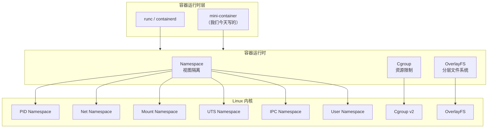
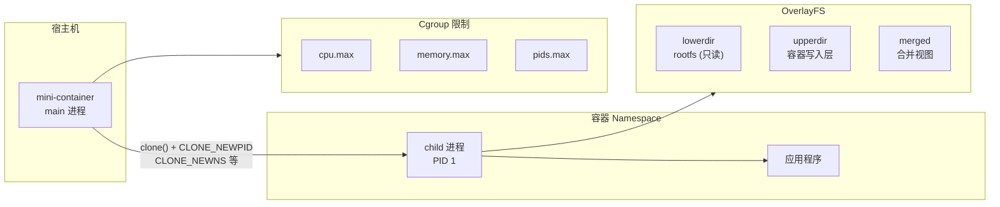
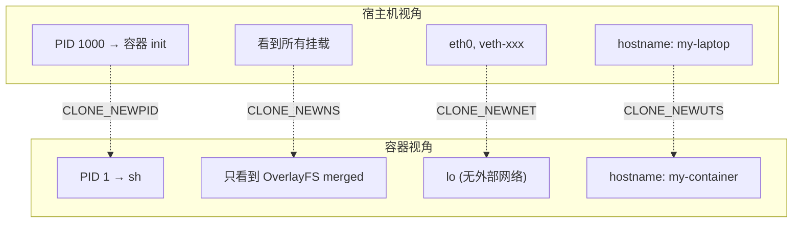
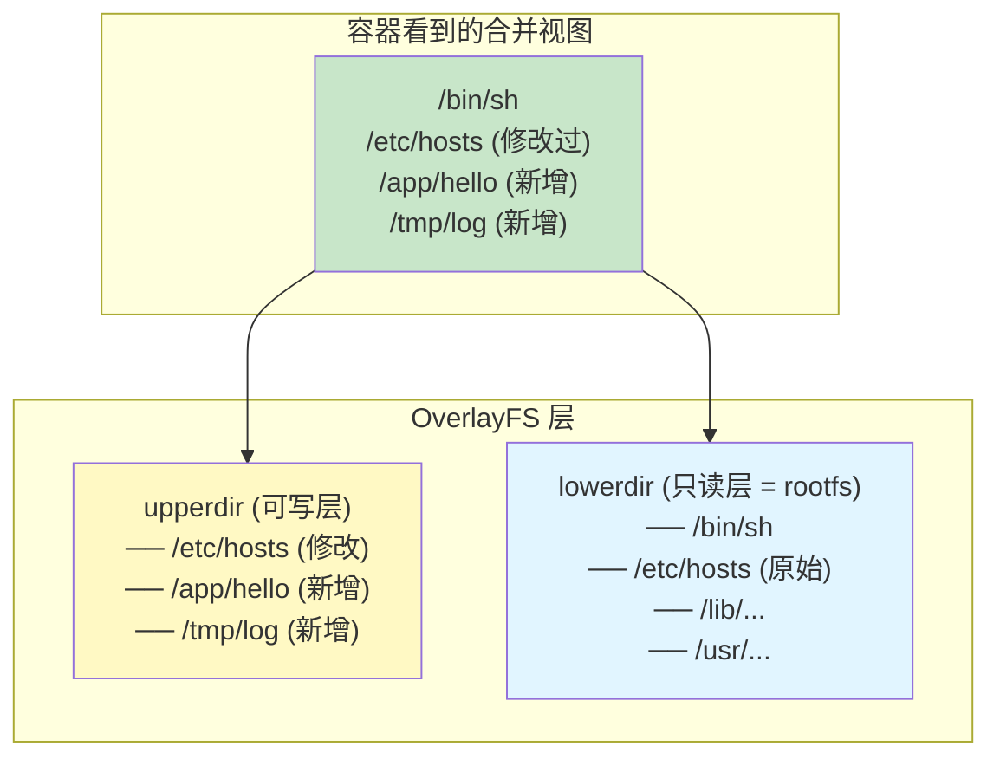

# 手写简易 Container

> 100 天认知提升计划 | Day 25

---

## 核心概念

### 容器是什么？

容器本质上是**一组 Linux 内核特性的组合应用**：Namespace 提供隔离、Cgroup 提供限制、OverlayFS 提供分层文件系统。Docker、containerd、runc 等工具都是围绕这三个核心构建的。



### 容器 vs 虚拟机

| 特性 | 容器 | 虚拟机 |
|------|------|--------|
| 隔离级别 | 进程级（共享内核） | 硬件级（独立内核） |
| 启动速度 | 毫秒级 | 秒级 |
| 镜像大小 | MB 级 | GB 级 |
| 性能损耗 | 接近原生 | 5-15% |
| 安全性 | 较弱（内核共享） | 较强（硬件隔离） |

---

## 架构设计

### mini-container 整体架构



---

## 完整实现（Go 语言）

### 项目结构

```
mini-container/
├── main.go           # 入口 + CLI
├── container.go      # 容器创建与管理
├── cgroup.go         # Cgroup 资源限制
├── filesystem.go     # OverlayFS 文件系统
├── network.go        # 网络配置
└── rootfs/           # 最小根文件系统
```

### main.go — 入口

```go
package main

import (
	"fmt"
	"os"
)

const (
	usage = `mini-container - 一个简易容器运行时

用法:
  mini-container run [选项] <command> [args...]

选项:
  -rootfs string    根文件系统路径 (默认 "rootfs")
  -cpus string      CPU 限额 (例如 "10000" = 1 核的 10%)
  -memory string    内存限额 (例如 "256M")
  -pids string      最大进程数 (例如 "100")
  -hostname string  容器主机名 (默认 "mini-container")
  -network          是否启用网络 namespace

示例:
  mini-container run -memory 256M -cpus 10000 /bin/sh
`
)

func main() {
	if len(os.Args) < 2 {
		fmt.Print(usage)
		os.Exit(1)
	}

	switch os.Args[1] {
	case "run":
		if err := runContainer(); err != nil {
			fmt.Fprintf(os.Stderr, "错误: %v\n", err)
			os.Exit(1)
		}
	case "exec":
		// 容器内部执行（child 进程入口）
		if err := execInContainer(); err != nil {
			fmt.Fprintf(os.Stderr, "错误: %v\n", err)
			os.Exit(1)
		}
	default:
		fmt.Print(usage)
		os.Exit(1)
	}
}
```

### container.go — 容器核心

```go
package main

import (
	"fmt"
	"os"
	"os/exec"
	"syscall"
)

type ContainerConfig struct {
	Rootfs   string
	Cpus     string
	Memory   string
	Pids     string
	Hostname string
	Network  bool
	Cmd      []string
}

func runContainer() error {
	// 解析参数（简化版，实际可用 flag 包）
	config := parseArgs()

	// 检查 rootfs
	if _, err := os.Stat(config.Rootfs); os.IsNotExist(err) {
		return fmt.Errorf("rootfs 不存在: %s", config.Rootfs)
	}

	// 准备 OverlayFS
	mergedDir, upperDir, workDir, err := setupOverlayFS(config.Rootfs)
	if err != nil {
		return fmt.Errorf("设置 OverlayFS 失败: %w", err)
	}
	defer cleanupOverlayFS(mergedDir, upperDir, workDir)

	// 准备 Cgroup
	cgroupPath, err := setupCgroup(config)
	if err != nil {
		return fmt.Errorf("设置 Cgroup 失败: %w", err)
	}
	defer cleanupCgroup(cgroupPath)

	// 准备子进程参数
	// 使用 /proc/self/exe exec 重新进入自身，在 child 模式下运行
	childArgs := []string{"exec",
		"-rootfs", mergedDir,
		"-hostname", config.Hostname,
	}
	childArgs = append(childArgs, config.Cmd...)

	cmd := exec.Command("/proc/self/exe", childArgs...)

	// 设置 Namespace 标志
	cmd.SysProcAttr = &syscall.SysProcAttr{
		Cloneflags: syscall.CLONE_NEWUTS |  // 主机名隔离
			syscall.CLONE_NEWPID |           // PID 隔离
			syscall.CLONE_NEWNS |            // Mount 隔离
			syscall.CLONE_NEWIPC,            // IPC 隔离
		// syscall.CLONE_NEWNET,            // 网络隔离（可选）
		// syscall.CLONE_NEWUSER,           // 用户隔离（可选）
	}

	cmd.Stdin = os.Stdin
	cmd.Stdout = os.Stdout
	cmd.Stderr = os.Stderr

	return cmd.Run()
}

func execInContainer() error {
	// 在子进程中执行 —— 此时已在新的 namespace 中
	config := parseArgs()

	// 1. 设置主机名
	if err := syscall.Sethostname([]byte(config.Hostname)); err != nil {
		return fmt.Errorf("设置主机名失败: %w", err)
	}

	// 2. mount proc（新的 PID namespace 需要）
	if err := syscall.Mount("proc", "proc", "proc", 0, ""); err != nil {
		// 先确保目标目录存在
		procPath := config.Rootfs + "/proc"
		os.MkdirAll(procPath, 0755)
		if err := syscall.Mount("proc", procPath, "proc", 0, ""); err != nil {
			return fmt.Errorf("挂载 proc 失败: %w", err)
		}
	}

	// 3. chroot 到 rootfs
	if err := syscall.Chroot(config.Rootfs); err != nil {
		return fmt.Errorf("chroot 失败: %w", err)
	}

	// 4. 切换到根目录
	if err := syscall.Chdir("/"); err != nil {
		return fmt.Errorf("chdir 失败: %w", err)
	}

	// 5. 设置环境变量
	os.Setenv("PATH", "/bin:/sbin:/usr/bin:/usr/sbin")
	os.Setenv("TERM", "xterm")
	os.Setenv("HOME", "/root")
	os.Setenv("HOSTNAME", config.Hostname)

	// 6. 执行用户命令
	binary, err := exec.LookPath(config.Cmd[0])
	if err != nil {
		return fmt.Errorf("命令未找到: %s", config.Cmd[0])
	}

	return syscall.Exec(binary, config.Cmd, os.Environ())
}

func parseArgs() *ContainerConfig {
	config := &ContainerConfig{
		Rootfs:   "rootfs",
		Hostname: "mini-container",
		Cmd:      []string{"/bin/sh"},
	}

	// 简化参数解析
	args := os.Args[2:]
	for i := 0; i < len(args); i++ {
		switch args[i] {
		case "-rootfs":
			i++; config.Rootfs = args[i]
		case "-cpus":
			i++; config.Cpus = args[i]
		case "-memory":
			i++; config.Memory = args[i]
		case "-pids":
			i++; config.Pids = args[i]
		case "-hostname":
			i++; config.Hostname = args[i]
		case "-network":
			config.Network = true
		default:
			config.Cmd = args[i:]
			i = len(args)
		}
	}
	return config
}
```

### cgroup.go — Cgroup 资源限制

```go
package main

import (
	"fmt"
	"os"
	"path/filepath"
	"strconv"
)

const cgroupBasePath = "/sys/fs/cgroup"

type CgroupConfig struct {
	Cpus   string // cpu.max
	Memory string // memory.max
	Pids   string // pids.max
}

func setupCgroup(containerConfig *ContainerConfig) (string, error) {
	cgroupName := fmt.Sprintf("mini-container-%d", os.Getpid())
	cgroupPath := filepath.Join(cgroupBasePath, cgroupName)

	// 创建 cgroup 目录（cgroup v2 方式）
	if err := os.MkdirAll(cgroupPath, 0755); err != nil {
		return "", fmt.Errorf("创建 cgroup 目录失败: %w", err)
	}

	// 设置 CPU 限制
	if containerConfig.Cpus != "" {
		if err := os.WriteFile(
			filepath.Join(cgroupPath, "cpu.max"),
			[]byte(containerConfig.Cpus),
			0644,
		); err != nil {
			return cgroupPath, fmt.Errorf("设置 CPU 限制失败: %w", err)
		}
	}

	// 设置内存限制
	if containerConfig.Memory != "" {
		if err := os.WriteFile(
			filepath.Join(cgroupPath, "memory.max"),
			[]byte(containerConfig.Memory),
			0644,
		); err != nil {
			return cgroupPath, fmt.Errorf("设置内存限制失败: %w", err)
		}
	}

	// 设置 PID 限制
	if containerConfig.Pids != "" {
		if err := os.WriteFile(
			filepath.Join(cgroupPath, "pids.max"),
			[]byte(containerConfig.Pids),
			0644,
		); err != nil {
			return cgroupPath, fmt.Errorf("设置 PID 限制失败: %w", err)
		}
	}

	// 将当前进程加入 cgroup
	pid := strconv.Itoa(os.Getpid())
	if err := os.WriteFile(
		filepath.Join(cgroupPath, "cgroup.procs"),
		[]byte(pid),
		0644,
	); err != nil {
		return cgroupPath, fmt.Errorf("加入 cgroup 失败: %w", err)
	}

	return cgroupPath, nil
}

func cleanupCgroup(cgroupPath string) {
	// 将进程移回根 cgroup
	procs, _ := os.ReadFile(filepath.Join(cgroupPath, "cgroup.procs"))
	if len(procs) > 0 {
		os.WriteFile(filepath.Join(cgroupBasePath, "cgroup.procs"), procs, 0644)
	}
	os.RemoveAll(cgroupPath)
}
```

### filesystem.go — OverlayFS 分层文件系统

```go
package main

import (
	"fmt"
	"os"
	"path/filepath"
	"syscall"
)

func setupOverlayFS(rootfs string) (merged, upper, work string, err error) {
	// 创建 OverlayFS 所需目录
	base := filepath.Join(os.TempDir(), fmt.Sprintf("mini-container-%d", os.Getpid()))
	merged = filepath.Join(base, "merged")
	upper = filepath.Join(base, "upper")
	work = filepath.Join(base, "work")

	for _, dir := range []string{merged, upper, work} {
		if err := os.MkdirAll(dir, 0755); err != nil {
			return "", "", "", fmt.Errorf("创建目录 %s 失败: %w", dir, err)
		}
	}

	// 获取 rootfs 的绝对路径
	absRootfs, err := filepath.Abs(rootfs)
	if err != nil {
		return "", "", "", err
	}

	// 构建 OverlayFS mount 选项
	// lowerdir=只读层 upperdir=可写层 workdir=工作目录
	options := fmt.Sprintf("lowerdir=%s,upperdir=%s,workdir=%s",
		absRootfs, upper, work)

	// 挂载 OverlayFS
	if err := syscall.Mount("overlay", merged, "overlay", 0, options); err != nil {
		return "", "", "", fmt.Errorf("挂载 OverlayFS 失败: %w", err)
	}

	// 在 merged 中准备必要的目录
	for _, dir := range []string{"proc", "dev", "sys", "tmp"} {
		os.MkdirAll(filepath.Join(merged, dir), 0755)
	}

	return merged, upper, work, nil
}

func cleanupOverlayFS(merged, upper, work string) {
	// 卸载 OverlayFS
	syscall.Unmount(merged, 0)

	// 清理临时目录
	base := filepath.Dir(merged)
	os.RemoveAll(base)
}
```

### network.go — 网络配置（可选）

```go
package main

import (
	"fmt"
	"os/exec"
)

// setupNetwork 在容器外（host）创建 veth pair 并配置
// 这是简化版，生产环境使用 CNI 插件
func setupNetwork(containerPID int) error {
	// 1. 创建 veth pair
	// ip link add veth-host type veth peer name veth-container
	if err := exec.Command("ip", "link", "add", "veth-host",
		"type", "veth", "peer", "name", "veth-container").Run(); err != nil {
		return fmt.Errorf("创建 veth pair 失败: %w", err)
	}

	// 2. 将 veth-container 移入容器的 network namespace
	// ip link set veth-container netns <pid>
	if err := exec.Command("ip", "link", "set", "veth-container",
		"netns", fmt.Sprintf("%d", containerPID)).Run(); err != nil {
		return fmt.Errorf("移动 veth 到容器 namespace 失败: %w", err)
	}

	// 3. 配置 host 端 IP
	// ip addr add 10.0.0.1/24 dev veth-host
	if err := exec.Command("ip", "addr", "add", "10.0.0.1/24",
		"dev", "veth-host").Run(); err != nil {
		return err
	}

	// 4. 启动 host 端
	if err := exec.Command("ip", "link", "set", "veth-host", "up").Run(); err != nil {
		return err
	}

	return nil
}
```

---

## 构建最小 Rootfs

```bash
#!/bin/bash
# build-rootfs.sh — 使用 Alpine 构建最小根文件系统

ROOTFS="rootfs"

# 方法1: 使用 Docker 导出 Alpine
docker pull alpine:latest
docker create --name temp-alpine alpine:latest
docker export temp-alpine | tar -xf - -C "$ROOTFS"
docker rm temp-alpine

# 方法2: 使用 debootstrap（Debian/Ubuntu）
# debootstrap --variant=minbase jammy "$ROOTFS"

echo "Rootfs 构建完成: $ROOTFS"
ls -la "$ROOTFS"
```

---

## 编译与运行

```bash
# 编译
go build -o mini-container .

# 查看帮助
sudo ./mini-container

# 基础运行（进入容器 shell）
sudo ./mini-container run /bin/sh

# 带资源限制
sudo ./mini-container run \
  -rootfs ./rootfs \
  -memory 256000000 \
  -cpus "10000 1000000" \
  -pids 100 \
  -hostname my-container \
  /bin/sh

# 在容器内验证隔离
hostname          # → my-container
ps aux            # → 只看到自己的进程（PID 1 是 sh）
ls /proc          # → 独立的 proc
cat /proc/meminfo # → 受 memory.max 限制的内存视图

# 在宿主机验证 Cgroup
cat /sys/fs/cgroup/mini-container-*/memory.max   # → 256000000
cat /sys/fs/cgroup/mini-container-*/pids.max     # → 100
cat /sys/fs/cgroup/mini-container-*/cgroup.procs # → 容器进程 PID
```

---

## 三大核心技术解析

### 1. Linux Namespace 速查

| Namespace | 隔离内容 | Clone flag | 系统调用 |
|-----------|----------|-----------|----------|
| PID | 进程 ID | `CLONE_NEWPID` | `unshare`, `setns` |
| Mount | 文件系统挂载点 | `CLONE_NEWNS` | `unshare`, `setns` |
| UTS | 主机名和域名 | `CLONE_NEWUTS` | `unshare`, `setns` |
| IPC | System V IPC, POSIX 消息队列 | `CLONE_NEWIPC` | `unshare`, `setns` |
| Network | 网络栈（接口、路由、端口） | `CLONE_NEWNET` | `unshare`, `setns` |
| User | 用户和组 ID | `CLONE_NEWUSER` | `unshare`, `setns` |
| Cgroup | Cgroup 根目录视图 | `CLONE_NEWCGROUP` | `unshare`, `setns` |



### 2. Cgroup v2 资源控制

```bash
# /sys/fs/cgroup/<cgroup-name>/ 下的控制器

# CPU 限制
echo "10000 1000000" > cpu.max    # 10000 quota / 1000000 period = 1% CPU
echo "max 1000000" > cpu.max      # 无限制

# 内存限制
echo "268435456" > memory.max      # 256MB
echo "max" > memory.max            # 无限制

# PID 限制
echo "100" > pids.max             # 最多 100 个进程
echo "max" > pids.max             # 无限制

# 将进程加入 cgroup
echo "<pid>" > cgroup.procs
```

### 3. OverlayFS 分层原理



| 操作 | 行为 |
|------|------|
| 读取已有文件 | 从 lowerdir 读取 |
| 修改已有文件 | Copy-up: 复制到 upperdir 后修改 |
| 创建新文件 | 直接写入 upperdir |
| 删除文件 | 在 upperdir 创建 whiteout 标记 |

---

## 与 runc 的对比

| 特性 | mini-container | runc (OCI) |
|------|---------------|------------|
| 代码量 | ~300 行 | ~20,000+ 行 |
| OCI 规范兼容 | ❌ | ✅ |
| 配置格式 | CLI 参数 | config.json |
| Rootfs 格式 | 目录 | OCI bundle |
| 安全特性 | 基础 | Seccomp, AppArmor, Capabilities |
| 网络支持 | 基础 veth | CNI 插件 |
| 多容器管理 | ❌ | ✅ |
| 信号处理 | 基础 | 完整 |
| 终端支持 | 基础 | PTY 完整 |
| 适合场景 | 学习理解 | 生产使用 |

---

## 实践任务

- [ ] 编译运行 mini-container，成功在容器中执行 `/bin/sh`
- [ ] 验证 PID 隔离：在容器内 `ps aux` 只看到自己的进程
- [ ] 验证 Cgroup 限制：启动一个 fork 炸弹，观察被 pids.max 限制
- [ ] 在容器内创建文件，退出后在 upperdir 中查看
- [ ] 添加 User Namespace 支持，实现 rootless container
- [ ] 阅读 runc 源码的 `libcontainer/process.go`，对比实现差异
- [ ] 使用 `strace` 跟踪 mini-container 的系统调用，理解每个步骤

---

## 关键收获

1. **容器不是魔法**：本质就是 Namespace + Cgroup + OverlayFS 的组合，可以用几百行代码实现
2. **`/proc/self/exe` 技巧**：通过重新执行自身实现子进程初始化，这是 runc 也使用的方式
3. **OverlayFS 的 Copy-up 机制**：修改只读层文件时先复制到可写层，这是容器镜像分层的基础
4. **Cgroup v2 更简洁**：统一层级、文件接口，不再需要 v1 的多个控制器目录
5. **网络是最复杂的部分**：生产容器使用 CNI 插件处理 veth、bridge、路由、DNS 等
6. **安全是深水区**：Seccomp、AppArmor、Capabilities、User Namespace 等共同构成容器安全

---

## 参考资料

- [Linux Namespaces man page](https://man7.org/linux/man-pages/man7/namespaces.7.html)
- [Cgroup v2 Documentation](https://www.kernel.org/doc/Documentation/admin-guide/cgroup-v2.rst)
- [OverlayFS Documentation](https://www.kernel.org/doc/Documentation/filesystems/overlayfs.txt)
- [runc 源码](https://github.com/opencontainers/runc)
- [OCI Runtime Spec](https://github.com/opencontainers/runtime-spec)
- [Build Your Own Container (Golang)](https://www.youtube.com/watch?v=Utf-A4r7ud4)
- [Julia Evans - Containers are just Linux](https://jvns.ca/blog/2023/09/22/containers-are-just-linux/)

---

*学习日期：2026-04-05*
