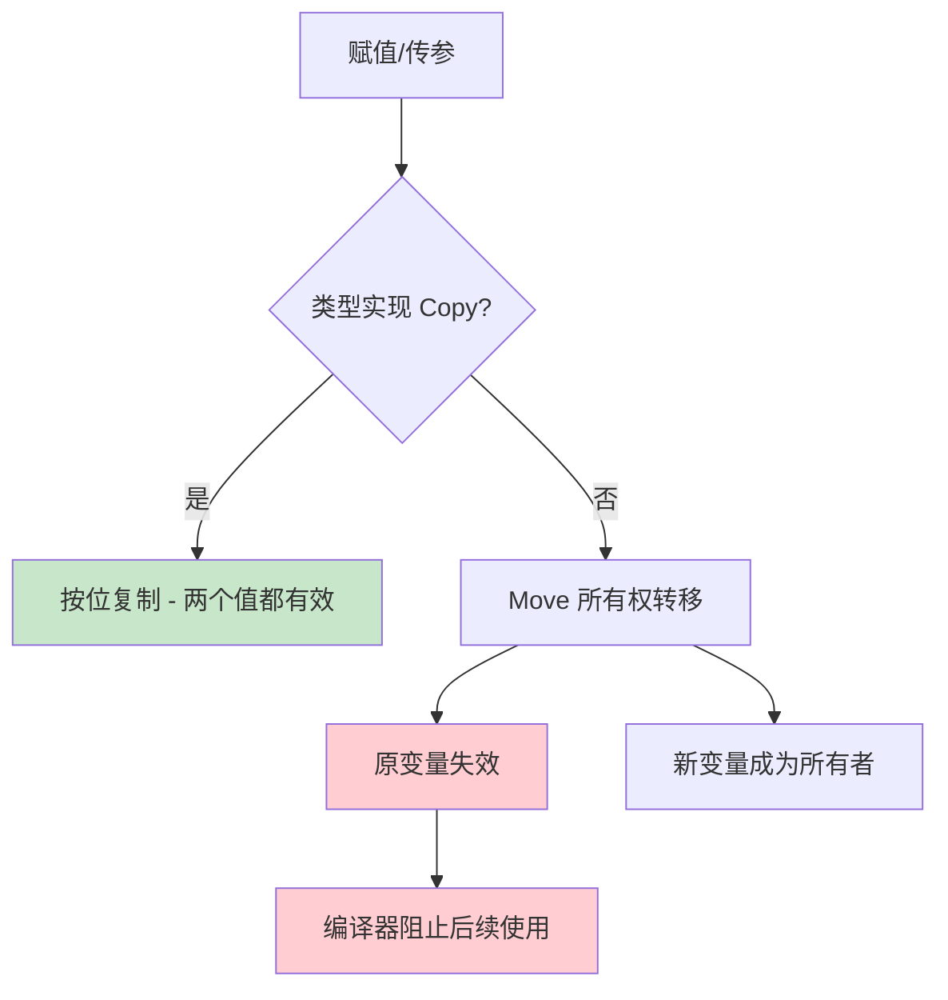
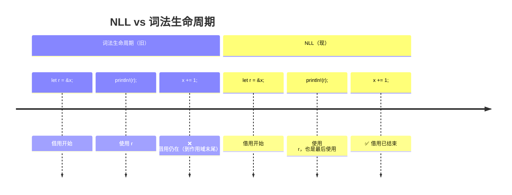
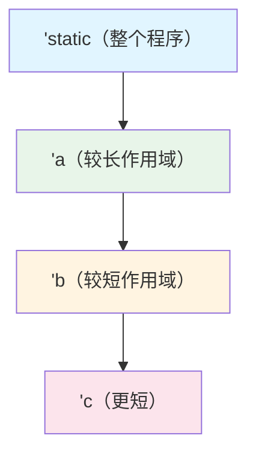
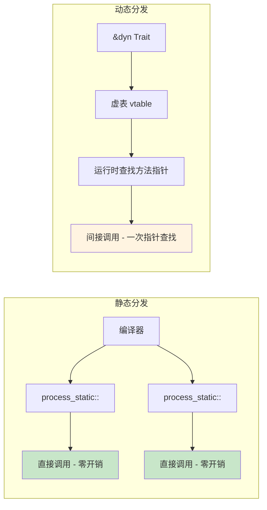
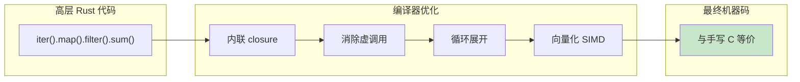

# Rust 所有权系统与零成本抽象

> 100 天认知提升计划 | Day 26-27

---

## 核心概念

### 所有权（Ownership）三规则

Rust 的所有权系统是其内存安全保证的基石，无需垃圾回收器即可在编译期消除内存错误。

**三大规则**：
1. Rust 中每个值都有一个 **所有者（owner）**
2. 同一时刻只能有 **一个** 所有者
3. 当所有者离开作用域时，值被 **丢弃（drop）**

```rust
fn ownership_basics() {
    let s1 = String::from("hello"); // s1 是 "hello" 的所有者
    let s2 = s1;                    // 所有权转移（move），s1 不再有效
    // println!("{}", s1);          // ❌ 编译错误：value borrowed after move
    println!("{}", s2);              // ✅ s2 现在是所有者

    let s3 = s2.clone();            // 深拷贝，两个独立的所有者
    println!("{} {}", s2, s3);      // ✅ 两者都有效
}
```

### Move 语义 vs Copy 语义

| 类型 | 语义 | 行为 | 示例 |
|------|------|------|------|
| `String`, `Vec<T>`, `Box<T>` | **Move** | 转移所有权，原变量失效 | `let s2 = s1;` |
| `i32`, `f64`, `bool`, `char` | **Copy** | 按位复制，原变量仍有效 | `let y = x;` |
| `&T` | **Copy** | 复制引用，生命周期由借用检查器管理 | `let r2 = r1;` |

**Copy trait 的条件**：所有字段都实现 Copy 的结构体自动实现 Copy。

```rust
#[derive(Copy, Clone)]
struct Point { x: i32, y: i32 }  // ✅ i32 是 Copy

struct Label(String);             // ❌ String 不是 Copy，Label 也不能 Copy
```



---

## 借用与引用（Borrowing）

### 借用规则

借用在 不获取所有权 的前提下允许访问数据：

| 规则 | 说明 |
|------|------|
| **规则 1** | 在任意给定时刻，要么只能有 **一个可变引用**，要么只能有 **多个不可变引用** |
| **规则 2** | 引用必须始终 **有效**（不能悬垂） |

```rust
fn borrowing_rules() {
    let mut data = vec![1, 2, 3];

    // ✅ 多个不可变引用
    let r1 = &data;
    let r2 = &data;
    println!("{} {}", r1[0], r2[1]);

    // ✅ r1, r2 的最后一次使用已过，可以创建可变引用（NLL）
    let r3 = &mut data;
    r3.push(4);

    // ❌ 不能同时持有可变和不可变引用
    // let r4 = &data;  // 编译错误
}
```

### 非词法生命周期（NLL）

Rust 2018+ 引入 NLL（Non-Lexical Lifetimes），引用的生命周期到 **最后一次使用位置** 而非作用域结尾：

```rust
fn nll_example() {
    let mut x = 5;
    let r = &x;           // 不可变借用开始
    println!("{}", r);     // r 最后一次使用
    // NLL: r 的借用在此结束
    x += 1;               // ✅ NLL 允许：r 不再使用
    println!("{}", x);
}
```



---

## 生命周期（Lifetime）

### 生命周期标注

生命周期不改变引用的存活时间，而是 **描述引用之间的关系**，帮助编译器验证引用有效性。

```rust
// 生命周期标注：返回值的生命周期 = 两个输入中较短的那个
fn longest<'a>(x: &'a str, y: &'a str) -> &'a str {
    if x.len() > y.len() { x } else { y }
}

// 结构体中的生命周期
struct Parser<'a> {
    input: &'a str,    // Parser 不能比 input 活得更久
    pos: usize,
}

impl<'a> Parser<'a> {
    fn new(input: &'a str) -> Self {
        Parser { input, pos: 0 }
    }

    fn peek(&self) -> Option<char> {
        self.input[self.pos..].chars().next()
    }
}
```

### 生命周期省略规则（Elision Rules）

编译器在简单场景自动推断生命周期，无需手动标注：

| 规则 | 说明 |
|------|------|
| **输入规则** | 每个引用参数获得独立的生命周期 |
| **输出规则 1** | 如果只有一个输入生命周期，输出自动获得它 |
| **输出规则 2** | 如果有 `&self` 或 `&mut self`，输出自动获得 `self` 的生命周期 |

```rust
// 编译器自动推断：
fn first_word(s: &str) -> &str;
// 等价于：
fn first_word<'a>(s: &'a str) -> &'a str;
```

### 生命周期子类型

生命周期之间有 **包含关系**：`'static: 'a: 'b`（更长的生命周期可以替代更短的）：

```rust
// 'static 是所有生命周期的超集
let s: &'static str = "I live forever";

fn choose<'a>(first: &'a str, second: &'a str) -> &'a str {
    // 'static 可以 coerce 为任意 'a
    if true { first } else { "static str" }  // &str 字面量是 'static
}
```



---

## Trait 系统

### Trait 定义与实现

Trait 是 Rust 的零成本抽象核心机制，类似接口但支持泛型单态化：

```rust
trait Summary {
    fn summarize_author(&self) -> String;

    // 默认实现
    fn summarize(&self) -> String {
        format!("(Read more from {}...)", self.summarize_author())
    }
}

struct Article { title: String, author: String }

impl Summary for Article {
    fn summarize_author(&self) -> String {
        self.author.clone()
    }
    // 使用默认的 summarize()
}
```

### Trait Bounds 与泛型

```rust
use std::fmt::Display;

// 泛型 + Trait Bound → 编译时单态化，零运行时开销
fn print_all<T: Display>(items: &[T]) {
    for item in items {
        println!("{}", item);
    }
}

// 等价的 trait bound 语法糖
fn largest<T: PartialOrd + Copy>(list: &[T]) -> T {
    let mut largest = list[0];
    for &item in list {
        if item > largest { largest = item; }
    }
    largest
}
```

### 静态分发 vs 动态分发

| 特性 | 静态分发（泛型） | 动态分发（dyn Trait） |
|------|-----------------|---------------------|
| 语法 | `fn foo<T: Trait>(t: T)` | `fn foo(t: &dyn Trait)` |
| 决定时机 | 编译时 | 运行时 |
| 代码膨胀 | 是（每种类型生成一份） | 否（一份代码） |
| 运行时开销 | **零** | 虚表查找 |
| 内联优化 | ✅ 完全内联 | ❌ 无法内联 |
| 二进制大小 | 较大 | 较小 |

```rust
// 静态分发 - 编译器为每种具体类型生成专门代码
fn process_static<T: Draw>(item: &T) {
    item.draw();
}

// 动态分发 - 通过虚表在运行时查找方法
fn process_dynamic(item: &dyn Draw) {
    item.draw();  // 运行时查虚表 → 调用正确的方法
}

trait Draw { fn draw(&self); }
```



### 核心 Trait 速查

| Trait | 用途 | 运算符/语法 |
|-------|------|------------|
| `Debug` | 格式化调试输出 | `{:?}` |
| `Display` | 用户友好的格式化 | `{}` |
| `Clone` | 显式深拷贝 | `.clone()` |
| `Copy` | 隐式按位复制 | 赋值/传参时自动 |
| `Drop` | 自定义析构 | 离开作用域自动调用 |
| `From/Into` | 类型转换 | `.into()` |
| `Iterator` | 迭代器 | `for x in iter` |
| `Add, Sub, ...` | 运算符重载 | `+, -, *, /` |
| `Sized` | 编译期已知大小 | 泛型默认约束 |
| `Send` | 可跨线程转移 | 线程安全标记 |
| `Sync` | 可跨线程共享 | 线程安全标记 |

---

## 宏系统

### 声明宏（macro_rules!）

```rust
macro_rules! vec_of {
    ($($element:expr),*) => {{
        let mut vs = Vec::new();
        $(vs.push($element);)*
        vs
    }};
}

let v = vec_of![1, 2, 3, 4, 5];
```

### 过程宏（Procedural Macros）

三种类型的过程宏：

| 类型 | 用途 | 示例 |
|------|------|------|
| **派生宏** | 自动实现 trait | `#[derive(Serialize)]` |
| **属性宏** | 修改项的定义 | `#[tokio::main]` |
| **函数式宏** | 代码生成 | `sql!(SELECT * FROM users)` |

```rust
// 派生宏示例
use serde::Serialize;

#[derive(Serialize, Debug)]
struct User {
    name: String,
    age: u32,
}

// 属性宏示例：tokio 自动将 async fn 包装为同步 main
#[tokio::main]
async fn main() {
    println!("running in tokio runtime");
}
```

---

## 零成本抽象验证

### 抽象无开销原则

Rust 遵循 C++ 的零开销原则：**你不需要为你没有使用的东西付代价，你使用的抽象不能比手写代码更差。**

```rust
// 高层抽象
let sum: i32 = vec.iter().map(|x| x * 2).filter(|x| x > &4).sum();

// 等价手写
let mut sum = 0;
for &x in &vec {
    let doubled = x * 2;
    if doubled > 4 {
        sum += doubled;
    }
}
// 编译器会将迭代器版本优化为与手写循环完全相同的机器码
```

### 实际验证：查看汇编

```bash
# 在 release 模式查看优化后的汇编
cargo rustc --release -- --emit=asm

# 使用 cargo-asm 工具查看特定函数的汇编
cargo install cargo-asm
cargo asm my_function
```

### 性能对比：迭代器 vs 手写循环

```rust
use std::time::Instant;

fn bench_iterator(data: &[i32]) -> i32 {
    data.iter()
        .map(|&x| x * x)
        .filter(|&x| x > 100)
        .sum()
}

fn bench_manual(data: &[i32]) -> i32 {
    let mut sum = 0;
    for &x in data {
        let sq = x * x;
        if sq > 100 {
            sum += sq;
        }
    }
    sum
}
// Benchmark 结果：两者性能几乎相同（差异在噪声范围内）
// 原因：迭代器被完全内联 + 循环展开
```



---

## 与 C++/Go 对比

### 内存管理策略

| 维度 | Rust | C++ | Go |
|------|------|-----|-----|
| **策略** | 编译期所有权检查 | 手动 + RAII + 智能指针 | 垃圾回收（GC） |
| **运行时开销** | **零** | **零** | GC 暂停（~0.5ms） |
| **安全性** | 编译期保证 | 需要遵守规范（易出错） | 运行时保证 |
| **学习曲线** | 陡峭 | 中等 | 平缓 |
| **数据竞争** | 编译期消除 | 可能发生 | 运行时检测 |

### 所有权对比代码

```cpp
// C++：没有所有权概念，依赖程序员自律
void cpp_example() {
    auto p = std::make_unique<int>(42);
    auto raw = p.get();
    // p.reset();  // 如果忘记，raw 悬垂
    std::cout << *raw << std::endl;  // 可能 UB
}

// Rust：编译器强制所有权规则
fn rust_example() {
    let p = Box::new(42);
    // let raw = &*p;  // 借用
    // drop(p);        // 显式 drop
    // println!("{}", raw);  // ❌ 编译错误：borrow after drop
}
```

```go
// Go：逃逸分析 + GC
func go_example() {
    p := new(int)
    *p = 42
    // 运行时决定何时回收，可能造成延迟
    runtime.GC()  // 显式触发（不推荐）
    _ = p
}
```

### 抽象能力对比

| 抽象机制 | Rust | C++ | Go |
|----------|------|-----|-----|
| 泛型 | ✅ Trait Bounds | ✅ Concepts/Templates | ✅ 泛型（1.18+） |
| 零成本抽象 | ✅ 单态化 + 内联 | ✅ 模板 + 内联 | ❌ 接口有运行时开销 |
| 运算符重载 | ✅ | ✅ | ❌ |
| 模式匹配 | ✅ exhaustive | ❌ | ✅（有限） |
| 宏 | ✅ 强大 | ✅ 预处理器 | ❌ 无宏 |
| 错误处理 | Result + ? | 异常/错误码 | error 接口 |

### 基准测试对比

| 场景 | Rust | C++ | Go |
|------|------|-----|-----|
| 字符串解析 | 1.0x | 1.0x | 2.5x |
| HTTP 服务吞吐 | 1.0x | 0.95x | 1.8x |
| 并发计算 | 1.0x | 1.1x | 1.3x |
| 内存占用 | 1.0x | 1.0x | 3-5x |

> 基准为相对值，Rust = 1.0x，越低越好。


---

## 实践任务

- [ ] 编写一个泛型栈结构 `Stack<T>`，支持 push/pop/peek，并用 trait 实现迭代器
- [ ] 实现一个简单的 `Vec<T>`（MyVec），手动管理堆内存，体验所有权
- [ ] 使用 `cargo bench` 对比迭代器 vs 手写循环的性能差异
- [ ] 用 `cargo asm` 查看泛型函数单态化后的汇编代码
- [ ] 实现一个声明宏 `hashmap!`，类似 `vec!` 但创建 HashMap
- [ ] 对比同逻辑的 Rust/C++/Go 程序，用 perf/valgrind 分析性能差异
- [ ] 编译一个含生命周期标注的项目，尝试删除标注看编译器报错信息
- [ ] 使用 `Send`/`Sync` trait 实现一个线程安全的 MPSC 通道

---

## 关键收获

| 概念 | 要点 |
|------|------|
| **所有权** | 编译期内存安全，零 GC 开销，确定性析构 |
| **借用** | 可变/不可变互斥，NLL 提升人体工程学 |
| **生命周期** | 描述引用间关系而非存活时间，省略规则减少标注 |
| **Trait** | 零成本抽象的基石，静态分发保证性能 |
| **宏** | 编译期代码生成，超越泛型的表达能力 |
| **零成本抽象** | 高层代码编译为与手写底层代码等价的机器码 |
| **Rust vs C++** | 同等性能，编译期安全 vs 运行时 UB |
| **Rust vs Go** | 安全性相当，性能 Rust 显著领先 |

> **核心洞察**：Rust 的所有权系统不是限制，而是 **编译器帮你证明了内存安全**。这种证明在运行时零开销，是工程与理论的完美结合。

---

## 参考资料

- [The Rust Programming Language](https://doc.rust-lang.org/book/)
- [Rust Nomicon - Unsafe 指南](https://doc.rust-lang.org/nomicon/)
- [Rust Reference - Lifetime Elision](https://doc.rust-lang.org/reference/lifetime-elision.html)
- [Zero-Cost Abstractions in Rust](https://blog.rust-lang.org/2015/05/11/traits.html)
- [C++ Core Guidelines](https://isocpp.github.io/CppCoreGuidelines/)
- [Go GC: A Guide to the Garbage Collector](https://go.dev/doc/gc-guide)

---

*学习日期：2026-04-06*
