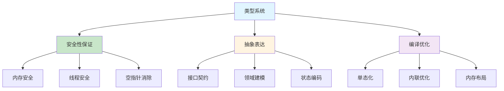
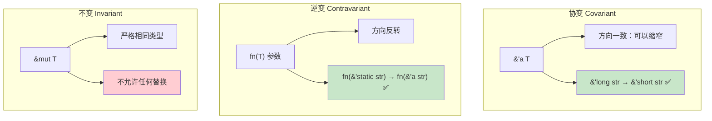
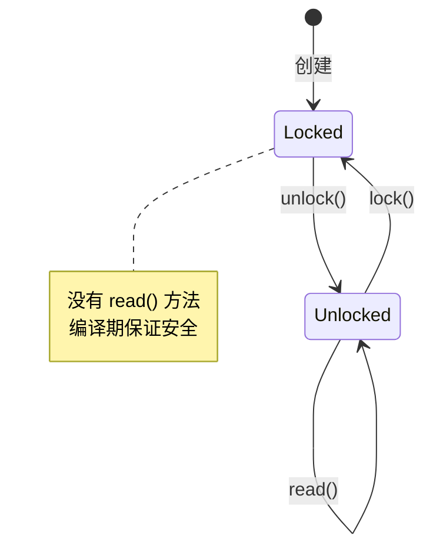
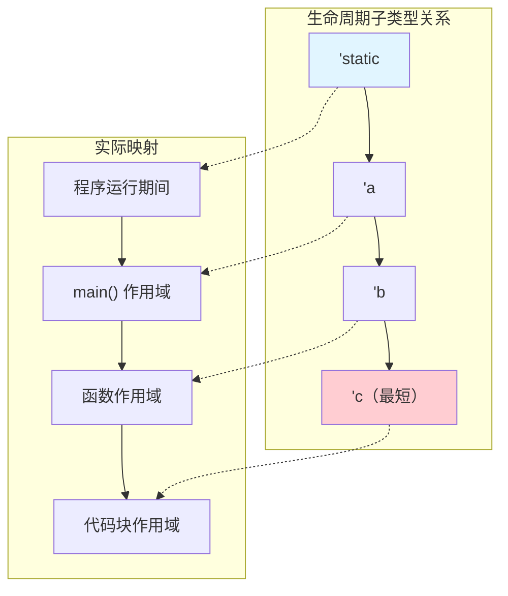
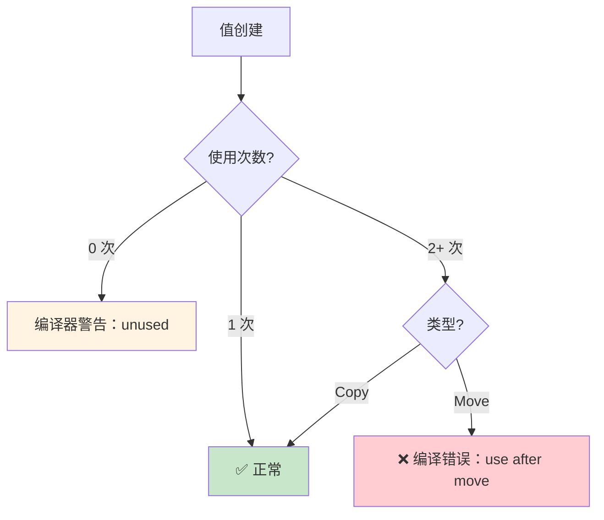

# 类型系统理论

> 100 天认知提升计划 | Day 28

---

## 核心概念

### 类型系统的作用

类型系统是编程语言中最核心的静态分析工具：**在编译期排除一类程序错误**。它是一套将值分类的规则体系，通过约束哪些操作合法来保证程序正确性。

| 维度 | 说明 |
|------|------|
| **安全性** | 阻止非法操作（如对字符串做除法） |
| **抽象** | 以类型为接口表达设计意图 |
| **文档** | 类型签名是最可靠的文档 |
| **优化** | 编译器利用类型信息生成更优代码 |



### 类型系统的分类

| 分类 | 说明 | 代表语言 |
|------|------|----------|
| **静态 vs 动态** | 类型检查在编译时 vs 运行时 | Rust/C++ vs Python/JS |
| **强 vs 弱** | 是否允许隐式类型转换 | Rust/Python vs C/JS |
| **名义 vs 结构** | 按声明名 vs 按结构匹配 | Rust/Java vs Go/TypeScript |
| **显式 vs 推断** | 需要标注 vs 自动推断 | Haskell/Rust（部分推断） |

---

## 变异性（Variance）

### 什么是 Variance？

Variance 描述了 **复合类型之间的子类型关系** 如何由其 **组成类型的子类型关系** 决定。这是泛型类型安全的理论基础。

设 `Sub` 是 `Super` 的子类型（`Sub <: Super`），则对于泛型 `F<T>`：

| Variance 类型 | 定义 | 含义 |
|---------------|------|------|
| **协变（Covariant）** | `Sub <: Super` → `F<Sub> <: F<Super>` | 方向一致 |
| **逆变（Contravariant）** | `Sub <: Super` → `F<Super> <: F<Sub>` | 方向反转 |
| **不变（Invariant）** | 无子类型关系 | 严格相同 |

### Rust 中的 Variance

```rust
// 'longer 是 'shorter 的子类型（生命周期包含）
// 'static <: 'a <: 'b （'static 最长）

// ✅ 协变：&'a T 关于 'a 是协变的
fn covariance<'a, 'b: 'a>(x: &'b str) -> &'a str {
    x  // 可以把 'b 当作 'a 使用（缩小生命周期是安全的）
}

// ✅ 协变：&'a T 关于 T 也是协变的
fn t_covariance<'a>(x: &'a str) -> &'a [u8] {
    // str: [u8] 的子类型概念 → 可以安全转换
    x.as_bytes()
}

// ❌ 逆变场景：函数参数类型
// fn(f: fn(&'a str)) 可以接受 fn(&'static str)
// 但 fn(f: fn(&'static str)) 不能接受 fn(&'a str)
fn contravariance_example<'a>() {
    let f: fn(&'static str) = |_| {};
    let g: fn(&'a str) = f;  // ✅ 函数参数类型是逆变的
}

// ❌ 不变：&mut T 关于 T 是不变的
fn invariance<'a>(x: &mut &'a str, y: &'static str) {
    // *x = y;  // 这会改变 'a 为 'static，但通过 &mut 可能有其他引用依赖 'a
}
```

### Variance 一览表

| 类型 | 对 T 的 Variance | 对生命周期的 Variance |
|------|-----------------|---------------------|
| `&'a T` | 协变 | 协变 |
| `&'a mut T` | **不变** | 协变 |
| `Box<T>` | 协变 | - |
| `Vec<T>` | 协变 | - |
| `Cell<T>` | **不变** | - |
| `fn(T) -> R` | T **逆变**，R 协变 | - |
| `*const T` | 协变 | - |
| `*mut T` | **不变** | - |



### 为什么 &mut T 是不变的？

```rust
// 假设 &mut T 是协变的（实际不是！）
fn exploit() {
    let mut s: &'static str = "hello";
    let r: &mut &'static str = &mut s;

    // 假设可以把 &mut &'static str 当作 &mut &'a str
    // （协变：'static <: 'a）
    let r_short: &mut &'a str = r;  // 假设允许

    let local = "temporary".to_string();
    *r_short = &local;  // 写入一个短生命周期引用

    // 但 r 指向的 s 现在持有了一个悬垂引用！
    println!("{}", s);  // 💥 use-after-free
}
```

这就是为什么可变引用必须是 **不变的**：通过 `&mut T` 写入短生命周期数据会导致悬垂引用。

---

## 幽灵类型（Phantom Types）

### 基本概念

Phantom Types 利用 **类型参数在类型层面编码额外信息**，而不在运行时产生任何开销。Rust 的 `PhantomData<T>` 是标准库支持。

```rust
use std::marker::PhantomData;

// 编码计量单位的类型安全
struct Meter;
struct Kilometer;

struct Distance<Unit> {
    value: f64,
    _marker: PhantomData<Unit>,  // 零大小，编译后消除
}

// 类型安全的运算
impl<Unit> Distance<Unit> {
    fn new(value: f64) -> Self {
        Distance { value, _marker: PhantomData }
    }
}

// 只允许相同单位相加
impl<Unit> std::ops::Add for Distance<Unit> {
    type Output = Self;
    fn add(self, rhs: Self) -> Self {
        Distance::new(self.value + rhs.value)
    }
}

fn phantom_example() {
    let a = Distance::<Meter>::new(5.0);
    let b = Distance::<Meter>::new(3.0);
    let c = a + b;  // ✅ Meter + Meter = Meter

    let d = Distance::<Kilometer>::new(1.0);
    // let e = a + d;  // ❌ 编译错误：Meter + Kilometer 不允许
}
```

### 实际应用场景

| 场景 | 说明 | 示例 |
|------|------|------|
| **计量单位** | 防止不同单位的值混用 | 米 vs 千米 |
| **状态编码** | 在类型中编码对象状态 | 未连接 vs 已连接 |
| **权限标记** | 类型层面区分读写权限 | ReadOnly vs ReadWrite |
| **ID 类型** | 防止不同实体的 ID 混用 | UserId vs OrderId |
| **生命周期关联** | PhantomData 告诉编译器 drop 检查 | `PhantomData<&'a T>` |

```rust
// 状态机类型保证的经典案例
struct Locked;
struct Unlocked;

struct Device<State> {
    data: String,
    _state: PhantomData<State>,
}

impl Device<Locked> {
    fn unlock(self) -> Device<Unlocked> {
        Device { data: self.data, _state: PhantomData }
    }
}

impl Device<Unlocked> {
    fn read(&self) -> &str {
        &self.data
    }

    fn lock(self) -> Device<Locked> {
        Device { data: self.data, _state: PhantomData }
    }
}

// Device<Locked> 没有 read() 方法 → 编译期阻止非法访问
```



### PhantomData 与 Drop 检查

`PhantomData` 不仅用于标记，还影响 **drop 检查**：

```rust
use std::marker::PhantomData;

struct VecWrapper<'a, T> {
    ptr: *mut T,
    len: usize,
    // 告诉编译器：我们拥有 &'a T 类型的数据
    // 如果不写，编译器不知道 VecWrapper 依赖 'a
    _marker: PhantomData<&'a T>,
}
```

| PhantomData 类型 | 含义 | Drop 检查行为 |
|------------------|------|-------------|
| `PhantomData<T>` | 拥有 T | 参与drop检查 |
| `PhantomData<&'a T>` | 借用 'a 中的 T | 确保 'a 比 Self 长 |
| `PhantomData<*const T>` | 不拥有 T | 不参与 drop 检查 |
| `PhantomData<fn(T)>` | 使用 T 但不拥有 | 不参与 drop 检查 |

---

## 生命周期子类型（Lifetime Subtyping）

### 生命周期作为子类型系统

Rust 的生命周期形成一个偏序集：`'static` 是所有生命周期的"最大"元素。

```rust
// 生命周期的包含关系
// 'static ⊇ 'a ⊇ 'b ⊇ 'c ...

// 显式生命周期约束
fn example<'a, 'b: 'a>() {
    // 'b: 'a 表示 'b 至少和 'a 一样长
    let x: &'a str;
    let y: &'b str;
    // 可以把 &'b str 赋值给 &'a str （协变）
}
```

### 高级模式：生命周期约束在结构体中

```rust
// 编译器上下文：确保 context 活得比 parser 久
struct Parser<'ctx, 'src: 'ctx> {
    context: &'ctx Context,
    source: &'src str,
}

impl<'ctx, 'src: 'ctx> Parser<'ctx, 'src> {
    fn parse(&self) -> Result<Ast, Error> {
        // 安全：self.source 至少活得和 self.context 一样久
        Ok(Ast)
    }
}

struct Context;
struct Ast;
struct Error;
```

### 生命周期与 Variance 的交互

```rust
// 函数签名中的隐含 Variance
fn longest<'a>(x: &'a str, y: &'a str) -> &'a str {
    if x.len() > y.len() { x } else { y }
}

// 调用时编译器会选择两个参数生命周期的交集
fn caller() {
    let s1 = String::from("long string");
    let result;
    {
        let s2 = String::from("xyz");
        result = longest(s1.as_str(), s2.as_str());
        println!("{}", result);  // ✅ s2 还活着
    }
    // println!("{}", result);  // ❌ result 的生命周期受限于 s2
}
```



---

## 状态机类型保证

### 用类型系统编码状态转换

将状态机的状态提升到 **类型层面**，使非法状态转换成为 **编译错误** 而非运行时错误：

```rust
use std::marker::PhantomData;

// 状态标记
struct Idle;
struct Connected;
struct Authenticated;

// 连接类型
struct Connection<State> {
    stream: Option<String>,  // 简化，实际是 TcpStream
    _state: PhantomData<State>,
}

impl Connection<Idle> {
    fn new() -> Self {
        Connection { stream: None, _state: PhantomData }
    }

    fn connect(self, addr: &str) -> Result<Connection<Connected>, String> {
        Ok(Connection {
            stream: Some(format!("connected to {}", addr)),
            _state: PhantomData,
        })
    }
}

impl Connection<Connected> {
    fn authenticate(self, user: &str, pass: &str) -> Result<Connection<Authenticated>, String> {
        if pass == "secret" {
            Ok(Connection {
                stream: self.stream,
                _state: PhantomData,
            })
        } else {
            Err("auth failed".into())
        }
    }

    fn disconnect(self) -> Connection<Idle> {
        Connection { stream: None, _state: PhantomData }
    }
}

impl Connection<Authenticated> {
    fn query(&self, sql: &str) -> String {
        format!("executing: {}", sql)
    }

    fn disconnect(self) -> Connection<Idle> {
        Connection { stream: None, _state: PhantomData }
    }
}
```

```mermaid
stateDiagram-v2
    [*] --> Idle: Connection::new()
    Idle --> Connected: connect(addr)
    Connected --> Authenticated: authenticate(user, pass)
    Authenticated --> Idle: disconnect()
    Connected --> Idle: disconnect()

    note right of Idle
        只有 connect() 可用
    end note

    note right of Connected
        authenticate() 或 disconnect()
    end note

    note right of Authenticated
        query() 和 disconnect()
    end note
```

### 编译期阻止非法操作

```rust
fn type_state_demo() {
    let conn = Connection::new();

    // conn.query("SELECT 1");  // ❌ 编译错误：Idle 没有 query 方法
    // conn.authenticate("a", "b");  // ❌ 编译错误：Idle 没有 authenticate

    let conn = conn.connect("localhost:5432").unwrap();
    // conn.query("SELECT 1");  // ❌ 编译错误：Connected 没有 query

    let conn = conn.authenticate("admin", "secret").unwrap();
    conn.query("SELECT 1");     // ✅ Authenticated 有 query

    let conn = conn.disconnect();
    // conn.query("SELECT 1");  // ❌ 回到 Idle，没有 query
}
```

### 状态机设计模式总结

| 模式 | 技术 | 优点 | 缺点 |
|------|------|------|------|
| **Enum + match** | `enum State { A, B }` | 灵活，运行时切换 | 忘记 match 某分支 |
| **Type State** | 泛型 + PhantomData | 编译期保证 | 状态在类型中固定 |
| **Builder Pattern** | 链式调用 + 类型状态 | 类型安全构造 | 代码较多 |

### 线性类型与所有权

Rust 的所有权系统本质上是 **仿线性类型（Affine Types）** 的实现：

| 类型系统 | 规则 | 代表 |
|----------|------|------|
| **线性类型** | 值必须恰好使用一次 | Clean, ATS |
| **仿射类型** | 值最多使用一次 | **Rust** |
| **相关类型** | 值可以任意使用 | 大多数语言 |

```rust
// Rust 的仿线性性：值最多使用一次
let s = String::from("hello");
let s2 = s;       // move: s 被消耗
// println!("{}", s);  // ❌ s 已经被消耗
println!("{}", s2);    // ✅ s2 是新所有者
```



---

## 类型级编程

### 类型等式与约束

```rust
// 使用 trait 实现编译期类型等式检查
trait Same {}
impl<T> Same for (T, T) {}

// 编译期断言两个类型相同
fn assert_same<A, B>() where (A, B): Same {}

fn demo() {
    assert_same::<i32, i32>();      // ✅ 编译通过
    // assert_same::<i32, u32>();    // ❌ 编译错误
}
```

### 关联类型与类型族

```rust
// 用 trait 实现编译期计算
trait Peano {}
struct Zero;
struct Succ<N>(std::marker::PhantomData<N>);

impl Peano for Zero {}
impl<N: Peano> Peano for Succ<N> {}

// 编译期加法
trait Add<N> { type Result; }
impl<N: Peano> Add<Zero> for N {
    type Result = N;
}
impl<N: Peano, M: Peano> Add<Succ<M>> for N
where N: Add<M>,
{
    type Result = Succ<<N as Add<M>>::Result>;
}

// 编译期验证：1 + 2 = 3
type One = Succ<Zero>;
type Two = Succ<One>;
type Three = Succ<Two>;

fn check() where (Succ<Succ<Succ<Zero>>>, <One as Add<Two>>::Result): Same {}
```

---

## 实践任务

- [ ] 实现一个类型安全的单位系统（长度/重量/时间），使用 PhantomData 防止混用
- [ ] 用 Type State 模式实现一个 TCP 连接状态机，编译期阻止非法状态转换
- [ ] 实现一个类型安全的构建器（Builder），只有所有必填字段填写后才能 `.build()`
- [ ] 编写代码验证 `&mut T` 的不变性，尝试创建破坏不变性的场景
- [ ] 用关联类型实现编译期自然数加法（Peano 数）
- [ ] 实现 `UserId` 和 `OrderId` 的幽灵类型包装，防止 ID 混用
- [ ] 研究 Rust 标准库中 `NonNull<T>` 的 Variance，理解其为什么使用 `*const T`
- [ ] 对比 Go 的 `interface{}` 和 Rust 的泛型，分析类型安全差异

---

## 关键收获

| 概念 | 要点 |
|------|------|
| **Variance** | 描述复合类型的子类型关系规则，是泛型安全的理论基础 |
| **协变** | 方向一致，不可变引用和生命周期安全地缩窄 |
| **逆变** | 方向反转，函数参数类型允许灵活替换 |
| **不变** | 严格相同，可变引用为防止写入侵而必须不变 |
| **Phantom Types** | 零运行时开销的类型级元信息，编码单位/状态/权限 |
| **生命周期子类型** | `'static ⊇ 'a ⊇ 'b`，生命周期的偏序关系 |
| **Type State** | 状态机的状态编码在类型中，非法转换变编译错误 |
| **仿线性类型** | Rust 的所有权是仿线性类型系统，值最多使用一次 |

> **核心洞察**：类型系统不仅是编译器的检查工具，更是 **设计语言**。通过将约束编码到类型中，程序员可以在编译期证明程序的性质，而非依赖运行时测试。Rust 的类型系统在这方面走到了极致——所有权、生命周期、trait、phantom types 共同构成了一个强大的编译期验证框架。

---

## 参考资料

- [Rust Reference - Type Layout and Variance](https://doc.rust-lang.org/reference/subtyping.html)
- [Rustonomicon - Variance](https://doc.rust-lang.org/nomicon/subtyping.html)
- [Types and Programming Languages (TAPL)](https://mitpress.mit.edu/9780262162098/types-and-programming-languages/) - Benjamin Pierce
- [PhantomData in Rust](https://doc.rust-lang.org/std/marker/struct.PhantomData.html)
- [Typestate Pattern in Rust](https://cliffle.com/blog/rust-typestate/)
- [Programming Rust, 2nd Edition](https://www.oreilly.com/library/view/programming-rust-2nd/9781492052586/)
- [GATs and Lifetime Bounds](https://blog.rust-lang.org/2022/10/28/gats-stabilization.html)

---

*学习日期：2026-04-07*
