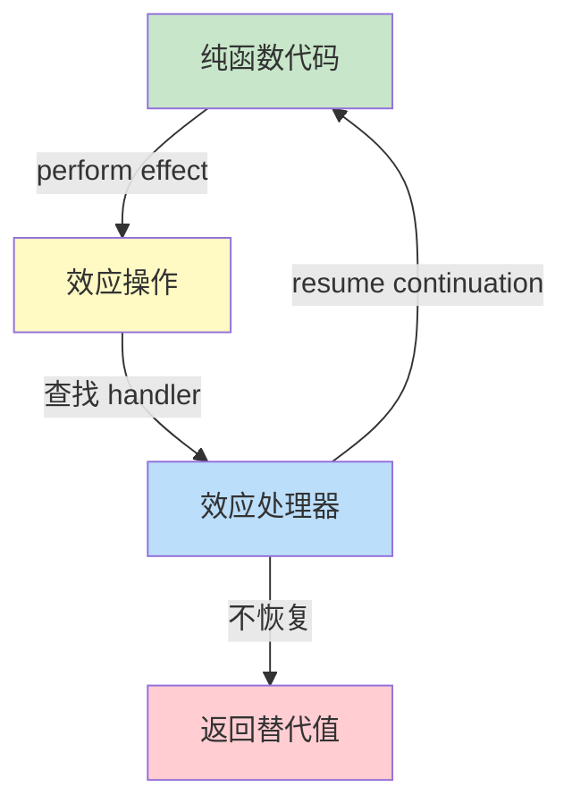
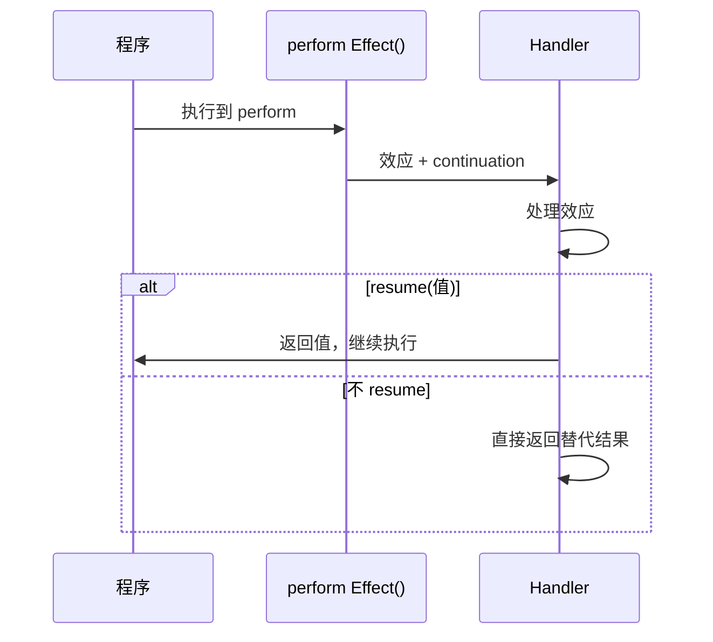
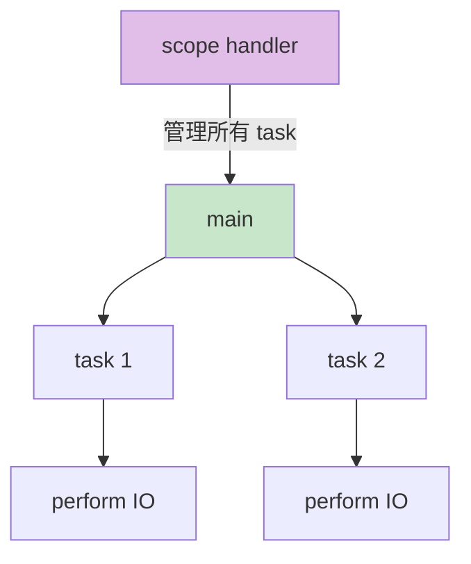

# Effect System

> 100 天认知提升计划 | Day 29

---

## 核心概念

### 什么是 Effect System？

**Effect System** 是一种类型系统的扩展，用于跟踪和约束程序中的**副作用**（side effects）。传统类型系统描述值"是什么"（`int`、`string`），而 Effect System 描述计算"做什么"——它会产生哪些副作用。

**设计动机**：
- 纯函数式语言中副作用需要被显式建模（如 Monad）
- Monad 导致**代码色调分离**（colored functions）——纯函数与有副件的函数变成不同颜色
- Effect System 试图让副作用可追踪，同时不牺牲代码的可组合性

### 代数效应（Algebraic Effects）

**代数效应** 是 Effect System 中最核心的概念，由 Andrej Bauer 和 Matija Pretnar 在 2010 年左右提出。它将副作用抽象为**效应**（effect）——一种可以被**处理器**（handler）捕获和解释的操作。

**三大核心思想**：

| 概念 | 类比 | 说明 |
|------|------|------|
| **Effect** | 抛出异常 | 声明"我要做某事"，但不关心如何做 |
| **Handler** | try/catch | 拦截效应并提供具体实现 |
| **Continuation** | 异常恢复 | 捕获效应后可以**恢复**执行，而非终止 |



#### 一个直觉性的例子

```javascript
// 假设的语言（类似 Koka / OCaml 5 语法）
fun greet(name) {
  val time = perform CurrentTime()     // 声明需要当前时间
  val config = perform GetConfig("lang") // 声明需要配置
  if config == "zh" {
    println("你好，{name}！现在是 {time}")
  } else {
    println("Hello, {name}! It's {time}")
  }
}
```

注意：`greet` 函数本身**不知道**时间从哪来、配置从哪来——它只是"声明需求"。调用者通过 handler 决定具体行为：

```javascript
// 测试时使用 mock handler
with handler {
  fun CurrentTime() -> resume(FixedTime("2026-01-01"))
  fun GetConfig(key) -> resume("zh")
} {
  greet("橙子")  // 输出：你好，橙子！现在是 2026-01-01
}

// 生产时使用真实 handler
with handler {
  fun CurrentTime() -> resume(System.now())
  fun GetConfig(key) -> resume(Database.lookup(key))
} {
  greet("橙子")  // 输出：你好，橙子！现在是 2026-04-08 20:00:00
}
```

### Continuation 捕获

这是代数效应区别于异常机制的关键：当 handler 处理完效应后，可以通过 **`resume`** 恢复到 `perform` 调用点继续执行。



**Continuation 的本质**：它是一个**一等公民的函数**，代表"perform 之后的剩余计算"。Handler 可以：
- 调用它一次（正常恢复）
- 调用它多次（回溯、非确定性计算）
- 不调用它（短路返回）
- 存储它供以后调用（异步恢复）

### 与 async/await 的对比

| 维度 | async/await | 代数效应 |
|------|-------------|---------|
| **函数色调** | 有色：`async fn` ≠ `fn` | 无色：普通函数可 perform |
| **副作用绑定** | 绑定到特定 runtime（Promise/Future） | 延迟到 handler 决定 |
| **组合性** | `async` 函数只能被 `await` | 任何函数都能 perform |
| **测试性** | 需要 mock 整个 async runtime | 只需替换 handler |
| **实现复杂度** | 编译器内置，生态成熟 | 多为研究阶段，实现较少 |
| **错误处理** | `Result<T, E>` + `?` 或 try/catch | handler 可以拦截所有效应 |

```javascript
// async/await: 函数必须标记 async
async function fetchUser(id) {
  const resp = await fetch(`/api/users/${id}`);  // 必须是 async 上下文
  return resp.json();
}

// 代数效应: 普通函数即可
function fetchUser(id) {
  const resp = perform HttpGet(`/api/users/${id}`);  // 任何函数都能 perform
  return JSON.parse(resp);
}

// 调用方决定如何处理网络请求
with handler {
  fun HttpGet(url) -> {
    // 生产：真实 HTTP 请求
    resume(fetchSync(url))
  }
} {
  fetchUser(42)
}
```

---

## 技术架构

### 结构化并发（Structured Concurrency）

代数效应天然支持**结构化并发**——并发任务的生命周期被限定在明确的词法作用域内。



**核心原则**：
1. 每个并发任务都有一个明确的**父作用域**
2. 父作用域退出时，所有子任务必须完成或取消
3. 错误可以在作用域级别统一处理

```javascript
// 结构化并发示例（伪代码）
fun main() {
  with handler {
    fun Fork(task) -> {
      val tid = spawnThread(() => resume(task()))
      resume(tid)
    }
    fun Join(tid) -> {
      resume(waitForThread(tid))
    }
  } {
    val t1 = perform Fork(() => slowComputation1())
    val t2 = perform Fork(() => slowComputation2())
    
    val r1 = perform Join(t1)
    val r2 = perform Join(t2)
    
    println(r1 + r2)
  }
  // 离开 handler 作用域时，所有线程必须已完成
}
```

### Koka 语言

**Koka** 是微软研究院开发的编程语言，由 Daan Leijen 设计，是代数效应最成熟的实现之一。

#### Koka 的核心特性

| 特性 | 说明 |
|------|------|
| **效应类型** | 函数签名自动推断副作用：`() -> <console,io> ()` |
| **效应抽象** | `effect` 关键字定义效应接口 |
| **Handler** | `with handler` 拦截效应 |
| **多阶段** | 支持编译时元编程 |
| **Perceus** | 引用计数内存管理，无 GC |

#### Koka 代码示例

```koka
// 定义效应
effect console {
  fun println(s : string) : ()
}

effect state<T> {
  fun get() : T
  fun put(x : T) : ()
}

// 使用效应的函数——不需要标记 async 或 monad
fun counter() {
  var i = perform get()
  while i < 10 {
    perform println("count: {i}")
    perform put(i + 1)
    i = perform get()
  }
}

// 提供 handler 实现
fun run-with-counter() {
  with handler {
    return x -> (x, 0)
    fun get() -> resume(0)    // 简化：始终返回 0
    fun put(x) -> resume(())
    fun println(s) ->
      println(s)               // 调用内建 println
      resume(())
  } {
    counter()
  }
}
```

#### Koka 的效应推断

Koka 编译器**自动推断**函数的效应类型，无需手动标注：

```koka
fun pure-computation(x : int) : int {
  x + 1
}
// 推断类型：() -> int
// 无副作用

fun impure-computation() : int {
  perform println("computing...")
  42
}
// 推断类型：() -> <console> int
// 带有 console 效应

fun maybe-div(x : int, y : int) : int {
  if y == 0 then error("division by zero") else x / y
}
// 推断类型：(int, int) -> <div,exn> int
// 带有除法异常效应
```

### Effect System 的分类

| 类型 | 语言示例 | 效应检查 | 运行时开销 |
|------|---------|---------|-----------|
| **代数效应** | Koka, OCaml 5, Eff | 静态推断 | 中等（continuation） |
| **单体效应** | Haskell (mtl) | 静态检查 | 低（编译时消除） |
| **效应多态** | Links, Frank | 静态检查 | 中等 |
| **动态效应** | React Suspense, Unison | 运行时 | 较高 |

---

## 实践与思考

### 实践任务

- [ ] 安装 Koka 语言并运行官方示例
- [ ] 用 Koka 实现一个带状态的计数器（state effect）
- [ ] 对比同一逻辑的 async/await 版本和代数效应版本
- [ ] 阅读 Koka 的 Perceus 内存管理论文
- [ ] 尝试 OCaml 5 的 effect handler（`Effect.Deep` 模块）

### 安装 Koka

```bash
# macOS
brew install koka

# 或从源码编译
git clone https://github.com/koka-lang/koka.git
cd koka
make

# 交互式运行
koka
```

### 示例：用代数效应实现依赖注入

```koka
// 定义数据库效应
effect db {
  fun query-user(id : int) : option<string>
  fun save-user(id : int, name : string) : ()
}

// 业务逻辑——纯逻辑，不依赖具体数据库
fun update-user-name(id : int, new-name : string) {
  match perform query-user(id) {
    Some(old) ->
      perform save-user(id, new-name)
      perform println("Updated user {id}: {old} -> {new-name}")
    None ->
      perform println("User {id} not found")
  }
}

// 生产 handler：连接真实数据库
fun with-sqlite-db(f) {
  with handler {
    fun query-user(id) -> resume(db-query("SELECT name FROM users WHERE id = {id}"))
    fun save-user(id, name) -> resume(db-exec("UPDATE users SET name = '{name}' WHERE id = {id}"))
  } { f() }
}

// 测试 handler：使用内存字典
fun with-mock-db(f) {
  val users = map(1->"Alice", 2->"Bob")
  with handler {
    fun query-user(id) -> resume(users.get(id))
    fun save-user(id, name) -> resume(())
  } { f() }
}
```

### 代数效应的实际应用

| 应用场景 | 技术实现 | 说明 |
|---------|---------|------|
| **React Suspense** | 隐式 continuation | 组件可以"暂停"等待数据 |
| **ZIO (Scala)** | 效应类型 + Runtime | 类型安全的副作用管理 |
| **OCaml 5** | 原生 effect handler | 高性能 continuation |
| **Unison** | 能力（Ability）系统 | 函数式效应管理 |
| **Log4j MDC** | 隐式上下文传递 | 类似 reader effect |

### 关键收获

1. **效应分离**：代数效应将"做什么"和"怎么做"彻底分离，函数只需声明需求
2. **无色函数**：不像 async/await 需要标记函数颜色，普通函数可以直接 perform
3. **可测试性**：只需替换 handler 即可 mock 任何副作用，无需依赖注入框架
4. **Continuation 灵活性**：resume 可调用 0 次到多次，支持回溯、生成器等高级模式
5. **未来方向**：代数效应正在从研究走向工程实践（OCaml 5 已原生支持）

### 注意事项

- **性能**：continuation 捕获有运行时开销，Koka 通过 Perceus 优化
- **生态**：多数实现仍在研究阶段，生产使用需谨慎评估
- **调试**：效应处理链可能复杂，需要良好的工具支持
- **学习曲线**：概念较抽象，需要理解 continuation 和类型论基础

---

## 参考资料

- [Koka Language](https://koka-lang.github.io/) - 官方网站和教程
- [Algebraic Effects for the Rest of Us](https://overreacted.io/algebraic-effects-for-the-rest-of-us/) - Dan Abramov 通俗讲解
- [What is Algebraic Effects?](https://gist.github.com/yelouafi/57825fdd2235c9ab0bc1c0e315ad8072) - 深入概念解析
- [OCaml 5 Effect Handlers](https://ocaml.org/manual/5.0/effects.html) - OCaml 官方文档
- [Perceus: Garbage Free Reference Counting](https://www.microsoft.com/en-us/research/publication/perceus-garbage-free-reference-counting-with-reuse/) - Koka 内存管理论文
- [Eff Directly in OCaml](https://arxiv.org/abs/2202.09848) - OCaml effect handler 实现

---

*学习日期：2026-04-08*
