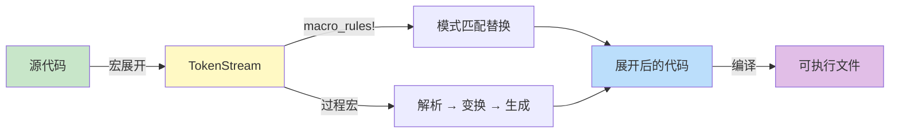
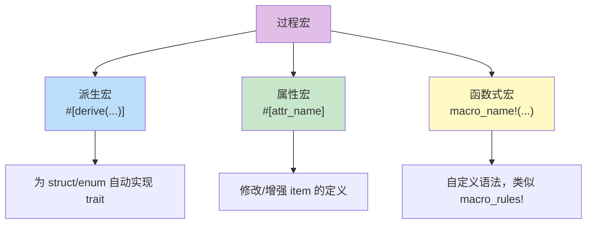
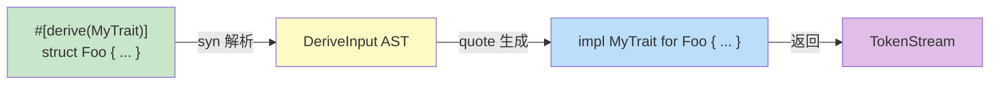
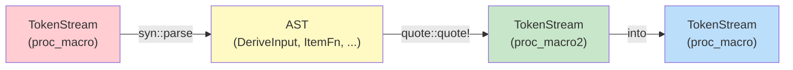

# 宏编程艺术

> 100 天认知提升计划 | Day 30

---

## 核心概念

### 什么是宏编程？

**宏编程**（Macro Programming）是一种在**编译时**对代码进行生成、变换和抽象的元编程技术。与运行时抽象（函数、接口）不同，宏在编译阶段操作代码的语法结构（token 或 AST），生成最终被编译的代码。

**设计目标**：
- 消除样板代码（boilerplate）
- 创建领域特定语言（DSL）
- 在不牺牲性能的前提下实现高级抽象
- 编译时计算与校验

### Rust 中的宏分类

Rust 拥有两套宏系统，各有适用场景：

| 类型 | 操作对象 | 执行时机 | 复杂度 | 典型用途 |
|------|---------|---------|--------|---------|
| **声明宏** (`macro_rules!`) | Token 模式匹配 | 编译时 | 低-中 | `vec!`、`println!`、简化 API |
| **过程宏** (Procedural Macro) | TokenStream → TokenStream | 编译时 | 中-高 | `#[derive]`、`#[attr]`、自定义语法 |



---

## 声明宏（`macro_rules!`）

### 基本语法

```rust
macro_rules! say_hello {
    () => {
        println!("Hello!");
    };
    ($name:expr) => {
        println!("Hello, {}!", $name);
    };
    ($greeting:expr, $name:expr) => {
        println!("{}, {}!", $greeting, $name);
    };
}

say_hello!();                    // Hello!
say_hello!("World");             // Hello, World!
say_hello!("你好", "橙子");      // 你好, 橙子!
```

### 片段类型（Fragment Specifiers）

| 标识符 | 匹配内容 | 示例 |
|--------|---------|------|
| `expr` | 表达式 | `2 + 2`、`foo()` |
| `ident` | 标识符 | `x`、`MyStruct` |
| `ty` | 类型 | `i32`、`Vec<String>` |
| `path` | 路径 | `std::collections::HashMap` |
| `stmt` | 语句 | `let x = 5;` |
| `block` | 块 | `{ let x = 1; x }` |
| `pat` | 模式 | `Some(x)` |
| `meta` | 元属性 | `#[derive(Debug)]` 中的 `derive(Debug)` |
| `tt` | 单个 token tree | 任意单个 token 或 `(...)` / `[...]` / `{...}` |
| `item` | 项 | `fn foo() {}`、`struct Bar;` |
| `lifetime` | 生命周期 | `'a`、`'static` |
| `vis` | 可见性 | `pub`、`pub(crate)` |
| `literal` | 字面量 | `42`、`"hello"` |

### 经典模式：`vec!` 宏的实现

```rust
macro_rules! vec {
    () => (
        $crate::__rust_force_expr!($crate::vec::Vec::new())
    );
    ($elem:expr; $n:expr) => (
        $crate::__rust_force_expr!($crate::vec::from_elem($elem, $n))
    );
    ($($x:expr),+ $(,)?) => (
        $crate::__rust_force_expr!({
            let mut v = $crate::vec::Vec::new();
            $(v.push($x);)+
            v
        })
    );
}

// 使用
let v1 = vec![];
let v2 = vec![1, 2, 3];
let v3 = vec![0; 5];  // [0, 0, 0, 0, 0]
```

### 重复模式

```rust
// $(...),+  → 一个或多个，逗号分隔
// $(...),*  → 零或多个，逗号分隔
// $(...);+  → 一个或多个，分号分隔
// $(...)  $(,)?  → 可选尾随逗号

macro_rules! hash_map {
    ($($key:expr => $value:expr),* $(,)?) => {{
        let mut map = std::collections::HashMap::new();
        $(
            map.insert($key, $value);
        )*
        map
    }};
}

let scores = hash_map! {
    "Alice" => 95,
    "Bob" => 87,
    "Carol" => 92,
};
```

### 递归宏

```rust
// 编译时阶乘
macro_rules! factorial {
    (0) => { 1 };
    ($n:expr) => { $n * factorial!($n - 1) };
    // 注意：这只是演示概念，实际递归宏有深度限制
}

// 更实用的递归：元组处理
macro_rules! tuple_len {
    () => { 0 };
    ($first:expr $(, $rest:expr)*) => { 1 + tuple_len!($($rest),*) };
}
```

---

## 过程宏（Procedural Macros）

过程宏是独立的 Rust 函数，接收 `TokenStream` 输入并返回 `TokenStream` 输出。它们必须在单独的 crate 中定义（crate type 为 `proc-macro`）。

### 三种过程宏



### 项目结构

```
my_derive_macro/
├── Cargo.toml          # [lib] proc-macro = true
└── src/
    └── lib.rs

my_app/
├── Cargo.toml          # my_derive_macro 作为依赖
└── src/
    └── main.rs
```

```toml
# my_derive_macro/Cargo.toml
[lib]
proc-macro = true

[dependencies]
syn = "2"
quote = "1"
proc-macro2 = "1"
```

### 派生宏（Derive Macro）

最常见的过程宏类型，用于自动实现 trait。

#### 实现步骤



#### 完整示例：自动实现 `Builder` 模式

```rust
// my_derive_macro/src/lib.rs
use proc_macro::TokenStream;
use quote::quote;
use syn::{parse_macro_input, DeriveInput, Data, Fields, Ident};

#[proc_macro_derive(Builder)]
pub fn derive_builder(input: TokenStream) -> TokenStream {
    let input = parse_macro_input!(input as DeriveInput);
    let name = &input.ident;
    let builder_name = Ident::new(&format!("{name}Builder"), name.span());

    let fields = match &input.data {
        Data::Struct(data) => match &data.fields {
            Fields::Named(fields) => &fields.named,
            _ => panic!("Builder only supports named fields"),
        },
        _ => panic!("Builder only supports structs"),
    };

    // 为每个字段生成 Option<T> 类型的 builder 字段
    let field_names: Vec<_> = fields.iter()
        .map(|f| f.ident.as_ref().unwrap())
        .collect();
    let field_types: Vec<_> = fields.iter().map(|f| &f.ty).collect();

    // 生成 builder 的 setter 方法
    let setters = field_names.iter().zip(field_types.iter()).map(|(name, ty)| {
        quote! {
            pub fn #name(mut self, value: #ty) -> Self {
                self.#name = Some(value);
                self
            }
        }
    });

    // 生成 build 方法中的字段检查
    let build_checks = field_names.iter().map(|name| {
        let err_msg = format!("field '{}' is not set", name);
        quote! {
            let #name = self.#name.ok_or(#err_msg)?;
        }
    });

    let expanded = quote! {
        pub struct #builder_name {
            #(
                #field_names: Option<#field_types>,
            )*
        }

        impl #builder_name {
            pub fn new() -> Self {
                Self {
                    #(
                        #field_names: None,
                    )*
                }
            }

            #(#setters)*

            pub fn build(self) -> Result<#name, Box<dyn std::error::Error>> {
                #(#build_checks)*
                Ok(#name {
                    #(
                        #field_names,
                    )*
                })
            }
        }

        impl #name {
            pub fn builder() -> #builder_name {
                #builder_name::new()
            }
        }
    };

    TokenStream::from(expanded)
}
```

```rust
// my_app/src/main.rs
use my_derive_macro::Builder;

#[derive(Builder)]
struct User {
    name: String,
    age: u32,
    email: String,
}

fn main() {
    let user = User::builder()
        .name("橙子".to_string())
        .age(28)
        .email("cheng@example.com".to_string())
        .build()
        .unwrap();

    println!("{:?}", user); // User { name: "橙子", age: 28, email: "cheng@example.com" }
}
```

### 属性宏（Attribute Macro）

属性宏可以修改或增强它所标注的项。

```rust
#[proc_macro_attribute]
pub fn cached(attr: TokenStream, item: TokenStream) -> TokenStream {
    // attr: 属性参数，如 #[cached(ttl = 60)]
    // item: 被标注的函数
    
    let ttl: syn::LitInt = parse_macro_input!(attr);
    let func = parse_macro_input!(item as syn::ItemFn);
    let func_name = &func.sig.ident;
    let body = &func.block;
    let inputs = &func.sig.inputs;
    
    let expanded = quote! {
        fn #func_name(#inputs) -> String {
            static mut CACHE: Option<(std::time::Instant, String)> = None;
            let ttl_duration = std::time::Duration::from_secs(#ttl);
            
            unsafe {
                if let Some((time, value)) = &CACHE {
                    if time.elapsed() < ttl_duration {
                        return value.clone();
                    }
                }
                let result = { #body };
                CACHE = Some((std::time::Instant::now(), result.clone()));
                result
            }
        }
    };
    
    TokenStream::from(expanded)
}

// 使用
#[cached(60)]
fn expensive_query() -> String {
    // 复杂计算...
    "result".to_string()
}
```

### 函数式过程宏

```rust
#[proc_macro]
pub fn sql(input: TokenStream) -> TokenStream {
    let query = parse_macro_input!(input as syn::LitStr);
    let query_str = query.value();
    
    // 编译时 SQL 校验（简化示例）
    if !query_str.to_uppercase().starts_with("SELECT") {
        return syn::Error::new_spanned(
            query,
            "Only SELECT queries are supported"
        ).to_compile_error().into();
    }
    
    // 生成安全的查询构建器
    let expanded = quote! {
        {
            let query = #query_str;
            // 这里可以生成类型安全的查询执行代码
            query
        }
    };
    
    TokenStream::from(expanded)
}

// 使用
fn main() {
    let q = sql!("SELECT * FROM users WHERE id = 1");
    // let bad = sql!("DELETE FROM users"); // 编译错误！
}
```

---

## TokenStream 处理

### 三大核心库

| 库 | 作用 | 类比 |
|----|------|------|
| **`syn`** | 将 TokenStream 解析为 AST | 解析器 |
| **`quote`** | 从 Rust 代码模板生成 TokenStream | 代码生成器 |
| **`proc-macro2`** | TokenStream 的稳定版本（便于测试） | 桥接层 |



### syn AST 关键类型

```rust
// struct 定义被解析为 DeriveInput
// struct User { name: String, age: u32 }
DeriveInput {
    ident: Ident("User"),
    vis: Visibility::Public,     // 或 Inherited
    attrs: Vec<Attribute>,       // #[...] 属性
    generics: Generics,          // <T: Clone> 泛型
    data: Data::Struct(DataStruct {
        fields: Fields::Named(FieldsNamed {
            named: [
                Field { ident: Some("name"), ty: Type::Path("String") },
                Field { ident: Some("age"), ty: Type::Path("u32") },
            ]
        })
    })
}
```

### quote! 模板技巧

```rust
// 变量插值：#var
let name = Ident::new("User", Span::call_site());
quote! { struct #name; }

// 重复：#(...)*
let fields = vec!["name", "age"];
quote! {
    #(
        let #fields: String;
    )*
}

// 条件生成
if has_default {
    quote! { impl Default for #name { ... } }
} else {
    quote! {}
}

// 泛型处理（使用 syn 的 split_for_impl）
let (impl_generics, ty_generics, where_clause) = input.generics.split_for_impl();
quote! {
    impl #impl_generics MyTrait for #name #ty_generics #where_clause {
        // ...
    }
}
```

---

## DSL 设计

### 什么是 DSL？

**领域特定语言**（Domain-Specific Language）是为特定问题域设计的 mini-language。宏使得在 Rust 中嵌入 DSL 成为可能。

### 示例：路由 DSL

```rust
// 定义路由的过程宏
#[proc_macro]
pub fn routes(input: TokenStream) -> TokenStream {
    let routes = parse_macro_input!(input with RoutesParser);
    
    let match_arms = routes.iter().map(|route| {
        let method = &route.method;
        let path = &route.path;
        let handler = &route.handler;
        quote! {
            (#method, #path) => #handler(req)
        }
    });
    
    let expanded = quote! {
        pub fn dispatch(req: Request) -> Response {
            match (req.method(), req.path()) {
                #(#match_arms,)*
                _ => Response::not_found(),
            }
        }
    };
    
    TokenStream::from(expanded)
}

// 使用
routes! {
    GET  "/"           => index,
    GET  "/users/:id"  => get_user,
    POST "/users"      => create_user,
    PUT  "/users/:id"  => update_user,
    DELETE "/users/:id" => delete_user,
}
```

### 示例：测试 DSL

```rust
macro_rules! describe {
    ($name:expr, $($body:tt)*) => {
        mod tests {
            use super::*;
            println!("--- {} ---", $name);
            $($body)*
        }
    };
}

macro_rules! it {
    ($desc:expr, $body:block) => {
        #[test]
        fn test() {
            println!("  ✓ {}", $desc);
            $body
        }
    };
}

// 使用
describe!("Vec operations", {
    it!("pushes and pops", {
        let mut v = vec![1];
        v.push(2);
        assert_eq!(v.pop(), Some(2));
    });
});
```

---

## 实践与思考

### 实践任务

- [ ] 实现 `#[derive(DebugCustom)]` 宏，自定义 `Debug` 格式
- [ ] 实现一个 `#[timed]` 属性宏，自动给函数添加执行计时
- [ ] 用 `macro_rules!` 实现一个简单的测试框架
- [ ] 阅读 `serde_derive` 源码，理解生产级过程宏的写法
- [ ] 尝试 `cargo expand` 工具查看宏展开结果

### 开发工具

```bash
# 查看宏展开结果
cargo install cargo-expand
cargo expand

# 过程宏开发时添加
[dev-dependencies]
trybuild = "1"    # 编译错误快照测试
```

### 调试技巧

```rust
// 过程宏中打印调试（会显示在编译输出中）
use proc_macro::TokenStream;

#[proc_macro_derive(MyTrait)]
pub fn derive(input: TokenStream) -> TokenStream {
    // 编译时打印
    eprintln!("INPUT: {}", input);
    
    let expanded = quote! { /* ... */ };
    let output = TokenStream::from(expanded);
    
    eprintln!("OUTPUT: {}", output);
    output
}
```

### 性能对比

| 抽象方式 | 编译时间 | 运行时开销 | 灵活性 | 代码量 |
|---------|---------|-----------|--------|--------|
| 手写代码 | 快 | 零 | 最高 | 多 |
| 泛型 + Trait | 中 | 零（单态化） | 高 | 中 |
| 声明宏 | 快 | 零 | 中 | 少 |
| 过程宏 | 慢（编译时开销大） | 零 | 最高 | 多 |

### 声明宏 vs 过程宏选择指南

| 场景 | 推荐 |
|------|------|
| 简单模式匹配、`vec!` 式构造 | `macro_rules!` |
| 自动实现 trait | 派生宏 |
| 修改函数/结构体行为 | 属性宏 |
| 自定义语法解析 | 函数式过程宏 |
| 需要复杂 AST 操作 | 过程宏 |
| 快速原型 | `macro_rules!` |

### 关键收获

1. **两层系统**：`macro_rules!` 简单快速，过程宏强大灵活，按需选择
2. **TokenStream 是核心**：所有过程宏的本质是 `TokenStream → TokenStream` 变换
3. **syn + quote 是利器**：syn 解析 AST，quote 生成代码，两者配合覆盖 90% 场景
4. **DSL 能力**：宏让 Rust 可以承载领域特定语言，这是其他抽象无法做到的
5. **编译时安全**：宏错误在编译时暴露，运行时零开销

### 注意事项

- **编译时间**：复杂过程宏会显著增加编译时间（如 `serde_derive`）
- **错误信息**：宏展开后的错误信息可能难以定位，使用 `cargo expand` 调试
- **卫生性**：`macro_rules!` 是部分卫生的，注意变量名冲突
- **调试困难**：过程宏调试只能靠 `eprintln!` 和 `cargo expand`
- **不要滥用**：如果函数 + 泛型能解决，不要用宏

---

## 参考资料

- [The Rust Programming Language - Macros](https://doc.rust-lang.org/book/ch19-06-macros.html) - 官方教程
- [The Little Book of Rust Macros](https://veykril.github.io/tlborm/) - 宏的权威指南
- [proc-macro-workshop](https://github.com/dtolnay/proc-macro-workshop) - 实战练习项目
- [syn 文档](https://docs.rs/syn) - Rust 源码解析库
- [quote 文档](https://docs.rs/quote) - 代码生成库
- [serde_derive 源码](https://github.com/serde-rs/serde/tree/master/serde_derive) - 生产级过程宏范例

---

*学习日期：2026-04-09*
