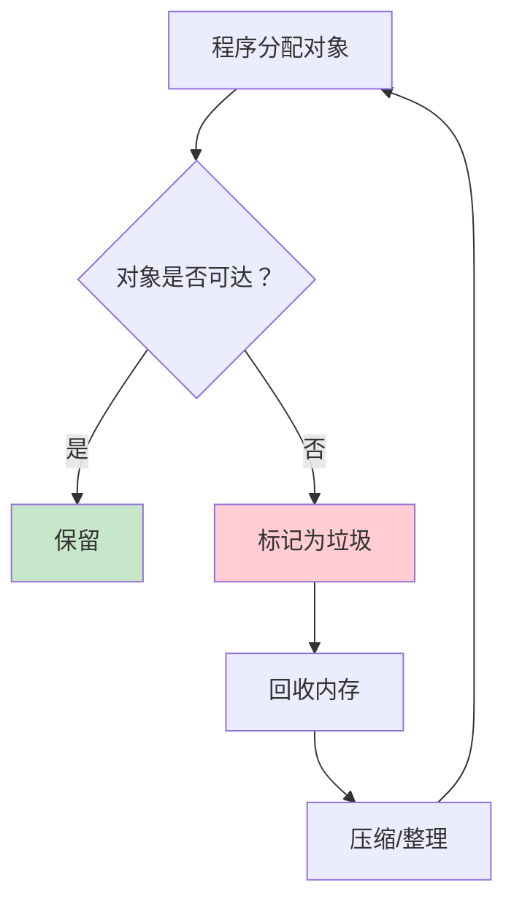
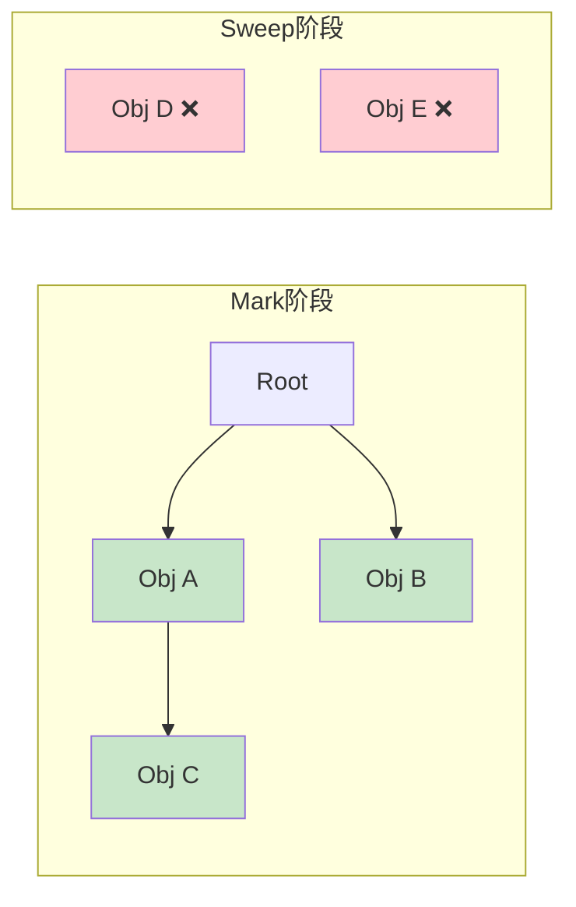
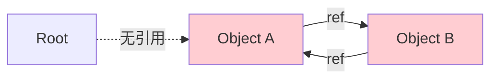
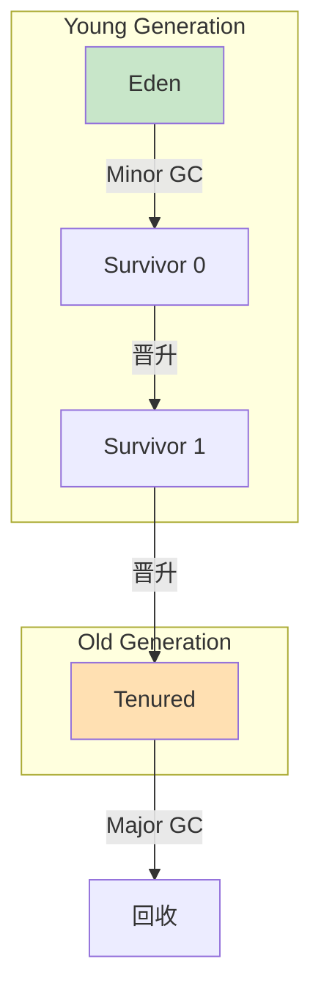
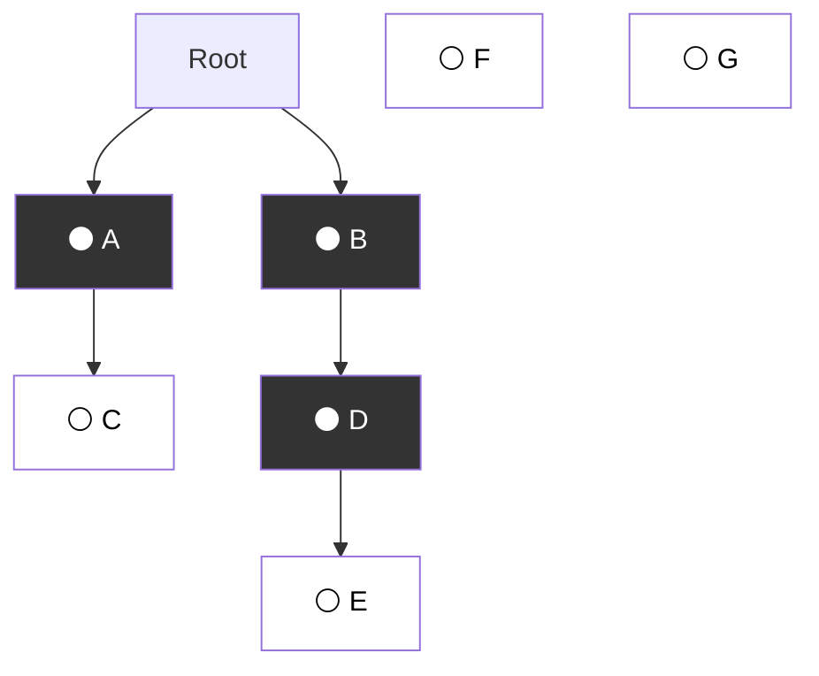
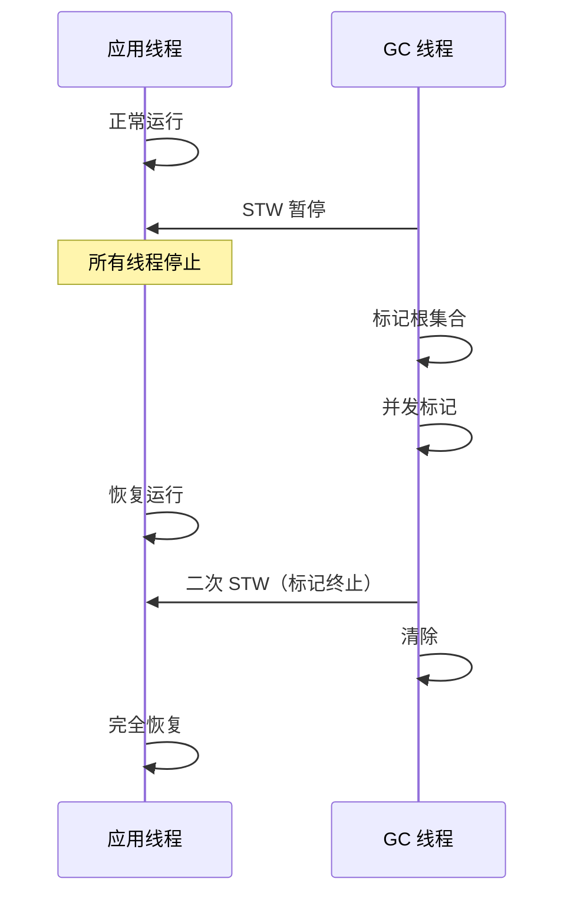
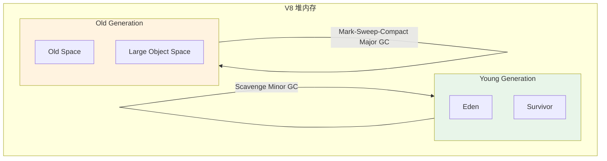
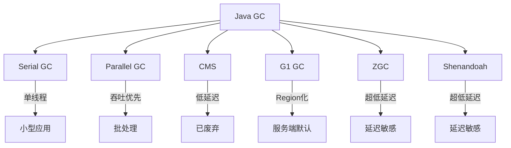
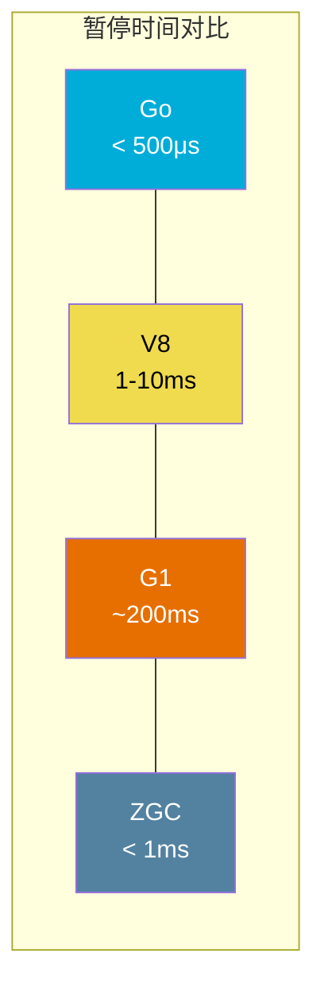
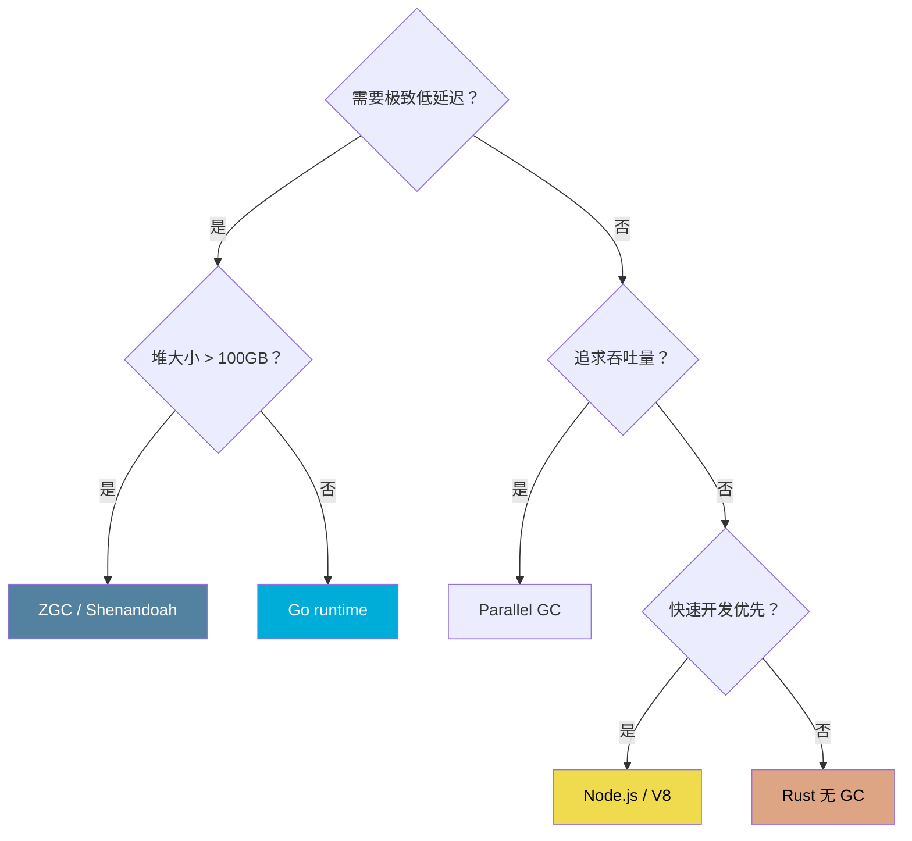

# 垃圾回收原理

> 100 天认知提升计划 | Day 31

---

## 核心概念

### 什么是垃圾回收？

**垃圾回收（Garbage Collection, GC）** 是自动内存管理的核心机制，由运行时系统负责识别和回收不再被程序引用的内存对象，替代手动 `malloc/free` 或 `new/delete`，消除悬垂指针、双重释放、内存泄漏等安全隐患。

**核心问题**：如何高效、准确地判定一块内存"不再被使用"？



### GC 发展时间线

| 年代 | 里程碑 | 贡献者 |
|------|--------|--------|
| 1959 | Mark-Sweep GC（Lisp） | John McCarthy |
| 1960 | 引用计数（Lisp 2） | George Collins |
| 1984 | 分代 GC 理论 | Lieberman & Hewitt |
| 1991 | 增量式三色标记 | Dijkstra et al. |
| 1995 | Java 1.0 GC | Sun Microsystems |
| 2008 | V8 并发 GC | Google |
| 2012 | Go concurrent GC | Google |

---

## 经典 GC 算法

### 1. Mark-Sweep（标记-清除）

**原理**：从根集合（栈、全局变量、寄存器）出发，遍历对象图，标记所有可达对象；然后清除未被标记的对象。



**伪代码**：

```c
// Mark 阶段
void mark(Object *obj) {
    if (obj == NULL || obj->marked) return;
    obj->marked = true;
    for (Object *child : obj->references) {
        mark(child);
    }
}

void mark_from_roots() {
    for (Object *root : roots) {
        mark(root);
    }
}

// Sweep 阶段
void sweep() {
    for (Object *obj : heap; obj != NULL; obj = obj->next) {
        if (obj->marked) {
            obj->marked = false;  // 为下一轮重置
        } else {
            free(obj);
        }
    }
}
```

**优缺点**：

| 优点 | 缺点 |
|------|------|
| 实现简单 | 内存碎片化 |
| 能处理循环引用 | STW 暂停时间与堆大小成正比 |
| 无额外内存开销（仅标记位） | 分配速度慢（需维护空闲列表） |

---

### 2. 引用计数（Reference Counting）

**原理**：每个对象维护一个引用计数器，引用 +1，取消引用 -1，计数归零立即回收。

```python
# Python 引用计数示例
import sys

a = [1, 2, 3]    # refcount = 1
b = a             # refcount = 2
del a             # refcount = 1
del b             # refcount = 0 → 立即回收

print(sys.getrefcount([1, 2]))  # 2 (临时引用 + getrefcount 参数)
```

**循环引用问题**：



A 和 B 互相引用，即使 Root 不再引用它们，计数也不为零 → **内存泄漏**。解决方案：配合周期性 Mark-Sweep 作为后备（如 CPython 的 `gc.collect()`）。

| 优点 | 缺点 |
|------|------|
| 即时回收，无 STW | 循环引用无法处理 |
| 内存友好（碎片少） | 计数器维护开销 |
| 适合实时系统 | 多线程下计数器需原子操作 |

---

### 3. 分代假说与分代 GC

**分代假说（Generational Hypothesis）**：**弱分代假说**——绝大多数对象朝生夕死；**强分代假说**——越老的对象越可能存活。



**核心思想**：将堆分为 Young/Old（部分还有 Perm/Metaspace），对 Young 区频繁回收（Minor GC），对 Old 区较少回收（Major/Full GC）。

**JVM 分代布局**：

| 区域 | 大小比例 | GC 频率 | 回收算法 |
|------|---------|---------|---------|
| Eden | 8 | 高 | 复制算法 |
| Survivor 0/1 | 各 1 | 高 | 复制算法 |
| Old | ~2/3 堆 | 低 | Mark-Sweep-Compact |

---

### 4. 三色标记法（Tri-color Marking）

**Dijkstra 三色标记**是并发 GC 的理论基础，将对象分为三种颜色：

| 颜色 | 含义 | 状态 |
|------|------|------|
| ⬜ 白色 | 未被访问 | 候选垃圾 |
| ⬛ 灰色 | 已访问但子节点未全处理 | 待处理 |
| ⬛ 黑色 | 已访问且子节点全处理 | 存活 |



**算法流程**：
1. 所有对象初始化为白色
2. 将根对象标记为灰色，放入灰色队列
3. 从灰色队列取出一个对象，将其引用的白色对象标灰，自身标黑
4. 重复步骤 3 直到灰色队列为空
5. 所有剩余白色对象即为垃圾

**并发标记的遗漏问题**：

条件：**对象 A（黑）→ 新引用 → 对象 C（白）**，且 C 到达 A 的所有灰色引用都被移除 → C 被错误回收。

**解决方案**：**写屏障（Write Barrier）**

- **Dijkstra 插入屏障**：新增引用时，将目标标灰（Go 1.8 前、V8 使用）
- **Yuasa 删除屏障**：删除引用时，将旧目标标灰（Go 1.8 使用）
- **混合屏障**：Go 1.8+ 结合两者，大幅减少 STW

---

## STW（Stop-The-World）分析

### 为什么需要 STW？

在标记过程中，如果应用程序并发修改对象图，可能导致：
1. **浮动垃圾**（Floating Garbage）：已标记为存活但实际已不可达 → 可容忍
2. **对象丢失**：存活对象被误回收 → **致命错误**



### 各语言 STW 对比

| 运行时 | GC 算法 | 典型 STW | 目标场景 |
|--------|---------|---------|---------|
| Go 1.22+ | 并发三色+分代 | **< 500μs** | 低延迟服务 |
| V8 (Node.js) | 并发三色+分代 | **1-10ms** | 交互式应用 |
| JVM (G1) | 分代+Region | **10-200ms** | 通用服务端 |
| JVM (ZGC) | 着色指针+读屏障 | **< 1ms**（< 10ms） | 超低延迟 |
| Python | 引用计数+分代 | **不可控** | 脚本/数据处理 |
| Rust | 无 GC | **0** | 系统编程 |

---

## Go GC 深度解析

### Go GC 演进

| 版本 | 算法 | STW 时间 |
|------|------|---------|
| Go 1.0 | STW Mark-Sweep | 数百 ms |
| Go 1.5 | 并发三色标记 | < 10ms |
| Go 1.8 | 混合写屏障 | < 1ms |
| Go 1.19 | 软内存上限 | 更平稳 |
| Go 1.22+ | 实验性分代 | < 500μs |

### Go GC 调优参数

```go
// 设置 GC 目标内存比例（默认 GOGC=100，即堆增长 100% 时触发）
debug.SetGCPercent(200)  // 允许堆增长 200%

// 设置内存上限（Go 1.19+）
debug.SetMemoryLimit(1 << 30)  // 1GB 上限

// 手动触发 GC
runtime.GC()

// 关闭 GC（不推荐）
debug.SetGCPercent(-1)
```

### Go GC Trace 实战

```bash
# 运行并查看 GC trace
GODEBUG=gctrace=1 go run main.go

# 输出示例：
# gc 1 @0.003s 5%: 0.018+1.2+0.012 ms clock, 0.14+0.52/1.1/0.28+0.095 ms cpu, 4->4->1 MB, 5 MB goal, 8 P
#       ↑        ↑    ↑                ↑                              ↑           ↑        ↑
#    GC序号   时间 占比  STW标记     并发标记时间                    堆变化      目标堆    P数
```

---

## V8 GC 深度解析

### V8 双垃圾回收器架构

V8 对 Young 和 Old 代使用不同回收器：



| 回收器 | 目标 | 算法 | 频率 | 暂停 |
|--------|------|------|------|------|
| **Scavenge** (Minor GC) | Young 区 | Cheney 半空间复制 | 高频（~1-2ms） | 短 |
| **Mark-Sweep-Compact** (Major GC) | Old 区 | 三色并发标记 | 低频 | 较长 |

### V8 内存调优（Node.js）

```javascript
// Node.js 启动参数
// --max-old-space-size=4096   设置 Old 区上限为 4GB
// --max-semi-space-size=2     设置 Semi-space 为 2MB
// --expose-gc                 暴露 global.gc()
// --gc-global                 强制 Full GC

// 代码中手动触发
if (global.gc) {
    global.gc();
}

// 查看堆内存使用
const used = process.memoryUsage();
console.log({
    rss: `${(used.rss / 1024 / 1024).toFixed(2)} MB`,
    heapTotal: `${(used.heapTotal / 1024 / 1024).toFixed(2)} MB`,
    heapUsed: `${(used.heapUsed / 1024 / 1024).toFixed(2)} MB`,
});
```

---

## Java GC 深度解析

### Java GC 家族



| GC | JDK 版本 | 目标 | 最大暂停 | 适用场景 |
|----|---------|------|---------|---------|
| Serial | 1.0+ | 简单 | 几百 ms | 客户端/小应用 |
| Parallel | 1.4+ | 吞吐量 | 几百 ms | 批处理 |
| CMS | 1.4-14 | 低延迟 | ~50ms | **已移除** |
| **G1** | 9+ (默认) | 平衡 | ~200ms | 通用服务端 |
| **ZGC** | 15+ (生产) | 超低延迟 | **< 1ms** | 交易/实时系统 |
| Shenandoah | 12+ | 超低延迟 | < 10ms | 类似 ZGC |

### ZGC 核心技术：着色指针

ZGC 使用 **着色指针（Colored Pointers）**，在 64 位指针中嵌入元数据，实现读屏障并发标记：

```
| 4位标记 | 0 | 42位地址 | 18位未用 |
|  ↑       |            |
|  Marked0/1/Remapped/Finalizable
```

无需额外标记位图，直接在指针上操作，结合读屏障实现**并发整理**。

---

## Go / V8 / Java GC 综合对比

| 维度 | Go | V8 (Node.js) | Java (G1/ZGC) |
|------|-----|--------------|---------------|
| **基础算法** | 并发三色标记-清除 | 分代+三色并发 | 分代+Region/着色指针 |
| **分代支持** | 1.22+ 实验性 | ✅ 完整 | ✅ 完整 |
| **写屏障类型** | 混合（插入+删除） | Dijkstra 插入 | G1: SATB / ZGC: 读屏障 |
| **内存整理** | ❌ 不压缩 | ✅ Mark-Compact | ✅ Region 迁移 |
| **典型暂停** | < 500μs | 1-10ms | G1: ~200ms / ZGC: < 1ms |
| **调优复杂度** | 低（GOGC/MemoryLimit） | 中（堆大小参数） | 高（数十个参数） |
| **堆上限** | TB 级 | ~4GB（默认） | TB 级 |
| **适用场景** | 高并发服务 | Web/CLI 工具 | 企业级服务端 |



---

## 实践任务

### 任务 1：Go GC 调优实验

```go
// gc_test.go
package main

import (
    "fmt"
    "runtime"
    "runtime/debug"
    "time"
)

func createGarbage() {
    // 创建大量短生命周期对象
    for i := 0; i < 1000000; i++ {
        _ = make([]byte, 100)
    }
}

func main() {
    // 实验 1：默认 GOGC=100
    fmt.Println("=== GOGC=100 ===")
    testGC(100)

    // 实验 2：GOGC=200（减少 GC 频率，更大堆）
    fmt.Println("\n=== GOGC=200 ===")
    testGC(200)

    // 实验 3：GOGC=50（更频繁 GC，更小堆）
    fmt.Println("\n=== GOGC=50 ===")
    testGC(50)
}

func testGC(percent int) {
    debug.SetGCPercent(percent)
    var m1, m2 runtime.MemStats
    runtime.GC()
    runtime.ReadMemStats(&m1)

    start := time.Now()
    for i := 0; i < 100; i++ {
        createGarbage()
    }
    runtime.GC()
    runtime.ReadMemStats(&m2)

    fmt.Printf("耗时: %v\n", time.Since(start))
    fmt.Printf("GC 次数: %d\n", m2.NumGC-m1.NumGC)
    fmt.Printf("堆峰值: %.2f MB\n", float64(m2.HeapInuse)/1024/1024)
}
```

```bash
# 运行并观察 GC 行为
GODEBUG=gctrace=1 go run gc_test.go
```

### 任务 2：Node.js 内存泄漏排查

```javascript
// leak.js - 制造并排查内存泄漏
const heapdump = require('heapdump');

const leaks = [];

function leak() {
    // 闭包泄漏：不断追加到外部数组
    leaks.push({
        data: new Array(1000).fill('x'.repeat(1000)),
        timestamp: Date.now()
    });
}

setInterval(() => {
    leak();
    const used = process.memoryUsage();
    console.log(`Heap: ${(used.heapUsed / 1024 / 1024).toFixed(2)} MB`);
}, 100);

// 30 秒后生成堆快照
setTimeout(() => {
    heapdump.writeSnapshot('/tmp/leak.heapsnapshot');
    console.log('Heap snapshot saved');
}, 30000);
```

### 任务 3：JVM GC 日志分析

```bash
# 启动 Java 应用并记录 GC 日志
java -XX:+UseG1GC \
     -Xms512m -Xmx2g \
     -Xlog:gc*:gc.log \
     -jar app.jar

# 使用 GCEasy 分析
# 上传 gc.log 到 https://gceasy.io
```

---

## 关键收获

| 要点 | 说明 |
|------|------|
| **分代假说是 GC 优化的基石** | 大多数对象短命，分代回收可大幅降低全堆扫描开销 |
| **三色标记是并发 GC 的核心** | 通过颜色区分对象状态，写屏障保证正确性 |
| **STW 是 GC 的核心矛盾** | 吞吐量 vs 延迟的 trade-off，不同运行时选择不同平衡点 |
| **Go 追求极低延迟** | 牺牲一定的吞吐和内存效率，换取 < 1ms STW |
| **ZGC 代表未来方向** | 着色指针 + 读屏障，实现 < 1ms 亚毫秒暂停 |
| **无 GC 也是一种选择** | Rust/C++ 通过所有权系统在编译期管理内存，零运行时开销 |

### GC 选择决策树



---

## 参考资料

- [Go GC Guide - A Guide to the Go Garbage Collector](https://tip.golang.org/doc/gc-guide)
- [V8 Trash Talk: Orinoco](https://v8.dev/blog/trash-talk)
- [ZGC Design](https://wiki.open.openjdk.org/display/zgc)
- [The Garbage Collection Handbook](https://gchandbook.org/) — Richard Jones et al.
- [Memory Management Reference](https://www.memorymanagement.org/)

---

*学习日期：2026-04-10*
