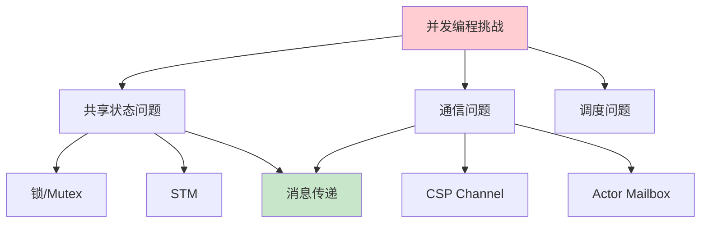
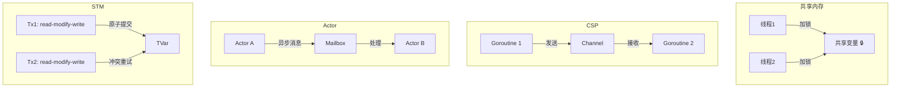
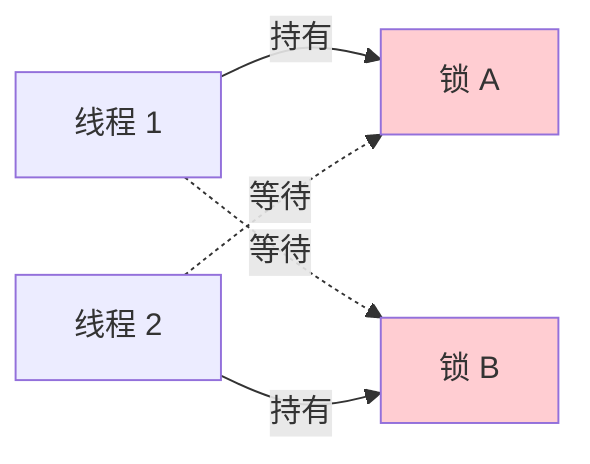
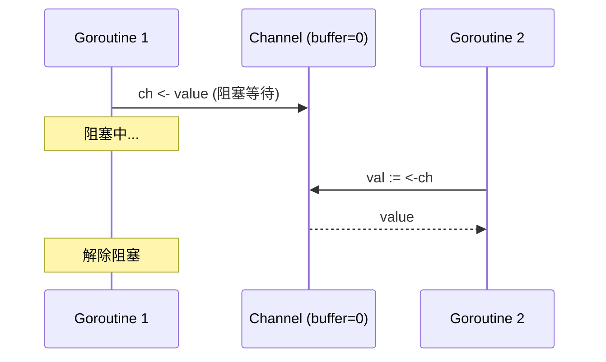
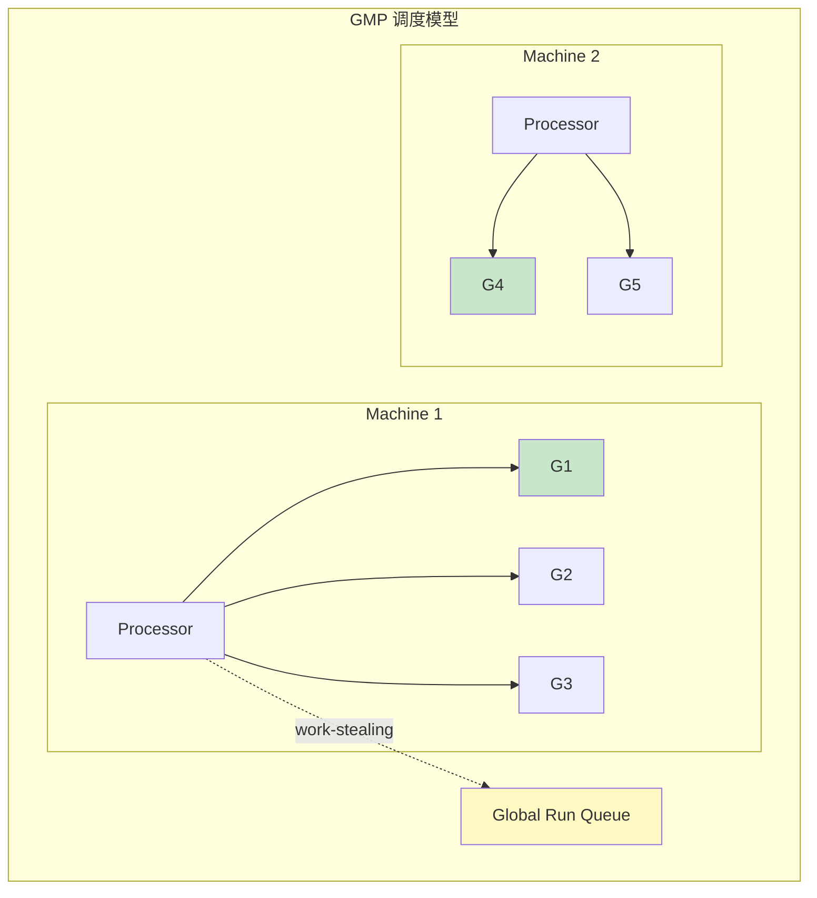
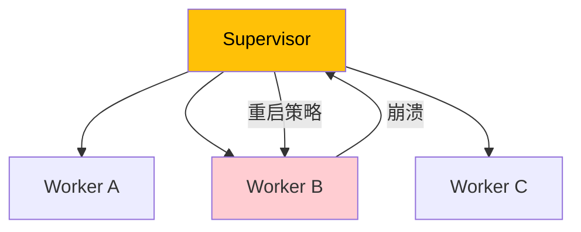
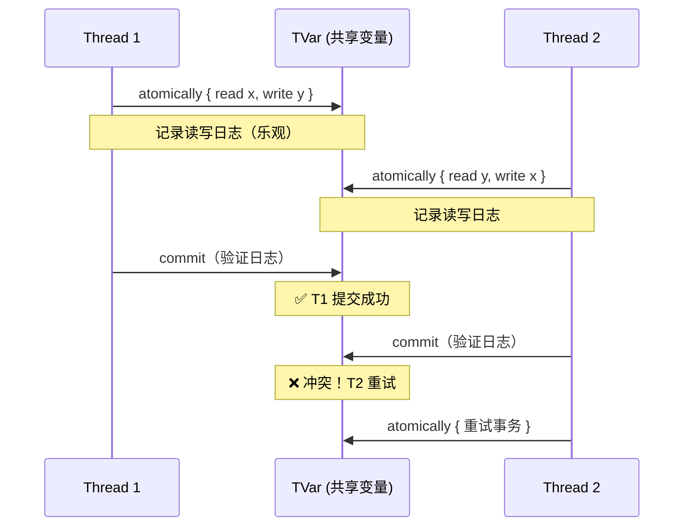
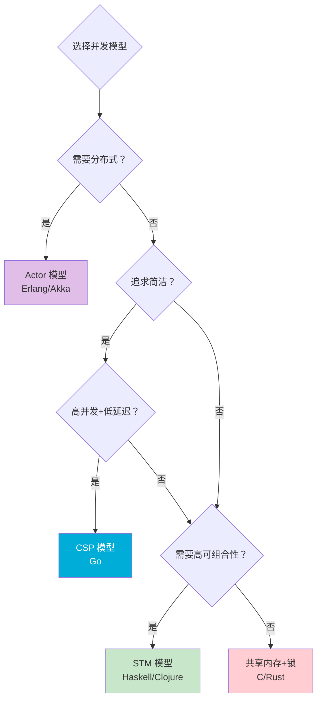

# 并发模型对比

> 100 天认知提升计划 | Day 32

---

## 核心概念

### 为什么需要并发模型？

**并发（Concurrency）** 是程序结构化处理多个任务的能力；**并行（Parallelism）** 是同时执行多个任务。并发模型决定了程序如何在多任务间协调共享资源、通信和同步。

**核心问题**：多个执行单元如何安全、高效地协作？

> Concurrency is about *dealing with* lots of things at once. Parallelism is about *doing* lots of things at once. — Rob Pike



---

## 四大并发模型概览

| 模型 | 哲学 | 代表语言 | 核心抽象 | 通信方式 |
|------|------|---------|---------|---------|
| **共享内存+锁** | 悲观并发 | C/C++/Java | Mutex/Semaphore | 共享变量+锁 |
| **CSP** | 通信即同步 | Go | Goroutine + Channel | 同步 Channel |
| **Actor** | 万物皆Actor | Erlang/Akka | Actor + Mailbox | 异步消息 |
| **STM** | 乐观并发 | Haskell/Clojure | 原子事务 | 事务变量 |



---

## 1. 共享内存 + 锁

### 基本原理

最传统、最直接的并发模型。多个线程共享同一块内存空间，通过锁（Mutex）保证互斥访问。

```java
// Java: 经典的线程安全计数器
public class Counter {
    private int count = 0;

    // synchronized = 内置锁
    public synchronized void increment() {
        count++;
    }

    public synchronized int getCount() {
        return count;
    }
}

// 更灵活的 ReentrantLock
public class BetterCounter {
    private final ReentrantLock lock = new ReentrantLock();
    private int count = 0;

    public void increment() {
        lock.lock();
        try {
            count++;
        } finally {
            lock.unlock();
        }
    }
}
```

### 经典问题：死锁



```c
// C: Pthreads 死锁示例
pthread_mutex_t lockA = PTHREAD_MUTEX_INITIALIZER;
pthread_mutex_t lockB = PTHREAD_MUTEX_INITIALIZER;

// 线程 1: lock A → lock B
void *thread1(void *arg) {
    pthread_mutex_lock(&lockA);
    sleep(1);  // 增加死锁概率
    pthread_mutex_lock(&lockB);  // 💀 死锁！
    // ...
}

// 线程 2: lock B → lock A（反序）
void *thread2(void *arg) {
    pthread_mutex_lock(&lockB);
    sleep(1);
    pthread_mutex_lock(&lockA);  // 💀 死锁！
    // ...
}
```

| 优点 | 缺点 |
|------|------|
| 性能可预测 | 死锁、活锁、优先级反转 |
| 细粒度控制 | 难以推理和调试 |
| 适合系统编程 | 不可组合（锁组合易死锁） |

---

## 2. CSP 模型（Communicating Sequential Processes）

### 核心哲学

> Don't communicate by sharing memory; share memory by communicating. — Go Proverb

CSP 模型由 Tony Hoare（1978）提出，核心思想：**通过 Channel 通信，而非共享变量**。Goroutine 是轻量级协程，Channel 是同步通信管道。

### Go 并发基础

```go
package main

import (
    "fmt"
    "sync"
    "time"
)

// 基础 goroutine + channel
func producer(ch chan<- int) {
    for i := 0; i < 10; i++ {
        ch <- i  // 发送到 channel
    }
    close(ch)
}

func consumer(ch <-chan int, done chan<- struct{}) {
    for val := range ch {  // 从 channel 接收
        fmt.Println("Received:", val)
    }
    done <- struct{}{}
}

func main() {
    ch := make(chan int, 5)       // 带缓冲 channel
    done := make(chan struct{})

    go producer(ch)
    go consumer(ch, done)

    <-done  // 等待完成
}
```

### Channel 类型与语义

| Channel 类型 | 声明 | 行为 |
|-------------|------|------|
| 无缓冲 | `make(chan T)` | 同步：发送方阻塞直到接收方就绪 |
| 带缓冲 | `make(chan T, N)` | 异步：缓冲区满时阻塞 |
| 单向发送 | `chan<- T` | 只能发送 |
| 单向接收 | `<-chan T` | 只能接收 |



### select 多路复用

```go
// select 实现 timeout 和非阻塞操作
select {
case msg := <-ch1:
    fmt.Println("Received from ch1:", msg)
case msg := <-ch2:
    fmt.Println("Received from ch2:", msg)
case <-time.After(5 * time.Second):
    fmt.Println("Timeout!")
default:
    fmt.Println("No message available")  // 非阻塞
}
```

### 常见并发模式

```go
// 模式 1: Fan-out / Fan-in
func fanOutFanIn() {
    input := make(chan int, 100)
    output := make(chan int, 100)

    // Fan-out: 启动多个 worker
    var wg sync.WaitGroup
    for i := 0; i < 5; i++ {
        wg.Add(1)
        go func() {
            defer wg.Done()
            for val := range input {
                result := heavyProcess(val)
                output <- result
            }
        }()
    }

    // Fan-in: 等待所有 worker 完成
    go func() {
        wg.Wait()
        close(output)
    }()

    // 收集结果
    for result := range output {
        fmt.Println(result)
    }
}

// 模式 2: Pipeline
func pipeline() {
    // stage1 → stage2 → stage3
    ch1 := generate(1, 2, 3, 4, 5)
    ch2 := filter(ch1, func(v int) bool { return v%2 == 0 })
    ch3 := transform(ch2, func(v int) int { return v * 10 })

    for v := range ch3 {
        fmt.Println(v)  // 20, 40
    }
}

// 模式 3: Context 取消
func worker(ctx context.Context, ch <-chan int) {
    for {
        select {
        case <-ctx.Done():
            fmt.Println("Worker cancelled:", ctx.Err())
            return
        case val := <-ch:
            process(val)
        }
    }
}
```

### Goroutine 调度器：GMP 模型



| 组件 | 说明 | 数量 |
|------|------|------|
| **G** (Goroutine) | 用户态协程，初始栈 2KB | 百万级 |
| **M** (Machine) | 操作系统线程 | 按需创建 |
| **P** (Processor) | 逻辑处理器，持有本地队列 | GOMAXPROCS（默认=CPU核数） |

**关键机制**：Work-stealing（工作窃取）——空闲 P 从其他 P 或全局队列窃取 G，保证负载均衡。

---

## 3. Actor 模型

### 核心哲学

> Everything is an Actor. — Carl Hewitt (1973)

每个 Actor 是独立的计算实体，拥有：
- **私有状态**（不共享）
- **Mailbox**（消息队列）
- **行为**（处理消息的逻辑）

```mermaid
flowchart LR
    subgraph Actor系统
        A1[Actor A<br/>state: count=0] -->|消息| A2[Actor B<br/>state: items=[]]
        A2 -->|消息| A3[Actor C<br/>state: config={}]
        A1 -->|消息| A3
        A3 -->|消息| A1
    end

    style A1 fill:#e1bee7
    style A2 fill:#bbdefb
    style A3 fill:#c8e6c9
```

### Erlang/Akka 实现

```erlang
%% Erlang: Actor 示例 - 计数器
-module(counter).
-export([start/0, increment/1, get_count/1]).

start() ->
    spawn(fun() -> loop(0) end).

increment(CounterPid) ->
    CounterPid ! {increment, 1}.

get_count(CounterPid) ->
    CounterPid ! {get_count, self()},
    receive
        {count, N} -> N
    end.

loop(Count) ->
    receive
        {increment, N} ->
            loop(Count + N);
        {get_count, Caller} ->
            Caller ! {count, Count},
            loop(Count)
    end.
```

```scala
// Akka (Scala): Actor 示例
import akka.actor._

class Counter extends Actor {
  var count = 0

  def receive = {
    case "increment" =>
      count += 1
    case "get" =>
      sender() ! count
  }
}

// 使用
val system = ActorSystem("MySystem")
val counter = system.actorOf(Props[Counter](), "counter")

counter ! "increment"
counter ! "increment"
counter ! "get"  // 异步接收回复
```

### Actor 监督策略（Supervisor）



| 策略 | 说明 |
|------|------|
| One-for-One | 只重启崩溃的 Actor |
| One-for-All | 重启所有同级 Actor |
| All-for-One | 重启崩溃 Actor 及其之后创建的所有 Actor |
| Rest-for-One | 重启崩溃 Actor 及其依赖者 |

### Erlang 的 "Let it crash" 哲学

与传统防御性编程不同，Erlang 主张：**让 Actor 崩溃，由 Supervisor 重启**。

| 传统防御性编程 | Let it crash |
|--------------|-------------|
| 每处代码 try-catch | Actor 崩溃后 Supervisor 重启 |
| 代码充满防御逻辑 | 业务代码简洁 |
| 错误可能被静默吞掉 | 崩溃可见、可恢复 |
| 适合单体应用 | 适合高容错分布式系统 |

---

## 4. STM 模型（Software Transactional Memory）

### 核心哲学

> 乐观地假设没有冲突，冲突时重试。

STM 将数据库事务的概念引入内存操作：一组内存读写被包装为**原子事务**，要么全部成功，要么全部回滚。



### Haskell STM

```haskell
import Control.Concurrent.STM
import Control.Concurrent (forkIO, threadDelay)

-- STM 变量
type Account = TVar Int

-- 原子转账
transfer :: Int -> Account -> Account -> STM ()
transfer amount from to = do
    balance <- readTVar from
    if balance < amount
        then retry  -- 余额不足，自动阻塞等待
        else do
            writeTVar from (balance - amount)
            destBalance <- readTVar to
            writeTVar to (destBalance + amount)

-- 组合事务
main :: IO ()
main = do
    alice <- newTVarIO 1000
    bob   <- newTVarIO 500

    -- 线程 1: Alice 转 Bob
    forkIO $ do
        atomically $ transfer 200 alice bob
        putStrLn "Alice → Bob: 200"

    -- 线程 2: Bob 转 Alice（如果余额足够）
    forkIO $ do
        atomically $ transfer 100 bob alice
        putStrLn "Bob → Alice: 100"

    -- 检查余额
    threadDelay 1000000
    a <- readTVarIO alice
    b <- readTVarIO bob
    putStrLn $ "Alice: " ++ show a ++ ", Bob: " ++ show b
```

### Clojure STM

```clojure
;; Clojure: ref + dosync
(def account-a (ref 1000))
(def account-b (ref 500))

;; 原子转账
(defn transfer [amount from to]
  (dosync
    (let [balance (deref from)]
      (if (>= balance amount)
        (do
          (alter from - amount)
          (alter to + amount))
        (throw (Exception. "Insufficient funds"))))))

;; 使用
(transfer 200 account-a account-b)
;; @account-a → 800, @account-b → 700
```

### STM 的优势：可组合性

```haskell
-- STM 事务可以自由组合！
atomically $ do
    transfer 100 alice bob
    transfer 50  bob   charlie
    -- 整体是原子的，要么全成功，要么全重试
```

这是锁无法做到的——两把锁的组合容易死锁，但两个 STM 事务的组合只是更大的事务。

---

## 四大模型深度对比

### 功能对比矩阵

| 维度 | 共享内存+锁 | CSP | Actor | STM |
|------|-----------|-----|-------|-----|
| **学习曲线** | 中 | 低 | 中 | 高 |
| **可组合性** | ❌ 差 | ✅ 好 | ✅ 好 | ✅✅ 最佳 |
| **分布式支持** | ❌ 单机 | ❌ 单机 | ✅ 原生支持 | ❌ 单机 |
| **错误处理** | 手动 | deferred/channel | Supervisor 树 | 自动重试 |
| **调试难度** | 高（竞态条件） | 中 | 中 | 低（确定性重试） |
| **性能开销** | 低 | 低（用户态调度） | 中（消息序列化） | 中（日志验证） |
| **死锁风险** | 高 | 低（无锁） | 低（无共享状态） | 无（自动重试） |

### 适用场景决策



### 性能对比（典型场景）

| 场景 | 共享内存 | CSP | Actor | STM |
|------|---------|-----|-------|-----|
| 1K 并发任务 | ⚡ 最快 | ⚡ 快 | 🔄 中（消息开销） | 🔄 中（日志开销） |
| 1M 并发任务 | ❌ 线程不够 | ✅ 协程轻松 | ✅ 轻量进程 | ❌ 内存压力 |
| 跨节点通信 | ❌ | ❌ | ✅ 透明 | ❌ |
| 复杂事务 | ❌ 难保证 | ⚠️ 需手动 | ⚠️ 需手动 | ✅ 原生支持 |

---

## 混合模型：现实中的选择

实际项目中，多种模型常常共存：

### Go：CSP + 共享内存

```go
// Go 实际上同时支持两种模式
// 模式 1: CSP（推荐）
ch <- result

// 模式 2: 共享内存（sync 包）
var mu sync.Mutex
mu.Lock()
sharedState++
mu.Unlock()

// 模式 3: 原子操作
var counter atomic.Int64
counter.Add(1)
```

### Rust：所有权 + 多种并发原语

```rust
use std::sync::{Arc, Mutex};
use std::thread;

// Rust 通过类型系统在编译期保证线程安全
fn main() {
    let data = Arc::new(Mutex::new(vec![1, 2, 3]));

    let mut handles = vec![];
    for _ in 0..4 {
        let data = Arc::clone(&data);
        handles.push(thread::spawn(move || {
            let mut data = data.lock().unwrap();
            data.push(4);
        }));
    }

    for handle in handles {
        handle.join().unwrap();
    }
}
```

**Rust 的类型系统保证**：`Send` trait 表示可跨线程传递，`Sync` trait 表示可被多线程共享引用。编译器在编译期拒绝数据竞争。

---

## 实践任务

### 任务 1：Go CSP Pipeline 实战

实现一个并发爬虫 pipeline：fetcher → parser → storage，每个阶段通过 channel 连接，支持 context 取消和错误传播。

```go
package main

import (
    "context"
    "fmt"
    "sync"
    "time"
)

func fetcher(ctx context.Context, urls []string) <-chan string {
    out := make(chan string)
    go func() {
        defer close(out)
        for _, url := range urls {
            select {
            case <-ctx.Done():
                return
            case out <- fmt.Sprintf("fetched: %s", url):
            }
        }
    }()
    return out
}

func parser(ctx context.Context, in <-chan string) <-chan string {
    out := make(chan string)
    go func() {
        defer close(out)
        for raw := range in {
            select {
            case <-ctx.Done():
                return
            case out <- fmt.Sprintf("parsed: [%s]", raw):
            }
        }
    }()
    return out
}

func main() {
    urls := []string{"a.com", "b.com", "c.com", "d.com", "e.com"}
    ctx, cancel := context.WithTimeout(context.Background(), 3*time.Second)
    defer cancel()

    // Pipeline: fetch → parse
    ch1 := fetcher(ctx, urls)
    ch2 := parser(ctx, ch1)

    for result := range ch2 {
        fmt.Println(result)
    }
}
```

### 任务 2：Erlang Actor 热升级

```erlang
%% 实现一个简单的 chat server，练习 Actor 模式
%% 1. 每个 client 是一个 Actor
%% 2. chat_room 是一个 Supervisor
%% 3. 支持动态加入/离开
%% 4. 练习 Erlang shell 中的热代码升级
```

### 任务 3：对比基准测试

```go
// benchmark_test.go
// 对比 CSP channel vs Mutex 在不同场景下的性能

func BenchmarkMutex(b *testing.B) {
    var mu sync.Mutex
    var count int
    b.RunParallel(func(pb *testing.PB) {
        for pb.Next() {
            mu.Lock()
            count++
            mu.Unlock()
        }
    })
}

func BenchmarkChannel(b *testing.B) {
    ch := make(chan struct{}, 1)
    var count int
    b.RunParallel(func(pb *testing.PB) {
        for pb.Next() {
            ch <- struct{}{}
            count++
            <-ch
        }
    })
}

func BenchmarkAtomic(b *testing.B) {
    var count atomic.Int64
    b.RunParallel(func(pb *testing.PB) {
        for pb.Next() {
            count.Add(1)
        }
    })
}
```

---

## 关键收获

| 要点 | 说明 |
|------|------|
| **没有银弹** | 每种模型都有最佳适用场景 |
| **CSP 的优势是简洁** | Channel 作为一等公民，代码易读易推理 |
| **Actor 的优势是容错** | Supervisor 树 + Let it crash，适合分布式 |
| **STM 的优势是可组合** | 事务自由组合，不会死锁 |
| **Go 选择了 CSP 但不排斥其他** | sync.Mutex、atomic、singleflight 等并存 |
| **Rust 在编译期消灭数据竞争** | 类型系统 > 运行时检查 |
| **模型可以混合使用** | 现实项目中常见多模型共存 |

---

## 参考资料

- [Communicating Sequential Processes — C.A.R. Hoare (1978)](https://www.cs.cmu.edu/~crary/819-f09/Hoare78.pdf)
- [Go Concurrency Patterns (Rob Pike, Google I/O 2012)](https://talks.golang.org/2012/concurrency.slide)
- [Akka Documentation](https://doc.akka.io/)
- [Beautiful Concurrency (Simon Peyton Jones)](https://www.microsoft.com/en-us/research/wp-content/uploads/2016/02/beautiful.pdf)
- [Erlang Programming (Francesco Cesarini)](https://www.oreilly.com/library/view/programming-erlang-2nd/9781680503971/)
- [Seven Concurrency Models in Seven Weeks](https://pragprog.com/titles/pb7con/seven-concurrency-models-in-seven-weeks/)

---

*学习日期：2026-04-11*
