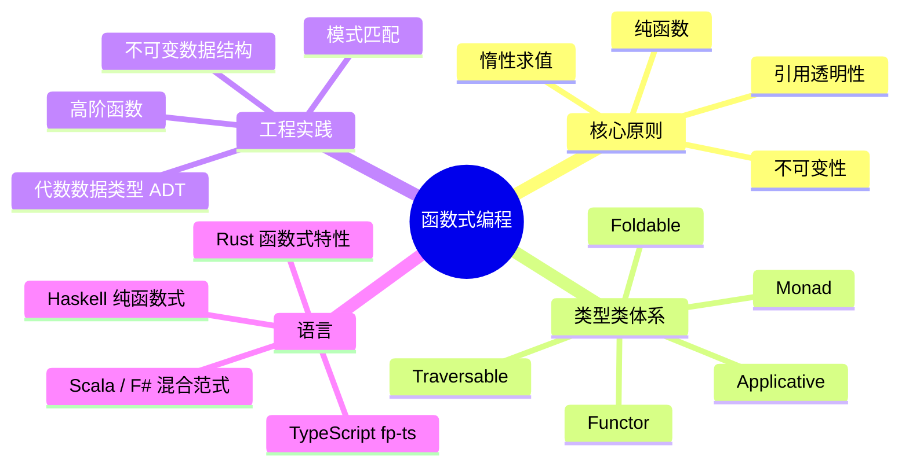
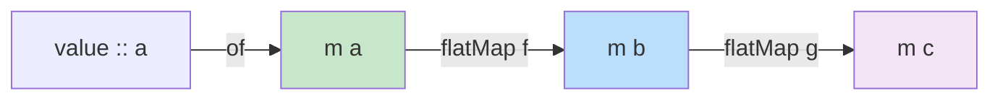

# 函数式编程范式

> 100 天认知提升计划 | Day 33

---

## 核心概念

### 什么是函数式编程？

函数式编程（Functional Programming, FP）是一种以**数学函数**为基本构建块的编程范式。它强调：

- **纯函数**：相同输入永远产生相同输出，无副作用
- **不可变性**：数据一旦创建就不被修改
- **声明式**：描述"做什么"而非"怎么做"
- **组合性**：通过函数组合构建复杂逻辑



### 纯函数（Pure Function）

纯函数是 FP 的基石，满足两个条件：

1. **确定性**：对于相同输入，始终返回相同输出
2. **无副作用**：不修改外部状态，不进行 I/O

```haskell
-- Haskell: 纯函数
add :: Int -> Int -> Int
add x y = x + y

-- 不纯！有副作用
counter :: IORef Int -> IO Int
counter ref = do
  modifyIORef ref (+1)
  readIORef ref
```

```typescript
// TypeScript: 纯 vs 不纯
// 纯函数 ✅
const add = (x: number, y: number): number => x + y;

// 不纯 ❌ — 依赖外部状态
let count = 0;
const increment = (): number => ++count;

// 纯化 ✅ — 显式传递状态
const increment = (count: number): number => count + 1;
```

**引用透明性**（Referential Transparency）：如果一个表达式可以被它的值替换而不改变程序行为，则它是引用透明的。

### 不可变性（Immutability）

不可变数据一旦创建就不能被修改，任何"修改"操作都会返回新的数据结构。

```typescript
// TypeScript: 不可变操作
interface User {
  readonly name: string;
  readonly age: number;
  readonly tags: ReadonlyArray<string>;
}

// ✅ 创建新对象而非修改
const updateUser = (user: User, newName: string): User => ({
  ...user,
  name: newName,
});

// 持久化数据结构（结构共享）
// fp-ts/Immutable.js 中的 List/Map
```

```mermaid
graph LR
    subgraph "可变（命令式）"
        A[数组 [1,2,3]] -->|push 4| B[数组 [1,2,3,4]]
    end
    subgraph "不可变（函数式）"
        C[数组 [1,2,3]] -->|concat [4]| D[新数组 [1,2,3,4]]
        C -.->|原数据不变| C
    end

    style B fill:#ffcdd2
    style D fill:#c8e6c9
```

#### 持久化数据结构与结构共享

不可变不意味着每次都完整复制——**结构共享**（Structural Sharing）让不可变数据结构高效：

| 数据结构 | 可变操作 | 不可变操作（结构共享） |
|----------|---------|---------------------|
| 数组 push | O(1) 均摊 | O(n)（朴素复制）/ O(log₃₂ n)（Trie） |
| HashMap 插入 | O(1) 均摊 | O(log₃₂ n)（HAMT） |
| List prepend | O(1) | O(1)（链表头插） |

---

## Functor、Applicative、Monad

这是 FP 中最核心的三个抽象，它们构成一个递进的层次结构：

```mermaid
graph TD
    A[Functor<br/>map: f → Ff] --> B[Applicative<br/>ap: F(f→g) → Ff → Fg]
    B --> C[Monad<br/>flatMap: Ff → (f→Fg) → Fg]

    style A fill:#c8e6c9
    style B fill:#bbdefb
    style C fill:#f3e5f5
```

### Functor（函子）

**Functor** 是可以用 `map` 函数遍历并转换内部值的容器。

**核心操作**：`map :: Functor f => f a → (a → b) → f b`

```typescript
// fp-ts: Functor
import * as O from 'fp-ts/Option';
import { pipe } from 'fp-ts/function';

// Option 是一个 Functor
const result1 = pipe(
  O.some(42),
  O.map(n => n * 2)  // Some(84)
);

const result2 = pipe(
  O.none,
  O.map(n => n * 2)  // None — 安全跳过
);
```

**Functor 定律**：

| 定律 | 描述 | 表达式 |
|------|------|--------|
| 恒等律 | `map(id) === id` | `fa.map(x => x) ≡ fa` |
| 组合律 | `map(f∘g) === map(f)∘map(g)` | `fa.map(g).map(f) ≡ fa.map(x => f(g(x)))` |

```typescript
// 验证 Functor 定律
import * as E from 'fp-ts/Either';

// 恒等律
const id = <A>(a: A): A => a;
const law1 = pipe(E.right(42), E.map(id));  // Right(42) ✅

// 组合律
const f = (x: number) => x * 2;
const g = (x: number) => x + 1;
const lhs = pipe(E.right(3), E.map(g), E.map(f));      // Right(8)
const rhs = pipe(E.right(3), E.map(x => f(g(x))));     // Right(8) ✅
```

### Applicative（应用函子）

**Applicative** 在 Functor 基础上增加了：能够将**包裹在容器中的函数**应用到**包裹在容器中的值**。

**核心操作**：
- `of :: a → f a`（纯值注入）
- `ap :: f (a → b) → f a → f b`（应用包裹的函数）

```typescript
// fp-ts: Applicative — 并行计算
import * as T from 'fp-ts/Task';
import { sequenceT } from 'fp-ts/Apply';

// 两个异步操作并行执行
const fetchUser = T.of({ name: '橙子' });
const fetchPosts = T.of([{ title: 'FP入门' }]);

// Applicative sequenceT 并行执行
const combined = sequenceT(T.ApplicativePar)(fetchUser, fetchPosts);
// Task<[User, Post[]]>
```

```haskell
-- Haskell: Applicative 风格
-- <$> 是 fmap, <*> 是 ap
buildUser :: String -> Int -> User
buildUser name age = User name age

result :: Maybe User
result = buildUser <$> Just "Alice" <*> Just 30
-- Just (User "Alice" 30)

failed :: Maybe User
failed = buildUser <$> Just "Alice" <*> Nothing
-- Nothing — 任一失败则整体失败
```

### Monad（单子）

**Monad** 是 FP 中最强大也最常被误解的抽象。它在 Applicative 基础上增加了 **链式组合**（flatMap/bind）。

**核心操作**：
- `of / return :: a → m a`
- `flatMap / bind :: m a → (a → m b) → m b`

Monad 解决的核心问题：**在有上下文（如可能失败、异步、状态）的计算之间安全地串联**。



#### 常见 Monad 及其用途

| Monad | 上下文 | 用途 | 示例 |
|-------|--------|------|------|
| `Option/Maybe` | 可能没有值 | 安全的空值处理 | 数据库查询 |
| `Either` | 可能失败（带错误信息） | 错误处理 | API 调用 |
| `Task/Future` | 异步计算 | 异步操作 | 网络请求 |
| `IO` | 副作用 | 隔离副作用 | 文件/控制台 |
| `State` | 可变状态 | 纯函数式状态管理 | 计数器、游戏状态 |
| `Reader` | 共享环境 | 依赖注入 | 配置读取 |
| `Writer` | 附加日志 | 审计日志 | 调试追踪 |

#### Haskell IO Monad 深入

```haskell
-- Haskell: IO Monad 将副作用隔离
main :: IO ()
main = do
  putStrLn "你的名字？"         -- IO ()
  name <- getLine               -- IO String, <- 提取值
  putStrLn ("你好, " ++ name)   -- IO ()

-- do 语法糖 ≡ flatMap 链
main :: IO ()
main =
  putStrLn "你的名字？" >>= \_ ->
  getLine >>= \name ->
  putStrLn ("你好, " ++ name)
```

```typescript
// fp-ts: Monad 链式错误处理
import * as O from 'fp-ts/Option';
import * as E from 'fp-ts/Either';
import { pipe } from 'fp-ts/function';

// 业务场景：用户注册流程
const validateEmail = (email: string): E.Either<string, string> =>
  email.includes('@')
    ? E.right(email)
    : E.left('无效邮箱');

const checkDuplicate = (email: string): E.Either<string, string> =>
  email === 'taken@example.com'
    ? E.left('邮箱已注册')
    : E.right(email);

const createUser = (email: string): E.Either<string, { id: string; email: string }> =>
  E.right({ id: crypto.randomUUID(), email });

// Monad 链式调用 — 任一步失败则短路
const register = (email: string) =>
  pipe(
    validateEmail(email),
    E.flatMap(checkDuplicate),
    E.flatMap(createUser)
  );

// 测试
register('bad-email')       // Left('无效邮箱')
register('taken@example.com') // Left('邮箱已注册')
register('new@test.com')    // Right({ id: '...', email: 'new@test.com' })
```

#### State Monad

```typescript
// fp-ts: State Monad — 纯函数式状态管理
import * as S from 'fp-ts/State';

type Stack = readonly number[];

const push = (n: number): S.State<Stack, void> =>
  (stack) => [[n, ...stack], undefined];

const pop: S.State<Stack, number> =
  (stack) => [stack.slice(1), stack[0]];

// 组合状态操作
const program: S.State<Stack, number> = pipe(
  push(3),
  S.chain(() => push(5)),
  S.chain(() => push(7)),
  S.chain(() => pop),  // 弹出 7
  S.chain(() => pop),  // 弹出 5
);

const [finalStack, result] = program([]);
// finalStack = [3], result = 5
```

---

## 代数数据类型（ADT）

### Sum Type 与 Product Type

```typescript
// TypeScript: 代数数据类型

// Product Type（"且" — 所有可能 = 各类型之积）
type Point = { x: number; y: number }; // 状态数 = number × number

// Sum Type（"或" — 所有可能 = 各类型之和）
type Shape =
  | { tag: 'circle'; radius: number }
  | { tag: 'rect'; width: number; height: number }
  | { tag: 'triangle'; base: number; height: number };

// 模式匹配（穷尽检查）
const area = (shape: Shape): number => {
  switch (shape.tag) {
    case 'circle':   return Math.PI * shape.radius ** 2;
    case 'rect':     return shape.width * shape.height;
    case 'triangle': return 0.5 * shape.base * shape.height;
  }
};
```

```haskell
-- Haskell: ADT 定义更优雅
data Shape
  = Circle { radius :: Double }
  | Rect   { width :: Double, height :: Double }
  | Triangle { base :: Double, height :: Double }
  deriving (Show, Eq)

area :: Shape -> Double
area (Circle r)       = pi * r ^ 2
area (Rect w h)       = w * h
area (Triangle b h)   = 0.5 * b * h
```

### 类型组合的代数性质

| 类型 | 定义 | 居民数（实例数） |
|------|------|----------------|
| `Void` | 无值 | 0 |
| `()` (Unit) | 只有一个值 | 1 |
| `Bool` | `True \| False` | 2 |
| `Either a b` | `Left a \| Right b` | a + b |
| `(a, b)` | 元组 | a × b |
| `a → b` | 函数 | bᵃ |
| `Maybe a` | `Nothing \| Just a` | 1 + a |
| `[a]` | 列表 | 1 + a + a² + ... = 1/(1-a) |

---

## 高阶函数与函数组合

### 函数组合

```typescript
// 函数组合
import { pipe, flow } from 'fp-ts/function';

const trim = (s: string) => s.trim();
const toLower = (s: string) => s.toLowerCase();
const split = (sep: string) => (s: string) => s.split(sep);

// pipe: 左到右
const slugify = (s: string) => pipe(
  s,
  trim,
  toLower,
  split(' '),
  words => words.join('-')
);

// flow: 创建组合函数
const slugify2 = flow(trim, toLower, split(' '), ws => ws.join('-'));
```

### Curry 与偏函数应用

```typescript
// 自动柯里化
const add = (a: number) => (b: number) => a + b;

const add5 = add(5);
add5(3);  // 8
add5(10); // 15

// 通用 curry
function curry<A, B, C>(f: (a: A, b: B) => C): (a: A) => (b: B) => C {
  return (a) => (b) => f(a, b);
}
```

---

## fp-ts 实战：类型安全的 API 层

```typescript
// 完整示例：类型安全的 HTTP API 客户端
import * as TE from 'fp-ts/TaskEither';
import * as E from 'fp-ts/Either';
import * as O from 'fp-ts/Option';
import { pipe } from 'fp-ts/function';

// 错误类型
type ApiError =
  | { tag: 'NetworkError'; message: string }
  | { tag: 'DecodeError'; message: string }
  | { tag: 'AuthError' }
  | { tag: 'NotFoundError' };

// 类型安全的 fetch 封装
const safeFetch = (url: string): TE.TaskEither<ApiError, unknown> =>
  TE.tryCatch(
    () => fetch(url).then(res => {
      if (res.status === 401) throw new Error('AuthError');
      if (res.status === 404) throw new Error('NotFoundError');
      return res.json();
    }),
    (reason) => {
      const msg = String(reason);
      if (msg.includes('AuthError')) return { tag: 'AuthError' as const };
      if (msg.includes('NotFoundError')) return { tag: 'NotFoundError' as const };
      return { tag: 'NetworkError' as const, message: msg };
    }
  );

// 用户 API
interface User {
  id: string;
  name: string;
  email: string;
}

const getUser = (id: string): TE.TaskEither<ApiError, User> =>
  pipe(
    safeFetch(`/api/users/${id}`),
    TE.mapLeft(err => err.tag === 'DecodeError'
      ? { tag: 'DecodeError', message: 'Invalid user shape' }
      : err
    ) as any
  );

// 使用
const program = pipe(
  getUser('123'),
  TE.match(
    (err) => {
      switch (err.tag) {
        case 'NetworkError':  return '网络错误';
        case 'AuthError':     return '请先登录';
        case 'NotFoundError': return '用户不存在';
        case 'DecodeError':   return '数据格式错误';
      }
    },
    (user) => `欢迎, ${user.name}!`
  )
);
```

---

## 性能考量

### 函数式 vs 命令式性能对比

| 操作 | 命令式 | 函数式（朴素） | 函数式（优化） |
|------|--------|--------------|--------------|
| 数组 map | O(n)，原地 | O(n)，新数组 | O(n)，惰性 |
| 大规模链式操作 | 多次遍历 | 多次遍历 + GC | 惰性求值，单次遍历 |
| 递归（无优化） | O(1) 栈帧 | O(n) 栈帧，可能栈溢出 | 尾调用优化 O(1) |
| 不可变更新 | O(1) 原地修改 | O(n) 全量复制 | O(log n) 结构共享 |

### 惰性求值（Lazy Evaluation）

```haskell
-- Haskell 天然惰性求值
-- take 10 只计算前 10 个，无穷列表不会死循环
primes :: [Integer]
primes = sieve [2..]
  where sieve (p:xs) = p : sieve [x | x <- xs, x `mod` p /= 0]

first10Primes :: [Integer]
first10Primes = take 10 primes
-- [2,3,5,7,11,13,17,19,23,29]
```

```typescript
// TypeScript: 惰性迭代器
function* fibonacci(): Generator<number> {
  let [a, b] = [0, 1];
  while (true) {
    yield a;
    [a, b] = [b, a + b];
  }
}

// 只取前 10 个，无穷序列不会爆内存
const first10 = [...(function* () {
  for (const n of fibonacci()) {
    if (n > 100) return;
    yield n;
  }
})()];
```

---

## FP 设计模式

### Reader Monad — 依赖注入

```typescript
// 无需全局变量或传参地狱的依赖注入
import * as R from 'fp-ts/Reader';

interface AppDeps {
  db: { query: (sql: string) => Promise<any[]> };
  logger: { info: (msg: string) => void };
  config: { maxItems: number };
}

// 每个函数都声明自己需要什么依赖
const getUsers = R.ask<AppDeps>().pipe(
  R.map(({ db, config }) =>
    db.query('SELECT * FROM users LIMIT $1', [config.maxItems])
  )
);
```

### Free Monad — 解释器模式

```haskell
-- Haskell: 将 DSL 与解释器分离
data DSL next
  = GetUser Int (User -> next)
  | SaveUser User (Bool -> next)
  | DeleteUser Int (Bool -> next)

-- 纯粹的业务描述
program :: Free DSL ()
program = do
  user <- getUser 1
  saveUser (user { name = "Updated" })
  deleteUser 2

-- 可以有多个解释器：真实DB、内存mock、测试
```

---

## 实践任务

- [ ] **Task 1: Haskell 基础** — 安装 GHC，实现 `Maybe` 和 `Either` Monad，验证 Functor/Applicative/Monad 定律
- [ ] **Task 2: fp-ts 实战** — 用 fp-ts 重写一个现有的错误处理逻辑，将 try-catch 替换为 TaskEither 链
- [ ] **Task 3: State Machine** — 用 State Monad 实现一个简单的 ATMs 状态机（存款、取款、查余额）
- [ ] **Task 4: ADT 建模** — 用 TypeScript discriminated union 为一个电商订单系统建模（Cart → Paid → Shipped → Delivered/Cancelled）
- [ ] **Task 5: 惰性序列** — 用 Generator 实现一个惰性的素数筛（埃拉托斯特尼筛法），支持 take/filter/map 组合

---

## 关键收获

| 概念 | 一句话总结 |
|------|-----------|
| 纯函数 | 没有副作用的函数，可预测、可测试、可缓存 |
| 不可变性 | 数据不被修改，通过结构共享实现高效持久化数据结构 |
| Functor | 可映射的容器，`map` 转换内部值 |
| Applicative | 包裹在容器中的函数可应用到包裹的值，支持并行组合 |
| Monad | 攡持链式组合的容器，解决"有上下文的计算"串联问题 |
| ADT | 通过 Sum Type 和 Product Type 精确建模业务领域 |
| 惰性求值 | 只在需要时计算，支持无穷数据结构和性能优化 |
| 函数组合 | 小函数通过 pipe/compose 组合成复杂逻辑 |

> **核心洞察**：Monad 不是一个"东西"，而是一种**设计模式**——它让你在有上下文（错误、异步、状态）的计算之间安全地串联，而不必手动处理每一步的上下文解包。

---

## 参考资料

- [Learn You a Haskell for Great Good!](http://learnyouahaskell.com/)
- [fp-ts 官方文档](https://gcanti.github.io/fp-ts/)
- [Professor Frisby's Mostly Adequate Guide to FP](https://mostly-adequate.gitbook.io/mostly-adequate-guide/)
- [Haskell Wikibook — Category Theory](https://en.wikibooks.org/wiki/Haskell/Category_theory)
- [Typeclassopedia](https://wiki.haskell.org/Typeclassopedia)
- [Structure and Interpretation of Computer Programs](https://mitpress.mit.edu/sites/default/files/sicp/full-text/book/book.html)

---

*学习日期：2026-04-12*
