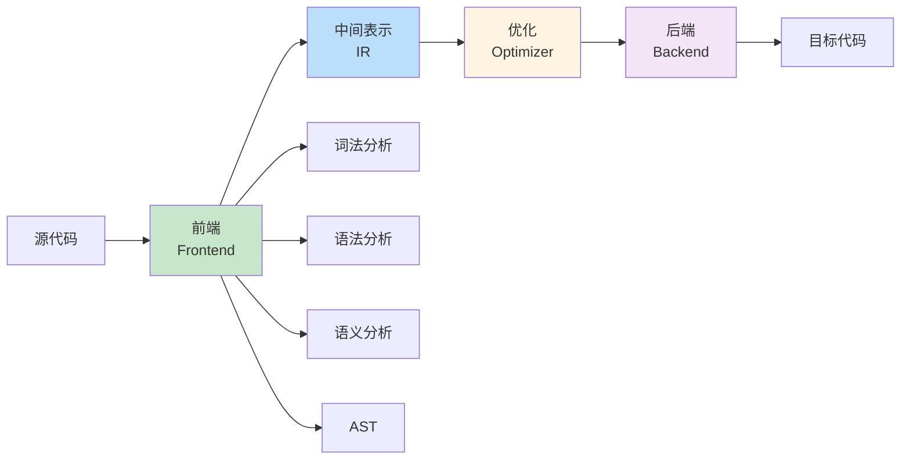
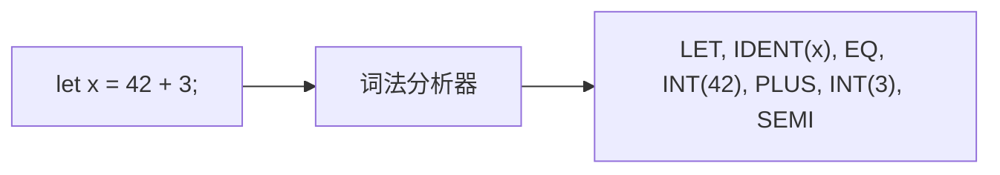
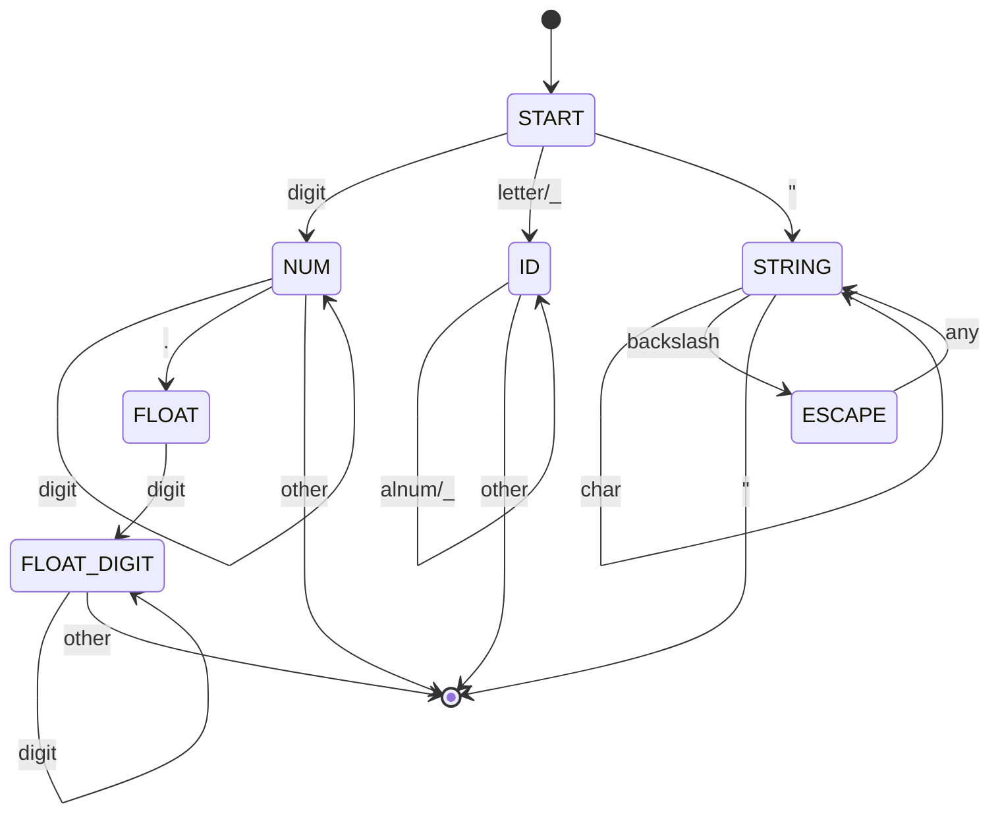
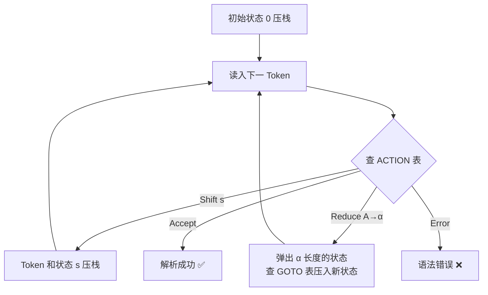
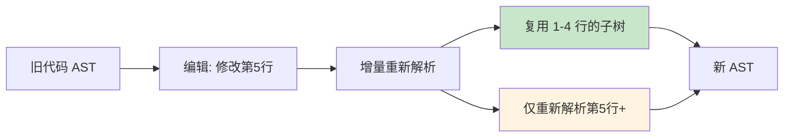

# 编译器前端

> 100 天认知提升计划 | Day 34

---

## 核心概念

### 编译器架构总览

编译器将源代码从高级语言翻译为目标代码，分为三个主要阶段：



**本文聚焦前端**——从源代码文本到 AST（抽象语法树）的完整过程：

| 阶段 | 输入 | 输出 | 工具/算法 |
|------|------|------|----------|
| 词法分析（Lexer） | 字符流 | Token 流 | DFA / 手写 |
| 语法分析（Parser） | Token 流 | AST / CST | LL(1) / LR(1) / 递归下降 |
| 语义分析 | AST + 符号表 | 标注后的 AST | 类型检查 / 作用域分析 |

---

## 词法分析（Lexical Analysis）

### 什么是词法分析？

词法分析器（Lexer / Scanner / Tokenizer）将字符流转换为 **Token 流**——识别出语言中的最小有意义单元。



### Token 类型

```python
# Python: Token 定义
from enum import Enum, auto
from dataclasses import dataclass

class TokenType(Enum):
    # 关键字
    LET = auto()
    IF = auto()
    ELSE = auto()
    WHILE = auto()
    FN = auto()
    RETURN = auto()

    # 字面量
    INT_LIT = auto()    # 42
    FLOAT_LIT = auto()  # 3.14
    STRING_LIT = auto() # "hello"
    BOOL_LIT = auto()   # true / false

    # 标识符
    IDENT = auto()      # variable_name

    # 运算符
    PLUS = auto()       # +
    MINUS = auto()      # -
    STAR = auto()       # *
    SLASH = auto()      # /
    EQ = auto()         # =
    EQEQ = auto()       # ==
    BANG = auto()       # !
    BANGEQ = auto()     # !=
    LT = auto()         # <
    LTEQ = auto()       # <=
    GT = auto()         # >
    GTEQ = auto()       # >=

    # 分隔符
    LPAREN = auto()     # (
    RPAREN = auto()     # )
    LBRACE = auto()     # {
    RBRACE = auto()     # }
    SEMI = auto()       # ;
    COMMA = auto()      # ,

    # 特殊
    EOF = auto()

@dataclass
class Token:
    type: TokenType
    value: str
    line: int
    column: int
```

### 手写词法分析器

```python
# Python: 完整词法分析器
class Lexer:
    def __init__(self, source: str):
        self.source = source
        self.pos = 0
        self.line = 1
        self.column = 1

    def peek(self) -> str | None:
        if self.pos < len(self.source):
            return self.source[self.pos]
        return None

    def advance(self) -> str:
        ch = self.source[self.pos]
        self.pos += 1
        if ch == '\n':
            self.line += 1
            self.column = 1
        else:
            self.column += 1
        return ch

    def skip_whitespace_and_comments(self):
        while self.pos < len(self.source):
            ch = self.peek()
            if ch in ' \t\r\n':
                self.advance()
            elif ch == '/' and self.pos + 1 < len(self.source) and self.source[self.pos + 1] == '/':
                # 单行注释
                while self.pos < len(self.source) and self.peek() != '\n':
                    self.advance()
            elif ch == '/' and self.pos + 1 < len(self.source) and self.source[self.pos + 1] == '*':
                # 多行注释 /* ... */
                self.advance()  # /
                self.advance()  # *
                while self.pos + 1 < len(self.source):
                    if self.peek() == '*' and self.source[self.pos + 1] == '/':
                        self.advance()  # *
                        self.advance()  # /
                        break
                    self.advance()
            else:
                break

    def read_string(self) -> str:
        self.advance()  # 开头引号
        result = []
        while self.peek() != '"':
            if self.peek() is None:
                raise SyntaxError(f"Unterminated string at line {self.line}")
            if self.peek() == '\\':
                self.advance()
                esc = self.advance()
                escape_map = {'n': '\n', 't': '\t', '\\': '\\', '"': '"'}
                result.append(escape_map.get(esc, esc))
            else:
                result.append(self.advance())
        self.advance()  # 结束引号
        return ''.join(result)

    def read_number(self) -> Token:
        start_line, start_col = self.line, self.column
        num_str = ''
        while self.peek() and self.peek().isdigit():
            num_str += self.advance()
        if self.peek() == '.' and self.pos + 1 < len(self.source) and self.source[self.pos + 1].isdigit():
            num_str += self.advance()  # .
            while self.peek() and self.peek().isdigit():
                num_str += self.advance()
            return Token(TokenType.FLOAT_LIT, num_str, start_line, start_col)
        return Token(TokenType.INT_LIT, num_str, start_line, start_col)

    def read_identifier(self) -> str:
        result = ''
        while self.peek() and (self.peek().isalnum() or self.peek() == '_'):
            result += self.advance()
        return result

    def tokenize(self) -> list[Token]:
        tokens = []
        KEYWORDS = {
            'let': TokenType.LET, 'if': TokenType.IF,
            'else': TokenType.ELSE, 'while': TokenType.WHILE,
            'fn': TokenType.FN, 'return': TokenType.RETURN,
            'true': TokenType.BOOL_LIT, 'false': TokenType.BOOL_LIT,
        }

        while self.pos < len(self.source):
            self.skip_whitespace_and_comments()
            if self.pos >= len(self.source):
                break

            ch = self.peek()
            start_line, start_col = self.line, self.column

            # 字符串
            if ch == '"':
                value = self.read_string()
                tokens.append(Token(TokenType.STRING_LIT, value, start_line, start_col))
            # 数字
            elif ch.isdigit():
                tokens.append(self.read_number())
            # 标识符 / 关键字
            elif ch.isalpha() or ch == '_':
                value = self.read_identifier()
                token_type = KEYWORDS.get(value, TokenType.IDENT)
                tokens.append(Token(token_type, value, start_line, start_col))
            # 双字符运算符
            elif ch in '=!<>':
                self.advance()
                if self.peek() == '=':
                    self.advance()
                    op_map = {'==': TokenType.EQEQ, '!=': TokenType.BANGEQ,
                              '<=': TokenType.LTEQ, '>=': TokenType.GTEQ}
                    tokens.append(Token(op_map[ch + '='], ch + '=', start_line, start_col))
                else:
                    single_map = {'=': TokenType.EQ, '!': TokenType.BANG,
                                  '<': TokenType.LT, '>': TokenType.GT}
                    tokens.append(Token(single_map[ch], ch, start_line, start_col))
            # 单字符
            else:
                single = {'+': TokenType.PLUS, '-': TokenType.MINUS,
                          '*': TokenType.STAR, '/': TokenType.SLASH,
                          '(': TokenType.LPAREN, ')': TokenType.RPAREN,
                          '{': TokenType.LBRACE, '}': TokenType.RBRACE,
                          ';': TokenType.SEMI, ',': TokenType.COMMA}
                if ch in single:
                    tokens.append(Token(single[ch], ch, start_line, start_col))
                    self.advance()
                else:
                    raise SyntaxError(f"Unexpected character '{ch}' at {start_line}:{start_col}")

        tokens.append(Token(TokenType.EOF, '', self.line, self.column))
        return tokens
```

### DFA 与正则表达式

词法分析的本质是**有限自动机（DFA）**：



| 工具 | 语言 | 原理 | 特点 |
|------|------|------|------|
| **Lex / Flex** | C | 正则 → DFA 表 | 经典，性能高 |
| **手写 Lexer** | 任意 | 状态机逻辑 | 灵活，好调试 |
| **Logos** | Rust | 正则 → DFA | 编译时生成，零分配 |
| **Nom** | Rust | Parser Combinator | 同时处理词法和语法 |

---

## 语法分析（Parsing）

### 语法分析策略对比

```mermaid
graph TD
    A[语法分析] --> B[自顶向下<br/>Top-Down]
    A --> C[自底向上<br/>Bottom-Up]

    B --> D[递归下降<br/>Recursive Descent]
    B --> E[LL(1)<br/>预测分析]
    B --> F[LL(k) / PEG]

    C --> G[LR(0)]
    C --> H[SLR(1)]
    C --> I[LALR(1)]
    C --> J[LR(1)]

    D -.->|最常用| K[手写/简单<br/>GCC, Rust, Go, V8]
    I -.->|工具生成| L[Yacc, Bison<br/>C, Java, SQL]

    style D fill:#c8e6c9
    style I fill:#bbdefb
```

| 方法 | 方向 | 回溯 | 文法类 | 难度 | 代表工具 |
|------|------|------|--------|------|----------|
| 递归下降 | 自顶向下 | 可能 | LL(k) / PEG | 低 | 手写 |
| LL(1) 预测 | 自顶向下 | 无 | LL(1) 子集 | 中 | ANTLR |
| LR(0) | 自底向上 | 无 | LR(0) | 高 | — |
| SLR(1) | 自底向上 | 无 | SLR(1) | 高 | — |
| LALR(1) | 自底向上 | 无 | LALR(1) | 高 | Yacc/Bison |
| LR(1) | 自底向上 | 无 | LR(1) | 最高 | — |

**文法表达能力**：LR(1) ⊃ LALR(1) ⊃ SLR(1) ⊃ LR(0)，LL(1) 与 LR 文法有交集但互不包含。

---

### 上下文无关文法（CFG）

```
# 表达式文法（二义性版本）
Expr   → Expr + Expr
       | Expr * Expr
       | ( Expr )
       | number

# 消除二义性（运算符优先级与结合性）
Expr     → Term ( ("+" | "-") Term )*
Term     → Factor ( ("*" | "/") Factor )*
Factor   → NUMBER | "(" Expr ")" | ("+" | "-") Factor
```

| 优先级 | 运算符 | 结合性 |
|--------|--------|--------|
| 1（最高） | 一元 +, - | 右结合 |
| 2 | *, / | 左结合 |
| 3（最低） | +, - | 左结合 |

### FIRST 与 FOLLOW 集合

LL(1) 分析的关键——通过 FIRST 和 FOLLOW 集合构建预测分析表：

```
# 示例文法
E  → T E'
E' → + T E' | ε
T  → F T'
T' → * F T' | ε
F  → ( E ) | id

FIRST(F) = { '(', id }
FIRST(T) = FIRST(F) = { '(', id }
FIRST(E) = FIRST(T) = { '(', id }
FIRST(E') = { '+', ε }
FIRST(T') = { '*', ε }

FOLLOW(E)  = { ')', $ }
FOLLOW(E') = FOLLOW(E) = { ')', $ }
FOLLOW(T)  = FIRST(E') ∪ FOLLOW(E') = { '+', ')', $ }
FOLLOW(T') = FOLLOW(T) = { '+', ')', $ }
FOLLOW(F)  = FIRST(T') ∪ FOLLOW(T') = { '*', '+', ')', $ }
```

**LL(1) 条件**：对于每个非终结符 A 的所有产生式 A → α | β，FIRST(α) ∩ FIRST(β) = ∅，且若 ε ∈ FIRST(α)，则 FIRST(β) ∩ FOLLOW(A) = ∅。

---

### 递归下降解析器（Python 实现）

```python
# Python: 完整递归下降表达式解析器
from dataclasses import dataclass
from typing import Union

# ---- AST 节点 ----

@dataclass
class NumberLiteral:
    value: float

@dataclass
class BinaryExpr:
    op: str        # '+', '-', '*', '/'
    left: 'Expr'
    right: 'Expr'

@dataclass
class UnaryExpr:
    op: str        # '-', '+'
    operand: 'Expr'

@dataclass
class CallExpr:
    callee: str
    args: list['Expr']

Expr = Union[NumberLiteral, BinaryExpr, UnaryExpr, CallExpr]

# ---- Parser ----

class Parser:
    def __init__(self, tokens: list[Token]):
        self.tokens = tokens
        self.pos = 0

    def peek(self) -> Token:
        return self.tokens[self.pos]

    def advance(self) -> Token:
        token = self.tokens[self.pos]
        self.pos += 1
        return token

    def expect(self, tt: TokenType) -> Token:
        token = self.advance()
        if token.type != tt:
            raise SyntaxError(
                f"Expected {tt}, got {token.type} ('{token.value}') "
                f"at line {token.line}:{token.column}"
            )
        return token

    # Expr → Term (('+' | '-') Term)*
    def parse_expr(self) -> Expr:
        left = self.parse_term()
        while self.peek().type in (TokenType.PLUS, TokenType.MINUS):
            op = self.advance().value
            right = self.parse_term()
            left = BinaryExpr(op, left, right)
        return left

    # Term → Factor (('*' | '/') Factor)*
    def parse_term(self) -> Expr:
        left = self.parse_factor()
        while self.peek().type in (TokenType.STAR, TokenType.SLASH):
            op = self.advance().value
            right = self.parse_factor()
            left = BinaryExpr(op, left, right)
        return left

    # Factor → NUMBER | '(' Expr ')' | ('+' | '-') Factor | IDENT '(' args ')'
    def parse_factor(self) -> Expr:
        tok = self.peek()

        # 一元运算符
        if tok.type in (TokenType.PLUS, TokenType.MINUS):
            op = self.advance().value
            operand = self.parse_factor()
            return UnaryExpr(op, operand)

        # 数字
        if tok.type == TokenType.INT_LIT:
            self.advance()
            return NumberLiteral(float(tok.value))

        if tok.type == TokenType.FLOAT_LIT:
            self.advance()
            return NumberLiteral(float(tok.value))

        # 括号表达式
        if tok.type == TokenType.LPAREN:
            self.advance()  # (
            expr = self.parse_expr()
            self.expect(TokenType.RPAREN)  # )
            return expr

        # 函数调用
        if tok.type == TokenType.IDENT:
            name = self.advance().value
            if self.peek().type == TokenType.LPAREN:
                self.advance()  # (
                args = []
                if self.peek().type != TokenType.RPAREN:
                    args.append(self.parse_expr())
                    while self.peek().type == TokenType.COMMA:
                        self.advance()
                        args.append(self.parse_expr())
                self.expect(TokenType.RPAREN)
                return CallExpr(name, args)
            raise SyntaxError(f"Unexpected identifier '{name}' at {tok.line}:{tok.column}")

        raise SyntaxError(
            f"Unexpected token {tok.type} ('{tok.value}') at {tok.line}:{tok.column}"
        )

# ---- 使用 ----
def parse(source: str) -> Expr:
    lexer = Lexer(source)
    tokens = lexer.tokenize()
    parser = Parser(tokens)
    return parser.parse_expr()
```

#### AST 可视化

```
输入: 3 + 4 * (2 - 1)

         (+)
        /   \
       3    (*)
           /   \
          4    (-)
              /   \
             2     1
```

```python
# AST 打印器
def print_ast(node: Expr, indent: int = 0) -> str:
    prefix = "  " * indent
    if isinstance(node, NumberLiteral):
        return f"{prefix}{node.value}"
    elif isinstance(node, UnaryExpr):
        return f"{prefix}{node.op}\n{print_ast(node.operand, indent + 1)}"
    elif isinstance(node, BinaryExpr):
        return (f"{prefix}{node.op}\n"
                f"{print_ast(node.left, indent + 1)}\n"
                f"{print_ast(node.right, indent + 1)}")
    elif isinstance(node, CallExpr):
        args = "\n".join(print_ast(a, indent + 1) for a in node.args)
        return f"{prefix}call {node.callee}\n{args}"

print(print_ast(parse("3 + 4 * (2 - 1)")))
# +
#   3
#   *
#     4
#     -
#       2
#       1
```

---

### LR(1) 分析

LR 分析是自底向上的方法，使用**状态栈**和**ACTION/GOTO 表**：



**LR(1) 项目**：`[A → α • β, a]`，其中 `a` 是前瞻符号。

```
# SLR(1) 分析表示例
# 文法: E → E + T | T, T → T * F | F, F → ( E ) | id

State 0:  E → • E + T, $     Shift/Reduce 表:
          E → • T, $          ACTION[0, id] = s5
          T → • T * F         ACTION[0, (]  = s4
          T → • F             GOTO[0, E] = 1
          F → • ( E )         GOTO[0, T] = 2
          F → • id            GOTO[0, F] = 3

输入: id + id * id
步骤: 0  id5  reduce F→id  reduce T→F  reduce E→T
      +s6  id5  reduce F→id  reduce T→F
      *s7  id5  reduce F→id  reduce T→T*F
      reduce E→E+T  accept
```

| LR 变体 | 项目数 | 特点 | 用途 |
|---------|--------|------|------|
| LR(0) | 最多 | 无前瞻，冲突多 | 教学 |
| SLR(1) | = LR(0) | 用 FOLLOW 集消除冲突 | 简单文法 |
| LALR(1) | = SLR(1) | 合并相同核心状态 | **Yacc/Bison** |
| LR(1) | 最多 | 完整前瞻，状态爆炸 | 理论完备 |

---

### Rust 实现表达式解析器

```rust
// Rust: 类型安全的表达式解析器
#[derive(Debug, Clone, PartialEq)]
enum Token {
    Number(f64),
    Plus,
    Minus,
    Star,
    Slash,
    LParen,
    RParen,
    Eof,
}

#[derive(Debug)]
enum Expr {
    Literal(f64),
    Binary {
        op: BinOp,
        left: Box<Expr>,
        right: Box<Expr>,
    },
    Unary {
        op: UnOp,
        operand: Box<Expr>,
    },
}

#[derive(Debug)]
enum BinOp { Add, Sub, Mul, Div }

#[derive(Debug)]
enum UnOp { Neg, Pos }

struct Parser {
    tokens: Vec<Token>,
    pos: usize,
}

impl Parser {
    fn new(tokens: Vec<Token>) -> Self {
        Self { tokens, pos: 0 }
    }

    fn peek(&self) -> &Token {
        self.tokens.get(self.pos).unwrap_or(&Token::Eof)
    }

    fn advance(&mut self) -> Token {
        let tok = self.tokens.get(self.pos).cloned().unwrap_or(Token::Eof);
        self.pos += 1;
        tok
    }

    // Expr → Term (('+' | '-') Term)*
    fn parse_expr(&mut self) -> Result<Expr, String> {
        let mut left = self.parse_term()?;
        loop {
            match self.peek() {
                Token::Plus => {
                    self.advance();
                    let right = self.parse_term()?;
                    left = Expr::Binary {
                        op: BinOp::Add,
                        left: Box::new(left),
                        right: Box::new(right),
                    };
                }
                Token::Minus => {
                    self.advance();
                    let right = self.parse_term()?;
                    left = Expr::Binary {
                        op: BinOp::Sub,
                        left: Box::new(left),
                        right: Box::new(right),
                    };
                }
                _ => break,
            }
        }
        Ok(left)
    }

    // Term → Factor (('*' | '/') Factor)*
    fn parse_term(&mut self) -> Result<Expr, String> {
        let mut left = self.parse_factor()?;
        loop {
            match self.peek() {
                Token::Star => {
                    self.advance();
                    let right = self.parse_factor()?;
                    left = Expr::Binary {
                        op: BinOp::Mul,
                        left: Box::new(left),
                        right: Box::new(right),
                    };
                }
                Token::Slash => {
                    self.advance();
                    let right = self.parse_factor()?;
                    left = Expr::Binary {
                        op: BinOp::Div,
                        left: Box::new(left),
                        right: Box::new(right),
                    };
                }
                _ => break,
            }
        }
        Ok(left)
    }

    // Factor → NUMBER | '(' Expr ')' | ('+' | '-') Factor
    fn parse_factor(&mut self) -> Result<Expr, String> {
        match self.peek().clone() {
            Token::Number(n) => {
                self.advance();
                Ok(Expr::Literal(n))
            }
            Token::LParen => {
                self.advance();
                let expr = self.parse_expr()?;
                match self.advance() {
                    Token::RParen => Ok(expr),
                    other => Err(format!("Expected ')', got {:?}", other)),
                }
            }
            Token::Minus => {
                self.advance();
                let operand = self.parse_factor()?;
                Ok(Expr::Unary {
                    op: UnOp::Neg,
                    operand: Box::new(operand),
                })
            }
            Token::Plus => {
                self.advance();
                let operand = self.parse_factor()?;
                Ok(Expr::Unary {
                    op: UnOp::Pos,
                    operand: Box::new(operand),
                })
            }
            other => Err(format!("Unexpected token: {:?}", other)),
        }
    }
}

// 求值器
fn eval(expr: &Expr) -> f64 {
    match expr {
        Expr::Literal(n) => *n,
        Expr::Binary { op, left, right } => {
            let l = eval(left);
            let r = eval(right);
            match op {
                BinOp::Add => l + r,
                BinOp::Sub => l - r,
                BinOp::Mul => l * r,
                BinOp::Div => l / r,
            }
        }
        Expr::Unary { op, operand } => {
            let v = eval(operand);
            match op {
                UnOp::Neg => -v,
                UnOp::Pos => v,
            }
        }
    }
}

fn main() {
    let tokens = vec![
        Token::Number(3.0), Token::Plus,
        Token::Number(4.0), Token::Star,
        Token::LParen, Token::Number(2.0),
        Token::Minus, Token::Number(1.0),
        Token::RParen, Token::Eof,
    ];
    let mut parser = Parser::new(tokens);
    let ast = parser.parse_expr().unwrap();
    println!("AST: {:?}", ast);
    println!("Result: {}", eval(&ast)); // 7.0
}
```

---

## Parser Generator 对比

| 工具 | 语言 | 方法 | 输出 | 代表项目 |
|------|------|------|------|----------|
| **Bison/Yacc** | C/C++ | LALR(1) | C 代码 | GCC (旧版), PostgreSQL |
| **ANTLR** | Java/多语言 | LL(*) | 多语言 | Hibernate, Groovy |
| **Tree-sitter** | C | GLR | 增量解析树 | Neovim, Helix 编辑器 |
| **Nom** | Rust | Combinator | Rust 代码 | many Rust projects |
| **Pest** | Rust | PEG | Rust 代码 | Rust projects |
| **Lalrpop** | Rust | LR(1)/LALR | Rust 代码 | Rust projects |
| **tree-sitter** | C | GLR | 增量 CST | 所有主流编辑器 |

### Tree-sitter：增量解析的革命



Tree-sitter 通过 GLR 解析 + 增量复用实现**亚毫秒级重解析**，是现代编辑器语法高亮的标准方案。

---

## 错误恢复

编译器需要在遇到错误后继续分析，以报告尽可能多的错误：

| 策略 | 原理 | 优点 | 缺点 |
|------|------|------|------|
| **Panic Mode** | 跳过 Token 直到同步点（`;`, `}`） | 简单，不容易级联 | 可能跳过很多代码 |
| **Phrase-Level** | 局部替换/插入/删除修复 | 精确 | 实现复杂 |
| **Error Productions** | 在文法中添加常见错误规则 | 报错友好 | 需要预先知道错误模式 |
| **Global Minimum** | 找最小编辑距离的修复 | 最优 | 太慢，实际不用 |

```python
# Panic Mode 错误恢复
SYNCHRONIZATION_TOKENS = {TokenType.SEMI, TokenType.RBRACE, TokenType.RPAREN}

def recover(self):
    """跳过 Token 直到同步点"""
    while self.peek().type not in SYNCHRONIZATION_TOKENS and self.peek().type != TokenType.EOF:
        self.advance()
```

---

## 性能对比

| 解析器类型 | 10万行解析时间 | 内存占用 | 增量解析 | 实现复杂度 |
|-----------|--------------|---------|---------|-----------|
| 手写递归下降 | ~50ms | 低 | 需手动实现 | 低 |
| LR/LALR (Bison) | ~30ms | 中（表驱动） | 不支持 | 高 |
| GLR (Tree-sitter) | ~80ms | 中 | **原生支持** | 高 |
| PEG (Packrat) | ~200ms | **高**（备忘录） | 不支持 | 低 |
| Parser Combinator | ~100ms | 中 | 不支持 | **最低** |

---

## 实践任务

- [ ] **Task 1: 词法分析器** — 用 Python 实现一个支持数字、字符串、标识符、注释的完整 Lexer，包含行号/列号追踪
- [ ] **Task 2: 递归下降解析器** — 扩展上面的 Parser，添加变量赋值（`let x = expr;`）和 if/while 语句
- [ ] **Task 3: Rust 版本** — 用 Rust 实现同样的表达式解析器，添加 `Result` 错误处理
- [ ] **Task 4: AST Interpreter** — 为解析器添加求值器（解释器），支持变量环境和函数定义
- [ ] **Task 5: Tree-sitter Grammar** — 为一个迷你语言编写 Tree-sitter grammar，在 Neovim 中获得语法高亮
- [ ] **Task 6: FIRST/FOLLOW** — 手动计算一个中等复杂度文法的 FIRST 和 FOLLOW 集合，构建 LL(1) 预测分析表

---

## 关键收获

| 概念 | 一句话总结 |
|------|-----------|
| 词法分析 | 字符流 → Token 流，本质是 DFA / 正则匹配 |
| 递归下降 | 最直观的解析方法，每个非终结符一个函数，Rust/Go/GCC 都用它 |
| LL(1) | 自顶向下，一个前瞻 Token 做决策，需满足 FIRST/FOLLOW 无冲突 |
| LR(1) | 自底向上，状态栈 + ACTION/GOTO 表，表达能力最强但实现复杂 |
| AST | 源代码的结构化表示，是编译器前端的最终输出 |
| 错误恢复 | Panic Mode 最实用，跳到同步点继续解析以报告更多错误 |
| 增量解析 | Tree-sitter 的核心创新，编辑后只重新解析受影响的部分 |

> **核心洞察**：编译器前端的本质是**模式匹配 + 树构建**——词法分析匹配 Token 模式，语法分析匹配语法结构，最终构建出反映程序结构的 AST。递归下降是实践中的王者，简单、直观、易调试。

---

## 参考资料

- [Crafting Interpreters](https://craftinginterpreters.com/) — Robert Nystrom，最佳编译器入门书
- [Compilers: Principles, Techniques, and Tools](https://en.wikipedia.org/wiki/Compilers:_Principles,_Techniques,_and_Tools)（龙书）
- [Tree-sitter 官方文档](https://tree-sitter.github.io/tree-sitter/)
- [Let's Build a Compiler](https://compilers.iecc.com/crenshaw/) — Jack Crenshaw 经典教程
- [Rust Compiler Development Guide](https://rustc-dev-guide.rust-lang.org/)
- [LL(k) vs LR(k) 解析对比](https://stackoverflow.com/questions/5970785/difference-between-ll-and-lr-parsing)

---

*学习日期：2026-04-13*
