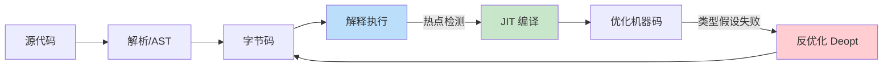
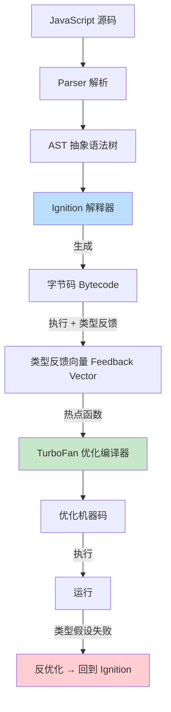
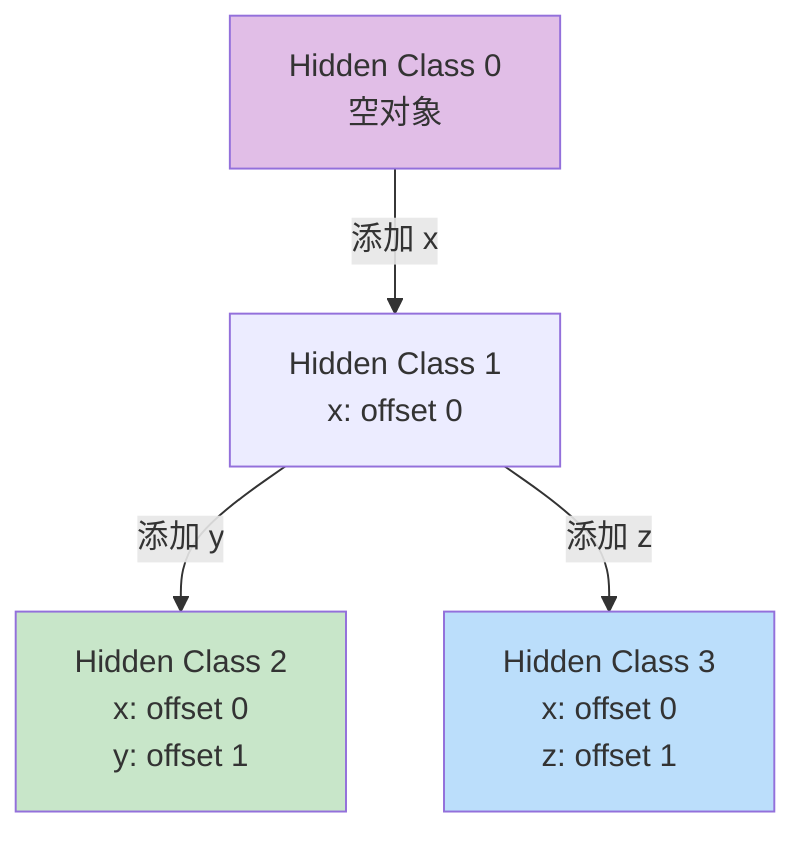
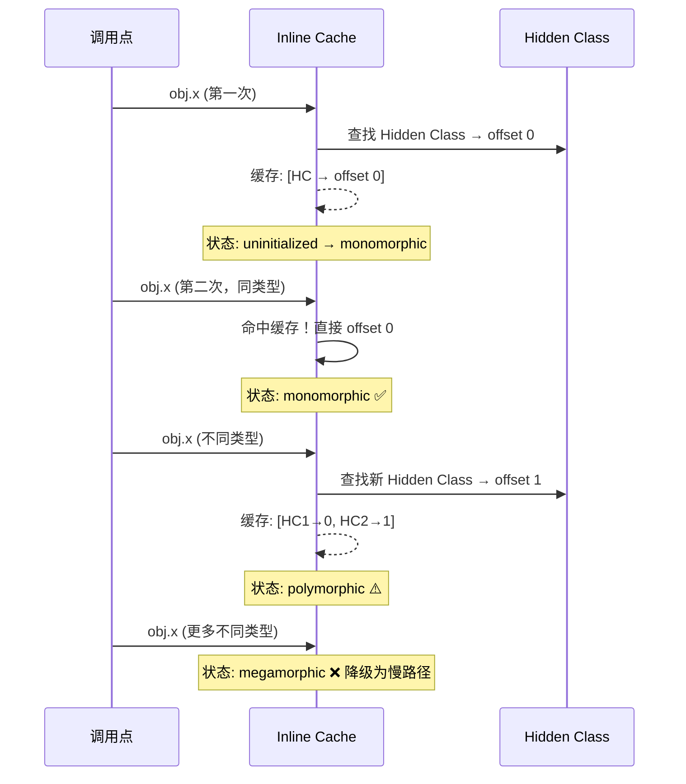
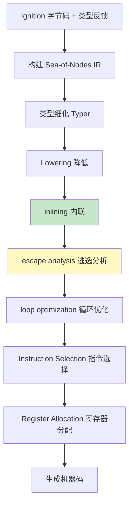
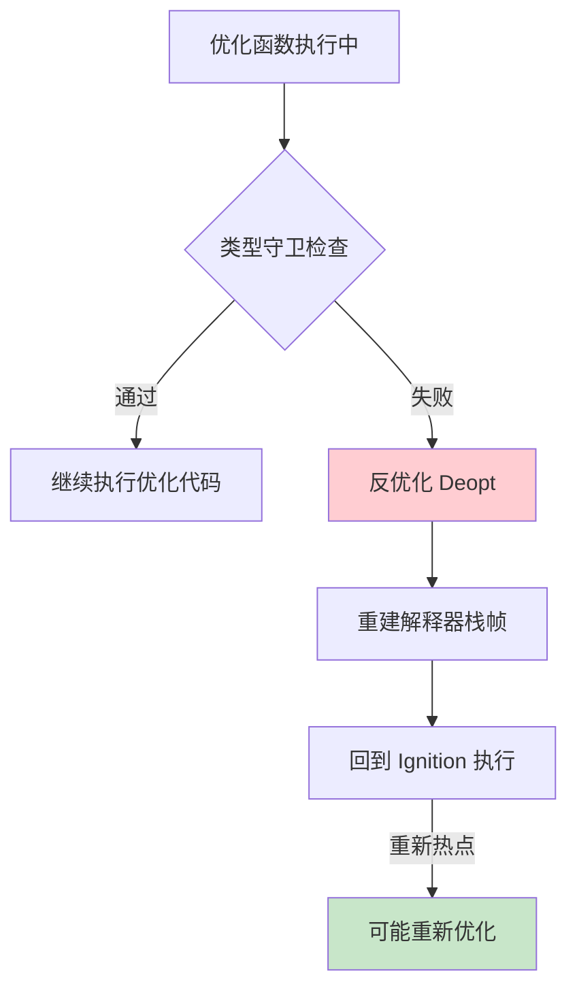
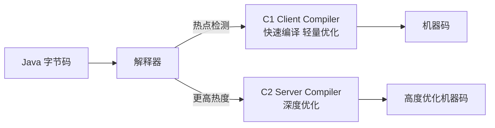

# JIT 编译原理

> 100 天认知提升计划 | Day 35

---

## 核心概念

### 什么是 JIT 编译？

**JIT（Just-In-Time）编译** 是一种在程序运行时将字节码或中间表示（IR）动态编译为本地机器码的技术。它结合了解释执行的灵活性和提前编译（AOT）的性能优势，通过运行时类型反馈（Type Feedback）和热点代码检测（Hot Spot Detection），对频繁执行的代码路径进行激进优化。



### 编译策略对比

| 策略 | 启动速度 | 峰值性能 | 内存占用 | 代表 |
|------|----------|----------|----------|------|
| 纯解释 | ⚡ 最快 | 🐢 最慢 | 最低 | Ruby MRI、早期 Python |
| JIT 编译 | 🔄 中等 | 🚀 快 | 中等 | V8、JVM、PyPy |
| AOT 编译 | 🐌 较慢 | 🚀 快 | 较高 | Go、Rust、GraalVM Native |
| 分层编译 | ⚡ 快 | 🚀 最快 | 最高 | V8 (Ignition+TurboFan)、JVM (C1+C2) |

### JIT 两大流派

| 流派 | 代表 | 思路 | 特点 |
|------|------|------|------|
| **Trace-based** | 早期 V8 (Crankshaft)、LuaJIT | 记录热路径（trace），编译线性代码序列 | 适合循环密集型，但处理复杂控制流困难 |
| **Method-based** | HotSpot JVM、现代 V8 (TurboFan) | 以函数为单位编译 | 更灵活，支持全局优化 |

---

## V8 引擎架构

### 整体流水线



### V8 编译管线演进

| 年代 | 解释器 | 优化编译器 | 特点 |
|------|--------|-----------|------|
| 2008–2010 | 无 | Crankshaft (full-codegen) | 直接编译为机器码，启动慢 |
| 2010–2015 | 无 | Crankshaft | 简单 JIT，优化能力强但受限 |
| 2016–2017 | Ignition | Crankshaft + TurboFan | Ignition 降低启动内存 |
| 2018–至今 | Ignition | **TurboFan** | Crankshaft 完全退役，TurboFan 统一 |

---

## Ignition 解释器

### 设计目标

Ignition 是 V8 的低开销解释器，使用寄存器式字节码（register-based bytecode），替代了早期直接生成机器码的 full-codegen 方案。

**核心优势**：
- **内存节省**：字节码比机器码小 3-5 倍
- **快速启动**：无需等待编译，直接执行
- **收集类型反馈**：为 TurboFan 优化提供关键数据

### 字节码示例

```javascript
function add(a, b) {
    return a + b;
}
```

对应字节码（`node --print-bytecode add.js`）：

```
LdaNamedProperty a0, [0]    // 加载 a
Add a1, [0]                  // 加上 b
Return                       // 返回结果
```

### 寄存器式 vs 栈式字节码

| 特性 | 栈式（JVM） | 寄存器式（V8/Ignition） |
|------|-----------|----------------------|
| 指令长度 | 短（无操作数） | 较长（含寄存器编号） |
| 指令数量 | 多（push/pop） | 少（直接操作寄存器） |
| 分发开销 | 高 | 低 |
| 数据局部性 | 差（栈顶频繁变化） | 好（寄存器映射物理寄存器） |

---

## Hidden Class（隐藏类）

### 核心思想

JavaScript 是动态类型语言，对象可以随时增删属性。V8 通过 **Hidden Class（隐藏类）** 机制，在底层为对象创建类似 C++ 虚表的结构，实现快速的属性访问。



### 属性访问优化

```javascript
// ✅ 好：相同属性顺序 → 共享 Hidden Class
function Point(x, y) {
    this.x = x;  // 先 x
    this.y = y;  // 后 y
}

// ❌ 坏：不同属性顺序 → 创建不同 Hidden Class
function messy(cond) {
    const obj = {};
    if (cond) {
        obj.x = 1;
        obj.y = 2;
    } else {
        obj.y = 1;  // 先 y！
        obj.x = 2;
    }
}
```

### 性能对比

```javascript
// benchmark: hidden class 的影响
const N = 1e7;

// Case 1: 一致的 Hidden Class
function testConsistent() {
    let sum = 0;
    for (let i = 0; i < N; i++) {
        const p = { x: i, y: i * 2 };
        sum += p.x + p.y;
    }
    return sum;
}

// Case 2: 不一致的 Hidden Class
function testInconsistent() {
    let sum = 0;
    for (let i = 0; i < N; i++) {
        const p = {};
        if (i % 2 === 0) { p.x = i; p.y = i * 2; }
        else { p.y = i * 2; p.x = i; }
        sum += p.x + p.y;
    }
    return sum;
}
```

| Case | 预计耗时 | 说明 |
|------|---------|------|
| 一致 Hidden Class | ~50ms | TurboFan 内联属性偏移 |
| 不一致 Hidden Class | ~200ms+ | 多态 IC，无法内联 |

---

## Inline Caching（内联缓存）

### 原理

**Inline Cache（IC）** 是 JIT 性能的核心优化之一。V8 在每个属性访问点记录之前看到的类型信息，后续访问同一类型时直接使用缓存路径，跳过类型查找。



### IC 多态性级别

| 状态 | 含义 | 性能 | TurboFan 优化 |
|------|------|------|--------------|
| Uninitialized | 未见过任何类型 | - | - |
| Monomorphic | 只见过 1 种类型 | 🚀 最快 | 直接内联偏移 |
| Polymorphic | 见过 2-4 种类型 | 🔄 较快 | 生成多路分支 |
| Megamorphic | 见过 >4 种类型 | 🐢 慢 | 降级为字典查找 |

```javascript
// monomorphic: 始终传入同一类型
function monoRead(p) { return p.x; }
for (let i = 0; i < 1000; i++) monoRead({ x: i });

// polymorphic: 传入不同形状的对象
function polyRead(p) { return p.x; }
for (let i = 0; i < 1000; i++) {
    if (i % 3 === 0) polyRead({ x: i });
    else if (i % 3 === 1) polyRead({ x: i, y: 1 });
    else polyRead({ x: i, z: 1 });
}
```

---

## TurboFan 优化编译器

### 编译流水线



### Sea-of-Nodes IR

TurboFan 使用 **Sea-of-Nodes** 中间表示——一种基于图（SSA 形式）的 IR，节点之间只有数据依赖和控制依赖边，没有固定顺序。

```javascript
function add(a, b) {
    return a + b;
}
```

对应的简化 Sea-of-Nodes：

```
  [Start]
     |
  [Parameter a]  [Parameter b]
     |                |
     +--- [NumberAdd] ---+
              |
          [Return]
              |
          [End]
```

### 关键优化技术

#### 1. 函数内联（Inlining）

将函数调用替换为函数体，消除调用开销，暴露更多优化机会。

```javascript
// 内联前
function double(x) { return x * 2; }
function compute(n) { return double(n) + 1; }

// TurboFan 内联后等价于
function compute_inlined(n) { return n * 2 + 1; }
```

#### 2. 逃逸分析（Escape Analysis）

分析对象是否"逃逸"出当前函数。未逃逸的对象可以在栈上分配甚至完全标量替换（拆解为独立变量）。

```javascript
function sum(a, b) {
    const pair = { x: a, y: b };  // 不逃逸 → 可标量替换
    return pair.x + pair.y;
}
// 优化后等价于：
function sum_opt(a, b) {
    return a + b;  // 对象被完全消除！
}
```

#### 3. 特化（Speculation）

基于类型反馈做假设性优化。如果运行时假设不成立，则触发反优化。

```javascript
function add(a, b) {
    return a + b;
}
// 如果历史调用都是 Number + Number
// TurboFan 假设：a 和 b 总是 Number → 生成数值加法机器码
// 如果突然传入 String → 反优化！
```

### 优化级别

| 级别 | 标志 | 含义 |
|------|------|------|
| `OPTIMIZE` | `--trace-opt` | TurboFan 优化编译 |
| `TURBOFAN` | `--trace-turbo` | TurboFan 管线详情 |
| `MAGLEV` | `--maglev` | V8 v11.6+ 中等优化层（介于 Ignition 和 TurboFan） |

---

## 反优化（Deoptimization）

### 触发条件

当 JIT 编译器做出的**乐观假设**被运行时违反时，V8 必须丢弃优化代码，回退到 Ignition 解释执行。



### 常见反优化原因

| 原因 | 说明 | 示例 |
|------|------|------|
| 类型变化 | 参数类型与优化假设不符 | 函数一直接收 Number，突然收到 String |
| Hidden Class 变化 | 对象形状不一致 | 动态添加新属性 |
| IC miss | 内联缓存未命中 | 访问不同形状对象的同一属性名 |
| 代码修改 | 动态修改原型链 | 运行时改写 `Array.prototype.push` |
| 堆越界 | 数组元素类型溢出 | SMI 数组存入浮点数 |

```javascript
// 反优化 demo
function process(arr) {
    let sum = 0;
    for (let i = 0; i < arr.length; i++) {
        sum += arr[i];  // TurboFan 假设 arr[i] 是 SMI (小整数)
    }
    return sum;
}

// 预热：全部整数 → TurboFan 优化为整数加法
for (let i = 0; i < 10000; i++) process([1, 2, 3]);

// 触发反优化：出现浮点数！
process([1.5, 2, 3]);  // 💥 反优化！整数假设被打破
```

---

## 实践：`--trace-opt` / `--trace-deopt`

### 环境准备

```bash
# 查看优化/反优化日志
node --trace-opt --trace-deopt script.js

# 查看更详细的优化原因
node --trace-opt-verbose script.js

# 查看 IC 状态
node --trace-ic script.js

# 查看 TurboFan 生成图（需要 debug 版本）
node --trace-turbo script.js
```

### 实战 Demo 1：观察优化过程

```javascript
// trace-opt-demo.js
function hotLoop(n) {
    let sum = 0;
    for (let i = 0; i < n; i++) {
        sum += i;
    }
    return sum;
}

// 预热阶段
console.log('--- warming up ---');
for (let i = 0; i < 100; i++) hotLoop(1000);

// 触发优化
console.log('--- hitting threshold ---');
hotLoop(1e6);
```

```bash
node --trace-opt --trace-deopt trace-opt-demo.js
```

预期输出（简化）：

```
[marking hotLoop 0x1234 for optimization to TURBOFAN]
[compiling method hotLoop  (target TURBOFAN) OSR]
[completed optimizing hotLoop to TURBOFAN, took 0.5ms]
```

### 实战 Demo 2：触发反优化

```javascript
// deopt-demo.js
function add(a, b) {
    return a + b;
}

// 阶段1：全部 Number → 优化
for (let i = 0; i < 10000; i++) add(i, i + 1);

// 阶段2：传入 String → 反优化！
add("hello", "world");

// 阶段3：后续调用回到解释执行
add(1, 2);
```

```bash
node --trace-opt --trace-deopt deopt-demo.js 2>&1 | grep -E "(deopt|opt)"
```

预期输出：

```
[marking add 0x... for optimization to TURBOFAN]
[completed optimizing add to TURBOFAN]
[Deoptimizing add, reason: Insufficient type feedback for call] 
```

### 实战 Demo 3：Hidden Class 诊断

```bash
# 查看 Hidden Class 转换链
node --allow-natives-syntax -e "
function Foo(x, y) { this.x = x; this.y = y; }
const a = new Foo(1, 2);
%DebugPrint(a);
"
```

---

## 性能优化最佳实践

### 编写 JIT 友好的 JavaScript

| 规则 | 原因 | 示例 |
|------|------|------|
| 保持对象属性顺序一致 | 共享 Hidden Class | 构造函数中固定顺序初始化 |
| 避免动态增删属性 | 减少 Hidden Class 分支 | 在构造函数中声明所有属性 |
| 保持函数参数类型一致 | 减少 IC 多态性 | 不要对同一函数传不同类型 |
| 避免修改原型链 | 防止全局反优化 | 不要在运行时改写 prototype |
| 使用 `const` 和字面量数组 | 便于类型推断 | `const arr = [1,2,3]` 优于 `new Array()` |
| 避免.arguments 使用 | 阻断内联优化 | 用 rest 参数 `...args` 替代 |

### 性能对比

```javascript
// 性能测试：JIT 友好 vs 不友好
const N = 1e7;

// ✅ JIT 友好
function jitFriendly() {
    let sum = 0;
    for (let i = 0; i < N; i++) {
        const p = new Point(i, i * 2);
        sum += p.x + p.y;
    }
    return sum;
}

// ❌ JIT 不友好
function jitHostile() {
    let sum = 0;
    for (let i = 0; i < N; i++) {
        const p = {};
        p[Math.random() > 0.5 ? 'x' : 'y'] = i;  // 动态属性名
        p[Math.random() > 0.5 ? 'y' : 'x'] = i * 2;
        sum += p.x + p.y;
    }
    return sum;
}

function Point(x, y) { this.x = x; this.y = y; }
```

| 实现 | V8 预计耗时 | 说明 |
|------|-----------|------|
| jitFriendly | ~30ms | 单态 IC + 内联 |
| jitHostile | ~500ms+ | megamorphic IC + 不断反优化 |

---

## 其他 JIT 实现对比

### JVM（HotSpot）



| 特性 | V8 (TurboFan) | JVM (C2) |
|------|---------------|----------|
| 语言 | 动态类型 | 静态类型 |
| 类型信息 | 运行时推断 | 编译时 + 运行时 |
| 内联策略 | 基于 IC 反馈 | 基于类型层次分析 |
| 逃逸分析 | 支持 | 支持（更成熟） |
| 分层编译 | Ignition→Maglev→TurboFan | C1→C2 |
| 反优化 | 频繁（动态类型） | 较少（静态类型） |

### SpiderMonkey（Firefox）

| 层级 | 编译器 | 优化程度 |
|------|--------|---------|
| L1 | Interpreter | 无优化 |
| L2 | Baseline | 快速编译，轻度优化 |
| L3 | Warp (formerly IonMonkey) | 深度优化 |

### JavaScriptCore（Safari）

| 层级 | 编译器 | 说明 |
|------|--------|------|
| L1 | LLInt | 低级解释器 |
| L2 | Baseline JIT | 模板 JIT |
| L3 | DFG JIT | 数据流图优化 |
| L4 | FTL JIT | LLVM 后端，最高优化 |

---

## 关键收获

### 1. JIT 本质是**投机优化**

JIT 用"先假设、后验证"的策略换取性能。理解这一点，就能理解为什么编写类型稳定的代码对性能至关重要。

### 2. Hidden Class 是 V8 性能的基石

动态类型语言的性能瓶颈在于属性查找。Hidden Class + IC 组合让 V8 能像静态语言一样快速访问属性。

### 3. 反优化不是"错误"，而是机制

反优化是 JIT 系统的自我纠正机制。关键是让热点代码路径保持稳定，避免在热循环中出现类型变化。

### 4. 分层编译平衡了启动速度和峰值性能

Ignition → Maglev → TurboFan 的三层架构，让 V8 既有快速的冷启动，又有接近 C 的峰值性能。

### 5. 写 JavaScript 要有"类型意识"

即使 JavaScript 是动态类型，写出 JIT 友好的代码需要像静态类型一样思考：保持对象形状一致、避免类型混用、减少运行时惊喜。

---

## 实践任务

- [ ] 使用 `--trace-opt` 和 `--trace-deopt` 观察 V8 的优化/反优化过程
- [ ] 编写一个触发 Hidden Class 分裂的 demo，对比性能差异
- [ ] 用 `--trace-ic` 观察 IC 从 monomorphic → polymorphic → megamorphic 的演变
- [ ] 测试逃逸分析：对比"未逃逸对象"和"逃逸对象"的性能
- [ ] 尝试 V8 的 `--allow-natives-syntax` 使用 `%DebugPrint` 查看对象内部结构
- [ ] 对比同一段代码在 Node.js 和 Firefox/Safari 的性能表现

---

## 参考资料

- [V8 官方博客 - TurboFan Optimization](https://v8.dev/blog/turbofan-jit)
- [V8 官方博客 - Ignition Interpreter](https://v8.dev/blog/ignition-interpreter)
- [V8 官方博客 - Fast Properties (Hidden Class)](https://v8.dev/blog/fast-properties)
- [JavaScript Engine Fundamentals (Mathias Bynens)](https://mathiasbynens.be/notes/shapes-ics)
- [Chrome University 2018: V8 Engine Overview (YouTube)](https://www.youtube.com/watch?v=N5QVvioa55E)
- [V8 源码 - src/compiler/](https://github.com/v8/v8/tree/main/src/compiler)
- [Surviving the Deoptimization Monster (Benedikt Meurer)](https://benediktmeurer.de/2018/09/14/surviving-the-deoptimization-monster/)

---

*学习日期：2026-04-15*
