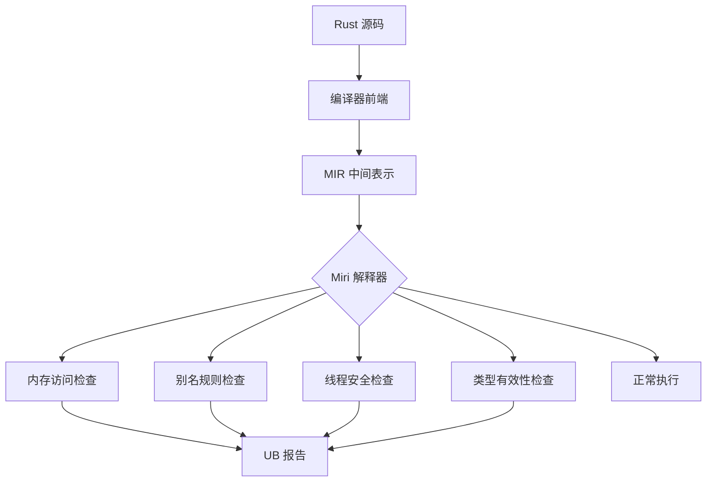
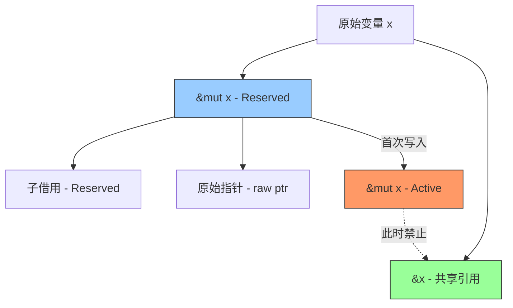
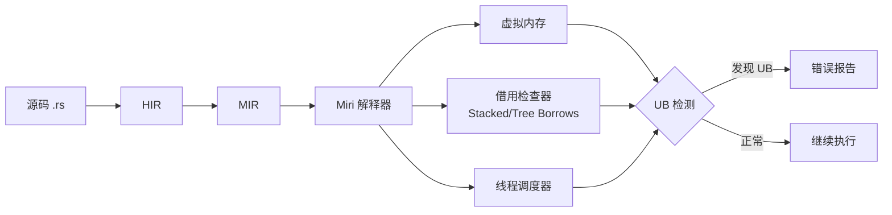
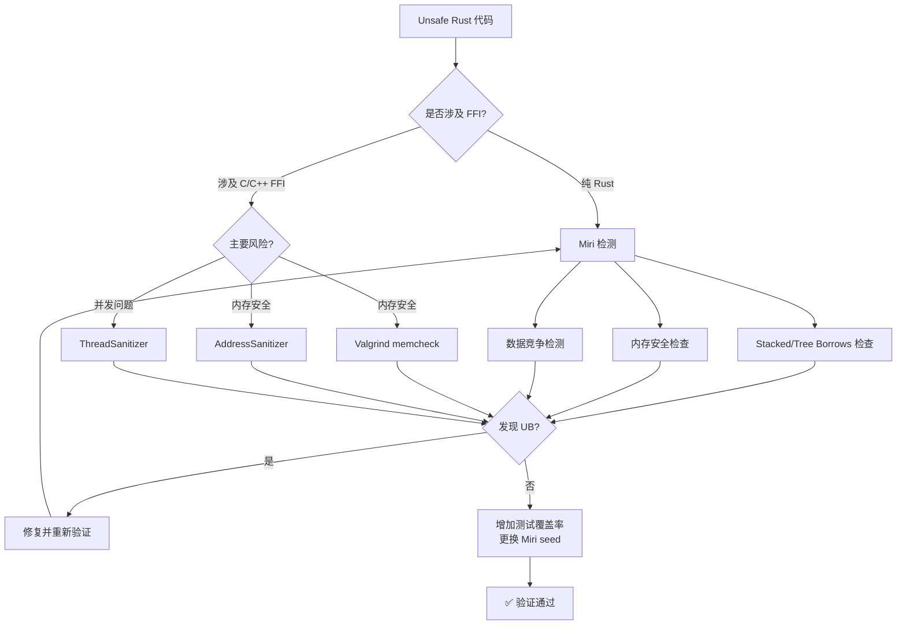
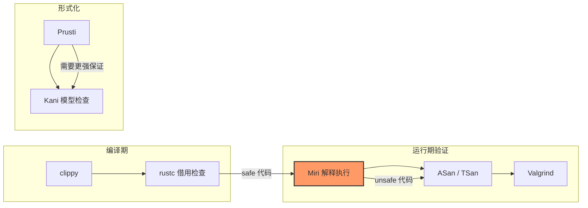

# 内存安全证明

> 100 天认知提升计划 | Day 37

---

## 核心概念

### Miri：Rust 的未定义行为检测器

Miri 是 Rust 官方的 **Undefined Behavior (UB) 检测工具**，基于 MIR（Mid-level Intermediate Representation）解释执行 Rust 程序。它能在运行时检测 unsafe 代码中的内存安全问题，是 Rust 生态中验证 unsafe 代码正确性的核心工具。

2026 年 POPL 论文 *"Miri: Practical Undefined Behavior Detection for Rust"* 正式发表了 Miri 的设计与实现，确认它是第一个能够检测确定性 Rust 程序中所有事实上的未定义行为的工具。

#### Miri 能检测什么

| 类别 | 具体问题 |
|------|----------|
| 内存安全 | 越界访问、Use-after-free、双重释放 |
| 未初始化内存 | 读取未初始化的数据 |
| 对齐违规 | 未对齐的内存访问和引用 |
| 类型不变量 | `bool` 不是 0/1、无效的枚举判别值 |
| 内置函数前提条件 | `unreachable_unchecked` 被执行、`copy_nonoverlapping` 范围重叠 |
| 数据竞争 | 多线程并发冲突、弱内存效应模拟 |
| 别名违规 | Stacked Borrows / Tree Borrows 规则违反 |
| 内存泄漏 | 程序结束时仍有不可达的分配 |



---

### Stacked Borrows：栈式别名模型

Stacked Borrows 是 Ralf Jung 提出的 Rust 别名模型，为引用类型的别名规则提供了操作语义。

**核心思想**：每个内存位置维护一个"借用栈"，记录当前活跃的借用关系。借用必须像栈一样嵌套——后创建的必须先结束。

```
借用栈示意：

位置 p 的借用栈:
┌─────────────┐
│  &mut x (3)  │  ← 栈顶，当前活跃
├─────────────┤
│  &mut x (2)  │  ← 已失效
├─────────────┤
│  &x (1)      │  ← 共享引用
├─────────────┤
│  原始所有者    │  ← 栈底
└─────────────┘
```

**规则**：
- 当通过引用访问内存时，该引用必须在栈顶（或栈中对应位置）
- 新的 `&mut` 创建时，会失效栈中在其之上的所有旧引用（即悬垂指针检测）
- 共享引用 `&T` 允许多个共存，但如果有 `UnsafeCell` 则可变

```rust
// Stacked Borrows 会报告 UB 的示例
fn main() {
    let mut x = 42;
    let r = &x;          // 共享借用，压栈
    let w = &mut x;      // 可变借用，r 被失效
    println!("{}", r);    // ❌ UB! r 已被 w 失效
}
```

---

### Tree Borrows：树式别名模型

Tree Borrows 是 Stacked Borrows 的后继模型，由 Neven Villani 在 ETH Zurich 实习期间开发。它解决了 Stacked Borrows 的几个关键问题。

**核心改进**：

1. **树结构替代栈**：用父子关系建模借用的派生关系，而非简单的栈顺序
2. **原生支持两阶段借用（Two-phase Borrows）**：`&mut` 引用初始处于 `Reserved` 状态，允许其他指针读取；仅在首次写入时激活为 `Active`
3. **延迟唯一性**：可变引用不会过早断言唯一性



**Stacked Borrows 的问题 vs Tree Borrows 的解决**：

```rust
// SB 下是 UB，TB 下是合法的
let mut a = [0, 1];
let from = a.as_ptr();           // 共享引用派生
let to = a.as_mut_ptr().add(1);  // &mut 断言唯一性 → SB 失效 from
std::ptr::copy_nonoverlapping(from, to, 1); // SB: UB! TB: 合法（to 仍是 Reserved）
```

---

## 技术细节

### Miri 的工作原理

Miri 不是一个编译器后端，而是一个 **MIR 解释器**：



1. **MIR 解释执行**：逐条解释 MIR 指令，而非编译到机器码
2. **虚拟内存**：维护自己的内存模型，每个分配都有元数据（大小、对齐、借用栈/树）
3. **确定性模拟**：默认完全确定，隔离宿主系统（使用假 RNG、假时钟）
4. **跨平台测试**：可以模拟不同目标平台（如大小端）

### 安装与使用

```bash
# 安装（需要 nightly Rust）
rustup +nightly component add miri

# 运行测试
cargo +nightly miri test

# 运行二进制
cargo +nightly miri run

# 切换别名模型
MIRIFLAGS="-Zmiri-tree-borrows" cargo +nightly miri test

# 禁用 Stacked Borrows 检查（调试用）
MIRIFLAGS="-Zmiri-disable-stacked-borrows" cargo +nightly miri test

# 跨目标测试（大端）
cargo +nightly miri test --target mips64-unknown-linux-gnuabi64

# 使用不同种子探索不同执行路径
MIRIFLAGS="-Zmiri-seed=42" cargo +nightly miri test
```

### 常见 UB 检测实战

#### 1. 悬垂指针（Use-after-free）

```rust
fn dangling_pointer() {
    let r;
    {
        let x = 42;
        r = &x;  // r 指向 x
    }            // x 被 drop，r 变成悬垂指针
    // Miri 检测：r 解引用是 UB
    // println!("{}", *r);  // 取消注释 → Miri 报错
}

// 用 unsafe 制造悬垂指针
unsafe fn use_after_free() {
    let r;
    {
        let x = Box::new(42);
        r = &*x;
    } // Box 被 drop
    // Miri: error: Undefined Behavior: pointer to 228 bytes starting at offset 0 is out-of-bounds
    // println!("{}", *r);
}
```

#### 2. 数据竞争

```rust
use std::thread;
use std::sync::atomic::{AtomicI32, Ordering};

fn data_race() {
    let mut x = 0;
    // 注意：这需要 unsafe 才能制造真正的数据竞争
    // Miri 能检测到：Data race detected between Read and Write
    let x_ptr = &mut x as *mut i32;
    
    let t1 = thread::spawn(move || {
        unsafe { *x_ptr = 1; }  // 写
    });
    unsafe { *x_ptr = 2; }      // 写 - 与 t1 竞争
    t1.join().unwrap();
}
```

#### 3. 未初始化内存

```rust
use std::mem::MaybeUninit;

fn uninit_memory() {
    let mut v: MaybeUninit<Vec<i32>> = MaybeUninit::uninit();
    // Miri: error: using uninitialized data
    // let val = unsafe { v.assume_init() };  // UB!
    
    // 正确做法
    v.write(vec![1, 2, 3]);
    let val = unsafe { v.assume_init() };
    assert_eq!(val, vec![1, 2, 3]);
}
```

#### 4. 别名违规（Stacked Borrows）

```rust
fn aliasing_violation() {
    let mut x = 42;
    let r = &x;
    let w = &mut x;     // r 被 invalidate
    // Miri (Stacked Borrows): error: Undefined Behavior: using a dead reference
    // println!("{}", r);  // UB! r 已被 w 失效
    *w = 43;
}
```

#### 5. 对齐违规

```rust
fn alignment_violation() {
    let data: [u8; 8] = [0; 8];
    let ptr = data.as_ptr() as *const u64;
    // 如果 data 的地址不是 8 字节对齐：
    // Miri: error: Undefined Behavior: accessing memory with alignment 1, but alignment 8 is required
    // unsafe { println!("{}", *ptr); }
}
```

---

## 可视化图表

### Unsafe 代码验证决策树



### Miri 生态位



---

## 实践与思考

### 实践任务

- [ ] 安装 Miri（`rustup +nightly component add miri`）并用 `cargo miri test` 跑一个项目
- [ ] 编写包含悬垂指针的 unsafe 代码，用 Miri 检测并修复
- [ ] 编写包含数据竞争的多线程代码，用 Miri 检测并修复
- [ ] 对比 Stacked Borrows 和 Tree Borrows 在同一段代码上的行为差异
- [ ] 为自己的 unsafe 模块编写 Miri 兼容的测试（使用 `#[cfg_attr(miri, ignore)]` 跳过不支持的部分）

### 关键收获

1. **Miri 是 unsafe Rust 的最佳伙伴**：它是第一个能检测确定性 Rust 程序中所有实际 UB 的工具，验证 unsafe 代码时应该作为标准流程
2. **Stacked Borrows vs Tree Borrows**：SB 是当前默认模型，TB 是更宽松的替代方案——TB 通过延迟唯一性和原生两阶段借用支持，减少了误报
3. **Miri ≠ 声音性证明**：Miri 只能证明某个特定执行路径没有 UB，不能保证所有可能的执行都安全。需要配合多种 seed 和高覆盖率测试
4. **cfg(miri) 模式**：可以用 `#[cfg_attr(miri, ignore)]` 跳过 Miri 不支持的操作（网络、FFI 等），确保测试套件兼容

---

## 参考资料

- [Miri GitHub 仓库](https://github.com/rust-lang/miri/) - 官方仓库，包含完整文档和已知 bug 列表
- [Miri: Practical Undefined Behavior Detection for Rust (POPL 2026)](https://research.ralfj.de/papers/2026-popl-miri.pdf) - 正式论文
- [Stacked Borrows: An Aliasing Model for Rust](https://www.ralfj.de/blog/2018/08/07/stacked-borrows.html) - Ralf Jung 的博客，SB 原始介绍
- [From Stacks to Trees: Tree Borrows](https://www.ralfj.de/blog/2023/06/02/tree-borrows.html) - Tree Borrows 介绍
- [Tree Borrows 交互式教程](https://perso.crans.org/vanille/treebor/) - 可视化理解别名模型
- [Microsoft RustTraining - Miri 章节](https://github.com/microsoft/RustTraining/blob/main/engineering-book/src/ch05-miri-valgrind-and-sanitizers-verifying-u.md) - 不安全代码验证决策树
- [Rust Reference - Undefined Behavior](https://doc.rust-lang.org/reference/behavior-considered-undefined.html) - 官方 UB 定义

---

*学习日期：2026-04-17*
