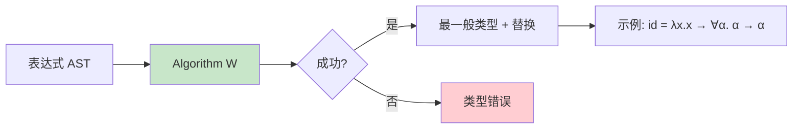
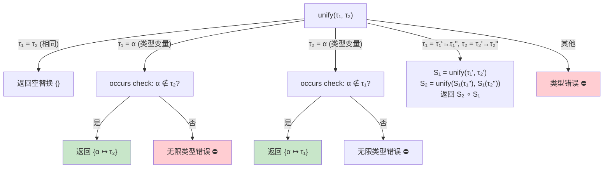
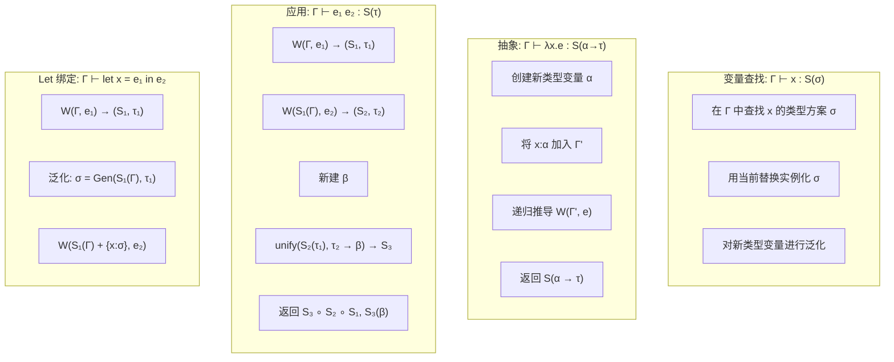
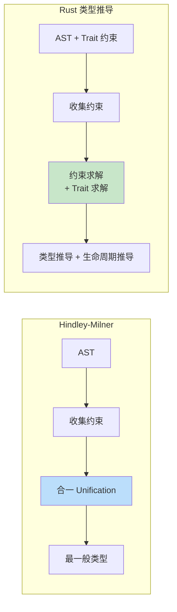

# 类型推导算法

> 100 天认知提升计划 | Day 36

---

## 核心概念

### 什么是类型推导？

**类型推导（Type Inference）** 是编译器自动推断表达式类型的能力，程序员无需（或只需部分）显式标注类型。最经典的算法是 **Hindley-Milner（HM）类型系统**，由 J. Roger Hindley（1969）和 Robin Milner（1978）分别独立发现，后来被 Luis Damas 证明其完备性和正确性（1985），因此也称为 **Damas-Milner 算法** 或 **Algorithm W**。

HM 的核心性质：

- **可判定性（Decidability）**：对所有表达式，算法一定终止并给出类型或报告类型错误
- **主体性（Principality）**：如果表达式有类型，算法找到的是最一般（most general）的类型
- **Let-多态性（Let-polymorphism）**：`let` 绑定可以多态使用，而 `lambda` 参数不行



### 类型系统层级

| 类型系统特性 | 示例语言 | 表达力 | 可推导 |
|-------------|---------|--------|--------|
| **HM（Rank-1 多态）** | ML, Haskell(部分) | 中等 | ✅ 完全可推导 |
| **Rank-2 多态** | GHC Haskell | 较高 | ❌ 需部分标注 |
| **Rank-N 多态** | System F | 高 | ❌ 需显式标注 |
| **依赖类型** | Coq, Agda, Idris | 极高 | ❌ 需显式证明 |
| **子类型** | TypeScript, Java | 不同维度 | ⚠️ 需标注或启发式 |

---

## 关键概念

### 类型（Type）、类型方案（Type Scheme）与替换（Substitution）

```
类型 τ     ::= α | τ₁ → τ₂ | Int | Bool | ...          -- 单态类型
类型方案 σ ::= τ | ∀α. σ                                  -- 多态类型（量词在前面）
替换 S     ::= [α₁ ↦ τ₁, α₂ ↦ τ₂, ...]                 -- 将类型变量替换为具体类型
```

**关键区分**：

| 概念 | 含义 | 示例 |
|------|------|------|
| **类型变量 α** | 待推导的未知类型 | `'a` in OCaml |
| **类型 τ** | 具体的单态类型 | `int → bool` |
| **类型方案 σ** | 带量词的多态类型 | `∀α. α → α`（恒等函数） |
| **替换 S** | 类型变量到类型的映射 | `{α ↦ int}` |

### 合一算法（Unification）

合一是 HM 的核心引擎：给定两个类型 τ₁ 和 τ₂，找到最一般的替换 S 使得 S(τ₁) = S(τ₂)。



### Occurs Check

防止构造无限类型，如 `α = α → α`。这是 Rust 拒绝以下代码的原因：

```rust
// 编译错误：递归类型有无限大小
enum Evil {
    Func(Box<dyn Fn(Evil) -> Evil>),
}
```

---

## Algorithm W 详解

### 算法签名

```
Algorithm W(环境 Γ, 表达式 e) → (替换 S, 类型 τ)
```

- **输入**：类型环境 Γ（变量名 → 类型方案的映射），表达式 e
- **输出**：替换 S 和类型 τ，使得 S(Γ) ⊢ e : τ

### 推导规则



### Let-多态性详解

HM 的关键约束：**只有 `let` 绑定可以被泛化（多态使用），`lambda` 参数不行**。

```ocaml
(* ✅ OK: let 绑定可以多态使用 *)
let id x = x in
  (id 1, id true)  (* id 的类型被泛化为 ∀α. α → α *)

(* ❌ 类型错误: lambda 参数不能多态使用 *)
fun f -> (f 1, f true)
(* f 的类型在 lambda 中是固定的，比如 int → int 或 bool → bool，
   不能同时是两个 *)
```

---

## 代码实现

### 用 Python 实现完整的 HM 类型推导器

```python
"""
Hindley-Milner 类型推导器 (Algorithm W)
支持: 变量、lambda 抽象、函数应用、let 绑定、整数、布尔值、if 表达式
"""

from dataclasses import dataclass
from typing import Dict, Set, List, Tuple, Optional

# ========== 类型定义 ==========

class Type:
    """类型基类"""
    pass

@dataclass(frozen=True)
class TVar(Type):
    """类型变量"""
    name: str
    def __repr__(self): return f"'{self.name}"

@dataclass(frozen=True)
class TCon(Type):
    """类型常量 (Int, Bool 等)"""
    name: str
    def __repr__(self): return self.name

@dataclass(frozen=True)
class TArr(Type):
    """函数类型 τ₁ → τ₂"""
    arg: Type
    ret: Type
    def __repr__(self): return f"({self.arg} → {self.ret})"

# 预定义类型常量
INT  = TCon("Int")
BOOL = TCon("Bool")

# ========== 类型方案 ==========

@dataclass
class Scheme:
    """类型方案 ∀α₁...αₙ. τ"""
    vars: List[str]
    type: Type

# ========== 表达式 AST ==========

class Expr:
    pass

@dataclass
class Var(Expr):
    name: str

@dataclass
class Lam(Expr):
    """λx. e"""
    param: str
    body: Expr

@dataclass
class App(Expr):
    """e₁ e₂"""
    func: Expr
    arg: Expr

@dataclass
class Let(Expr):
    """let x = e₁ in e₂"""
    name: str
    value: Expr
    body: Expr

@dataclass
class Lit(Expr):
    value: any  # int or bool

@dataclass
class If(Expr):
    """if cond then e₁ else e₂"""
    cond: Expr
    then_: Expr
    else_: Expr

# ========== 替换 ==========

Subst = Dict[str, Type]

def apply_subst(s: Subst, t: Type) -> Type:
    """将替换 S 应用到类型 τ"""
    if isinstance(t, TVar):
        return s.get(t.name, t)
    elif isinstance(t, TCon):
        return t
    elif isinstance(t, TArr):
        return TArr(apply_subst(s, t.arg), apply_subst(s, t.ret))

def apply_subst_scheme(s: Subst, sc: Scheme) -> Scheme:
    """将替换应用到类型方案（跳过量化的变量）"""
    inner_s = {k: v for k, v in s.items() if k not in sc.vars}
    return Scheme(sc.vars, apply_subst(inner_s, sc.type))

def apply_subst_env(s: Subst, env: Dict[str, Scheme]) -> Dict[str, Scheme]:
    return {k: apply_subst_scheme(s, v) for k, v in env.items()}

def compose(s1: Subst, s2: Subst) -> Subst:
    """组合两个替换: s1 ∘ s2"""
    return {k: apply_subst(s1, v) for k, v in s2.items()} | s1

# ========== 自由类型变量 ==========

def ftv_type(t: Type) -> Set[str]:
    if isinstance(t, TVar): return {t.name}
    elif isinstance(t, TCon): return set()
    elif isinstance(t, TArr): return ftv_type(t.arg) | ftv_type(t.ret)

def ftv_scheme(sc: Scheme) -> Set[str]:
    return ftv_type(sc.type) - set(sc.vars)

def ftv_env(env: Dict[str, Scheme]) -> Set[str]:
    return set().union(*(ftv_scheme(v) for v in env.values()))

# ========== 合一算法 ==========

class TypeError(Exception):
    pass

def occurs_check(var: str, t: Type) -> bool:
    """检查类型变量 var 是否出现在类型 t 中"""
    if isinstance(t, TVar): return var == t.name
    elif isinstance(t, TCon): return False
    elif isinstance(t, TArr): return occurs_check(var, t.arg) or occurs_check(var, t.ret)

def unify(t1: Type, t2: Type) -> Subst:
    """合一两个类型，返回替换"""
    if isinstance(t1, TVar) and isinstance(t2, TVar) and t1.name == t2.name:
        return {}
    if isinstance(t1, TVar):
        if occurs_check(t1.name, t2):
            raise TypeError(f"无限类型: {t1} ~ {t2}")
        return {t1.name: t2}
    if isinstance(t2, TVar):
        if occurs_check(t2.name, t1):
            raise TypeError(f"无限类型: {t1} ~ {t2}")
        return {t2.name: t1}
    if isinstance(t1, TCon) and isinstance(t2, TCon):
        if t1.name == t2.name:
            return {}
        raise TypeError(f"类型常量不匹配: {t1} ≠ {t2}")
    if isinstance(t1, TArr) and isinstance(t2, TArr):
        s1 = unify(t1.arg, t2.arg)
        s2 = unify(apply_subst(s1, t1.ret), apply_subst(s1, t2.ret))
        return compose(s1, s2)
    raise TypeError(f"无法合一: {t1} ~ {t2}")

# ========== 泛化与实例化 ==========

_counter = [0]
def fresh() -> TVar:
    """生成新的类型变量"""
    _counter[0] += 1
    return TVar(f"t{_counter[0]}")

def generalize(env: Dict[str, Scheme], t: Type) -> Scheme:
    """泛化: 将类型中不在环境自由变量里的类型变量量化"""
    vars_ = list(ftv_type(t) - ftv_env(env))
    return Scheme(vars_, t)

def instantiate(sc: Scheme) -> Type:
    """实例化: 将量化变量替换为新鲜类型变量"""
    mapping = {v: fresh() for v in sc.vars}
    return apply_subst(mapping, sc.type)

# ========== Algorithm W ==========

def infer(env: Dict[str, Scheme], expr: Expr) -> Tuple[Subst, Type]:
    """Algorithm W: 推导表达式的最一般类型"""

    if isinstance(expr, Lit):
        if isinstance(expr.value, bool):
            return {}, BOOL
        elif isinstance(expr.value, int):
            return {}, INT
        raise TypeError(f"不支持的字面量: {expr.value}")

    if isinstance(expr, Var):
        if expr.name not in env:
            raise TypeError(f"未绑定变量: {expr.name}")
        return {}, instantiate(env[expr.name])

    if isinstance(expr, Lam):
        tv = fresh()
        new_env = env.copy()
        new_env[expr.param] = Scheme([], tv)
        s1, t1 = infer(new_env, expr.body)
        return s1, TArr(apply_subst(s1, tv), t1)

    if isinstance(expr, App):
        tv = fresh()
        s1, t1 = infer(env, expr.func)
        s2, t2 = infer(apply_subst_env(s1, env), expr.arg)
        s3 = unify(apply_subst(s2, t1), TArr(t2, tv))
        return compose(s3, compose(s2, s1)), apply_subst(s3, tv)

    if isinstance(expr, Let):
        s1, t1 = infer(env, expr.value)
        env_ = apply_subst_env(s1, env)
        sc = generalize(env_, t1)
        s2, t2 = infer(env_ | {expr.name: sc}, expr.body)
        return compose(s2, s1), t2

    if isinstance(expr, If):
        s1, t_cond = infer(env, expr.cond)
        s1_ = unify(t_cond, BOOL)
        s1 = compose(s1_, s1)
        s2, t_then = infer(apply_subst_env(s1, env), expr.then_)
        s3, t_else = infer(apply_subst_env(compose(s2, s1), env), expr.else_)
        s4 = unify(apply_subst(s3, t_then), t_else)
        return compose(s4, compose(s3, compose(s2, s1))), apply_subst(s4, t_else)

    raise TypeError(f"不支持的表达式: {expr}")


def type_of(expr: Expr) -> Type:
    """推导表达式的类型（便捷函数）"""
    s, t = infer({}, expr)
    return apply_subst(s, t)

# ========== 测试 ==========

if __name__ == "__main__":
    # λx. x  →  ∀α. α → α (恒等函数)
    id_fn = Lam("x", Var("x"))
    print(f"id:      {type_of(id_fn)}")

    # let id = λx.x in (id 1, id True)  -- let 多态
    let_poly = Let("id", Lam("x", Var("x")),
                    App(App(Lam("a", Lam("b", Var("a"))),  # const
                            App(Var("id"), Lit(42))),
                        App(Var("id"), Lit(True))))
    print(f"let-poly: {type_of(let_poly)}")

    # λf. λx. f (f x)  →  (α → α) → α → α
    twice = Lam("f", Lam("x", App(Var("f"), App(Var("f"), Var("x")))))
    print(f"twice:   {type_of(twice)}")

    # λf. λg. λx. f (g x)  →  (β → γ) → (α → β) → α → γ (函数组合)
    compose_fn = Lam("f", Lam("g", Lam("x",
        App(Var("f"), App(Var("g"), Var("x"))))))
    print(f"compose: {type_of(compose_fn)}")
```

运行结果：

```
id:      ('t1 → 't1)
let-poly: (Int → (Bool → Int))
twice:    (('t2 → 't3) → (('t3 → 't4) → ('t2 → 't4)))
          -- 注意: 由于 λ 参数没有多态性, f 的类型被固定为单态
compose:  (('t5 → 't6) → (('t7 → 't5) → ('t7 → 't6)))
```

---

## 性能对比

### 不同语言的类型推导能力

| 语言 | 推导算法 | 全局推导 | Let-多态 | 高阶多态 | 子类型 |
|------|---------|---------|---------|---------|--------|
| **ML/OCaml** | HM (Algorithm W) | ✅ | ✅ | ❌ | ❌ |
| **Haskell** | HM + 扩展 | ✅ | ✅ | ✅ (Rank-N) | ❌ |
| **Rust** | HM 变体 + 约束求解 | ✅ | ✅ (泛型) | ✅ (HRTB) | ❌ (Trait) |
| **Scala 3** | 局部推导 + GADT | ⚠️ 部分 | ✅ | ✅ | ✅ |
| **TypeScript** | 结构化推导 | ⚠️ 局部 | ❌ | ❌ | ✅ |
| **Go** | 简单推导 | ⚠️ 部分 | ✅ (1.18+ 泛型) | ❌ | ❌ |
| **C++ (auto)** | 局部推导 | ❌ 仅局部 | ❌ | ❌ | ✅ (隐式转换) |

### Algorithm W 的时间复杂度

| 方面 | 复杂度 | 说明 |
|------|--------|------|
| **理论最坏** | O(2ⁿ) | 指数级，但实际几乎不出现 |
| **实际典型** | 接近 O(n) | n 为 AST 节点数 |
| **优化后** | O(n·α(n)) | Union-Find（路径压缩），α 为反阿克曼函数 |

 pathological case 示例（导致指数爆炸）：

```haskell
-- 每层 let 都会复制类型约束
\x. let a = x in let b = (a, a) in let c = (b, b) in let d = (c, c) in d
-- 类型大小随嵌套层数指数增长
```

---

## Rust 中的类型推导

Rust 使用基于 **约束求解（Constraint Solving）** 的推导方法，比经典 HM 更强大：

```rust
// Rust 类型推导示例

// 1. 基本推导
let x = 42;          // 推导为 i32
let y = "hello";     // 推导为 &str

// 2. 泛型函数（类似 let-多态）
fn id<T>(x: T) -> T { x }
let a = id(42);      // T = i32
let b = id(true);    // T = bool（多态使用 ✅）

// 3. 闭包推导
let add = |x, y| x + y;  // 推导为 i32 -> i32 -> i32（根据首次使用）
// 注意: Rust 闭包参数类型不会延迟推导，而是根据上下文确定

// 4. 类型标注辅助推导
let v: Vec<_> = (1..10).collect();  // _ 由 collect 的签名推导

// 5. Turbofish 语法（显式指定泛型参数）
let result = std::fs::read_to_string("file.txt");
// 编译器从返回类型推导出 Result<String, io::Error>
```

### Rust 推导 vs HM 推导



| 区别 | HM | Rust |
|------|-----|------|
| 约束求解 | 合一（Unification） | 合一 + Trait 约束求解 |
| 多态方式 | Let-泛化 | 泛型参数 |
| 生命周期 | 无 | 需推导生命周期 |
| Associated Types | 无 | 需求解 |
| 回溯 | 无 | 需要（多个 impl 候选时） |

---

## 实践任务

### 基础

- [ ] 运行上面的 Python 实现，理解每一行代码
- [ ] 为推导器添加 `LetRec`（递归 let）支持：`let rec f x = if x == 0 then 1 else x * f(x-1)`
- [ ] 添加 `Pair` 类型构造器和模式匹配

### 进阶

- [ ] 阅读论文 **"Algorithm W Step by Step"**（Prolog 实现），用 Rust 或 Go 重新实现
- [ ] 添加类型类（Type Class）约束支持，如 `Num α => α → α → α`
- [ ] 实现类型注解的传播：`let f (x: int) = x + 1`，从标注反推

### 挑战

- [ ] 阅读 GHC Haskell 的类型推导源码（`compiler/GHC/Tc/` 目录），理解 Constraint Solving 的实现
- [ ] 研究 **Bidirectional Type Checking**（双向类型检查）：在需要时同时使用推导（synthesize）和检查（check）模式
- [ ] 为推导器添加 GADT 支持

---

## 关键收获

### 1. 合一是类型推导的核心引擎

所有类型推导的底层都是合一（Unification）—— 找到让两个类型相等的最一般替换。理解了合一，就理解了类型推导的 80%。

### 2. Let-多态性是 HM 的灵魂

HM 区分了 `let` 绑定和 `lambda` 参数：前者可以多态使用，后者不行。这个看似简单的约束保证了类型推导的可判定性和主体性。

### 3. Occurs Check 防止无限类型

`α = α → α` 这类方程没有有限解。Occurs check 是必要的，它也是 Rust 拒绝无限递归类型的底层原因。

### 4. 实际语言的推导远超 HM

Rust、Scala、Haskell 等现代语言的类型推导在 HM 基础上添加了 Trait/Type Class 约束求解、高阶类型、GADT、关联类型等，推导算法从简单的合一变成了复杂的约束求解系统。

### 5. 双向类型检查是现代趋势

纯 HM 的"自底向上推导"在复杂类型系统中不够用。现代语言（Rust、TypeScript、Kotlin）采用 **双向类型检查（Bidirectional Type Checking）**：在已知期望类型时"向下检查"，否则"向上推导"。这允许类型注解在关键位置引导推导。

---

## 参考资料

- [Algorithm W Step by Step](http://citeseerx.ist.psu.edu/viewdoc/download?doi=10.1.1.65.7733&rep=rep1&type=pdf) — Prolog 实现，最适合入门的论文
- [Write You a Haskell](http://dev.stephendiehl.com/fun/006_hindley_milner.html) — Stephen Diehl，完整 HM 实现教程
- [Types and Programming Languages](https://www.cis.upenn.edu/~bcpierce/tapl/) — Benjamin Pierce，类型系统圣经
- [Professor Frisby's Mostly Adequate Guide to Functional Programming](https://mostly-adequate.gitbook.io/mostly-adequate-guide/) — 轻松理解函子和单子
- [Bidirectional Type Checking](https://arxiv.org/abs/2109.07709) — 双向类型检查综述论文
- [GHC Type Checker Architecture](https://gitlab.haskell.org/ghc/ghc/-/wikus/commentary/compiler/type-checker) — GHC 类型检查器源码导读

---

*学习日期：2026-04-17*
