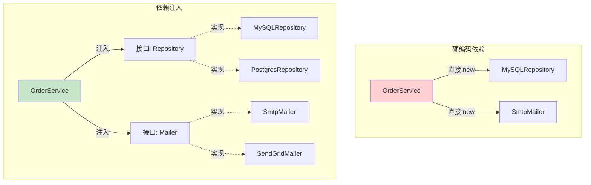
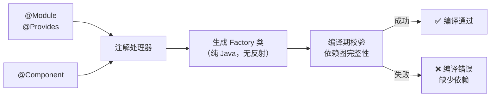
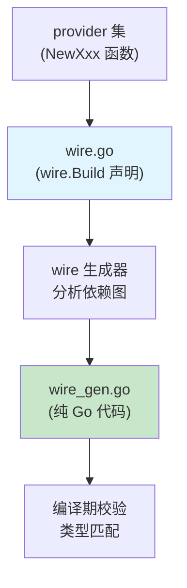
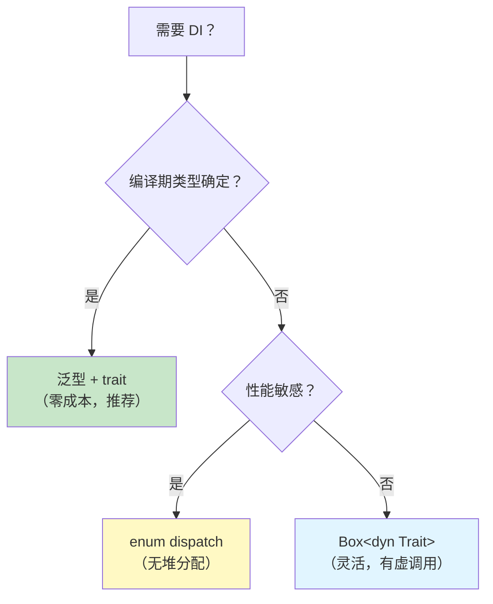
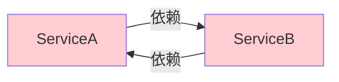

# 依赖注入模式

> 100 天认知提升计划 | Day 38

---

## 核心概念

### 什么是依赖注入？

**依赖注入（Dependency Injection, DI）** 是一种控制反转（IoC）的实现方式：对象不自行创建其依赖，而是由外部容器或框架在运行时/编译期注入。它将"使用什么"与"如何创建"解耦，是构建可测试、可维护系统的基石。

**三种注入方式**：

| 方式 | 说明 | 优点 | 缺点 |
|------|------|------|------|
| 构造器注入 | 通过构造函数参数传入 | 依赖不可变、强制提供 | 参数多时构造器臃肿 |
| Setter 注入 | 通过 setter 方法设置 | 可选依赖、灵活 | 对象可能处于不完整状态 |
| 接口注入 | 依赖通过特定接口方法注入 | 最解耦 | 侵入性强，实际少用 |

### 为什么需要 DI？



**核心收益**：
- **可测试性**：轻松注入 mock 对象
- **可替换性**：切换实现无需修改调用方
- **生命周期管理**：容器统一管理对象的创建和销毁
- **关注点分离**：业务逻辑不关心基础设施细节

---

## 技术架构：各语言 DI 实现对比

### 1. Java Spring — 运行时反射 DI

Spring 是最经典的 DI 容器，通过 **运行时反射** 解析 `@Autowired` 注解并注入依赖。

```java
// 接口定义
public interface UserRepository {
    User findById(Long id);
}

// 实现类 — @Component 注册到容器
@Component
public class JpaUserRepository implements UserRepository {
    @PersistenceContext
    private EntityManager em;

    @Override
    public User findById(Long id) {
        return em.find(User.class, id);
    }
}

// 消费者 — 构造器注入（Spring 推荐）
@Service
public class UserService {
    private final UserRepository userRepo;
    private final EmailService emailService;

    @Autowired // Spring 4.3+ 单构造器可省略
    public UserService(UserRepository userRepo, EmailService emailService) {
        this.userRepo = userRepo;
        this.emailService = emailService;
    }
}
```

**Spring Bean 生命周期**：

```mermaid
flowchart TB
    A[实例化 Bean] --> B[属性注入]
    B --> C[BeanNameAware]
    C --> D[BeanFactoryAware]
    D --> E[ApplicationContextAware]
    E --> F[BeanPostProcessor::postProcessBeforeInitialization]
    F --> G[@PostConstruct]
    G --> H[InitializingBean::afterPropertiesSet]
    H --> I[自定义 init-method]
    I --> J[BeanPostProcessor::postProcessAfterInitialization]
    J --> K["✅ Bean 就绪"]
    K --> L[@PreDestroy]
    L --> M[DisposableBean::destroy]
    M --> N[自定义 destroy-method]
```

**Spring 的代价**：
- 启动时反射扫描开销大
- 运行时代理（CGLIB/JDK Dynamic Proxy）影响性能
- 依赖关系在运行时才能发现错误
- 复杂的代理链导致调试困难

### 2. Java Dagger 2 — 编译期代码生成

Dagger 2 由 Google 开发，完全在 **编译期** 通过注解处理器生成 DI 代码，零反射。

```java
// 1. 用 @Module 标记提供依赖的模块
@Module
public class ApplicationModule {
    @Provides
    @Singleton
    public UserRepository provideUserRepository(DataSource ds) {
        return new JpaUserRepository(ds);
    }

    @Provides
    public DataSource provideDataSource() {
        return new HikariDataSource(config);
    }
}

// 2. 用 @Component 连接模块和注入目标
@Component(modules = ApplicationModule.class)
@Singleton
public interface ApplicationComponent {
    UserService userService();     // 暴露入口
    void inject(OrderController controller); // 字段注入目标
}

// 3. 编译后自动生成 DaggerApplicationComponent
ApplicationComponent component = DaggerApplicationComponent.create();
UserService userService = component.userService();
```

**Dagger 2 编译流程**：



**Dagger 2 vs Spring 对比**：

| 维度 | Spring | Dagger 2 |
|------|--------|----------|
| 解析时机 | 运行时（反射） | 编译期（代码生成） |
| 性能开销 | 启动慢，运行时代理 | 零运行时开销 |
| 错误发现 | 运行时异常 | 编译期报错 |
| 学习曲线 | 较低 | 中等 |
| 适用场景 | 企业应用、微服务 | Android、CLI 工具 |
| 代码量 | 少（框架做得多） | 多（生成的样板代码） |

### 3. Go Wire — 编译期代码生成

Wire 由 Google 开发，为 Go 提供编译期 DI。Go 没有泛型注解，Wire 用 **代码声明** 替代。

```go
// provider.go — 定义如何构造各依赖

// NewDataSource 创建数据源
func NewDataSource(cfg *Config) *sql.DB {
    db, _ := sql.Open("postgres", cfg.DBURL)
    return db
}

// NewUserRepo 创建用户仓库
func NewUserRepo(db *sql.DB) UserRepository {
    return &PostgresUserRepo{db: db}
}

// NewEmailService 创建邮件服务
func NewEmailService(cfg *Config) EmailService {
    return &SMTPEmailer{host: cfg.SMTPHost}
}

// NewUserService 创建用户服务
func NewUserService(repo UserRepository, mailer EmailService) *UserService {
    return &UserService{repo: repo, mailer: mailer}
}

// wire.go — 声明依赖图（//go:build wireinject）
//go:build wireinject

func InitializeUserService(cfg *Config) *UserService {
    wire.Build(
        NewDataSource,
        NewUserRepo,
        NewEmailService,
        NewUserService,
    )
    return nil // 仅为类型签名，Wire 生成真实实现
}

// 运行 wire 生成 wire_gen.go：
// func InitializeUserService(cfg *Config) *UserService {
//     db := NewDataSource(cfg)
//     repo := NewUserRepo(db)
//     mailer := NewEmailService(cfg)
//     return NewUserService(repo, mailer)
// }
```

**Wire 工作流程**：



### 4. Rust — 类型系统实现 DI（零成本抽象）

Rust 没有运行时反射，也不需要 DI 框架。**泛型 + trait** 本身就是编译期 DI。

```rust
// 用 trait 定义接口
trait UserRepository: Send + Sync {
    fn find_by_id(&self, id: u64) -> Option<User>;
}

trait EmailService: Send + Sync {
    fn send(&self, to: &str, subject: &str, body: &str) -> Result<(), EmailError>;
}

// 业务逻辑 — 泛型参数就是"注入点"
struct UserService<R, E>
where
    R: UserRepository,
    E: EmailService,
{
    repo: R,
    mailer: E,
}

impl<R, E> UserService<R, E>
where
    R: UserRepository,
    E: EmailService,
{
    fn new(repo: R, mailer: E) -> Self {
        Self { repo, mailer }
    }

    fn register(&self, name: &str, email: &str) -> Result<User, Error> {
        let user = self.repo.save(User::new(name, email))?;
        self.mailer.send(email, "欢迎", "注册成功")?;
        Ok(user)
    }
}

// 单态化 — 编译期确定具体类型，零虚函数调用开销
fn main() {
    let repo = PostgresUserRepo::new(db_conn);
    let mailer = SendGridMailer::new(api_key);
    let service = UserService::new(repo, mailer);
    service.register("Alice", "alice@example.com").unwrap();
}
```

**Rust 的 DI 策略选择**：

| 场景 | 方案 | 示例 |
|------|------|------|
| 编译期已知类型 | 泛型 + trait | `struct S<R: Repo>` |
| 运行时动态选择 | `dyn Trait` | `Box<dyn Repo>` |
| 需要服务定位 | `shaku` / `waiter` crate | DI 容器库 |
| 配置驱动切换 | enum dispatch | 手写枚举分发 |



---

## 性能对比

### DI 框架启动开销

以注入 1000 个依赖为例的基准测试估算：

| 框架 | 启动时间 | 内存开销 | 反射使用 |
|------|---------|---------|---------|
| Spring (反射) | ~800ms | ~50MB | ✅ 大量 |
| Dagger 2 (编译期) | ~2ms | ~5MB | ❌ 无 |
| Go Wire (编译期) | ~1ms | ~2MB | ❌ 无 |
| Rust 泛型 | 0ms (编译时) | 0 额外 | ❌ 无 |
| Rust `dyn Trait` | ~0.1ms | ~1MB | ❌ 无 |

### 运行时方法调用开销

```
虚函数调用（dyn Trait / Spring Proxy）: ~5-10ns 额外开销
单态化（Rust 泛型 / Dagger 生成代码）:  0ns 额外开销
反射调用（Spring @Autowired 字段注入）: ~100-500ns 额外开销
```

---

## DI 反模式

### ⚠️ Service Locator（服务定位器）

```java
// 反模式：在类内部主动拉取依赖
public class OrderService {
    public void process(Order order) {
        // 隐藏的依赖！从全局容器拉取
        UserRepository repo = ServiceLocator.get(UserRepository.class);
        EmailService mailer = ServiceLocator.get(EmailService.class);
    }
}
```

**问题**：依赖关系被隐藏，测试困难，与全局变量无异。

### ⚠️ 过度注入

```java
// 构造器参数过多 → 信号：类承担了太多职责
public class MegaService {
    public MegaService(A a, B b, C c, D d, E e, F f, G g /* ... */) { }
}
```

**解法**：拆分为更小的、职责单一的类（SRP）。

### ⚠️ 循环依赖



Spring 通过三级缓存 + 早期引用解决（但这是坏味道），Dagger 2 直接编译报错。

---

## 关键收获

1. **DI 的本质是解耦**：将"依赖什么"与"如何创建"分离，核心价值是可测试性和可维护性
2. **编译期 > 运行时**：Dagger 2 / Wire / Rust 泛型将错误提前到编译期，优于 Spring 的运行时发现
3. **Rust 不需要 DI 框架**：泛型 + trait 就是编译期 DI，单态化后零运行时开销
4. **Go 的哲学是显式优于隐式**：Wire 的代码生成方式符合 Go 社区偏好
5. **警惕 Service Locator**：它不是 DI，而是全局变量的变体
6. **构造器注入是最佳实践**：保证依赖不可变且完整，Spring/Dagger/Go 社区均推荐

---

## 实践任务

- [ ] 用 Java + Dagger 2 实现一个简单的订单服务 DI，体验编译期生成
- [ ] 用 Go + Wire 重写同样的服务，对比代码生成风格
- [ ] 用 Rust 泛型 + trait 实现同样的服务，体会零成本 DI
- [ ] 对比三种实现的编译速度、运行时开销和调试体验
- [ ] 思考：在 TypeScript/JavaScript 项目中，DI 的最佳实践是什么？（提示：考虑 `tsyringe`、`inversify`、手动注入）

---

## 参考资料

- [Dependency Injection Principles, Practices, and Patterns](https://manning.com/books/dependency-injection-principles-practices-patterns) — Steven van Deursen, Mark Seemann
- [Dagger 2 官方文档](https://dagger.dev/dev-guide/)
- [Go Wire 教程](https://github.com/google/wire/blob/main/docs/guide.md)
- [Rust 中的依赖注入](https://github.com/kud1ing/rust-design-patterns) — Rust Design Patterns
- [Inversion of Control Containers and the Dependency Injection pattern](https://martinfowler.com/articles/injection.html) — Martin Fowler
- [Spring Framework DI 文档](https://docs.spring.io/spring-framework/reference/core/beans.html)

---

*学习日期：2026-04-18*
