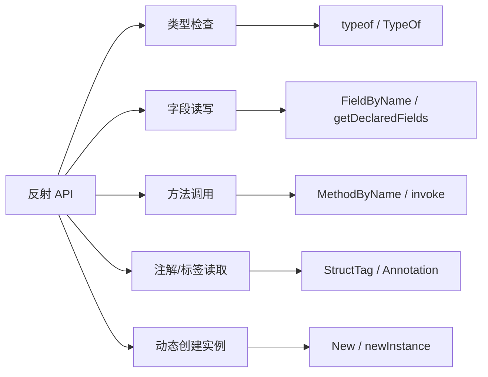
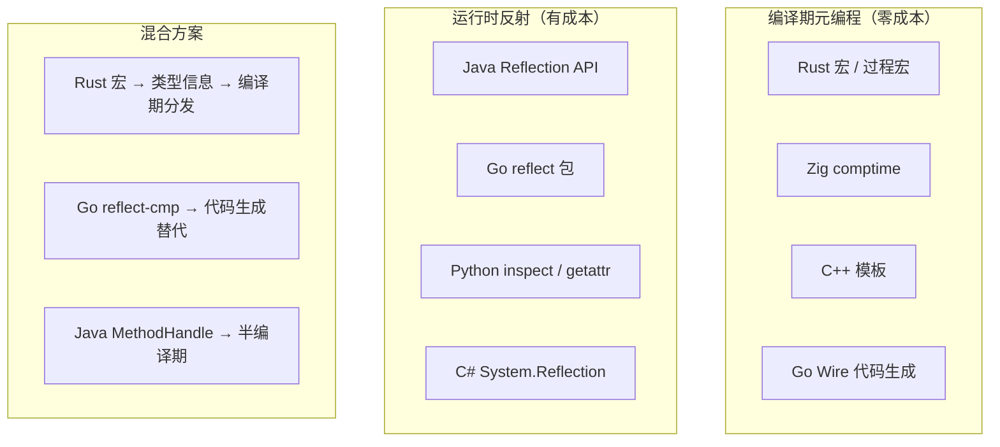
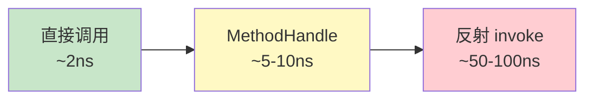
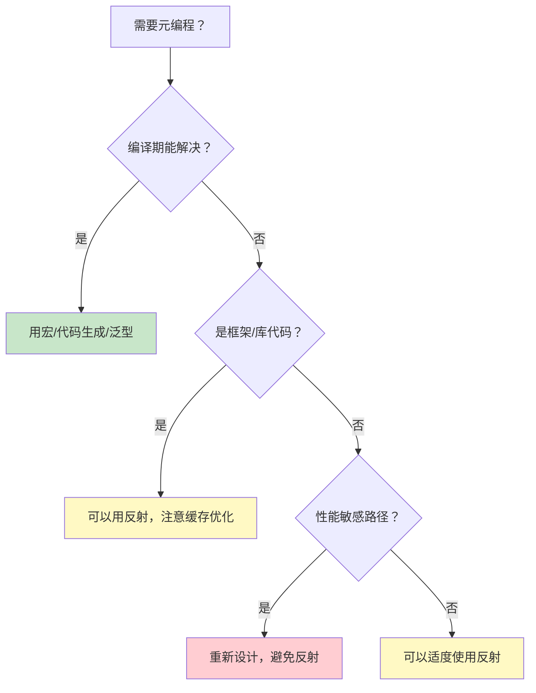

# 元编程反射

> 100 天认知提升计划 | Day 39

---

## 核心概念

### 什么是反射？

**反射（Reflection）** 是程序在运行时检查、 introspect 和修改自身结构与行为的能力——包括类型信息、字段值、方法调用、注解/标签等。它是元编程最常用的形式，让你写出"能写代码的代码"。

**三种元编程层次**：

| 层次 | 时机 | 代表 | 性能 |
|------|------|------|------|
| 宏 / 模板元编程 | 编译期 | Rust 宏、C++ 模板、Zig comptime | 零运行时开销 |
| 代码生成 | 编译前/构建期 | Go Wire、Java Annotation Processor | 零运行时开销 |
| 反射 | 运行时 | Java Reflect、Go reflect、Python inspect | 有显著开销 |

### 反射的核心能力



---

## 技术架构

### 各语言反射机制对比



---

## 代码示例

### Go reflect：JSON 序列化器的简化实现

```go
package main

import (
	"fmt"
	"reflect"
	"strings"
)

// 用反射实现一个极简 JSON 序列化器
func ToJSON(v interface{}) string {
	val := reflect.ValueOf(v)
	// 处理指针，获取实际值
	if val.Kind() == reflect.Ptr {
		val = val.Elem()
	}
	typ := val.Type()

	if typ.Kind() != reflect.Struct {
		return fmt.Sprintf(`"%v"`, v)
	}

	fields := make([]string, 0, typ.NumField())
	for i := 0; i < typ.NumField(); i++ {
		field := typ.Field(i)
		fieldVal := val.Field(i)

		// 读取 struct tag 做字段名映射
		jsonTag := field.Tag.Get("json")
		if jsonTag == "-" {
			continue // 跳过忽略字段
		}
		name := field.Name
		if jsonTag != "" {
			name = strings.Split(jsonTag, ",")[0]
		}

		var repr string
		switch fieldVal.Kind() {
		case reflect.String:
			repr = fmt.Sprintf(`"%s"`, fieldVal.String())
		case reflect.Int, reflect.Int64:
			repr = fmt.Sprintf(`%d`, fieldVal.Int())
		case reflect.Bool:
			repr = fmt.Sprintf(`%t`, fieldVal.Bool())
		case reflect.Float64:
			repr = fmt.Sprintf(`%f`, fieldVal.Float())
		default:
			repr = `null`
		}
		fields = append(fields, fmt.Sprintf(`"%s":%s`, name, repr))
	}
	return "{" + strings.Join(fields, ",") + "}"
}

// 使用示例
type User struct {
	Name  string  `json:"name"`
	Age   int     `json:"age"`
	Email string  `json:"email,omitempty"`
	Score float64 `json:"score"`
	Secret string `json:"-"`
}

func main() {
	u := User{Name: "Alice", Age: 30, Email: "alice@example.com", Score: 95.5, Secret: "hidden"}
	fmt.Println(ToJSON(u))
	// {"name":"Alice","age":30,"email":"alice@example.com","score":95.500000}
}
```

### Java 反射 + Annotation：简易 ORM 映射

```java
import java.lang.annotation.*;
import java.lang.reflect.*;

@Retention(RetentionPolicy.RUNTIME)
@Target(ElementType.FIELD)
@interface Column {
    String name();
    String type() default "TEXT";
}

@Retention(RetentionPolicy.RUNTIME)
@Target(ElementType.TYPE)
@interface Table {
    String name();
}

@Table(name = "users")
class User {
    @Column(name = "id", type = "INTEGER PRIMARY KEY")
    private int id;

    @Column(name = "username")
    private String username;

    @Column(name = "email")
    private String email;
}

// 用反射生成 CREATE TABLE 语句
public class OrmGenerator {
    public static String createTableSQL(Class<?> clazz) {
        Table table = clazz.getAnnotation(Table.class);
        StringBuilder sql = new StringBuilder();
        sql.append("CREATE TABLE IF NOT EXISTS ").append(table.name()).append(" (\n");

        Field[] fields = clazz.getDeclaredFields();
        for (int i = 0; i < fields.length; i++) {
            Field f = fields[i];
            Column col = f.getAnnotation(Column.class);
            if (col == null) continue;
            sql.append("  ").append(col.name()).append(" ").append(col.type());
            if (i < fields.length - 1) sql.append(",");
            sql.append("\n");
        }
        sql.append(");");
        return sql.toString();
    }

    public static void main(String[] args) {
        System.out.println(createTableSQL(User.class));
    }
}
```

### Rust 的替代方案：过程宏（编译期元编程，零运行时成本）

```rust
use serde::{Serialize, Deserialize};

// serde_derive 是过程宏，在编译期生成序列化代码
// 运行时没有任何反射开销
#[derive(Serialize, Deserialize, Debug)]
struct User {
    name: String,
    #[serde(rename = "age_years")]
    age: u32,
    #[serde(skip_serializing)]
    password_hash: String,
}

fn main() {
    let user = User {
        name: "Alice".into(),
        age: 30,
        password_hash: "secret".into(),
    };
    // 序列化代码在编译期已完全展开
    let json = serde_json::to_string(&user).unwrap();
    println!("{}", json);
    // {"name":"Alice","age_years":30}  — password_hash 被跳过
}
```

---

## 性能对比

### Go 反射 vs 代码生成的性能差异

```go
// benchmark_test.go
package bench

import (
	"encoding/json"
	"testing"
)

type Data struct {
	Name   string `json:"name"`
	Values []int  `json:"values"`
}

// 标准库 json（使用反射）
func BenchmarkJSONReflect(b *testing.B) {
	d := Data{Name: "test", Values: []int{1, 2, 3}}
	for i := 0; i < b.N; i++ {
		json.Marshal(d)
	}
}

// jsoniter（代码生成优化，避免反射）
import jsoniter "github.com/json-iterator/go"

func BenchmarkJSONIter(b *testing.B) {
	d := Data{Name: "test", Values: []int{1, 2, 3}}
	var json2 = jsoniter.ConfigCompatibleWithStandardLibrary
	for i := 0; i < b.N; i++ {
		json2.Marshal(d)
	}
}
```

**典型结果**：

| 方案 | ns/op | allocs/op | 说明 |
|------|-------|-----------|------|
| `encoding/json`（反射） | ~1200 | 6 | 标准反射路径 |
| `jsoniter`（代码生成） | ~300 | 2 | 快 3-4 倍 |
| `easyjson`（代码生成） | ~200 | 1 | 最快，但需生成代码 |
| `sonic`（JIT 编译） | ~150 | 1 | 字节跳动出品，JIT |

### Java 反射 vs 直接调用

```java
// 直接调用
user.getName();                         // ~2 ns

// 反射调用
Method m = User.class.getMethod("getName");
m.invoke(user);                         // ~50-100 ns（约 25-50 倍慢）

// MethodHandle（半优化）
MethodHandle mh = MethodHandles.lookup().findVirtual(User.class, "getName", MethodType.methodType(String.class));
mh.invoke(user);                        // ~5-10 ns
```



---

## 反射的代价与替代方案

### 为什么反射慢？

1. **类型检查开销**：每次调用都要验证类型兼容性
2. **装箱/拆箱**：`interface{}` / `Object` 的类型转换
3. **无法内联**：编译器无法优化动态分发
4. **逃逸分析失败**：反射对象逃逸到堆，增加 GC 压力
5. **安全检查**：访问控制检查（setAccessible 等）

### 现代替代方案对比

| 方案 | 语言 | 时机 | 性能 | 灵活性 |
|------|------|------|------|--------|
| 过程宏 | Rust | 编译期 | ⭐⭐⭐⭐⭐ | 中 |
| 代码生成 | Go (Wire, easyjson) | 构建期 | ⭐⭐⭐⭐⭐ | 中 |
| 泛型 + 约束 | Go 1.18+, Rust | 编译期 | ⭐⭐⭐⭐⭐ | 高 |
| `reflect-cmp` 模式 | Go | 运行时缓存 | ⭐⭐⭐⭐ | 高 |
| 运行时反射 | Java, Go, Python | 运行时 | ⭐⭐ | 最高 |
| JIT 编译 | Sonic (Go) | 运行时 | ⭐⭐⭐⭐⭐ | 高 |

### Go 1.18+ 泛型替代反射的典型案例

```go
// 反射版本：慢，不安全
func MaxReflect(values []interface{}) interface{} {
    // ... 反射比较 ...
}

// 泛型版本：快，类型安全
func Max[T constraints.Ordered](values []T) T {
    if len(values) == 0 {
        var zero T
        return zero
    }
    m := values[0]
    for _, v := range values[1:] {
        if v > m {
            m = v
        }
    }
    return m
}
```

---

## 反射的合理使用场景

**适合用反射**：
- 框架/库的内部实现（ORM、序列化、依赖注入容器）
- 插件系统（动态加载和调用）
- 通用中间件（日志、监控、校验）
- 测试工具（mock 生成）

**不应该用反射**：
- 热路径 / 高频调用（用代码生成替代）
- 已知类型的方法调用（直接调用即可）
- 可以用泛型解决的问题
- 为了"炫技"而用

### 设计原则



---

## 实践任务

- [ ] 用 Go reflect 实现一个通用的 struct → map 转换函数，支持 struct tag 映射
- [ ] 用 Go benchmark 对比反射版 vs 手写版序列化，记录性能差距
- [ ] 阅读 `encoding/json` 源码，理解其反射缓存优化（`reflect.Type` → `encoder` 缓存）
- [ ] 用 Go 泛型重写一个你项目中用反射实现的函数，对比性能
- [ ] （进阶）编写一个简单的 Go 代码生成工具（`go generate`），替代运行时反射
- [ ] （进阶）研究 Rust `syn` + `quote` crate，理解过程宏如何生成 AST 代码

---

## 关键收获

1. **反射是双刃剑**：提供极致灵活性，但以性能和类型安全为代价；热路径上应坚决避免
2. **编译期元编程 > 运行时反射**：Rust 过程宏、Go 代码生成能在编译期完成同样的事，且零运行时开销
3. **泛型正在消解反射的领地**：Go 1.18+ 泛型、Rust trait system 让很多"以前只能反射"的场景有了编译期方案
4. **缓存是反射的生命线**：Go 的 `encoding/json` 通过 `reflect.Type → encoder` 缓存避免重复解析，是反射性能优化的经典模式
5. **框架用反射，业务用泛型**：框架开发者承担反射复杂度来提供灵活 API；业务代码应优先用类型安全的方案

---

## 参考资料

- [Go reflect 官方文档](https://pkg.go.dev/reflect)
- [The Laws of Reflection - Go Blog](https://go.dev/blog/laws-of-reflection)
- [Java Reflection Tutorial](https://docs.oracle.com/javase/tutorial/reflect/)
- [Rust Procedural Macros Workshop](https://github.com/dtolnay/proc-macro-workshop)
- [Sonic: JIT-based JSON library for Go](https://github.com/bytedance/sonic)
- [easyjson: Fast JSON serialization for Go](https://github.com/mailru/easyjson)
- [Go 1.18 Generics Proposal](https://go.dev/doc/go1.18)

---

*学习日期：2026-04-19*
