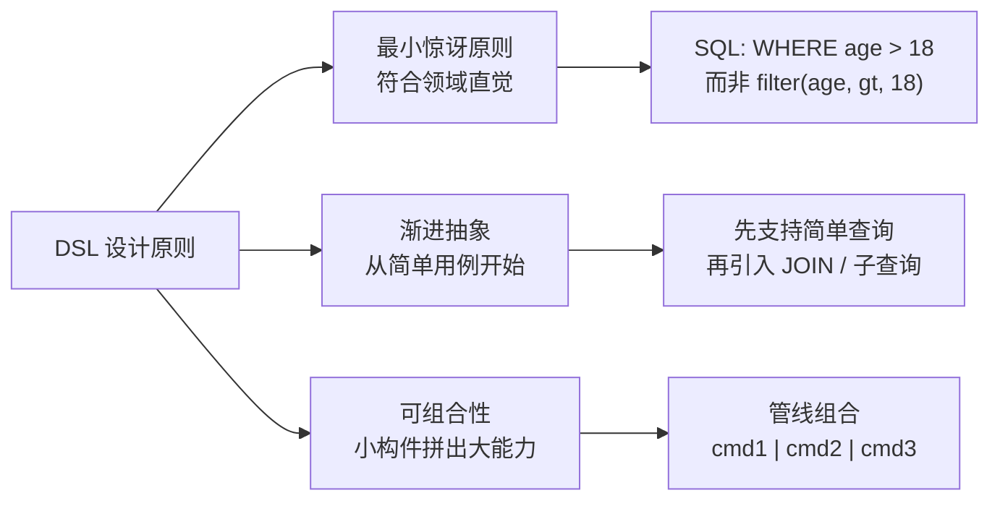
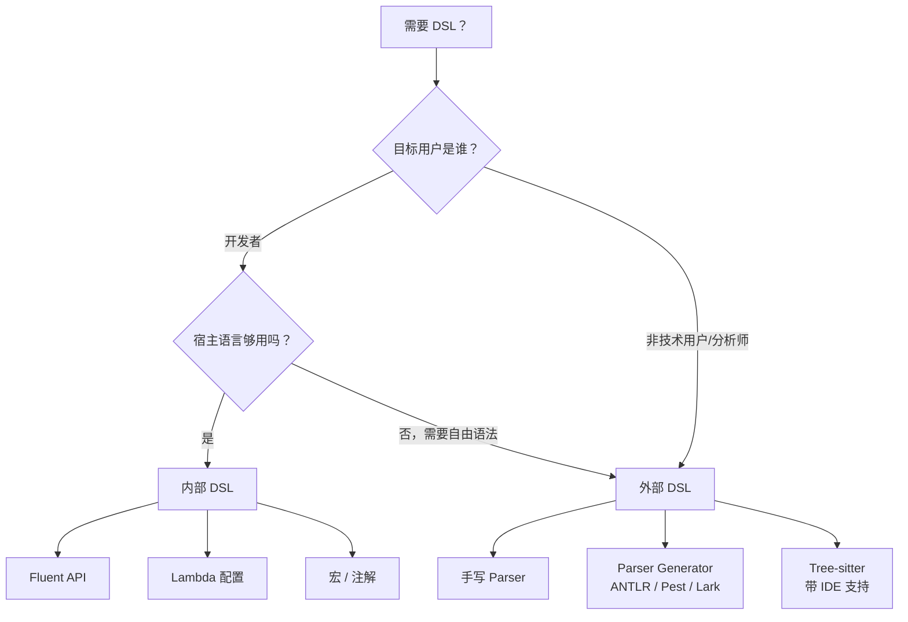
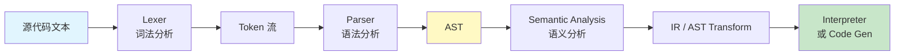

# DSL 设计实践

> 100 天认知提升计划 | Day 40

---

## 核心概念

### 什么是 DSL？

**DSL（Domain-Specific Language，领域特定语言）** 是针对某一特定领域问题而设计的专用语言，它牺牲通用性换取表达力和可读性。与通用编程语言（GPL）不同，DSL 只解决一类问题，但把这类问题的表达做到极致。

**两大流派**：

| 类型 | 定义方式 | 代表 | 优势 | 劣势 |
|------|---------|------|------|------|
| 内部 DSL | 宿主语言内构建 | Rails ActiveRecord、jQuery、Kotlin DSL | 零额外工具链，可复用宿主生态 | 受宿主语法约束 |
| 外部 DSL | 独立语法 + 解析器 | SQL、Regex、Terraform HCL | 完全自由的表达力 | 需要独立工具链 |

### DSL 设计的三大原则



### 内部 DSL 的核心技术

| 技术 | 说明 | 示例语言 |
|------|------|---------|
| **Fluent API / Method Chaining** | 方法返回 this，链式调用 | Java、Go、Rust |
| **Lambda / 闭包** | 用代码块定义结构化配置 | Kotlin、Ruby、Swift |
|**运算符重载** | 让表达式读起来像自然语言 | Kotlin、Scala、Rust |
| **宏 / 元编程** | 编译期生成语法结构 | Rust、Elixir、Zig |
| **Builder 模式** | 分步构建复杂对象 | Java、TypeScript |

---

## 技术架构

### 内部 DSL vs 外部 DSL 决策树



### 外部 DSL 的经典架构



---

## 代码示例

### 内部 DSL：Rust 查询构建器（Fluent API）

```rust
/// 一个类型安全的 SQL 查询构建器内部 DSL
#[derive(Debug, Clone)]
enum OrderDir { Asc, Desc }

#[derive(Debug, Clone)]
struct Query {
    table: String,
    columns: Vec<String>,
    conditions: Vec<String>,
    order_by: Option<(String, OrderDir)>,
    limit: Option<usize>,
}

impl Query {
    fn from(table: &str) -> Self {
        Query {
            table: table.to_string(),
            columns: vec!["*".to_string()],
            conditions: vec![],
            order_by: None,
            limit: None,
        }
    }

    fn select(mut self, cols: &[&str]) -> Self {
        self.columns = cols.iter().map(|s| s.to_string()).collect();
        self
    }

    fn where_gt(mut self, col: &str, val: i64) -> Self {
        self.conditions.push(format!("{} > {}", col, val));
        self
    }

    fn where_eq(mut self, col: &str, val: &str) -> Self {
        self.conditions.push(format!("{} = '{}'", col, val));
        self
    }

    fn order_by(mut self, col: &str, dir: OrderDir) -> Self {
        self.order_by = Some((col.to_string(), dir));
        self
    }

    fn limit(mut self, n: usize) -> Self {
        self.limit = Some(n);
        self
    }

    fn build(&self) -> String {
        let cols = self.columns.join(", ");
        let mut sql = format!("SELECT {} FROM {}", cols, self.table);

        if !self.conditions.is_empty() {
            sql.push_str(&format!(" WHERE {}", self.conditions.join(" AND ")));
        }
        if let Some((col, dir)) = &self.order_by {
            let d = match dir { OrderDir::Asc => "ASC", OrderDir::Desc => "DESC" };
            sql.push_str(&format!(" ORDER BY {} {}", col, d));
        }
        if let Some(n) = self.limit {
            sql.push_str(&format!(" LIMIT {}", n));
        }
        sql
    }
}

fn main() {
    let sql = Query::from("users")
        .select(&["name", "email", "age"])
        .where_gt("age", 18)
        .where_eq("status", "active")
        .order_by("created_at", OrderDir::Desc)
        .limit(10)
        .build();

    println!("{}", sql);
    // SELECT name, email, age FROM users WHERE age > 18 AND status = 'active' ORDER BY created_at DESC LIMIT 10
}
```

### 内部 DSL：Kotlin 类型安全构建器（Lambda 配置）

```kotlin
// 用 Kotlin Lambda 构建类型安全的 HTML DSL
@DslMarker
annotation class HtmlDsl

interface Element {
    fun render(builder: StringBuilder, indent: String)
}

class TextElement(val text: String) : Element {
    override fun render(builder: StringBuilder, indent: String) {
        builder.append("$indent$text\n")
    }
}

@HtmlDsl
class Tag(val name: String) : Element {
    val children = mutableListOf<Element>()
    val attributes = mutableMapOf<String, String>()

    var `class`: String
        get() = attributes["class"] ?: ""
        set(value) { attributes["class"] = value }

    override fun render(builder: StringBuilder, indent: String) {
        val attrs = if (attributes.isNotEmpty())
            attributes.entries.joinToString("") { " ${it.key}=\"${it.value}\"" }
        else ""
        builder.append("$indent<$name$attrs>\n")
        children.forEach { it.render(builder, "$indent  ") }
        builder.append("$indent</$name>\n")
    }
}

@HtmlDsl
class Html : Tag("html") {
    fun head(init: Head.() -> Unit) { val h = Head(); h.init(); children.add(h) }
    fun body(init: Body.() -> Unit) { val b = Body(); b.init(); children.add(b) }
}
class Head : Tag("head") {
    fun title(text: String) { children.add(Tag("title").also { it.children.add(TextElement(text)) }) }
}
class Body : Tag("body") {
    fun h1(text: String) { children.add(Tag("h1").also { it.children.add(TextElement(text)) }) }
    fun p(text: String) { children.add(Tag("p").also { it.children.add(TextElement(text)) }) }
    fun div(`class`: String = "", init: Div.() -> Unit) {
        val d = Div(); d.`class` = `class`; d.init(); children.add(d)
    }
}
class Div : Tag("div") {
    fun p(text: String) { children.add(Tag("p").also { it.children.add(TextElement(text)) }) }
}

fun html(init: Html.() -> Unit): Html {
    val html = Html(); html.init(); return html
}

fun main() {
    val page = html {
        head { title("DSL 示例") }
        body {
            h1("Hello DSL!")
            p("这是用 Kotlin DSL 生成的 HTML")
            div("container") {
                p("嵌套内容也支持")
            }
        }
    }
    val sb = StringBuilder()
    page.render(sb, "")
    println(sb)
}
```

### 外部 DSL：用 Rust + Pest 实现配置语言解析器

```rust
// Cargo.toml: pest = "2.7", pest_derive = "2.7"
// src/config_grammar.pest:
//   WHITESPACE = _{ " " | "\t" | "\n" }
//   key        = @{ ASCII_ALPHA+ }
//   value      = @{ ASCII_ALPHANUMERIC+ }
//   pair       = { key ~ "=" ~ value }
//   config     = { SOI ~ pair+ ~ EOI }

use pest::Parser;
use pest_derive::Parser;

#[derive(Parser)]
#[grammar = "config_grammar.pest"]
struct ConfigParser;

fn parse_config(input: &str) -> Result<Vec<(String, String)>, Box<dyn std::error::Error>> {
    let pairs = ConfigParser::parse(Rule::config, input)?;
    let mut result = vec![];
    for pair in pairs {
        if pair.as_rule() == Rule::pair {
            let mut inner = pair.into_inner();
            let key = inner.next().unwrap().as_str().to_string();
            let value = inner.next().unwrap().as_str().to_string();
            result.push((key, value));
        }
    }
    Ok(result)
}

fn main() -> Result<(), Box<dyn std::error::Error>> {
    let config = r#"
        host=localhost
        port=8080
        mode=production
    "#;
    let pairs = parse_config(config)?;
    for (k, v) in pairs {
        println!("{} => {}", k, v);
    }
    Ok(())
}
```

### 外部 DSL：用 Python + Lark 实现表达式计算器

```python
from lark import Lark, Transformer

# 定义语法：支持加减乘除和括号
grammar = """
    ?expr: term (("+" | "-") term)*
    ?term: factor (("*" | "/") factor)*
    ?factor: NUMBER -> number
           | "(" expr ")"

    %import common.NUMBER
    %import common.WS
    %ignore WS
"""

class CalcTransformer(Transformer):
    def number(self, args):
        return float(args[0])

    def expr(self, args):
        result = args[0]
        i = 1
        while i < len(args):
            op = args[i]
            right = args[i + 1]
            result = result + right if op == '+' else result - right
            i += 2
        return result

    def term(self, args):
        result = args[0]
        i = 1
        while i < len(args):
            op = args[i]
            right = args[i + 1]
            result = result * right if op == '*' else result / right
            i += 2
        return result

parser = Lark(grammar, parser='lalr', transformer=CalcTransformer())

# 使用
print(parser.parse("3 + 4 * 2"))         # 11.0
print(parser.parse("(3 + 4) * 2"))       # 14.0
print(parser.parse("10 / 2 - 3"))        # 2.0
```

---

## 实践任务

- [ ] 用 Rust 或 TypeScript 实现一个 Fluent API 查询构建器（支持 WHERE / ORDER BY / LIMIT）
- [ ] 用 Kotlin 或 Python 实现一个 HTML/配置文件 DSL（Lambda 构建器模式）
- [ ] 用 Pest（Rust）、Lark（Python）或 Chevrotain（TypeScript）实现一个简单的表达式计算器外部 DSL
- [ ] 对比同一个需求（如路由定义）用内部 DSL vs 外部 DSL 的实现，分析可读性和可维护性
- [ ] 阅读一个知名 DSL 的源码（如 Terraform HCL、TOML 解析器），理解其词法分析和 AST 设计

---

## 性能对比

### 内部 DSL vs 外部 DSL 运行时开销

| 维度 | 内部 DSL | 外部 DSL |
|------|---------|---------|
| **解析速度** | 无需解析，直接执行 | 需词法+语法分析（O(n)~O(n·log n)） |
| **启动成本** | 零（编译到宿主代码） | 需初始化 parser |
| **运行时类型安全** | 宿主语言保证 | 需额外语义分析阶段 |
| **错误信息质量** | 取决于宿主编译器 | 可定制，更友好 |
| **IDE 支持** | 宿主语言原生支持 | 需 LSP / Tree-sitter 插件 |
| **学习曲线** | 只需学 API | 需学新语法 |
| **表达能力** | 受宿主语法约束 | 完全自由 |

### Rust 查询构建器构建开销

```
Query::from("users").select(&["a","b"]).where_gt("x", 1).limit(10).build()
→ 仅涉及 String 拼接和 Vec push，纳秒级
→ 编译后零额外抽象开销（monomorphization 内联）
```

---

## 关键收获

1. **内部 DSL 优先**：大多数场景下，用宿主语言的 Fluent API + Lambda 就够了。只有当目标用户不是开发者，或领域语法高度特殊时才考虑外部 DSL。

2. **Fluent API 的秘诀是方法链**：每个方法返回 `Self`（或新的 builder），让调用者自然地链式书写。

3. **Kotlin/Scala 的 @DslMarker** 是防止 DSL 作用域泄漏的利器——阻止在 `div {}` 里调用 `head {}`。

4. **外部 DSL 的核心是语法设计**：好的语法让领域专家可以直接读写；坏语法只是另一种编程语言。参考 SQL、Regex 的极简哲学。

5. **Parser Generator 大幅降低外部 DSL 门槛**：Pest（Rust）、Lark（Python）、Chevrotain（TS）、ANTLR（Java）都只需写语法规则，自动生成 parser。

6. **DSL 是抽象的极致**：好的 DSL 把领域的复杂性封装到语法里，让使用者只需要关心"说什么"而非"怎么说"。

---

## 参考资料

- [Martin Fowler - Domain-Specific Languages](https://martinfowler.com/books/dsl.html)
- [Kotlin Type-Safe Builders](https://kotlinlang.org/docs/type-safe-builders.html)
- [Pest Parser (Rust)](https://pest.rs/)
- [Lark Parser (Python)](https://github.com/lark-parser/lark)
- [Chevrotain (TypeScript)](https://chevrotain.io/)
- [Designing a DSL - JetBrains Guide](https://www.jetbrains.com/mps/concept/)
- [The Art of Unix Usability - DSL Philosophy](http://www.catb.org/~esr/writings/taoup/html/ch08s03.html)

---

*学习日期：2026-04-22*
