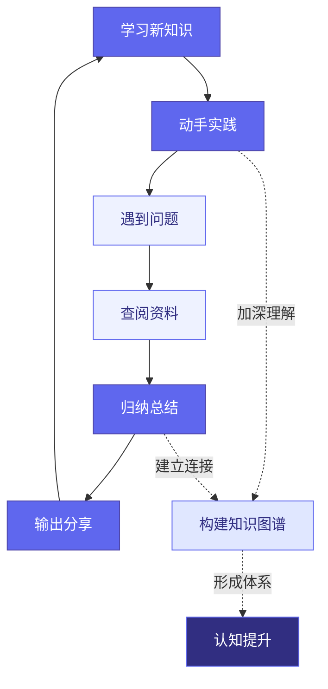

# Plan 1: 硬核开发者 100 天进阶计划

> 目标：掌握有深度、有门槛、能立即投入生产环境的硬核技术
> 
> 适用人群：资深开发者，追求技术深度与工程实践

---

## 学习路线图

```mermaid
flowchart LR
    subgraph Phase1["🚀 第一阶段"]
        A1[Day 1-10<br/>开发工具链]
    end
    
    subgraph Phase2["🖥️ 第二阶段"]
        B1[Day 11-25<br/>系统与底层]
    end
    
    subgraph Phase3["🦀 第三阶段"]
        C1[Day 26-40<br/>编程语言深度]
    end
    
    subgraph Phase4["🏗️ 第四阶段"]
        D1[Day 41-55<br/>架构与设计]
    end
    
    subgraph Phase5["🔒 第五阶段"]
        E1[Day 56-65<br/>安全与逆向]
    end
    
    subgraph Phase6["🤖 第六阶段"]
        F1[Day 66-80<br/>AI 时代开发]
    end
    
    subgraph Phase7["🔮 第七阶段"]
        G1[Day 81-90<br/>前沿技术]
    end
    
    subgraph Phase8["🎯 第八阶段"]
        H1[Day 91-100<br/>综合实战]
    end
    
    Phase1 --> Phase2 --> Phase3 --> Phase4
    Phase4 --> Phase5 --> Phase6 --> Phase7 --> Phase8
    
    style Phase1 fill:#5f67ee,stroke:#4f46a8,color:#fff
    style Phase2 fill:#5f67ee,stroke:#4f46a8,color:#fff
    style Phase3 fill:#5f67ee,stroke:#4f46a8,color:#fff
    style Phase4 fill:#5f67ee,stroke:#4f46a8,color:#fff
    style Phase5 fill:#5f67ee,stroke:#4f46a8,color:#fff
    style Phase6 fill:#5f67ee,stroke:#4f46a8,color:#fff
    style Phase7 fill:#5f67ee,stroke:#4f46a8,color:#fff
    style Phase8 fill:#5f67ee,stroke:#4f46a8,color:#fff
```



### 学习迭代循环



---

## 八大阶段概览

### 🚀 第一阶段：开发工具链与效率（Day 1-10）

**阶段目标**：把工具用到极致，开发体验拉满。

> "工欲善其事，必先利其器"，这一阶段的投入会在未来 10 倍回报。

| Day | 主题 | 状态 |
|-----|------|------|
| Day 1 | Neovim/TMUX 工作流 | 🟡 计划中 |
| Day 2 | 结构化日志艺术 | 🟡 计划中 |
| Day 3 | 终端性能监控 | ✅ 已完成 |
| Day 4 | HTTP 调试进阶 | ✅ 已完成 |
| Day 5 | Git 黑魔法 | ✅ 已完成 |
| Day 6 | 数据库调试 | ✅ 已完成 |
| Day 7 | 容器网络排查 | 🟡 计划中 |
| Day 8 | 性能剖析实战 | 🟡 计划中 |
| Day 9 | 代码搜索神器 | 🟡 计划中 |
| Day 10 | 终端复用与自动化 | 🟡 计划中 |

### 🖥️ 第二阶段：系统与底层（Day 11-25）

**阶段目标**：理解机器如何真正工作，掌握 Linux 内核和系统编程核心概念。

| Day | 主题 | 状态 |
|-----|------|------|
| Day 11-25 | Linux Namespace、Cgroup、epoll/kqueue、零拷贝、内存对齐、DPDK、io_uring、eBPF、系统调用追踪、网络栈调优、内存管理、NUMA、CPU Cache、PMC、手写容器 | ⚪ 待开始 |

### 🦀 第三阶段：编程语言深度（Day 26-40）

**阶段目标**：掌握语言本质，理解类型系统和编译原理。

| Day | 主题 | 状态 |
|-----|------|------|
| Day 26-40 | Rust 所有权系统、类型系统理论、Effect System、宏编程、垃圾回收原理、并发模型、函数式编程 | ⚪ 待开始 |

### 🏗️ 第四阶段：架构与设计（Day 41-55）

**阶段目标**：构建可扩展、高性能、高可用的系统。

### 🔒 第五阶段：安全与逆向（Day 56-65）

**阶段目标**：理解攻防原理，编写更安全的代码。

### 🤖 第六阶段：AI 时代开发（Day 66-80）

**阶段目标**：掌握 AI 辅助开发和 LLM 应用技术。

### 🔮 第七阶段：前沿技术（Day 81-90）

**阶段目标**：探索未来技术趋势，保持技术敏感度。

### 🎯 第八阶段：综合实战（Day 91-100）

**阶段目标**：整合所学，输出成果。

---

## 学习方法论

### 每日笔记模板

```markdown
# [主题名称]

> 100 天认知提升计划 | Day X

---

## 目录
- [第一部分：...](#第一部分xxx)
- [第二部分：...](#第二部分xxx)
- [第三部分：实践与思考](#第三部分实践与思考)

---

## 第一部分：[主主题]

### 子主题

**概念说明**

[内容]

---

## 第二部分：[相关主题]

...

---

## 第三部分：实践与思考

### 实践记录

- [ ] 待办事项

### 疑问与思考

**已解答**
1. ✅ 已解决的问题

**待探索**
2. ❓ 待深入的问题

---

*更新日期：YYYY-MM-DD*
```

### 学习原则

1. **结构化展示** - 将内容组织成清晰的章节（第一部分/第二部分/第三部分）
2. **三部分结构** - 典型结构为：理论概述 → 技术细节 → 实践与思考
3. **使用表格** - 对比、配置、示例等信息使用表格展示
4. **代码示例** - 提供可运行的代码示例
5. **疑问追踪** - 用 ✅ 标记已解答，用 ❓ 标记待探索

---

## 推荐工具链

| 类别 | 工具 | 用途 |
|------|------|------|
| 编辑器 | Neovim + LazyVim | 现代化 IDE 级编辑器 |
| 终端 | Alacritty / WezTerm | GPU 加速终端 |
| 终端复用 | Zellij / tmux | 会话管理 |
| Shell | zsh + starship | 现代化 shell 体验 |
| 搜索 | ripgrep + fd | 极速文件搜索 |
| JSON 处理 | jq + fx | 结构化日志处理 |
| 数据库 | pgcli | 现代化 PostgreSQL 客户端 |
| 版本控制 | lazygit | 交互式 Git 界面 |

---

## 每日学习记录

点击左侧侧边栏查看详细的每日学习笔记，按阶段分类整理。

---

*学习是一场马拉松，不是短跑。保持节奏，享受过程！*
